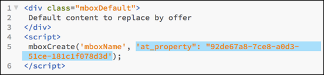

#  Configurar permissões corporativas

Informações sobre as tarefas necessárias para adicionar usuários à sua implementação [!DNL Target]; criar espaços de trabalho, grupos de usuários e propriedades; atualize sua implementação [!DNL Target] para incluir o parâmetro `at_property`; e especifique funções e permissões.

>[!NOTE]
>
>A funcionalidade Propriedades e permissões está disponível como parte da solução do [Target Premium](/help/c-intro/intro.md#premium). Não estão disponíveis no [!DNL Target Standard] sem uma licença do [!DNL Target Premium].

A tabela a seguir lista as tarefas que você deve realizar para criar propriedades e atribuir funções e permissões de usuário. Consulte as seções abaixo para obter mais informações sobre cada tarefa.

| Tarefa | Realizada em |
|--- |--- |
| 1. Adicionar usuários (Opcional) | [!DNL Adobe Admin Console for Enterprise] |
| 2. Crie um espaço de trabalho (Perfil do produto) | [!DNL Adobe Admin Console for Enterprise] |
| 3. Criar grupos de usuários (Opcional) | [!DNL Adobe Admin Console for Enterprise] |
| 4. Criar propriedades | [!DNL Target] Interface do usuário |
| 5: atualizar sua implementação para incluir o parâmetro `at_property` | [!DNL Target] interface do usuário, funções da at.js ou  [!DNL Adobe Experience Platform Launch] |
| 6: Especificar funções e permissões | [!DNL Adobe Admin Console for Enterprise] |

Para essas tarefas realizadas no [!DNL Adobe Admin Console for Enterprise], acesse o console seguindo estas etapas:

1. No Adobe Target, clique em **[!UICONTROL Administração]** > **[!UICONTROL Propriedades]** > **[!UICONTROL Atribuir propriedades a espaços de trabalho]**.

   Ou

   Vá para [https://adminconsole.adobe.com/enterprise](https://adminconsole.adobe.com/enterprise/) > faça logon usando sua Adobe ID, caso ainda não tenha se conectado.

1. (Condicional) Se tiver acesso ao [!DNL Admin Console for Enterprise] para mais de uma organização, clique no avatar do usuário no canto direito ou na barra de navegação superior e selecione a organização desejada.

## Etapa 1. Adicionar usuários (Opcional) {#section_A92AF0F921B743FEB9E9033433BD816A}

Quando você começa a usar a nova funcionalidade [!UICONTROL Propriedades], todo o gerenciamento de usuário deve ser realizado no [!DNL Adobe Admin Console for Enterprise]. Entretanto, todos os seus usuários existentes no [!DNL Target] serão migrados do [!DNL Target] para o [!DNL Admin Console for Enterprise].

1. [No Admin Console](/help/administrating-target/c-user-management/property-channel/properties-overview.md#section_79796E0227D048F59BAE0AB02E544EBE), clique na guia **[!UICONTROL Usuários]** na parte superior da página > **[!UICONTROL Adicionar usuários]** para criar novos usuários ou editar usuários existentes.
1. Siga as instruções em [Gerenciar usuários e grupos na Experience Cloud](https://helpx.adobe.com/enterprise/help/users.html) no *Guia do usuário da empresa*.

## Etapa 2. Criar um espaço de trabalho (perfil do produto) {#section_B82EB409B67C4D9D9D20CE30E48DB1DC}

Um espaço de trabalho (perfil de produto) permite que uma organização atribua um conjunto específico de usuários a um conjunto específico de propriedades. De muitas formas, um espaço de trabalho é semelhante a um conjunto de relatórios no [!DNL Analytics].

As organizações podem começar a aproveitar a funcionalidade de permissões empresariais criando novos espaços de trabalho dentro de [!DNL Admin Console], atribuindo propriedades [!DNL Target] a esses espaços de trabalho e movendo os usuários da configuração &quot;Espaço de trabalho padrão&quot; para esses espaços de trabalho mais recentes e de acesso limitado.

Os clientes podem usar esses espaços de trabalho para separar o acesso a diferentes equipes por região, por unidades de negócios, por seção do site ou por qualquer outro método que escolherem.

Os usuários podem fazer parte de vários espaços de trabalho e podem até ter diferentes funções dentro de cada um deles.

1. No [!DNL Admin Console], clique em **[!UICONTROL Produtos]** e selecione o nome do produto desejado.

   

1. Crie o espaço de trabalho desejado (Perfil do produto):

   * **Acesso padrão:** Todas as atividades existentes serão combinadas em um único projeto chamado &quot;Acesso padrão&quot;. Isso não terá nenhum impacto sobre os clientes. Todas as funcionalidades e funções de usuário continuarão exatamente iguais, pois são anteriores a essa alteração.

      Todas as atividades criadas por meio do [!DNL Adobe Experience Manager] (AEM), do [!DNL Adobe Mobile Services] e do [!DNL Target Classic] também farão parte do espaço de trabalho &quot;Acesso padrão&quot;. Você não pode mover projetos de &quot;Acesso padrão&quot; para outro projeto atualmente.

   * **Novos espaços de trabalho (Perfis de produto):** Você pode começar a utilizar nova funcionalidade de permissões fazendo o seguinte:

      * Criar novos espaços de trabalho dentro do [!DNL Admin Console for Enterprise].
      * Atribuir propriedades do Target aos espaços de trabalho.

   Você pode usar esses espaços de trabalho para dividir o acesso a diferentes equipes por região, por unidades de negócios, por seção do site ou por qualquer outro método que você escolher. Os usuários podem fazer parte de vários espaços de trabalho e podem ter diferentes funções dentro de cada um deles.

1. Siga as instruções em [Criar e gerenciar configurações de produto](https://helpx.adobe.com/enterprise/help/manage-products-and-configurations.html) no *Guia do usuário da empresa*.

>[!NOTE]
>Veja o vídeo de treinamento abaixo para obter mais informações sobre como configurar espaços de trabalho.

### Obter a ID do espaço de trabalho {#workspace-id}

Você precisará passar a ID do espaço de trabalho para utilizar as Permissões empresariais nas [APIs do Target](/help/c-implementing-target/c-api-and-sdk-overview/api-and-sdk-overview.md).

1. No [Adobe Admin Console](https://adminconsole.adobe.com), clique na guia [!UICONTROL Produtos] e depois no produto, no menu esquerdo, para exibir a lista da PLC(workspace).
1. Clique na PLC(workspace) desejada e localize a ID de &quot;perfis&quot; no URL, como mostrado abaixo.

   

## Etapa 3. Criar grupos de usuários (Opcional) {#section_5F5CB9AA7A9F4D26953E22016DA59605}

É possível criar grupos de usuários, como Desenvolvedores, Analistas, Profissionais de marketing, Executivos, etc., e atribuir privilégios a vários produtos e espaços de trabalho da Adobe. A atribuição de todos os privilégios apropriados a um novo membro da equipe em diferentes produtos da Adobe pode ser tão fácil quanto adicioná-lo a um grupo de usuários específico.

1. No Admin Console, clique na guia **[!UICONTROL Usuários]** na parte superior da página > **[!UICONTROL Grupos de usuários]** para criar novos grupos de usuários ou editar grupos existentes.
1. Siga as instruções em [Gerenciar usuários e grupos de uma configuração de produto](https://helpx.adobe.com/enterprise/help/manage-products-and-configurations.html) no *Guia do usuário da empresa*.

## Etapa 4. Criar propriedades {#section_E8F2C92BE0F4466AB87604059C9CF3FD}

As propriedades são ativadas adicionando um par de nome/valor específico como parâmetro com qualquer chamada (chamada do Target, chamada de api etc.) ao Target.

As propriedades pertencem a canais específicos (Web, dispositivos móveis, email e API/Outros).

**Dica**: veja o vídeo de treinamento abaixo para obter mais informações sobre como criar propriedades.

1. Em [!DNL Target], clique em **[!UICONTROL Administration]** > **[!UICONTROL Properties]** para exibir a lista [!UICONTROL Properties].
1. Clique em **Criar propriedade**.

   

   Preencha os campos:

   * **Nome da propriedade (obrigatório):** especifique um nome descritivo para a propriedade.
   * **Descrição:** especifique uma descrição opcional para a propriedade.
   * **Canal:** Selecione o canal desejado para a propriedade: Web, Aplicativo móvel, E-mail, ou Outro/API (por exemplo, um conversor ou um console PlayStation).

1. Clique em **[!UICONTROL Copiar]** para copiar o código para a área de transferência que você usará ao executar as etapas em [5: Atualize sua implementação para incluir o parâmetro at_property](/help/administrating-target/c-user-management/property-channel/properties-overview.md#section_9B17A59807A94712BE642942442EBBC8).
1. Clique em **[!UICONTROL Salvar]** ao concluir.

>[!NOTE]
>Veja o vídeo de treinamento abaixo para obter mais informações sobre a criação de propriedades.

## Etapa 5: Atualize sua implementação para incluir o parâmetro at_property {#section_9B17A59807A94712BE642942442EBBC8}

Para usar a funcionalidade [!DNL Target] de permissões de usuário, você deve adicionar o parâmetro `at_property` a qualquer chamada que esteja acessando [!DNL Target] (Chamada do Target, chamada de api etc.).

**Para obter o código do parâmetro `at_property`:**

1. (Condicional) Use o código de implementação que você gerou e salvou sua área de transferência enquanto realizava as etapas em [4. Crie propriedades](/help/administrating-target/c-user-management/property-channel/properties-overview.md#section_E8F2C92BE0F4466AB87604059C9CF3FD) e prossiga para a etapa 2.

   Ou

   Em [!DNL Target], clique em **[!UICONTROL Administration]** > **[!UICONTROL Properties]** para exibir a lista [!UICONTROL Properties].

   1. Passe o seu ponteiro do mouse sobre a coluna [!UICONTROL Última atualização] para a propriedade desejada ser exibida e clique no ícone do [!UICONTROL código].

      

   1. Clique com o botão direito no código de implementação destacado para copiá-lo para sua área de transferência.

      

1. Atualize sua implementação [!DNL Target] com o código de implementação obtido na etapa anterior.

   Há várias maneiras de atualizar sua implementação do [!DNL Target]. Por exemplo, é possível usar os métodos a seguir em páginas da Web:

   * **Por meio de um &quot;Parâmetro global&quot; em [!DNL Adobe Launch]:**

      Para obter mais informações, consulte [Adicionar parâmetros do Target global](https://experienceleague.adobe.com/docs/experience-platform/tags/extensions/adobe/target/overview.html?lang=en#add-global-mbox-params) na documentação *Adobe Experience Platform Launch*.

   * **Por meio da função targetPageParams():** adicione o seguinte código nas  `<head>` tags, acima da referência de at.js.

      

      Para obter mais informações sobre como fazer isso com o at.js, consulte [targetPageParams()](/help/c-implementing-target/c-implementing-target-for-client-side-web/targetpageparams.md).

   * **Por meio da função mboxCreate():**

      

      Para obter mais informações sobre como fazer isso com a at.js, consulte  [targetPageParams()](/help/c-implementing-target/c-implementing-target-for-client-side-web/targetpageparams.md) e  [mboxCreate(mbox,params)](/help/c-implementing-target/c-implementing-target-for-client-side-web/mboxcreate-atjs.md).

## Etapa 6: Especificar funções e permissões {#section_8C425E43E5DD4111BBFC734A2B7ABC80}

1. No Admin Console, clique em **[!UICONTROL Produtos]** e selecione o nome do produto desejado.

   

1. Clique no nome do perfil desejado (por exemplo, Espaço de trabalho padrão).

   

1. Clique em **[!UICONTROL Usuários]**.

   A guia [!UICONTROL Usuários] exibe todos os usuários nesse espaço de trabalho.

   

1. Selecione a função de permissões desejada (Aprovador, Editor, Observador ou Editor) usando a lista suspensa para cada usuário na coluna [!UICONTROL Função do produto].

   

   | Função | Descrição |
   |--- |--- |
   | Aprovador | Pode criar, editar e ativar ou parar atividades. |
   | Editor | Pode criar e editar atividades antes que elas entrem ao vivo, mas não pode aprovar a inicialização de uma atividade. |
   | Observador | Pode exibir atividades, mas não pode criá-las ou editá-las. |
   | Editor | Semelhante à função de Observador (pode exibir atividades, mas não pode criá-las ou editá-las). No entanto, a função Editor tem a permissão adicional para ativar atividades. |

   Para obter mais informações, consulte [Gerenciar permissões e funções do produto no Admin Console](https://helpx.adobe.com/enterprise/help/manage-permissions-and-roles.html) no *Guia do usuário da empresa*.

## Vídeos de treinamento

Os vídeos a seguir contêm mais informações sobre os conceitos discutidos neste artigo.

>[!NOTE]
>
>A interface do usuário do menu [!DNL Target] [!UICONTROL Administration] (anteriormente [!UICONTROL Setup]) foi reprojetada para fornecer melhor desempenho, reduzir o tempo de manutenção necessário ao lançar novos recursos e melhorar a experiência do usuário no produto. As informações nos vídeos a seguir são geralmente corretas; no entanto, as opções podem estar em locais um pouco diferentes. Os vídeos atualizados serão publicados em breve.

### Como configurar espaços de trabalho do Adobe Target (6:55) 

Este vídeo explica como criar espaços de trabalho.

* Acessar o Adobe Admin Console a partir da interface do Adobe Target (3 maneiras)
* Configure um espaço de trabalho no Adobe Admin Console

   * Adicionar usuários a espaços de trabalho
   * Adicionar propriedades aos espaços de trabalho

* Compreenda espaços de trabalho padrão

>[!VIDEO](https://video.tv.adobe.com/v/19463/)

### Como criar propriedades no Adobe Target (3:05) 

* Como criar uma propriedade na interface do [!DNL Adobe Target]
* Como gerar um token de propriedade para incluir na sua implementação de propriedade
* Familiarize-se com os três métodos de implementação:

   * Web
   * Aplicativo móvel
   * Email, definir caixa superior ou chamadas da API

>[!VIDEO](https://video.tv.adobe.com/v/18990/)
