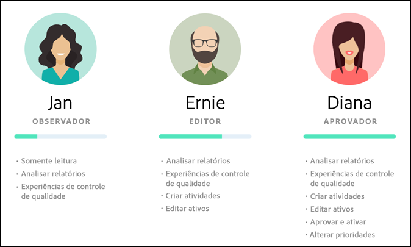
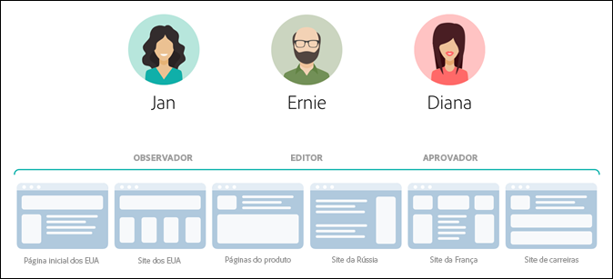
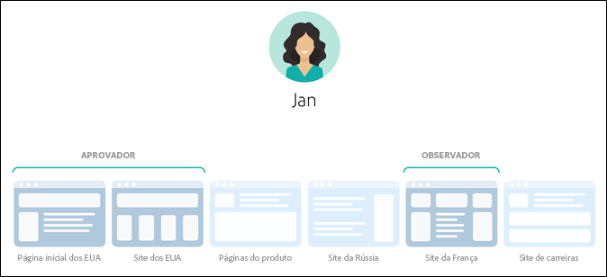
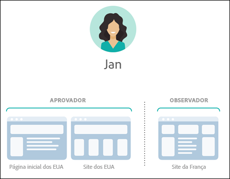
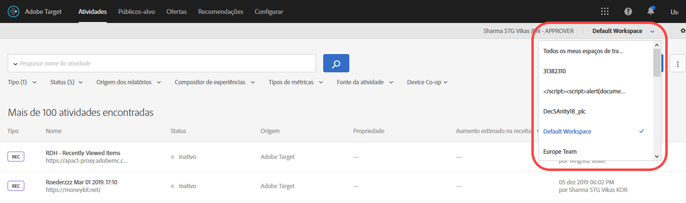
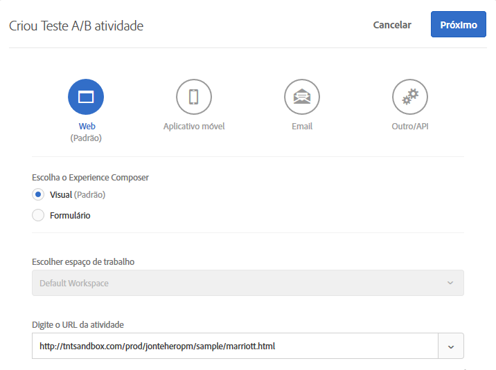
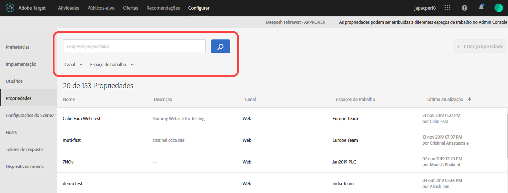

# Permissões do usuário corporativo {#enterprise-user-permissions}

As permissões do usuário corporativo são um meio de administração formal de acesso de usuário empresarial ao [!DNL Target]. Adicione usuários a [!DNL Target], atribua permissões com base em suas funções e crie espaços de trabalho para equipes com base em diferentes departamentos, locais globais, canais e outros agrupamentos lógicos. Você pode atribuir aos usuários as funções de [!UICONTROL Observer], [!UICONTROL Editor] ou [!UICONTROL Aprovador].

## Determine se você tem acesso a permissões de usuário corporativo

>[!NOTE]
>
>A funcionalidade Propriedades e permissões está disponível como parte da solução do [!DNL Target] Premium. Não estão disponíveis no [!DNL Target] Standard sem uma licença do [!DNL Target] Premium.
>
>Sua implementação [!DNL Target] pode estar usando qualquer versão do at.js ou mbox.js.

Você pode saber se sua organização tem uma licença Padrão ou Premium clicando no link [!UICONTROL Administração] na parte superior da interface do usuário [!DNL Target].

* **[!DNL Target Standard]Clientes**: Se você vir a guia   Usuário ([!UICONTROL Administração > Usuários]) (e não as   Propriedades), sua organização tem uma  [!DNL Target Standard] licença. [!DNL Target Standard]Os clientes devem seguir as instruções em [Usuários](/help/administrating-target/c-user-management/c-user-management/user-management.md) para adicionar usuários e atribuir permissões no [!DNL Adobe Admin Console].

* **[!DNL Target Premium]Clientes**: Se você vir as   Propriedades ([!UICONTROL Administração > Propriedades]) e a guia   Usuário, sua organização tem uma  [!DNL Target Premium] licença. Os clientes da [!DNL Target Premium] devem seguir as instruções neste artigo e em [Configurar permissões corporativas](/help/administrating-target/c-user-management/property-channel/properties-overview.md).

## Antes de começar a usar permissões corporativas

>[!IMPORTANT]
>
>Certifique-se de ler a seção [Avisos](/help/administrating-target/c-user-management/property-channel/property-channel.md#section_9714311B1CD9497A86F4910F8AE635E2) abaixo antes de continuar com as permissões corporativas.

## Termos e definições usados nesta seção {#section_F8D229544FEA41C3BC2EFD1F95AA0116}

Os termos a seguir são usados em toda esta seção e podem ser novos para usuários que desejam usar a funcionalidade Propriedades e permissões no [!DNL Target] Premium.

### Propriedade

As propriedades são de natureza semelhante àquelas dentro de [!DNL Adobe Platform Launch] na medida em que usam um trecho exclusivo do código para diferenciá-las.

Uma propriedade da Web é uma biblioteca de regras e um código incorporado. Uma propriedade da Web pode ser qualquer agrupamento de um ou mais domínios e subdomínios.

As propriedades são ativadas adicionando um par de nome/valor específico como parâmetro com qualquer chamada (chamada de Público alvo, chamada de api etc.) para [!DNL Target].

As propriedades pertencem a canais específicos (Web, celular, email ou API/Outros).

### Espaço de trabalho (perfil do produto)

Um espaço de trabalho permite que uma organização atribua um conjunto específico de usuários a um conjunto específico de propriedades. De muitas formas, um espaço de trabalho é semelhante a um conjunto de relatórios no [!DNL Adobe Analytics].

Observação: Os espaços de trabalho são conhecidos como [!UICONTROL Perfis de produto] no [!DNL Adobe Admin Console for Enterprise].

Se você fizer parte de uma organização multinacional, poderá ter um espaço de trabalho para suas páginas da Web, propriedades ou sites na Europa e outro espaço de trabalho para suas páginas, propriedades ou sites da Web nos EUA. Se fizer parte de uma organização multimarcas, poderá ter um espaço de trabalho separado para cada uma de suas marcas.

Os usuários podem fazer parte de vários espaços de trabalho e podem até ter diferentes funções dentro de cada um deles.

Os usuários podem ter visualizações diferentes de [!DNL Adobe Target] ao alternar entre espaços de trabalho, de modo semelhante a como [!DNL Analytics] os usuários têm visualizações diferentes de [!DNL Analytics] ao alternar entre Conjuntos de relatórios.

Os espaços de trabalho podem incluir diferentes públicos-alvo, ofertas de código e atividades.

Todos os públicos-alvo e atividades criados antes da migração para o novo modelo de Permissões empresariais serão agrupados no &quot;Espaço de trabalho padrão&quot;, discutido abaixo.

Todas as atividades criadas via [!DNL Adobe Experience Manager] (AEM), [!DNL Adobe Mobile Services] e [!DNL Adobe Target Classic] farão parte da &quot;Área de trabalho padrão&quot;.

### Espaço de trabalho padrão

Todos os espaços de trabalho existentes (perfis de produtos) em [!DNL Admin Console] são mesclados em um único espaço de trabalho chamado &quot;Espaço de trabalho padrão&quot; durante a migração de sua organização para o novo modelo de Permissões corporativas.

>[!IMPORTANT]
>
>Não exclua o Espaço de trabalho padrão.

Todas as funções de usuário e o acesso a toda a funcionalidade [!DNL Target] permanecem exatamente os mesmos que antes da migração para o novo modelo de Permissões Corporativas.

### Grupos de usuários

É possível criar grupos de usuários, como Desenvolvedores, Analistas, Profissionais de marketing, Executivos, etc., e atribuir privilégios a vários produtos e espaços de trabalho da Adobe. A atribuição de todos os privilégios apropriados a um novo membro da equipe em diferentes produtos da Adobe pode ser tão fácil quanto adicioná-lo a um grupo de usuários específico.

### Funções e permissões

As funções e permissões determinam os níveis de acesso que os usuários têm para criar e gerenciar as atividades na implementação do [!DNL Target]. No [!DNL Target], as funções incluem:

| Função | Descrição |
|--- |--- |
| Aprovador | Pode criar, editar e ativar ou parar atividades. |
| Editor | Pode criar e editar atividades antes que elas entrem ao vivo, mas não pode aprovar a inicialização de uma atividade. |
| Observador | Pode exibir atividades, mas não pode criá-las ou editá-las. |
| Editor | Semelhante à função Observador (pode visualização atividades, mas não pode criá-las ou editá-las). No entanto, a função Editor tem permissão adicional para ativar o atividade. |

### Canal

Canal refere-se ao tipo de conteúdo onde suas atividades do [!DNL Target] são entregues: páginas da Web, aplicativos móveis, mensagens de email e assim por diante.

Quando você cria uma nova atividade, ela é criada no espaço de trabalho selecionado atualmente. Você verá as opções de seleção de canal na primeira caixa de diálogo, que permite escolher o canal desejado para a atividade: Web, Aplicativo móvel, Email ou Outro/API.

## Visão geral de permissões {#section_DC2172520DA84605B218A5E9FB6D187A}

As informações a seguir explicam a forma como as permissões eram aplicadas anteriormente no [!DNL Target] e como são aplicadas usando a funcionalidade [!UICONTROL Propriedades] e [!UICONTROL Permissões].

A nova funcionalidade de [!UICONTROL Permissões] permite criar projetos diferentes (chamados de &quot;Perfis de produtos&quot; no [!DNL Adobe Admin Console for Enterprise]) para possibilitar a atribuição de permissões diferentes para um único usuário que impõem direitos de acesso para cada projeto. Esses projetos distintos podem ser comparados à maneira como os conjuntos de relatórios funcionam no [!DNL Adobe Analytics]. Cada projeto pode ter usuários específicos com funções específicas que se aplicam a um conjunto de propriedades. O resultado é que os clientes poderão restringir o acesso de visualização, edição e aprovação aos usuários com base na região, no ambiente (desenvolvimento/armazenamento temporário/produção), no canal ou em outros critérios personalizados, conforme mostrado abaixo:

Por exemplo, um usuário específico pode ter acesso de &quot;aprovação&quot; nos sites das Américas, mas apenas de &quot;visualização&quot; no aplicativo móvel Europeu. Esse mesmo usuário pode não ter acesso para ver as atividades oferecidas nas propriedades da Web e de dispositivos móveis na região APAC.

O modelo atual de [!DNL Target] [!UICONTROL Permissões] apresenta três funções de permissão (Observador, Editor e Aprovador), conforme mostrado na seguinte ilustração:

Cada função tem diferentes níveis de permissões:

| Função | Descrição |
|--- |--- |
| Aprovador | Pode criar, editar e ativar ou parar atividades. |
| Editor | Pode criar e editar atividades antes que elas entrem ao vivo, mas não pode aprovar a inicialização de uma atividade. |
| Observador | Pode exibir atividades, mas não pode criá-las ou editá-las. |
| Editor | Semelhante à função Observador (pode visualização atividades, mas não pode criá-las ou editá-las). No entanto, a função Editor tem permissão adicional para ativar o atividade. |

É importante observar que a função de cada usuário se aplica a todas as páginas, propriedades ou sites da conta que incluam tags do [!DNL Target], conforme mostrado abaixo:

O novo modelo de [!DNL Target] [!UICONTROL Permissões] apresenta as mesmas três funções de permissão (Observador, Editor e Aprovador); entretanto, é possível atribuir funções de permissões de um usuário separadamente para páginas, propriedades ou sites individuais, conforme mostrado abaixo:

Neste exemplo, Jan tem permissões de Aprovador para a página inicial dos EUA e o site dos EUA, bem como permissões de Observador para o site da França.

Além disso, Jan não poderá ver as páginas, propriedades ou sites no [!DNL Target] aos quais não tem permissões, conforme mostrado abaixo:

Neste exemplo, Jan não pode ver as páginas dos produtos, o site da Rússia e o site de carreiras.

## Cenários de caso de uso {#section_F3CE8576959E4F4CB13BEEED38311DD8}

Os seguintes casos de uso podem ser úteis para entender como as propriedades, projetos, funções e permissões podem ajudá-lo a atingir suas metas de marketing como [!DNL Target]:

### Organização multinacional

Se você fizer parte de uma organização multinacional, poderá ter um espaço de trabalho para suas páginas da Web, propriedades ou sites na Europa e outro espaço de trabalho para suas páginas, propriedades ou sites da Web nos EUA. 
Após uma reorganização, usando as pessoas das ilustrações acima, você pode configurar espaços de trabalho e permissões semelhantes aos seguintes:

* **Jan**: Jan é a responsável pela otimização no Centro de excelência das páginas, propriedades e sites dos Estados Unidos de sua organização. Ela provavelmente tem direitos de administrador do sistema na Adobe Experience Cloud.

   Em sua função, ela tem permissões de Aprovador para a página inicial dos EUA e o site dos EUA. Com as permissões de Aprovador, ela pode criar, editar e ativar ou interromper atividades.

   Jan também consulta a equipe de otimização na França e, portanto, tem permissões de Observador para o site da França que lhe dão acesso somente leitura às atividades. Jan pode exibir atividades, mas não pode criá-las ou editá-las.

   Como Jan não tem nenhuma função que exija que ela veja as Páginas dos produtos, o site da Rússia ou o site de carreiras, ela não consegue ver as atividades desses sites.

* **Ernie**: Ernie é um gerente de marketing da organização responsável pelo marketing nos Estados Unidos.

   Como Ernie é relativamente novo na organização e um pouco inexperiente com o Target, ele tem permissões de editor para a página inicial dos EUA, o site dos EUA e as páginas dos produtos. Com permissões de Editor, Ernie pode criar e editar atividades antes de elas ficarem ativas, mas não pode aprovar o lançamento de uma atividade. Alguém com permissões de Aprovação, como Jan, deve aprovar a atividade para que ela seja colocada em produção.

   Como Ernie não tem nenhuma função que exija que ele veja o site da Rússia, o site da França ou o site de carreiras, ele não consegue ver as atividades desses sites.

* **Diana**: Diana agora é Analista da organização e recebeu permissões de Observador para a página inicial dos EUA, o site dos EUA, as páginas dos produtos, o site da Rússia e o site da França que lhe dão acesso somente leitura às atividades. Diana pode exibir atividades, mas não pode criá-las ou editá-las.

   Como Diana não tem nenhuma função que exija que ela veja o site de carreiras, ela não consegue ver as atividades desses sites.

### Organização multimarcas

Se você fizer parte de uma organização multimarcas, poderá ter um espaço de trabalho separado para as páginas da Web, propriedades ou sites de cada marca.

Após uma reorganização, usando as pessoas das ilustrações acima, você pode configurar projetos e permissões semelhantes aos seguintes:

* **Jan**: Jan é a Chefe de Otimização no Centro de Excelência de uma organização de cuidados de saúde que opera nos ramos de produtos hospitalares e de consumo. Ela provavelmente tem direitos de administrador do sistema na Adobe Experience Cloud.

   Em sua função, ela tem permissões de Aprovador para o site do Hospital. Com as permissões de Aprovador, ela pode criar, editar e ativar ou interromper atividades.

   Jan também consulta a equipe de otimização no ramo de produtos de consumo e, portanto, tem permissões de Observador para esse site que lhe dão acesso somente leitura às atividades. Jan pode exibir atividades, mas não pode criá-las ou editá-las.

* **Ernie**: Ernie é um gerente de marketing da organização responsável pelo marketing no espaço do produto do consumidor.

   Como Ernie é relativamente novo na organização e um pouco inexperiente com o Target, ele tem permissões de Editor para o site do cliente. Com permissões de Editor, Ernie pode criar e editar atividades antes de elas ficarem ativas, mas não pode aprovar o lançamento de uma atividade. Alguém com permissões de Aprovação para o site do consumidor, mas não o Jan neste cenário, deve aprovar a atividade para que ela seja colocada em produção.

   Como Ernie não tem nenhuma função que exija que ele veja o site do hospital, ele não consegue ver as atividades desse site.

* **Diana**: Diana agora é uma analista da organização e recebeu permissões de observador para o site do hospital e do consumidor que dá acesso somente leitura às atividades. Diana pode exibir atividades, mas não pode criá-las ou editá-las.

## Pontos de contato de Permissões e Propriedades da interface do público alvo {#section_3414371393BB42999A268628B5456EC9}

A nova funcionalidade de Permissões pode ser vista em vários locais na interface do usuário do [!DNL Target].

* **Lista suspensa Espaço de trabalho (Perfil do produto):** a lista suspensa Espaço de trabalho é exibida na parte superior das páginas [!UICONTROL Atividades], [!UICONTROL Públicos] e [!UICONTROL Ofertas]. Selecione o espaço de trabalho desejado para filtrar a lista e exibir somente itens no espaço de trabalho selecionado.

   

* **Criação de atividade:** quando você cria uma nova atividade, ela é criada no espaço de trabalho selecionado atualmente. Você verá as opções de seleção de canal na primeira caixa de diálogo, que permite escolher o canal desejado para a atividade: Web, Aplicativo móvel, Email ou Outro/API.

   

* **Criação de público-alvo:** ao criar um novo público-alvo, ele é criado no espaço de trabalho selecionado no momento.
* **Criação de oferta:** ao criar uma nova oferta, ela é criada no espaço de trabalho selecionado no momento.
* **Página Propriedades (Administração > Propriedades):** você pode usar a   Searchbox para pesquisar a   Lista de propriedades.

   

## Avisos {#section_9714311B1CD9497A86F4910F8AE635E2}

Considere o seguinte ao usar ou configurar propriedades e permissões no [!DNL Target] Premium:

* **Importante**: não exclua espaços de trabalho com atividades. Se isso acontecer, trabalhe com o atendimento ao cliente para recuperar essas atividades.
* Ao utilizar a exibição Todos os espaços de trabalho:

   * Você pode ver atividades, públicos-alvo e ofertas de todos os espaços de trabalho que você tem as funções e permissões corretas para acessar.
   * Ao selecionar a exibição Todos os espaços de trabalho, uma nova coluna é adicionada à página Atividades, Públicos-alvo e Ofertas, que lista o espaço de trabalho do item e sua permissão de usuário associada ao item (Observador, Editor ou Aprovador),
   * Ao criar uma atividade, público-alvo ou oferta na exibição Todos os espaços de trabalho, você deve selecionar o espaço de trabalho onde o item será criado. Somente esses espaços de trabalho podem ser selecionados para o qual você tem a permissão de Editor ou Aprovador.
   * Ao copiar uma atividade, público-alvo ou oferta na exibição Todos os espaços de trabalho, você deve selecionar o espaço de trabalho onde o item será copiado. Somente esses espaços de trabalho podem ser selecionados para o qual você tem a permissão de Editor ou Aprovador.

* Qualquer configuração nas seguintes páginas de Administração pode ser controlada por qualquer aprovador em qualquer espaço de trabalho:

   * Visual Experience Composer
   * Relatório
   * Configuração Scene7
   * Implementação
   * Propriedades
   * Hosts
   * Ambientes
   * Tokens de resposta
   * Usuários

* Os usuários não podem mover recursos de um espaço de trabalho (perfil do produto) para outro. Entretanto, é possível copiar.
* Ao visualizar públicos-alvo da página [!DNL Audiences], ela carrega mais lentamente do que o esperado. Se você interagir com a barra de pesquisa de alguma forma, os públicos-alvo serão exibidos mais rapidamente. Esse é um problema conhecido e será corrigido em uma atualização futura. Esse problema não afeta a seleção de públicos-alvo durante o fluxo de trabalho de criação de atividades.
* Os seguintes recursos fazem parte do novo modelo de Permissões empresariais:

   * Atividades, públicos-alvo e ofertas de código criados no Target Standard/Premium após a ativação do cliente para permissões. (Observação: os clientes devem ter direito ao Target Premium.)
   * As propriedades podem ser adicionadas às atividades existentes no Espaço de trabalho padrão; contudo, isso está sujeito a alterações.
   * Somente os novos recursos (como atividades, ofertas de código e públicos-alvo) criados no Target Premium (após a ativação das Permissões empresariais) estarão disponíveis para restringir por permissões.
   * Os recursos externos estão disponíveis somente para os usuários do Espaço de trabalho padrão. A função de um usuário no Espaço de trabalho padrão se aplica globalmente (a todas as solicitações e recursos do Target).

* Os recursos a seguir *não* fazem parte do novo modelo de Permissões empresariais:

   * Ofertas de imagem
   * Todos os recursos do Recommendations, incluindo Biblioteca de critérios, Biblioteca de design, Catálogo, Configuração de recomendações.
   * Os recursos existentes (como atividades, ofertas de código e públicos-alvo) criados no Target Premium antes da ativação das Permissões empresariais podem ser copiados, mas não podem ser movidos para outros espaços de trabalho.
   * Atividades, públicos, ofertas de código, ofertas de imagem, ou qualquer outro recurso criado usando as seguintes soluções ou métodos não podem ser controlados pelo modelo de Permissões empresariais, mas farão parte do Espaço de trabalho padrão: Target Classic, Adobe Experience Manager (AEM), Adobe Mobile Services e recursos criados por meio da API. Os recursos criados por meio da API incluem atividades, públicos-alvo, ofertas de código e ofertas de imagem).
   * Ofertas de imagem (os ativos armazenados em `https://[tenantName].marketing.adobe.com/content/mac/[tenantName]/target/offers.html#image-library` não podem ser controlados pelo modelo de Permissões empresariais no momento.
   * O clickTracking e os redirecionamentos somente funcionarão quando o link ou a página de destino fizerem parte de uma propriedade incluída na atividade. Além disso, o clickTracking pode não funcionar ao usar a função `targetPageParams()`. A função recomendada é `targetPageParamsAll()`.

   [!DNL Target]Atualmente, o exige que um token `at_property` esteja presente nas páginas em que ocorre o rastreamento. No evento em que o token está (1) ausente, (2) não detectado no momento da configuração da atividade (dentro do VEC) ou (3) não passado para a chamada de Público alvo clickTracking pela função `targetPageParamsAll()`, a métrica não será aumentada e aparecerá como &quot;0&quot;.

   O mesmo se aplica às atividades que usam redirecionamentos. A página de destino deve ter um token `at_property` e ser reconhecida no momento da configuração dentro do VEC.

   Em uma versão futura, o Target funcionará em páginas em que nenhum token `at_property` está presente ou páginas em que um token diferente de `at_property` estiver presente.

* A funcionalidade Permissões de usuário do Enterprise não é compatível com [chamadas da API do Adobe I/O](https://developers.adobetarget.com).

## Perguntas frequentes {#faqs}

As perguntas frequentes sobre as permissões empresariais incluem o seguinte:

### Posso mover uma atividade de um espaço de trabalho para outro?

Infelizmente, não é possível mover atividades de um espaço de trabalho para outro. No entanto, é possível copiar uma atividade para qualquer espaço de trabalho, sabendo que os dados de relatório não serão transferidos. Para obter mais informações, consulte &quot;Copiando/editando uma atividade ao usar espaços de trabalho&quot; em [Copiando/editando uma atividade ao usar espaços de trabalho](/help/c-activities/edit-activity.md#section_45A92E1DD3934523B07E71EF90C4F8B6).

As atividades criadas antes da migração continuam sendo executadas da mesma maneira no Espaço de trabalho padrão, a menos que sejam editadas e atribuídas a propriedades. As atividades em um espaço de trabalho específico seguirão as propriedades atribuídas a ele e, portanto, o comportamento poderá ser diferente de antes da migração.

### Por que recebo uma mensagem de erro indicando que nenhuma propriedade está associada a essa atividade, mesmo que haja uma propriedade atribuída?

Se você implementou o [!DNL Target] com o [!DNL Adobe Launch] e recebeu uma mensagem de erro indicando que não há propriedade associada à atividade, passe o parâmetro `at_property` com a função `targetPageParams`.

### As conversões de rastreamento de cliques são registradas se uma página de redirecionamento e o URL da atividade pertencerem a propriedades diferentes?

O rastreamento de cliques não é registrado quando a página e o URL da atividade pertencerem a propriedades diferentes.

Considere o seguinte cenário (se aplica a at.js e a mbox.js):

* A página 1 pertence à Propriedade 1.
* A página 2 pertence à Propriedade 2.
* Na atividade, a Página 1 redireciona para a Página 2, que contém rastreamento de cliques.

Quando um visitante abre a Página 1 em um navegador, ele é redirecionado para a Página 2. Como a Página 2 não está qualificada para fornecer a atividade, sua chamada do Target não terá rastreamentos de cliques na resposta.

Se a página de redirecionamento e o URL da atividade pertencerem à mesma propriedade, o rastreamento de cliques funcionará como esperado. Para obter mais informações, consulte [Rastreamento de cliques](/help/c-activities/r-success-metrics/click-tracking.md).

## Vídeos de treinamento

Os vídeos a seguir contêm mais informações sobre os conceitos discutidos neste artigo.

### Vídeo de treinamento: Vídeo de treinamento sobre permissões corporativas 

Objetivos de aprendizagem:

* Os três níveis de função que os usuários do Adobe Target podem ter
* Os conceitos de Propriedades e Espaços de trabalho e como esses limites e agrupamentos funcionam para permitir o controle sobre os níveis de acesso dos usuários
* Exemplos de diferentes propriedades para sua organização considerar

>[!VIDEO](https://video.tv.adobe.com/v/19042/)

### Horas de escritório: Espaços de trabalho do Público alvo Premium

Este vídeo é uma gravação de &quot;No expediente&quot;, uma iniciativa da equipe de Atendimento ao cliente da Adobe.

* Criação de um espaço de trabalho (perfil de produto)
* Criação de propriedades
* Adicionar usuários
* Atualização da implementação

>[!NOTE]
>
>A interface do usuário do menu [!DNL Target] [!UICONTROL Administration] (anteriormente [!UICONTROL Setup]) foi reprojetada para melhorar o desempenho, reduzir o tempo de manutenção necessário ao lançar novos recursos e melhorar a experiência do usuário no produto. As informações do vídeo a seguir são geralmente corretas; no entanto, as opções podem estar em locais ligeiramente diferentes. Os vídeos atualizados serão publicados em breve.

>[!VIDEO](https://video.tv.adobe.com/v/23643/)
