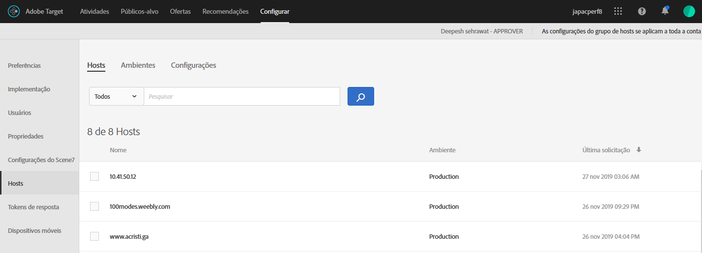

# Hosts{#hosts}

Organize seus sites e ambientes de pré-produção para fácil gerenciamento e geração de relatórios separados.

O objetivo principal do gerenciamento de hosts é assegurar que nenhum conteúdo inativo seja exibido acidentalmente nos sites. O gerenciamento de hosts também permite separar os dados do relatório por [ambiente](/help/administrating-target/environments.md).

Um host é qualquer domínio do qual uma solicitação [!DNL Target] é feita. Em um site, geralmente é a propriedade `location.hostname` do URL que faz a solicitação [!DNL Target].

Por padrão, [!DNL Target] não limita um host que pode fazer [!DNL Target] solicitações e receber [!DNL Target] respostas. Quando novos hosts fazem solicitações, elas funcionam automaticamente. Isso também permite o teste em domínios diferentes que você não conhece ou que não pode antecipar. Se desejar substituir esse comportamento padrão, você pode configurar uma  lista de permissões ou lista de bloqueios para limitar quais hosts trabalharão com [!DNL Target].

Para gerenciar hosts, clique em **[!UICONTROL Administração]** > **[!UICONTROL Hosts]**.

## Reconhecendo hosts {#concept_0D4B43E23AA9408F8B28A57ED754BF65}

Para reconhecer um host e adicioná-lo à lista [!UICONTROL Hosts], as seguintes condições devem ser atendidas:

* Pelo menos uma solicitação [!DNL Target] deve existir no host
* Uma página no host deve ter  o seguinte:

   * Uma referência precisa do at.js ou mbox.js
   * Uma solicitação [!DNL Target] ou uma solicitação [!DNL Target] global gerada automaticamente

* A página com a solicitação [!DNL Target] deve ser visualizada em um navegador

Depois que a página é visualizada, o host é listado na lista [!UICONTROL Hosts], permitindo que você gerencie em um ambiente, bem como pré-visualização e inicie atividades e testes.

>[!NOTE]
>
>Isso inclui quaisquer servidores de desenvolvimento pessoal.

Após adicionar um host na lista de [!UICONTROL Host], certifique-se de que o host seja reconhecido.

1. Clique em **[!UICONTROL Administração]** > **[!UICONTROL Hosts]**.
1. Se o seu host não estiver listado, atualize seu navegador. 

   Por padrão, um host recém-reconhecido é colocado no ambiente [!UICONTROL Production]. Esse é o ambiente mais seguro porque ele não permite que atividades inativas sejam visualizadas nesses hosts.

1. (Condicional) Clique no ícone **[!UICONTROL Mover]** (  ) para mover o host para [!UICONTROL Desenvolvimento], [!UICONTROL Armazenamento temporário] ou outro ambiente.

>[!NOTE]
>
>O ambiente [!UICONTROL Production] não pode ser excluído, mesmo que você o renomeie. Pressupõe-se que este seja o local em que você disponibiliza atividades ativas e testes finais e aprovados. O ambiente padrão não permite que campanhas inativas sejam visualizadas.

## Classificar ou pesquisar a lista Hosts {#section_068B23C9D8224EB78BC3B7C8580251B0}

Para classificar a lista [!UICONTROL Hosts], clique em qualquer cabeçalho de coluna ([!UICONTROL Nome], [!UICONTROL Ambiente] ou [!UICONTROL Último pedido]) para classificar a lista em ordem crescente ou decrescente.

Para pesquisar a lista [!UICONTROL Hosts], digite um termo de pesquisa na caixa [!UICONTROL Hosts de pesquisa].

## Crie lista de permissões que especifiquem hosts autorizados a enviar solicitações de Público alvo ao Público alvo. {#allowlist}

Você pode criar uma lista de permissões que especifique hosts (domínios) autorizados a enviar solicitações [!DNL Target] para [!DNL Target]. Todos os outros hosts que geram solicitações obterão uma resposta de erro de autorização comentada. Por padrão, qualquer host que contenha uma solicitação [!DNL Target] se registra com [!DNL Target] no ambiente [!UICONTROL Production] e tem acesso a todas as atividades ativas e aprovadas. Se essa não for a abordagem desejada, você poderá usar a  lista de permissões para registrar hosts específicos que sejam elegíveis para fazer [!DNL Target] solicitações e receber conteúdo [!DNL Target]. Todos os hosts continuarão a ser exibidos na lista [!UICONTROL Hosts], e os ambientes ainda poderão ser usados para agrupar esses hosts e atribuir níveis diferentes a cada um, como se o host pode ver atividades ativas e/ou inativas.

Para criar uma  lista de permissões:

1. Na lista [!UICONTROL Hosts], clique em **[!UICONTROL Autorizar hosts]**.
1. Ative a opção **[!UICONTROL Ativar hosts autorizados para delivery de conteúdo]**.
1. Adicione os hosts desejados na caixa **[!UICONTROL Host contém]**, conforme desejado.

   Vários hosts podem ser listados, cada um na própria linha.

1. Adicione os hosts desejados na caixa **[!UICONTROL O host não contém]**, conforme desejado.

   Vários hosts podem ser listados, cada um na própria linha.

1. Clique em **[!UICONTROL Salvar]**.

Se uma solicitação [!DNL Target] for feita em um host não autorizado, a chamada responderá com `/* no display - unauthorized mbox host */`.

>[!IMPORTANT]
>
>**Práticas** recomendadas de segurança: Se você usar a funcionalidade de ubox  [!DNL Target], observe que essa lista de permissões também controlará a lista de domínios para os quais seus   redirecionadores navegam. Certifique-se de adicionar quaisquer domínios aos quais você deseja redirecionar ao usar o ubox como parte da implementação. Se a  de lista de permissões não for especificada, [!DNL Adobe] não poderá verificar os URLs de redirecionamento e proteger contra possíveis redirecionamentos mal-intencionados.
>
>A lista de permissões tem precedência sobre os ambientes. Você deve apagar todos os hosts antes de usar o recurso de  de lista de permissões e, em seguida, apenas os hosts permitidos pela lista de permissões serão exibidos na lista dos hosts. Em seguida, você poderá mover os hosts para o ambiente desejado.

Em algumas ocasiões, domínios de outros sites podem ser exibidos em seus ambientes. Um domínio é exibido na lista se o domínio fizer uma chamada para seu at.js ou mbox.js. Por exemplo, se alguém copiar uma de suas página da Web para outro servidor, o domínio será exibido em seu ambiente. Você também poderá ver domínios de mecanismos spiders, sites de tradução ou unidades de disco locais.

Nos casos em que `mboxHost` é passada na chamada de API, a conversão é registrada para o ambiente que é transmitido. Se nenhum ambiente for transmitido, o padrão do host na chamada será [!UICONTROL Production].

Você também pode criar uma lista de bloqueios que especifique hosts (domínios) que não possam enviar solicitações [!DNL Target] para [!DNL Target] adicionando os hosts desejados na caixa [!UICONTROL O host não contém].

>[!NOTE]
>
>Como a lista Hosts Autorizados é usada para hosts [!DNL Target] e hosts de redirecionamento padrão, você deve adicionar todos os domínios existentes aprovados para usar o [!DNL Adobe Target] Javascript SDK (at.js) *AND* todos os domínios usados em URLs de redirecionamento padrão da ubox. Você também deve adicionar novos domínios semelhantes à lista de permissões no futuro.

## Excluir um host {#section_F56355BA4BC54B078A1A8179BC954632}

Você pode excluir um host quando ele não é mais necessário.

1. Na lista [!UICONTROL Hosts], clique no ícone **[!UICONTROL Excluir]**.
1. Clique em **[!UICONTROL Excluir]** para confirmar a exclusão.

>[!NOTE]
>
>O host será listado novamente se alguém navegar até uma página que contém uma solicitação [!DNL Target] no host.

## Solucionar problemas dos hosts {#concept_B3D7583FA4BB480382CC7453529FE1B7}

Tente as dicas de solução de problemas a seguir se tiver dificuldade com seus hosts:

**O host não aparece na lista da sua conta.**

* Atualize a página [!UICONTROL Hosts] no seu navegador.
* Confirme se a solicitação [!DNL Target] está correta, incluindo a referência a at.js ou mbox.js.
* Tente navegar para uma das solicitações [!DNL Target] no host. É possível que nenhuma solicitação [!DNL Target] no host tenha sido renderizada em um navegador.

**Domínios aleatórios ou desconhecidos são exibidos nas listas de grupo de [!UICONTROL Hosts].**

Um domínio é exibido nesta lista se uma solicitação para [!DNL Target] for feita a partir do domínio. Frequentemente, é possível ver domínios de mecanismos spider, sites de tradutor de idiomas ou unidades de discos locais. Se o domínio listado não for o domínio utilizado pela sua equipe, clique em [!UICONTROL Excluir] para removê-lo.

**Minha  [!DNL Target] solicitação retorna /* sem exibição - host mbox não autorizado */.**

Se uma solicitação [!DNL Target] for feita em um host não autorizado, a solicitação responderá com /* sem exibição - host mbox não autorizado */.
