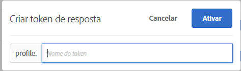

# Tokens de resposta

Os tokens de resposta permitem gerar automaticamente informações específicas para [!DNL Adobe Target] na página da Web da sua marca. Essas informações podem incluir detalhes sobre a atividade, oferta, experiência, perfil de usuário, informações geográficas e muito mais. Esses detalhes fornecem dados de resposta adicionais para compartilhar com ferramentas internas ou de terceiros ou para usar na depuração.

Os tokens de resposta permitem escolher quais variáveis (em pares de valores chave) usar e permitir que sejam enviadas como parte de uma resposta [!DNL Target]. Você habilita uma variável usando o switch e a variável é enviada com respostas [!DNL Target], que podem ser validadas em chamadas de rede. Os tokens de resposta também funcionam no modo [!UICONTROL Preview].

Uma diferença importante entre plug-ins e tokens de resposta é que os plug-ins entregam o JavaScript para a página que é executada na entrega. No entanto, os tokens de resposta fornecem um objeto que pode ser lido e executado com o uso de ouvintes de eventos. A abordagem do token de resposta é mais segura e permite um desenvolvimento e manutenção mais fáceis de integrações de terceiros.

>[!NOTE]
>
>Os tokens de resposta estão disponíveis com a versão [!DNL Adobe Experience Platform Web SDK] 2.6.0 ou posterior e com a at.js versão 1.1 ou posterior.

| SDK do Target | Ações sugeridas |
|--- |--- |
| [SDK da Web da Adobe Experience Platform](/help/c-implementing-target/c-implementing-target-for-client-side-web/aep-web-sdk.md) | Certifique-se de que você esteja usando o SDK da Web da plataforma versão 2.6.0 ou posterior. Para obter informações sobre como baixar a versão mais recente do SDK da Web da plataforma, consulte [Instalar o SDK](https://experienceleague.adobe.com/docs/experience-platform/edge/fundamentals/installing-the-sdk.html) no guia *Visão geral do SDK da Web da plataforma* . Para obter informações sobre a nova funcionalidade em cada versão do SDK da Web da plataforma, consulte [Notas de versão](https://experienceleague.adobe.com/docs/experience-platform/edge/release-notes.html) no guia *Visão geral do SDK da Web da plataforma* . |
| [at.js](/help/c-implementing-target/c-implementing-target-for-client-side-web/c-how-atjs-works/how-atjs-works.md) | Certifique-se de que você esteja usando a at.js versão 1.1 ou posterior. Para obter informações sobre como baixar a versão mais recente do at.js, consulte [Baixar o at.js](/help/c-implementing-target/c-implementing-target-for-client-side-web/how-to-deployatjs/implementing-target-without-a-tag-manager.md). Para obter informações sobre a nova funcionalidade em cada versão do at.js, consulte [Detalhes da versão do at.js](/help/c-implementing-target/c-implementing-target-for-client-side-web/target-atjs-versions.md).<br>Os clientes que usam a at.js são incentivados a usarem os tokens de resposta e a evitarem os plugins. Alguns plug-ins que dependem de métodos internos existentes na mbox.js, mas não na at.js, são entregues, mas falham. Para obter mais informações, consulte [Limitações do at.js](/help/c-implementing-target/c-implementing-target-for-client-side-web/t-mbox-download/c-target-atjs-implementation/target-atjs-limitations.md). |

## Uso de tokens de resposta {#section_A9E141DDCBA84308926E68D05FD2AC62}

1. Certifique-se de que você esteja usando o SDK da Web da plataforma versão 2.6.0 (ou posterior) ou a at.js versão 1.1 (ou posterior).

   Para obter mais informações:

   * **Plataforma Web SDK**: Consulte  [Instalar o ](https://experienceleague.adobe.com/docs/experience-platform/edge/fundamentals/installing-the-sdk.html) SDKs no guia de  *visão geral do SDK da Web da* plataforma.
   * **at.js**: Consulte  [Baixar a at.js](/help/c-implementing-target/c-implementing-target-for-client-side-web/how-to-deployatjs/implementing-target-without-a-tag-manager.md#concept_1E1F958F9CCC4E35AD97581EFAF659E2).

1. Em [!DNL Target], clique em **[!UICONTROL Administração]** > **[!UICONTROL Tokens de Resposta]**.

   

1. Ative os tokens de resposta desejados, como `activity.id` e `option.id`.

   Os seguintes parâmetros estão disponíveis por padrão:

   | Tipo | Parâmetro | Notas |
   |--- |--- |--- |
   | Perfis incorporados | `profile.activeActivities` | Retorna uma matriz do `activityIds` para o qual os visitantes estão qualificados. Ele é incrementado à medida que os usuários são qualificados. Por exemplo, em uma página com duas solicitações [!DNL Target] que fornecem duas atividades diferentes, a segunda solicitação inclui ambas as atividades. |
   |  | `profile.isFirstSession` | Retorna &quot;true&quot; ou &quot;false.&quot; |
   |  | `profile.isNewSession` | Retorna &quot;true&quot; ou &quot;false.&quot; |
   |  | `profile.daysSinceLastVisit` | Retorna o número de dias, desde a última visita do visitante. |
   |  | `profile.tntId` | Retorna tntID do visitante |
   |  | `profile.marketingCloudVisitorId` | Retorna a ID do visitante da Experience Cloud. |
   |  | `profile.thirdPartyId` | Retorna a ID de terceiros do visitante. |
   |  | `profile.categoryAffinity` | Retorna a categoria favorita do visitante. |
   |  | `profile.categoryAffinities` | Retorna uma matriz das 5 categorias principais do visitante como sequências de caracteres. |
   | Atividade | `activity.name`<br>`activity.id`<br>`experience.name`<br>`experience.id`<br>`option.name`<br>`option.id` | Detalhes da atividade atual. Observe que &quot;option&quot; equivale a &quot;offer.&quot; |
   | Geografia | `geo.country`<br>`geo.state`<br>`geo.city`<br>`geo.zip`<br>`geo.dma`<br>`geo.domainName`<br>`geo.ispName`<br>`geo.connectionSpeed`<br>`geo.mobileCarrier` | Consulte [Geo](/help/c-target/c-audiences/c-target-rules/geo.md) para obter mais informações sobre como usar o direcionamento geográfico nas atividades. |
   | Método de alocação de tráfego<br>(Aplica-se somente às atividades [!UICONTROL Direcionamento automático] e [!UICONTROL Automated Personalization]). | `experience.trafficAllocationId` | Retorna 0 se um visitante recebeu uma experiência de estar em tráfego de &quot;controle&quot; e 1 se um visitante recebeu uma experiência da distribuição de tráfego de &quot;direcionado&quot;. |
   |  | `experience.trafficAllocationType` | Retorne &quot;controle&quot; ou &quot;direcionado&quot;. |

   Os atributos do perfil do usuário e dos Atributos do cliente também são exibidos na lista.

   >[!NOTE]
   >
   >Os parâmetros com caracteres especiais não são exibidos na lista. Somente caracteres alfanuméricos e sublinhados são suportados.

1. (Condicional) Para usar um parâmetro de perfil como um token de resposta, mas o parâmetro não foi transmitido por uma solicitação [!DNL Target] e, portanto, não foi carregado na interface [!DNL Target], você pode usar o botão [!UICONTROL Adicionar token de resposta] para adicionar o perfil à interface do usuário.

   Clique em **[!UICONTROL Adicionar Token de Resposta]**, forneça o nome do token e clique em **[!UICONTROL Ativar]**.

   

1. Crie uma atividade.

## Analise as respostas e leia os tokens de resposta

O processo usado para ouvir [!DNL Target] respostas e ler tokens de resposta é diferente dependendo se você tem uma implementação [!DNL Platform Web SDK] ou at.js.

###  [!DNL Platform Web SDK] usando a classe de objeto Handle

Use a classe Handle object , que tem um objeto de metadados e um objeto de dados para acompanhar as respostas [!DNL Target] e ler os tokens de resposta.

O exemplo de resposta a seguir adiciona um manipulador de evento personalizado [!DNL Platform Web SDK] diretamente na página HTML (a tabela explica os objetos usados no código):

| Objeto | Informações |
| --- | --- |
| Tipo - Personalization.decision | Se a decisão foi tomada pelo provedor [!DNL Target] ou Offer Decisioning. |
| DecisionProvider - TGT | TGT-[!DNL Target]. [!DNL Target] fornece os metadados e valores do token de resposta para a página. |
| Meta | Metadados passados para a página. |
| Dados | Valores dos metadados passados para a página. |

```html
<html>

<head>
 ...
 <script src="alloy.js"></script>
 <script>
  {
   "requestId": "4d0a7cfd-952c-408c-b3b8-438edc38250a",
   "handle": [{
    "type": "personalization:decisions",
    "payload": [{
     "id": "....",
     "scope": "__view__",
     "scopeDetails": {
      "decisionProvider": "TGT",
      "activity": {
       "id": "..."
      },
      "experience": {
       "id": "...."
      }
     },
     "items": [{
      "id": "123",
      "schema": "https://ns.adobe.com/personalization/dom-action",
      "meta": {
       "activity.id": "...",
       "activity.name": "...",
       "profile.foo": "...",
       "profile.bar": "..."
      },
      "data": {
       "id": "123",
       "type": "setHtml",
       "selector": "#foo",
       "prehidingSelector": "#foo",
       "content": "<div>Hello world</div>"
      }
     }]
    }]
   }]
  }
  });
 </script>
</head>

<body>
 ...
</body>

</html>
```

###  badgeat.js usando eventos personalizados

Use [Eventos personalizados da at.js](/help/c-implementing-target/c-implementing-target-for-client-side-web/atjs-custom-events.md) para ouvir a resposta da e ler os tokens de resposta.[!DNL Target]

O código de amostra a seguir adiciona um manipulador de evento personalizado da [!DNL at.js] diretamente na página HTML:

```html
<html> 
  <head> 
    .... 
    <script src="at.js"></script> 
    <script> 
      document.addEventListener(adobe.target.event.REQUEST_SUCCEEDED, function(e) { 
        console.log("Request succeeded", e.detail); 
      }); 
    </script> 
  <head> 
  <body> 
  ... 
  </body> 
</html>
```

## Perguntas frequentes de tokens de resposta {#section_3DD5F32C668246289CDF9B4CDE1F536D}

**Qual função é necessária para ativar ou desativar os tokens de resposta?**

Os tokens de resposta podem ser ativados ou desativados apenas por usuários com a função [!DNL Target] [!UICONTROL Administrador].

**O que acontece se eu estiver executando [!DNL Platform Web SDK] 2.6.0 (ou anterior)?

Você não tem acesso aos tokens de resposta.

**O que acontece se eu estiver executando a at.js 1.0 (ou anterior)?**

Você vê os tokens de resposta, mas a at.js não pode usá-los.

**[!DNL Target Classic]Posso fazer com que ambos plugins e tokens de resposta do fiquem ativos ao mesmo tempo?**

Os plugins e os tokens de resposta estão disponíveis em paralelo; no entanto, os plug-ins serão descontinuados no futuro.

**Os tokens de resposta são entregues por meio de todas as  [!DNL Target] respostas ou somente por meio de  [!DNL Target] respostas que entregam uma atividade do ?**

Os tokens de resposta são entregues somente por meio de respostas [!DNL Target] que entregam uma atividade.

**Meu  [!DNL Target Classic] plug-in incluiu JavaScript. Como replico a funcionalidade dele usando os tokens de resposta?**

Ao migrar para tokens de resposta, esse tipo de JavaScript deve ser mantido em sua base de código ou solução de gerenciamento de tags. Você pode acionar esse código usando [!DNL Platform Web SDK] ou [!DNL at.js] eventos personalizados e transmitir os valores do token de resposta às suas funções JavaScript.

**Por que meu parâmetro de perfil/Atributos do cliente não é exibido na lista de tokens de resposta?**

[!DNL Target] normalmente atualiza parâmetros a cada 15 minutos. Essa atualização depende da ação do usuário e os dados são atualizados somente quando você exibe a página de tokens de resposta. Se os seus parâmetros não forem exibidos na lista de token de resposta, [!DNL Target] ainda não atualizou os dados.

Além disso, se o parâmetro contém caracteres que não sejam alfanuméricos ou qualquer símbolo que não seja sublinhados, o parâmetro não aparecerá na lista. Atualmente, somente caracteres alfanuméricos e sublinhados são aceitos.

**O token de resposta ainda fornece conteúdo se usar um script de perfil excluído ou um parâmetro de perfil?**

Os tokens de resposta extraem as informações dos perfis de usuário e, em seguida, as entregam. Se você excluir um script ou parâmetro de perfil, isso n~so significa que as informações foram removidas dos perfis de usuário. Os perfis de usuário ainda têm dados correspondentes ao script de perfil. O token de resposta continua a fornecer o conteúdo. Para usuários que não têm essas informações salvas em seus perfis ou para novos visitantes, esse token não é entregue porque os dados não estão presentes em seus perfis.

[!DNL Target] não desliga o token automaticamente. Se você excluir o script de perfil e não desejar mais que ele seja entregue, você deve desligar o token sozinho.

**Renomeei meu script de perfil, mas por que o token está usando o script ainda ativo com o nome herdado?**

Conforme mencionado acima os tokens de resposta trabalham nas informações de perfil salvas pelos usuários. Mesmo que você tenha renomeado seu script de perfil, os usuários que visitaram seu site têm o valor de script de perfil antigo salvo em seus perfis. O token continua a escolher o valor antigo que já está salvo nos perfis do usuário. Se você não deseja entregar o conteúdo no novo nom, deve desligar o token anterior e ligar o novo token.

**Se meus atributos foram alterados, quando eles serão removidos da lista?**

[!DNL Target]O realiza uma atualização de atributos em intervalos regulares. Qualquer atributo que não esteja ligado é removido durante a próxima atualização. No entanto, se você tiver um atributo que foi ativado e removido, esse script não será removido da lista de atributos até que ele seja desligado. Como exemplo, você removeu um script de perfil que era usado como um token. [!DNL Target]O remove somente os atributos desligados na lista, quando são excluídos ou renomeados.

## Enviar dados para o Google Analytics

As seções a seguir descrevem como enviar dados [!DNL Target] para o Google Analytics. Os dados enviados por tokens de resposta também podem ser enviados para outras integrações de terceiros.

###  badgeSending data para o Google Analytics via SDK da Web da plataforma

O Google Analytics pode enviar dados por meio do SDK da Web da plataforma versão 2.6.0 (ou posterior), adicionando o seguinte código na página HTML.

>[!NOTE]
>
>Verifique se o par de valor da chave do token de resposta está sob o objeto `alloy(“sendEvent”`.

```
<script type="text/javascript"> 
   (function(i, s, o, g, r, a, m) { 
   i['GoogleAnalyticsObject'] = r; 
   i[r] = i[r] || function() { 
   (i[r].q = i[r].q || []).push(arguments) 
   }, i[r].l = 1 * new Date(); 
   
   
   a = s.createElement(o), 
   m = s.getElementsByTagName(o)[0]; 
   a.async = 1; 
   a.src = g; 
   m.parentNode.insertBefore(a, m) 
   })(window, document, 'script', 'https://www.google-analytics.com/analytics.js', 'ga'); 
   ga('create', 'Google Client Id', 'auto'); 
</script> 
<script type="text/javascript">
   alloy("sendEvent", {
   
   
   })
   .then(({ renderedPropositions, nonRenderedPropositions }) => {
   // concatenate all the propositions
   const propositions = [...renderedPropositions, ...nonRenderedPropositions];
   // extractResponseTokens() extract the meta from item -> meta
   const tokens = extractResponseTokens(propositions);
   const activityNames = []; 
   const experienceNames = []; 
   const uniqueTokens = distinct(tokens); 
   
   
   uniqueTokens.forEach(token => { 
   activityNames.push(token["activity.name"]); 
   experienceNames.push(token["experience.name"]); 
   }); 
   
   
   ga('send', 'event', { 
   eventCategory: "target", 
   eventAction: experienceNames, 
   eventLabel: activityNames 
   }); 
   
   
   });
</script>
```

###  badgeEnvio de dados para o Google Analytics via at.js {#section_04AA830826D94D4EBEC741B7C4F86156}

O Google Analytics pode enviar dados via at.js ao adicionar o seguinte código na página HTML:

```javascript
<script type="text/javascript"> 
  (function(i, s, o, g, r, a, m) { 
    i['GoogleAnalyticsObject'] = r; 
    i[r] = i[r] || function() { 
      (i[r].q = i[r].q || []).push(arguments) 
    }, i[r].l = 1 * new Date(); 
    a = s.createElement(o), 
      m = s.getElementsByTagName(o)[0]; 
    a.async = 1; 
    a.src = g; 
    m.parentNode.insertBefore(a, m) 
  })(window, document, 'script', 'https://www.google-analytics.com/analytics.js', 'ga'); 
  ga('create', 'Google Client Id', 'auto'); 
</script> 
 
<script type="text/javascript"> 
  document.addEventListener(adobe.target.event.REQUEST_SUCCEEDED, function(e) { 
    var tokens = e.detail.responseTokens; 
 
    if (isEmpty(tokens)) { 
      return; 
    } 
 
    var activityNames = []; 
    var experienceNames = []; 
    var uniqueTokens = distinct(tokens); 
 
    uniqueTokens.forEach(function(token) { 
      activityNames.push(token["activity.name"]); 
      experienceNames.push(token["experience.name"]); 
    }); 
 
    ga('send', 'event', { 
      eventCategory: "target", 
      eventAction: experienceNames, 
      eventLabel: activityNames 
    }); 
  }); 
 
  function isEmpty(val) { 
    return (val === undefined || val == null || val.length <= 0) ? true : false; 
  } 
 
  function key(obj) { 
     return Object.keys(obj) 
    .map(function(k) { return k + "" + obj[k]; }) 
    .join(""); 
  } 
 
  function distinct(arr) { 
    var result = arr.reduce(function(acc, e) { 
      acc[key(e)] = e; 
      return acc; 
    }, {}); 
   
    return Object.keys(result) 
    .map(function(k) { return result[k]; }); 
  } 
</script>
```

## Depuração

As seções a seguir fornecem informações sobre como depurar tokens de resposta:

###  seloGoogle Analytics e depuração

O código a seguir permite depurar usando o Google Analytics:

```javascript
<script type="text/javascript"> 
  (function(i, s, o, g, r, a, m) { 
    i['GoogleAnalyticsObject'] = r; 
    i[r] = i[r] || function() { 
      (i[r].q = i[r].q || []).push(arguments) 
    }, i[r].l = 1 * new Date(); 
    a = s.createElement(o), 
      m = s.getElementsByTagName(o)[0]; 
    a.async = 1; 
    a.src = g; 
    m.parentNode.insertBefore(a, m) 
  })(window, document, 'script', 'https://www.google-analytics.com/analytics.js', 'ga'); 
  ga('create', 'Google Client Id', 'auto'); 
</script> 
 
<script type="text/javascript"> 
  document.addEventListener(adobe.target.event.REQUEST_SUCCEEDED, function(e) { 
    var tokens = e.detail.responseTokens; 
 
    if (isEmpty(tokens)) { 
      return; 
    } 
 
    var activityNames = []; 
    var experienceNames = []; 
    var uniqueTokens = distinct(tokens); 
 
    uniqueTokens.forEach(function(token) { 
      activityNames.push(token["activity.name"]); 
      experienceNames.push(token["experience.name"]); 
    }); 
 
    ga('send', 'event', { 
      eventCategory: "target", 
      eventAction: experienceNames, 
      eventLabel: activityNames 
    }); 
  }); 
 
  function isEmpty(val) { 
    return (val === undefined || val == null || val.length <= 0) ? true : false; 
  } 
 
  function key(obj) { 
     return Object.keys(obj) 
    .map(function(k) { return k + "" + obj[k]; }) 
    .join(""); 
  } 
 
  function distinct(arr) { 
    var result = arr.reduce(function(acc, e) { 
      acc[key(e)] = e; 
      return acc; 
    }, {}); 
   
    return Object.keys(result) 
    .map(function(k) { return result[k]; }); 
  } 
```

### Depuração usando o equivalente do plugin ttMeta

O equivalente do plugin ttMeta para fins de depuração pode ser criado ao adicionar o seguinte código à página HTML:

```javascript
<script type="text/javascript" > 
  document.addEventListener(adobe.target.event.REQUEST_SUCCEEDED, function (e) { 
    window.ttMETA= typeof(window.ttMETA)!="undefined" ? window.ttMETA : []; 
 
    var tokens=e.detail.responseTokens; 
 
    if (isEmpty(tokens)) { 
      return; 
    } 
     
    var uniqueTokens = distinct(tokens); 
 
    uniqueTokens.forEach(function(token) { 
      window.ttMETA.push({ 
        'CampaignName': token["activity.name"], 
        'CampaignId' : token["activity.id"], 
        'RecipeName': token["experience.name"], 
        'RecipeId': token["experience.id"], 
        'OfferId': token["option.id"], 
        'OfferName': token["option.name"], 
        'MboxName': e.detail.mbox}); 
      console.log(ttMETA); 
    }); 
  }); 
 
  function isEmpty(val){ 
    return (val === undefined || val == null || val.length <= 0) ? true : false; 
  } 
 
  function key(obj) { 
     return Object.keys(obj) 
    .map(function(k) { return k + "" + obj[k]; }) 
    .join(""); 
  } 
 
  function distinct(arr) { 
    var result = arr.reduce(function(acc, e) { 
      acc[key(e)] = e; 
      return acc; 
    }, {}); 
   
    return Object.keys(result) 
    .map(function(k) { return result[k]; }); 
  } 
</script>
```

##  js: Tokens de resposta e eventos personalizados da at.js {#section_3AA0A6C8DBD94A528337A2525E3E05D5}

O vídeo a seguir explica como usar tokens de resposta e eventos personalizados de at.js para compartilhar informações de perfil de [!DNL Target] para sistemas de terceiros.

>[!NOTE]
>
>A interface do usuário do menu [!DNL Target] [!UICONTROL Administration] (anteriormente [!UICONTROL Setup]) foi reprojetada para fornecer melhor desempenho, reduzir o tempo de manutenção necessário ao lançar novos recursos e melhorar a experiência do usuário no produto. As informações do vídeo seguinte estão corretas; no entanto, as opções estão em locais ligeiramente diferentes.

>[!VIDEO](https://video.tv.adobe.com/v/23253/)
