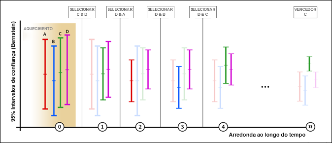

# Alocação automática{#auto-allocate}

A Alocação automática identifica um vencedor entre duas ou mais experiências e realoca automaticamente mais tráfego para o vencedor, a fim de aumentar as conversões enquanto o teste continua a ser executado e aprendido.

>[!IMPORTANT]
>
>A Alocação automática não oferece suporte aos relatórios do [!DNL Target for Analytics] (A4T).

Ao [criar uma atividade A/B usando o fluxo de trabalho guiado de três etapas](../../c-activities/t-test-ab/t-test-create-ab/test-create-ab.md#task_68C8079BF9FF4625A3BD6680D554BB72), é possível escolher a opção [!UICONTROL Alocar automaticamente para a melhor experiência].

## O desafio {#section_85D5A03637204BACA75E19646162ACFF}

Os testes A/B padrão têm um custo inerente. Você pode gastar o tráfego para medir o desempenho de cada experiência e, por meio de análise, descobrir a experiência vencedora. A distribuição do tráfego permanece fixa mesmo depois de você reconhecer que algumas experiências estão superando outras. Além disso, é complicado descobrir o tamanho da amostra, e a atividade deve ser executada em sua totalidade para que você possa agir em um vencedor. Depois de tudo isso, ainda há uma chance de o vencedor identificado não ser um vencedor real.

## A solução: Alocação automática {#section_98388996F0584E15BF3A99C57EEB7629}

A alocação automática reduz esse custo e a sobrecarga de determinar uma experiência vencedora. A alocação automática monitora o desempenho da métrica de meta de todas as experiências e envia mais novos participantes para as experiências de alto desempenho proporcionalmente. Há tráfego suficiente reservado para explorar as outras experiências. Você pode ver os benefícios do teste nos resultados, mesmo enquanto a atividade está em execução: a otimização e o aprendizado ocorrem paralelamente.

A alocação automática move os visitantes para experiências vencedoras gradativamente, em vez de exigir que você aguarde o fim de uma atividade para determinar um vencedor. Você se beneficia do incentivo mais rapidamente porque os participantes da atividade que teriam sido enviados para experiências de menor sucesso recebem experiências vencedoras potenciais.

Um teste A/B normal no Target mostra apenas comparações de pares de desafiantes com controle. Por exemplo, se uma atividade tiver experiências: A, B, C e D, em que A é o controle, um teste A/B normal do Target compararia A versus B, A versus C e A versus D.

Em tais testes, a maioria dos produtos, incluindo o Target, usa um teste t de Estudante para produzir confiança baseada no valor p. Este valor de confiança é então usado para determinar se o desafiante é suficientemente diferente do controle. No entanto, o Target não realiza automaticamente as comparações implícitas (B versus C, B versus D e C versus D) que são necessárias para encontrar a &quot;melhor&quot; experiência. Como resultado, o profissional de marketing deve analisar manualmente os resultados para determinar a &quot;melhor&quot; experiência.

A alocação automática executa todas as comparações implícitas entre as experiências e produz um vencedor &quot;verdadeiro&quot;. Não há noção de experiência de &quot;controle&quot; no teste.

A alocação automática aloca novos visitantes a experiências de modo inteligente até que o intervalo de confiança da melhor experiência não se sobreponha ao de qualquer outra experiência. Normalmente, este processo pode produzir falsos positivos, mas a alocação automática usa intervalos de confiança baseados na [Desigualdade de Bernstein](https://en.wikipedia.org/wiki/Bernstein_inequalities_(probability_theory)) que compensa avaliações repetidas. Neste ponto, temos um verdadeiro vencedor. Quando a Alocação automática é interrompida, desde que não haja uma dependência de tempo substancial para os visitantes que chegam à página, há pelo menos 95% de chance de que a alocação automática retorne uma experiência cuja resposta verdadeira não seja pior do que 1% (relativa) menos do que a verdadeira resposta da experiência vencedora.

## Quando usar a alocação automática, o teste A/B ou a personalização automatizada {#section_3F73B0818A634E4AAAA60A37B502BFF9}

* Use **Alocação automática** quando quiser otimizar sua atividade a partir do início e identificar as experiências vencedoras o mais rapidamente possível. Quando experiências de alto desempenho são proporcionadas com mais frequência, o desempenho geral da atividade aumenta.
* Use um padrão **[Use o teste A/B](../../c-activities/t-test-ab/test-ab.md#task_05E33EB15C4D4459B5EAFF90A94A7977)** quando quiser caracterizar o desempenho de todas as experiências antes de otimizar o site. Um teste A/B ajuda a classificar todas as experiências, enquanto a alocação de tráfego automatizada encontra aquelas de desempenho mais alto, mas não garante a diferenciação entre aquelas de desempenho mais baixo.
* Use [Personalização automatizada](../../c-activities/t-automated-personalization/automated-personalization.md#task_8AAF837796D74CF893CA2F88BA1491C9) quando quiser algoritmos de otimização da mais alta complexidade, como modelos de aprendizado automatizado que fazem previsões com base em atributos de perfil individuais. A alocação de tráfego automatizada observa o comportamento agregado das experiências (assim como testes A/B padrão) e não diferencia os visitantes.

## Principais benefícios {#section_0913BF06F73C4794862561388BBDDFF0}

* Mantém o rigor de um teste A/B
* Encontra um vencedor estatisticamente significativo mais rapidamente do que um teste A/B manual
* Fornece um lift médio de campanha maior que de um teste A/B manual

## Terminologia {#section_670F8785BA894745B43B6D4BFF953188}

Os seguinte termos são úteis quando falamos de alocação automática:

**Multi-armed bandit:** Uma abordagem [multi-armed bandit](https://en.wikipedia.org/wiki/Multi-armed_bandit) à otimização equilibra o aprendizado exploratório e o aproveitamento desse aprendizado.

## Como o algoritmo funciona {#section_ADB69A1C7352462D98849F2918D4FF7B}

A lógica geral por trás da Alocação automática incorpora o desempenho medido (como a taxa de conversão) e os intervalos de confiança dos dados cumulativos. Ao contrário de um teste A/B padrão em que o tráfego é dividido entre experiências, a Alocação automática altera a alocação de tráfego entre as experiências.

* 80% dos visitantes são alocados usando a lógica inteligente descrita abaixo.
* 20% dos visitantes são distribuídos aleatoriamente em todas as experiências para se adaptarem à mudança de comportamento do visitante.

A abordagem multi-armed bandit mantém algumas experiências livre para exploração ao mesmo tempo em que aproveita as experiências que têm um bom desempenho. Mais novos visitantes são colocados em experiências de melhor desempenho enquanto preservam a capacidade de reagir a mudanças nas condições. Esses modelos são atualizados pelo menos uma vez por hora para garantir a reação do modelo aos dados mais recentes.

À medida que mais visitantes entram na atividade, algumas experiências começam a ter mais êxito, e mais tráfego é enviado para as experiências bem-sucedidas. 20% do tráfego continua sendo distribuído aleatoriamente para explorar todas as experiências. Se uma das experiências de baixo desempenho começar a funcionar melhor, mais tráfego será alocado para essa experiência. Ou, se o sucesso de uma atividade de desempenho mais alto diminui, menos tráfego será alocado para essa experiência. Por exemplo, se um evento faz com que os visitantes procurem informações diferentes no site de sua mídia, ou se as vendas no fim de semana em seu site de vendas oferecem resultados diferentes.

A ilustração a seguir representa como pode ser o desempenho do algoritmo durante um teste com quatro experiências:

A ilustração mostra como o tráfego alocado para cada experiência progride ao longo de várias rodadas do tempo de atividade até que um vencedor claro seja determinado.

| Arredondar | Descrição |
|--- |--- |
|  | **Rodada de aquecimento (0):** durante a rodada de aquecimento, cada experiência recebe a mesma distribuição de tráfego até que cada experiência na atividade tenha um mínimo de 1.000 visitantes e 50 conversões.<ul><li>Experiência A=25%</li><li>Experiência B=25%</li><li>Experiência C=25%</li><li>Experiência D=25%</li></ul>Após cada experiência receber 1.000 visitantes e 50 conversões, o Target inicia a alocação automática de tráfego. Todas as alocações acontecem em rodadas e duas experiências são escolhidas para cada rodada. Somente duas experiências avançam para a próxima rodada: D e C. Seguir em frente significa que as duas experiências recebem 80% do tráfego igualmente, enquanto as outras duas experiências continuam a participar, mas são servidas apenas como parte da alocação de tráfego aleatório de 20% à medida que novos visitantes entram na atividade. Todas as alocações são atualizadas a cada hora (mostradas por arredondamentos ao longo do eixo x acima). Após cada rodada, os dados acumulados são comparados. |
|  | **Rodada 1:** nesta rodada, 80% do tráfego é alocado às experiências C e D (40% cada). 20% do tráfego é alocado aleatoriamente para experiências A, B, C e D (5% cada). Durante esta rodada, a experiência A tem um excelente desempenho.<ul><li>O algoritmo escolhe a experiência D para avançar para a próxima rodada porque tem a taxa de conversão mais alta (conforme indicado por na escala vertical de cada atividade).</li><li>O algoritmo escolhe a experiência A para avançar também porque tem o limite superior mais alto do intervalo de confiança de 95% de Bernstein das experiências restantes.</li></ul>As experiências D e A seguem em frente. |
|  | **Rodada 2:** nesta rodada, 80% do tráfego é alocado às experiências A e D (40% cada). 20% do tráfego é alocado aleatoriamente, portanto, isso significa que A, B, C e D recebem 5% cada um. Durante esta rodada, a experiência B tem um excelente desempenho.<ul><li>O algoritmo escolhe a experiência D para avançar para a próxima rodada porque tem a taxa de conversão mais alta (conforme indicado por na escala vertical de cada atividade).</li><li>O algoritmo escolhe a experiência B para avançar também porque tem o limite superior mais alto do intervalo de confiança de 95% de Bernstein das experiências restantes.</li></ul>As experiências D e B seguem em frente. |
|  | **Rodada 3:** nesta rodada, 80% do tráfego é alocado às experiências B e D (40% cada). 20% do tráfego é alocado aleatoriamente, portanto, isso significa que A, B, C e D recebem 5% cada um. Durante esta ronda, a experiência D continua a ter um bom desempenho e a experiência C tem um excelente desempenho.<ul><li>O algoritmo escolhe a experiência D para avançar para a próxima rodada porque tem a taxa de conversão mais alta (conforme indicado por na escala vertical de cada atividade).</li><li>O algoritmo escolhe a experiência C para avançar também porque tem o limite superior mais alto do intervalo de confiança de 95% de Bernstein das experiências restantes.</li></ul>As experiências D e C seguem em frente. |
|  | **Rodada 4:** nesta rodada, 80% do tráfego é alocado às experiências C e D (40% cada). 20% do tráfego é alocado aleatoriamente, portanto, isso significa que A, B, C e D recebem 5% cada um. Durante esta rodada, a experiência C tem um excelente desempenho.<ul><li>O algoritmo escolhe a experiência C para avançar para a próxima rodada porque tem a taxa de conversão mais alta (conforme indicado por na escala vertical de cada atividade).</li><li>O algoritmo escolhe a experiência D para avançar também porque tem o limite superior mais alto do intervalo de confiança de 95% de Bernstein das experiências restantes.</li></ul>As experiências C e D seguem em frente. |
|  | **Rodada n**: Conforme a atividade avança, uma experiência de alto desempenho começa a surgir e o processo continua até que haja uma experiência vencedora. Quando o intervalo de confiança da experiência com a taxa de conversão mais alta não coincide com o intervalo de confiança de qualquer outra experiência, ele é rotulado como vencedor e um [selo é exibido na página da atividade](/help/c-activities/automated-traffic-allocation/determine-winner.md) e na lista da Atividade.<ul><li>O algoritmo escolhe a experiência C como o vencedor claro</li></ul>Nesse ponto, o algoritmo serve 80% do tráfego para a experiência C, enquanto 20% do tráfego continua a ser servido aleatoriamente para todas as experiências (A, B, C e D). No total, C recebe 85% do tráfego. No caso improvável de que o intervalo de confiança do vencedor comece a se sobrepor novamente, o algoritmo reverte para o comportamento da rodada 4 acima. **Importante:** se você escolhesse manualmente um vencedor no início do processo, teria sido fácil escolher a experiência errada. Por esse motivo, é uma prática recomendada esperar até que o algoritmo determine a experiência vencedora. |

Se a atividade tiver apenas duas experiências, ambas receberão tráfego igual até que o Target encontre uma experiência com 90% de confiança. Nesse ponto, 70% do tráfego é alocado para o vencedor e 30% para o perdedor. Após essa experiência atingir 95% de confiança, 100% do tráfego é atribuído ao vencedor e 0% ao perdedor.

Depois que o modelo para uma atividade de Alocação automática estiver pronto (cada experiência tem um mínimo de 1.000 visitantes e 50 conversões), as seguintes operações da interface do usuário não serão permitidas:

* Alternar o modo &quot;Alocação de tráfego&quot; para &quot;Manual&quot;
* Alterar o tipo de métrica de meta
* Alterar as opções no painel &quot;Configurações avançadas&quot;

## Avisos {#section_5C83F89F85C14FD181930AA420435E1D}

**A alocação automática de atividades A/B não é mais suportada no Analytics for Target (A4T)**

Com a versão 16.10.1.0 (25 de outubro de 2016), o Target não suporta o Analytics como fonte de relatórios para as atividades de alocação automática de A/B no futuro. Qualquer atividade A/B de Alocação automática com o A4T ativado será alternada para o modo Manual (alocação de tráfego igual).

**O recurso de alocação automática funciona apenas com uma configuração de métrica avançada: Aumentar contagem e manter o usuário na atividade**

As seguintes configurações avançadas de métricas não são suportadas: Aumentar contagem, Liberar o usuário, Permitir a reentrada e Aumentar a contagem e Liberar o usuário e Impedir a reentrada.

**Visitantes que retornam com frequência podem aumentar as taxas de conversão da experiência.**

Se um visitante que vê a experiência A retorna com frequência e faz conversão várias vezes, a Índice de conversão (CR) da experiência A aumenta artificialmente. Compare isso com a experiência B, na qual os visitantes fazem a conversão mas não retornam com frequência. Como resultado, a CR de A parece melhor do que a CR de B, então os novos visitantes têm maior probabilidade de ser alocados a A do que a B. Se você optar por contar uma vez por participante, a CR de A e a CR de B poderão ser idênticas.

Se visitantes recorrentes são distribuídos aleatoriamente, seu efeito nas taxas de conversão tem mais probabilidade de ser uniformizado. Para amenizar esse efeito, considere alterar o método de contagem da métrica de meta para contar somente uma vez por participante.

**Diferencia entre os profissionais de alto desempenho, não entre os de baixo desempenho.**

A alocação automática é boa em diferenciar entre experiências de alto desempenho (e encontrar uma vencedora). Pode ser que algumas vezes não haja diferenciação suficiente entre as experiências de desempenho inferior.

Se você deseja produzir uma diferenciação estatisticamente significativa entre todas as experiências, convém considerar o uso do modo de alocação de tráfego manual.

**As taxas de conversão associadas ao tempo (ou que variam de acordo com o contexto) podem distorcer as quantidades de alocação.**

Alguns fatores que podem ser ignorados durante um teste A/B padrão por afetarem todas as experiências de maneira uniforme não podem ser ignorados em um teste de alocação automática. O algoritmo está sujeito às taxas de conversão observadas. Estes são exemplos de fatores que podem afetar o desempenho das experiências de maneira uniforme:

* Experiências com relevância contextual variável (tempo, local, gênero etc.) relevância.

   Por exemplo:

   * &quot;Graças a Deus é sexta-feira&quot; resulta em maiores conversões na sexta-feira
   * &quot;Impulsione sua segunda-feira&quot; tem conversão mais alta na segunda-feira
   * &quot;Prepare-se para um inverno da Costa Leste&quot; tem conversão mais alta na Costa Leste ou em locais afetados pelo inverno

Esses fatores podem distorcer os resultados em um teste de alocação automática mais do que em um teste A/B, pois o teste A/B analisa os resultados durante um período mais longo.

* Experiências com atrasos de conversão variáveis, possivelmente devido à urgência da mensagem.

   Por exemplo, &quot;O desconto de 30% termina hoje&quot; avisa o visitante para converter hoje, mas &quot;50% de desconto na primeira compra&quot; não cria o mesmo senso de urgência.

## Perguntas frequentes {#section_0E72C1D72DE74F589F965D4B1763E5C3}

**Os visitantes recorrentes são realocados automaticamente a experiências de alto desempenho?**

Não. Somente novos visitantes são alocados automaticamente. Os visitantes recorrentes continuam vendo sua experiência original. Isso protege a validade do teste A/B.

**Como o algoritmo lida com falsos positivos?**

O algoritmo garante uma confiança de 95% ou taxa de 5% de falso-positivo, se você esperar até que o emblema vencedor apareça.

**Quando a alocação automática começa a alocar o tráfego?**

O algoritmo começa a funcionar depois que todas as experiências na atividade têm um mínimo de 1.000 visitantes e 50 conversões.

**Qual é o nível de dinamismo do aproveitamento pelo algoritmo?**

80% do tráfego é veiculado usando alocação automática e 20% do tráfego é veiculado aleatoriamente. Quando um vencedor é identificado, todos os 80% do tráfego vão para ele, enquanto todas as experiências continuam recebendo tráfego como parte dos 20%, incluindo a experiência vencedora.

**As experiências perdedoras são exibidas?**

Sim. A abordagem multi-armed bandit garante que pelo menos 20% do tráfego seja reservado para explorar a mudança nos padrões ou nas taxas de conversão em todas as experiências.

**O que acontece com atividades com longos atrasos de conversão?**

Desde que todas as experiências que estão sendo otimizadas enfrentem atrasos semelhantes, o comportamento é o mesmo de uma atividade com um ciclo de conversão mais rápido, embora leve mais tempo para atingir o limite de 50 conversões antes do início do processo de alocação de tráfego.

**Qual é a diferença entre a alocação automática e a personalização automatizada?**

A personalização automatizada usa os atributos de perfil de cada visitante para determinar a melhor experiência. Ao fazer isso, ela não apenas otimiza, mas também personaliza a atividade para esse usuário.

A alocação automática, por outro lado, é um teste A/B que produz um vencedor agregado (a experiência mais popular, mas não necessariamente a experiência mais efetiva para cada visitante).

**Os visitantes recorrentes aumentam a taxa de conversão em minha métrica de sucesso?**

No momento, a lógica favorece visitantes que convertem rapidamente ou visitam com mais frequência. Isso ocorre porque esses visitantes aumentam temporariamente a taxa de conversão geral da experiência à qual eles pertencem. O algoritmo se ajusta frequentemente, então o aumento na taxa de conversão é amplificado a cada instantâneo. Se o site recebe muitos visitantes recorrentes, suas conversões podem aumentar potencialmente a taxa de conversão geral da experiência à qual eles pertencem. Há uma boa chance de os visitantes recorrentes serem distribuídos aleatoriamente; nesse caso, o efeito agregado (maior incentivo) é uniformizado. Para amenizar esse efeito, considere alterar o método de contagem da métrica de sucesso para contar somente uma vez por participante.

**Posso usar a calculadora de tamanho de amostra ao usar a Alocação automática para estimar quanto tempo a atividade levará para identificar o vencedor?**

Você pode usar a calculadora de tamanho [de amostra existente](https://docs.adobe.com/content/target-microsite/testcalculator.html) com a correção de Bonferroni aplicada apropriadamente para obter uma estimativa de quanto tempo será a execução do teste. Em nossos experimentos, vimos a atividade de alocação automática terminar muito mais cedo do que esse tamanho de amostra.

**Devo remover uma experiência com baixo desempenho de uma atividade de Alocação automática para acelerar o processo de decisão de um vencedor?**

Não há motivo para remover uma experiência com baixo desempenho. A Alocação automática veicula automaticamente as experiências de alto desempenho com mais frequência e as com baixo desempenho com menos frequência. Deixar uma experiência com baixo desempenho na atividade não afetará significativamente a velocidade para determinar um vencedor.

20% dos visitantes são atribuídos aleatoriamente em todas as experiências. A quantidade de tráfego veiculada para uma experiência com baixo desempenho é mínima (20% dividido pelo número de experiências).

## Vídeos de treinamento {#section_893E5B36DC4A415C9B1D287F51FCCB83}

Os vídeos a seguir contêm mais informações sobre os conceitos discutidos neste artigo.

### Fluxo de trabalho da atividade - Direcionamento (2:14)

Este vídeo inclui informações sobre a configuração da alocação de tráfego.

* Designar um público-alvo para sua atividade
* Controle do tráfego
* Selecione seu método de alocação de tráfego
* aloque o tráfego entre diferentes experiências

>[!VIDEO](https://video.tv.adobe.com/v/17385?captions=por_br)

### Criação de testes A/B (8:36)

Este vídeo monstra como criar um teste A/B usando o fluxo de trabalho orientado de três etapas do Target. Alocação automática de tráfego será discutida a partir de 4:45.

* Criar uma atividade A/B no Adobe Target
* Aloque o tráfego usando uma divisão manual ou automática

>[!VIDEO](https://video.tv.adobe.com/v/17391?captions=por_br)