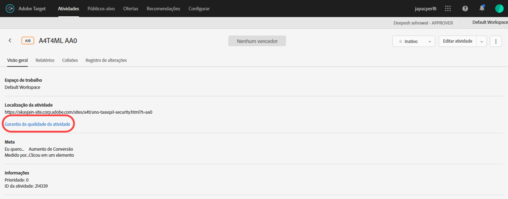

# Controle de qualidade da atividade {#activity-qa}

Use URLs de QA no Adobe Target para realizar um controle de qualidade completo e fácil com links de pré-visualização que nunca mudam, direcionamento opcional de audiência e relatórios de controle de qualidade que fica segmentado dos dados de atividade ativa.

## Visão geral {#section_11B761A522A14E61978275772210A4C2}

O controle de qualidade da atividade permite que você teste completamente suas atividades do Target antes de iniciá-las ao vivo. A funcionalidade de controle de qualidade da atividade inclui:

* Links para compartilhar com membros da equipe que nunca mudam ou exigem regeneração, independentemente das atualizações feitas nas experiências ou atividades. Isso permite testar totalmente suas atividades em toda a jornada do usuário.
* As condições do público-alvo são respeitadas opcionalmente, para que os profissionais de marketing possam testar os critérios de direcionamento ou ignorá-los para garantir a qualidade da aparência das experiências sem precisar atender a essas condições.
* Os relatórios de controle de qualidade são capturados para que os profissionais de marketing possam confirmar que as métricas estão sendo incrementadas conforme esperado e os dados do relatório de controle de qualidade são mantidos separados dos relatórios de produção (para relatórios não-A4T).
* A capacidade de pré-visualização de uma experiência isoladamente ou em conjunto com outras atividades ativas que satisfazem os critérios do delivery (solicitação de página/Público alvo/audiência).
* A habilidade de garantir a qualidade de toda a jornada do usuário. Você pode acessar seu site uma vez com o link de controle de qualidade e, em seguida, navegar pelo site inteiro enquanto estiver no Controle de qualidade da atividade. Você permanece no Controle de qualidade da atividade até terminar a sessão ou até usar o  [Bookmarklet de controle de qualidade do Target](/help/c-activities/c-activity-qa/activity-qa-bookmark.md#concept_A8A3551A4B5342079AFEED5ECF93E879) para forçar você a sair do controle de qualidade da atividade. Esse recurso é particularmente útil se você tiver uma atividade abrangendo várias páginas da Web.

   >[!NOTE]
   >
   >Isso é verdadeiro para implementações do at.js com a versão 2.*x* ou posterior. Para at.js 1.*implementações x* e mbox.js, isso só é verdade se o navegador do visitante não bloquear cookies de terceiros.

## Acesso e compartilhamento de um URL de controle de qualidade  {#section_1C59BAA247B247BDB125D1BE8EAD4547}

1. Na página [!UICONTROL Visão geral] de uma atividade (todos os tipos exceto a Personalização automatizada), clique no link **[!UICONTROL Controle de qualidade da atividade]**.

   

1. Configure as seguintes definições:

   

   * **Combinar as regras do público-alvo para ver as experiências:** algumas vezes, você quer confirmar se a combinação de público-alvo funciona. Outras vezes você só quer verificar a aparência da atividade. Se essa configuração for alternada para a posição &quot;ativada&quot;, os testadores deverão atender aos requisitos de direcionamento para se qualificarem para ver as experiências. Para as atividades do Direcionamento de experiência (XT), um único URL de atividade será fornecido. A experiência que você vê é determinada pela sua qualificação para uma das regras de direcionamento.

      Se essa configuração for colocada na posição &quot;off&quot;, você verá as experiências ao clicar nos links, independente do fato de você se qualificar ou não. Ao executar o controle de qualidade, você pode alternar entre exigir ou não exigir que o direcionamento do público-alvo seja respeitado.

   * **Mostrar conteúdo padrão para todas as outras Atividades:** Se essa opção for alternada para a posição &quot;ligado&quot;, o conteúdo padrão será exibido para todas as outras atividades (por exemplo, a pré-visualização será exibida isoladamente sem considerar todas as outras atividades ativas na mesma página/[!DNL Target] solicitação.

      Se essa configuração for configurada como &quot;desativada&quot;, considere o seguinte:

      * Se houver colisões entre a atividade que você está testando e outras atividades ao vivo,  [as regras normais de prioridade](/help/c-activities/priority.md#concept_1780C11FEA57440499F0047DD6900E0F) serão aplicadas. Por causa disso, é possível que você não veja a atividade desejada para o controle de qualidade.
      * Aumento de métricas para as atividades visualizadas, mas apenas no ambiente de relatório de controle de qualidade.

1. Clique em **[!UICONTROL Concluído]** para salvar suas alterações.
1. Compartilhe os URLs de link de atividade com os membros de sua organização para testar.

   Os links de atividades nunca expiram e você não precisa reenviar links se alguém fizer alterações em uma atividade ou experiência. No entanto, se você aplicar um público-alvo diferente da Biblioteca de público-alvo, em vez de simplesmente editar a atividade, será gerado um novo link que você precisará compartilhar novamente.

   Cada URL de link de atividade (para Exp A, Exp B etc.) permite iniciar a jornada do usuário a partir da experiência correspondente. Você pode clicar no URL gerado para uma experiência e prosseguir com a navegação normal do site para ver experiências em várias páginas (se houver várias páginas). Apenas um URL é gerado por experiência, mesmo que a experiência abranja várias páginas (teste de modelo ou teste de várias páginas).

   Você pode navegar pelo site para ver as outras páginas porque o Controle de qualidade da atividade é aderente. Observe que isso é verdadeiro para implementações do at.js com a versão 2.*x* ou posterior. Para at.js 1.*implementações x* e mbox.js, isso só é verdade se o navegador do visitante não bloquear cookies de terceiros.

1. Para ver os relatórios gerados a partir dos URLs do link de atividade, clique na página **[!UICONTROL Relatórios]** da atividade, clique no ícone **[!UICONTROL Configurações]** () e selecione **[!UICONTROL Modo de controle de qualidade]** na lista suspensa **[!UICONTROL Ambiente]**.

## Considerações {#section_B256EDD7BFEC4A6DA72A8A6ABD196D78}

* O link [!UICONTROL Controle de qualidade da atividade] é exibido na página [!UICONTROL Visão geral] de todos os tipos de atividade exceto para a Personalização automatizada (AP). Você pode utilizar  [Visualização de links](/help/c-activities/t-automated-personalization/experience-preview.md#task_586C6655A6FD4AF08F5678FC3F481EFC) para atividades de AP.
* Os links de visualização de QA da atividade para atividades salvas podem não ser carregados se houver muitas atividades salvas em sua conta. Tentar novamente os links de visualização deve funcionar. Para impedir que isso continue acontecendo, arquive as atividades salvas que não são mais usadas ativamente.
* Os URLs de controle de qualidade de atividades estão disponíveis com atividades com o Analytics como fonte de geração de relatórios (A4T). Os hits gerados durante a execução do Controle de qualidade usando o Controle de qualidade da atividade fluirão para o mesmo conjunto de relatórios no qual os dados da atividade serão gerados mesmo depois que a atividade for ativada.
* O Controle de qualidade da atividade não exibe o conteúdo para atividades arquivadas ou atividades que estão além das datas de término. Se você desativar uma atividade finalizada, deverá salvá-la novamente para que o Controle de qualidade da atividade funcione.
* Atividades importadas para Target Standard / Premium (do Target Classic, por exemplo) não são compatíveis com URLs de controle de qualidade.
* Nas atividades de alocação automática, direcionamento automático e Recommendations, o modelo não será afetado pelas visitas capturadas no controle de qualidade da atividade.
* Como o Controle de qualidade da atividade é aderente, depois de navegar em um site no Controle de qualidade da atividade, sua sessão do Target deve expirar ou você precisa que o Target o libere do Controle de qualidade da atividade antes que você possa exibir seu site como um visitante típico. Use o  [Bookmarklet de Controle de qualidade do Target](/help/c-activities/c-activity-qa/activity-qa-bookmark.md#concept_A8A3551A4B5342079AFEED5ECF93E879) para forçar você a sair do Controle de qualidade da atividade.

   Você também pode forçar a sua saída manualmente carregando uma página em seu site com o parâmetro `at_preview_token` com um valor vazio (por exemplo, `https://www.mysite.com/?at_preview_token=`).

* Se você tiver especificado “URL é” ao criar os refinamentos da atividade [no Criador baseado em formulário](/help/c-experiences/form-experience-composer.md#task_FAC842A6535045B68B4C1AD3E657E56E) ou [opções de entrega da página no Visual Experience Composer)](/help/c-experiences/c-visual-experience-composer/viztarget-options.md#reference_3BD1BEEAFA584A749ED2D08F14732E81), a URL de QA não funcionará porque o QA da atividade adiciona parâmetros de URL. Para resolver esse problema, clique no URL do Controle de qualidade para acessar seu site, remover os parâmetros anexados do URL e, em seguida, carregar o novo URL.
* Se você tiver o at.js 1.*x*, ou mbox.js, o modo de QA da Atividade não ficará fixo se você usar o Safari ou outro navegador que bloqueia cookies de terceiros. Nesses casos, você deve adicionar os parâmetros de pré-visualização a cada URL para o qual você navega. O mesmo é verdade se você implementou o [CNAME](/help/c-implementing-target/c-considerations-before-you-implement-target/implement-cname-support-in-target.md).
* Se uma atividade usar vários públicos-alvo de experiência (por exemplo, um site dos EUA e Reino Unido incluídos na mesma atividade), os links de controle de qualidade não serão gerados para as quatro combinações (Experiência A/Site dos EUA, Experiência A/Site do Reino Unido, Experiência B/Site dos EUA, Experience B/Site do Reino Unido). Apenas dois links de Controle de qualidade (Experiência A e Experiência B) são criados e os usuários devem se qualificar para o público-alvo apropriado para ver a página. Uma pessoa do Controle de qualidade do Reino Unido não conseguiu ver o site dos EUA.
* Todos os parâmetros `at_preview` e valores já estão codificados com URL. Na maioria das vezes, tudo funciona conforme o esperado; no entanto, alguns clientes podem ter balanceadores de carga ou servidores da Web que tentam codificar os parâmetros de cadeia de caracteres de consulta mais uma vez.

   Devido a essa codificação dupla, quando tentamos decodificar o `at_preview_token`, o Target não pode extrair o valor do token correto, resultando em uma visualização que não funciona.

   Recomendamos que você converse com sua equipe de TI para garantir que todos os parâmetros de pré-visualização sejam incluir na lista de permissões para que esses valores não sejam transformados de nenhuma forma.

   A tabela a seguir lista os parâmetros que podem ser incluir na lista de permissões em seu domínio:

   | Parâmetro | Tipo | Valor | Descrição |
   |--- |--- |--- |--- |
   | `at_preview_token` | Sequência de caracteres criptografada | Obrigatório; sem valor padrão | Uma entidade criptografada que contém a lista de IDs de campanha que podem ser executadas no modo QA. |
   | `at_preview_index` | String | Empty | O formato do parâmetro é `<campaignIndex>` ou `<campaignIndex>_< experienceIndex>` Ambos os índices começam com 1. |
   | `at_preview_listed_activities_only` | Booleano (true/false) | Valor padrão: false | Se &quot;true&quot;, todas as campanhas especificadas nos parâmetros `at_preview_index` serão processadas. Se &quot;false&quot;, todas as campanhas da página serão processadas, mesmo que não tenham sido especificadas no token de visualização. |
   | `at_preview_evaluate_as_true_audience_ids` | String | Empty | Underscore-separated (&quot;_&quot;) list of segmentId-s that should always (at targetting and reporting level) be evaluated as &quot;true&quot; in the scope of the [!DNL Target] request. |
   | `_AT_Debug` | String | Janela ou console | Logon no console ou nova janela. |
   | `adobe_mc_ref` |  |  | Passa o URL de referência da página padrão para a nova página. Quando usado com a versão 2.1 (ou posterior) do `AppMeasurement.js`, o [!DNL Adobe Analytics] usa esse valor de parâmetro como o URL de referência na nova página. |
   | `adobe_mc_sdid` |  |  | Passa a [!DNL Supplemental Data Id] (SDID) e a [!DNL Experience Cloud Org Id] da página padrão para a nova página, para que o Analytics para Target (A4T) &quot;junte&quot; a solicitação do Target na página padrão com a solicitação do Analytics na nova página. |

* A interface do usuário do modo de controle de qualidade do Target mostra apenas o primeiro URL de uma experiência em uma atividade de várias páginas. A suposição é que você esteja criando um teste de jornada e moverá do URL 1 para URL 2. No entanto, se você quiser ir independentemente para o URL 2, copie todos os parâmetros de URL fornecidos em relação ao URL 1 e aplique-os ao URL 2 após colocar um &quot;?&quot; exatamente como você vê no URL 1.
