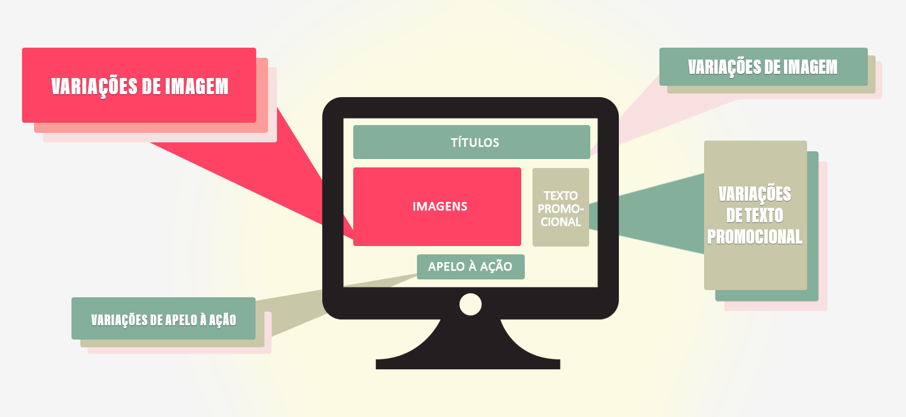

# Visão geral de teste multivariado

O [!UICONTROL Teste multivariado] (MVT) no [!DNL Adobe Target] compara combinações de ofertas em elementos em uma página para determinar qual combinação tem o melhor desempenho para um público-alvo específico e identifica qual elemento afeta mais o sucesso da atividade.

## Visão geral do MVT {#section_C73A2D1409EC42C9B0EDD4B976651C5E}

O teste multivariado pode ajudar você a descobrir a influência relativa que os elementos específicos têm na conversão, em comparação com outros elementos na página. Ele também pode ajudar você a refinar uma combinação de elementos que demonstraram ser eficazes.

Uma vantagem que um teste multivariado oferece em comparação com um teste A/B é a capacidade de mostrar quais elementos na sua página têm a maior influência na conversa. Isso também é conhecido como &quot;efeito principal&quot;. Essa informação é útil, por exemplo, ao ajudar você a determinar onde colocar conteúdo que deve receber mais atenção.

Os testes multivariados também ajudam você a descobrir os efeitos compostos entre dois ou mais elementos em uma página. Por exemplo, um determinado anúncio pode produzir mais conversas quando combinado com um certo banner ou imagem principal. Isso também é conhecido como &quot;efeito de interação&quot;.

[!DNL Target]O usa testes multivariados fatoriais completos para ajudar você a otimizar seu conteúdo. Um teste multivariado fatorial completo verifica todas as combinações possíveis de conteúdo com probabilidade igual. Por exemplo, se houver dois elementos de página com três ofertas cada, haverá nove combinações possíveis (3x3). Três elementos, com dois deles contendo três ofertas possíveis e um com duas ofertas, oferecem 18 opções (3x3x2).

No Target, cada combinação é uma experiência única. O teste multivariado compara cada experiência para você poder saber quais são as combinações de maior êxito. Ao mesmo tempo, os dados são coletados e analisados para entender como cada local e as ofertas influenciam a métrica de sucesso.

Devido ao número de combinações que podem ser geradas, um teste multivariado requer mais tempo e tráfego do que um teste A/B. A página deve receber tráfego suficiente para produzir resultados significativos estatisticamente para cada experiência. Para obter resultados úteis, você precisa entender a quantidade de tráfego que a sua página recebe e testar o número ideal de combinações para a quantidade certa de tempo a fim de obter os resultados necessários. Target&#39;s [O Avaliador de tráfego](/help/c-activities/c-multivariate-testing/t-create-multivariate-test/traffic-estimator.md#task_71AA6922AFD447EA8C5E610A78ABA714) pode ajudar você a projetar um teste que funcione com seu tráfego. Antes de usar o Avaliador de tráfego, você deve ter boas estatísticas que demonstrem o número de impressões e conversas que o site recebe normalmente. Considere seus níveis diários de tráfego. Quanto mais experiências em uma atividade, mais tráfego ela precisará incluir, ou terá que ser executada por mais tempo. Se o seu tráfego não for muito alto, você deverá testar um número pequeno de combinações; caso contrário, o tempo necessário para produzir resultados significativos para o teste pode ser muito longo para ser útil.

## Terminologia MVT {#section_DF475CA7F34B4CFDB7BE7363761D64AE}

Ao configurar um teste multivariado, é útil compreender a terminologia básica.

Há vários termos que são usados de maneiras diferentes no setor. Esta seção define os termos usados pelo [!DNL Target].

**Combinação:** as variações de conteúdo criadas quando você testa várias opções de conteúdo em diversos locais. Por exemplo, se você estiver testando três localizações, cada uma delas com três opções de conteúdo, então, haverá 27 combinações possíveis (3x3x3). Um visitante do site verá uma combinação, também chamada de experiência.

**Conteúdo:** o texto ou a imagem que compõe uma variação de teste em uma localização. Em um teste multivariado, são comparadas várias opções de conteúdo em várias localizações. Na metodologia MVT, o conteúdo é, às vezes, chamado de *nível*.

**Elemento:** um elemento DOM que tem variações de conteúdo a serem testadas no teste MVT. Consulte também *Localização*.

**Localização:** uma área de conteúdo específico em uma página, normalmente, contido por um elemento DOM. Na metodologia MVT, uma localização é, às vezes, chamado de *fator*. Um teste multivariado fatorial completo compara todas as combinações possíveis de ofertas nas localizações.

## Quando usar MVT vs A/B {#section_3D2B966B6671406C861A1843EA41D28C}

Os testes multivariados podem ser usados junto com testes A/B para otimizar sua página. Estes são alguns exemplos de ocasiões em que talvez você queira usá-los juntos:

* Use um teste A/B para otimizar o layout da sua página, seguido por um teste MVT para determinar o melhor conteúdo em cada elemento na página.

   Um teste A/B pode gerar um feedback importante no layout, e os testes MVT são ótimos para testar o conteúdo dentro dos elementos no design da sua página. A execução de um teste A/B no layout antes de testar várias opções de conteúdo pode ajudar você a determinar o melhor layout e o conteúdo mais impactante.

* Use um teste MVT para determinar qual elemento é o mais importante e acompanhe com um teste A/B mais focado nesse elemento.

   Quando o número de experiências diferentes exceder cinco e abranger dois ou mais elementos, é recomendável considerar um teste MVT antes de executar seus testes A/B. O teste MVT mostra quais áreas da página têm maior probabilidade de melhorar a conversão. Esses são os elementos em que um profissional de marketing deve se concentrar. Por exemplo, o teste de MVT pode mostrar que a chamada à ação é o elemento mais importante para atingir suas metas. Depois que determinar quais elementos e conteúdos são mais úteis para ajudá-lo a atingir suas metas, você poderá executar um teste A/B para refinar mais os resultados, por exemplo, para testar duas imagens específicas entre si ou comparar o texto ou as cores de uma chamada à ação. Ao seguir o teste MVT com um ou mais testes A/B, você pode determinar o melhor conteúdo possível para os resultados que deseja.

## Considerações {#section_979FE3F398654C1EA1C86E7DBC9A8DAD}

* Use um teste MVT quando você tiver pelo menos três elementos para testar. Se tiver menos, execute uma série de  Testes A/B.
* Selecione os elementos de páginas que você acha que terão mais impacto sobre os resultados.
* Não inclua elementos nem locais demais em um teste. Quanto maior o número, maior será a duração do teste.
* Planejar o teste com antecedência. Não é aconselhável editar um teste depois que ele é ativado e start de dados sendo coletados e analisados.
* Recomenda-se que os elementos sejam independentes entre si.

   Por exemplo, não teste o layout e o conteúdo no mesmo teste.

* Inclua mais tempo para QA devido ao amento do número de experiências. Você também pode usar testes fatoriais parciais para diminuir a quantidade de tráfego necessário para um teste multivariado. Para obter mais informações, consulte Teste fatorial parcial abaixo:

## Teste fatorial parcial

[!DNL Target]O oferece teste multivariado fatorial completo como uma opção de atividade incorporada. Em estatísticas, o projeto de experimentos oferece muitas abordagens, ou projetos, para determinar quais fatores influenciam os resultados. Uma dessas abordagens é o [Método Taguchi](https://en.wikipedia.org/wiki/Taguchi_methods) para testes fatoriais parciais. O Taguchi permite que os profissionais de marketing criem um conjunto de hipóteses que reduzirá o número de permutas de experiências que precisam ser testadas e, por sua vez, diminua os requisitos de tráfego para um teste multivariado. Essa abordagem de funcionalidade e teste pode ser utilizada no [!DNL Target] usando [esta planilha offline](/help/assets/MVT-Taguchi-Partial-Factorial-Design-02102017.xlsx).

Se a sua equipe usa outras abordagens de Projeto de Experimentos, você pode usar essa planilha como implementação de referência para projetos experimentais personalizados.

À medida que você usa a planilha de cálculo, considere as seguintes dicas:

* Escolha os elementos que você deseja alterar e o número de versões de cada elemento (3x2, 4x3 e assim por diante).
* Mantenha a numeração consistente. Por exemplo, se o botão for o Elemento 1 e as opções forem Azul, Verde e Amarelo, o botão azul é 1-1, o botão verde é 1-2 e o botão amarelo é 1-3.
* A planilha offline fornece o número apropriado de experiências necessárias (quatro para um 3x2, nove para 4x3 e assim por diante).
* Crie as experiências no fluxo de trabalho A/B com o [Visual Experience Composer (VEC)](/help/c-experiences/experiences.md). Você pode usar o código personalizado, editar o HTML, o WYSIWYG ou qualquer combinação.
* Após o término da atividade (baseada na calculadora de tamanho de exemplo), execute os resultados na planilha para obter os outros detalhes.

Para mais considerações e práticas recomendadas, consulte [Práticas recomendadas de teste multivariado](/help/c-activities/c-multivariate-testing/best-practices.md#reference_53635817FFB741EF8C4E56CC70688EDD).

## Vídeos de treinamento

Os vídeos a seguir contêm mais informações sobre os conceitos discutidos neste artigo.

### Tipos de atividade (9:03) 

Este vídeo de visão geral explica os tipos de atividades disponíveis no Target Standard/Premium. O teste multivariado é discutido a partir de 04:20.

* Descreva os tipos de atividade incluídos no [!DNL Adobe Target]
* Selecione o tipo de atividade apropriado para atingir suas metas
* Descreva o fluxo de trabalho guiado em três etapas que se aplica a todos os tipos de atividade

>[!VIDEO](https://video.tv.adobe.com/v/17386)

### Criando testes multivariados (9:25) 

Este vídeo explica como compreender, planejar e criar um teste multivariado usando o fluxo de trabalho orientado de três etapas do Target.

* Definir e projetar um teste multivariado
* Criar um teste multivariado

>[!VIDEO](https://video.tv.adobe.com/v/17395)