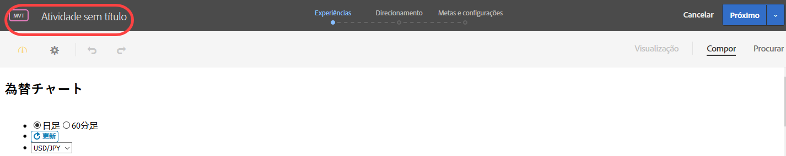
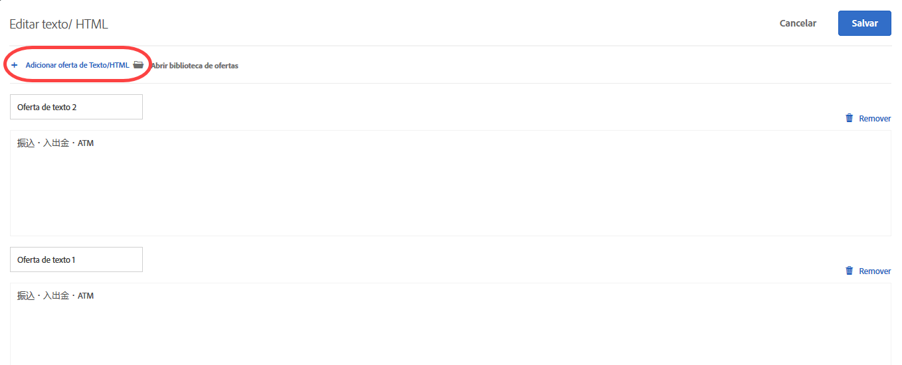
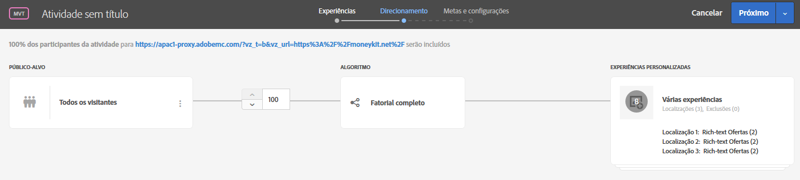
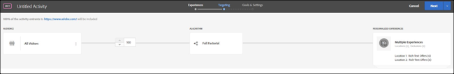

# Criar um teste multivariado{#create-a-multivariate-test}

O Visual Experience Composer no Target facilita a criação do teste diretamente em uma página habilitada pelo Target e a modificação de partes da página no Target.

O editor de ponto e clique do Target permite que você escolha qualquer local e adicione várias ofertas.

O teste multivariado ocupa um relatório de primeira página. Em outras palavras, o teste é executado em um URL específico, com as experiências projetadas para essa página.

1. Clique em **[!UICONTROL Criar atividade]** &gt; **[!UICONTROL Teste multivariado]**.

   

1. [Especifique o URL](../../../c-activities/c-multivariate-testing/t-create-multivariate-test/url.md#concept_C12E4A85FF3B4E518E3110F6CF1AF9C0) da página que deseja testar e clique em **[!UICONTROL Criar atividade]**.

   

   >[!NOTE]
   >
   >Use um URL completo, incluindo HTTP ou HTTPS no início.

   Se uma mensagem aparecer, solicitando que você ative o navegador para conteúdo misto, siga as instruções na mensagem. Depois de ativar seu navegador para conteúdo misto, comece de novo na Etapa 1.

   O Visual Experience Composer é aberto.

   Em caso de problemas, para obter informações sobre a solução de problemas do VEC, consulte [Solução de problemas do Visual Experience Composer](../../../c-experiences/c-visual-experience-composer/r-troubleshoot-composer/troubleshoot-composer.md#reference_77743144F10143A3A89D56E116D296E4).
1. Digite um nome para a atividade.

   

   Os seguintes caracteres não são permitidos em um nome de atividade:

   | Caractere | Descrição |
   |--- |--- |
   | / | Barra |
   | ? | Ponto de interrogação |
   | # | Sinal numérico |
   | : | Dois-pontos |
   | = | Igual a |
   | + | Plus |
   | - | menos |
   | @ | Sinal de arroba |

1. [Crie as ofertas em cada local](../../../c-activities/c-multivariate-testing/t-create-multivariate-test/add-offers.md#concept_DCE6B45C30F7419B8EC17AFDEE8D8AA6).

   

   Você pode adicionar os seguintes tipos de ofertas:

   * HTML
   * Imagem
   * Texto

1. [Visualize suas experiências](../../../c-activities/c-multivariate-testing/t-create-multivariate-test/preview-experiences.md#task_21A700587E88453A9FC2210C0DE53A28).

   

   Você pode exibir cada experiência e excluir aquelas que não quiser incluir no seu teste.
1. [Use o Avaliador de tráfego](../../../c-activities/c-multivariate-testing/t-create-multivariate-test/traffic-estimator.md#task_71AA6922AFD447EA8C5E610A78ABA714) para testar a viabilidade do seu plano de teste.

     

1. Escolha o público-alvo e porcentagem de visitantes qualificados que você quer inserir na atividade.

   

   Por exemplo, você pode limitar as entradas a 50% de todos os visitantes ou 45% do público-alvo na Califórnia.

   >[!NOTE]
   >
   >Além de selecionar um público-alvo existente, você pode combinar vários deles para criar públicos-alvo combinados ad hoc em vez de criar um novo. Para obter mais informações, consulte [Combinar vários públicos-alvo](../../../c-target/combining-multiple-audiences.md#concept_A7386F1EA4394BD2AB72399C225981E5).

1. [Revise o resumo do teste](../../../c-activities/c-multivariate-testing/t-create-multivariate-test/test-summary.md#reference_971AB225963A4DC18EEB5B0E20F0A4A7), faça as alterações desejadas e clique em **[!UICONTROL Avançar]**.

   

1. [Especifique as metas e as configurações](../../../c-activities/c-multivariate-testing/t-create-multivariate-test/goals-and-settings.md#reference_B25389FD6F3A4989801E740364B089CC) do teste.

   

1. Clique em **[!UICONTROL Salvar e fechar]** para criar a atividade.

## Vídeo de treinamento: Criação de testes multivariados (9:25)

Este vídeo monstra como planejar e criar um teste multivariado usando o fluxo de trabalho orientado de três etapas do Target.

* Definir e projetar um teste multivariado
* Criar um teste multivariado

>[!VIDEO](https://video.tv.adobe.com/v/17395)
