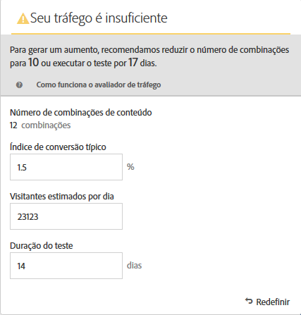
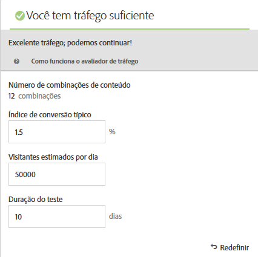

# Criar um teste multivariado{#create-a-multivariate-test}

O [!UICONTROL Visual Experience Composer] (VEC) no [!DNL Target] facilita a criação do teste diretamente em uma página ativada para o Target e a modificação de partes da página no [!DNL Target].

O editor de apontar e clicar do Target permite que você escolha qualquer local e adicione várias ofertas.

O [!UICONTROL teste multivariado] (MVT) ocupa um relatório de primeira página. Em outras palavras, o teste é executado em um URL específico, com as experiências projetadas para essa página.

1. Clique em **[!UICONTROL Criar atividade]** > **[!UICONTROL Teste multivariado]**.

   

   >[!NOTE]
   >
   >Os tipos de atividades disponíveis dependem da sua conta do Target. Alguns tipos de atividades podem não aparecer na lista. Por exemplo, a [!UICONTROL Personalização automatizada] é um [recurso do Target Premium](/help/c-intro/intro.md#premium).
   >
   >Para obter mais informações sobre os diversos tipos de atividades disponíveis no [!DNL Target] e suas diferenças, consulte [Atividades](/help/c-activities/activities.md#concept_D317A95A1AB54674BA7AB65C7985BA03). Consulte [Tipos de atividade do Target](/help/c-activities/target-activities-guide.md) para ajudá-lo a decidir qual tipo de atividade se adapta melhor as suas necessidades.

1. Selecione **[!UICONTROL Visual (Padrão)]**, se necessário.

   

   >[!NOTE]
   >
   >Em caso de problemas, para obter informações sobre a solução de problemas do VEC, consulte [Solução de problemas do Visual Experience Composer](/help/c-experiences/c-visual-experience-composer/r-troubleshoot-composer/troubleshoot-composer.md).
   >
   >A opção [!UICONTROL Escolher local de trabalho] na ilustração anterior é um recurso do [Target Premium](/help/c-intro/intro.md). Caso não veja essa opção, a licença da organização é do Target Standard.

1. (Condicional) Se você for um cliente do Target Premium, [escolha um espaço de trabalho](/help/administrating-target/c-user-management/property-channel/property-channel.md).

1. [Especifique o URL](/help/c-activities/c-multivariate-testing/t-create-multivariate-test/url.md#concept_C12E4A85FF3B4E518E3110F6CF1AF9C0) da página que deseja testar e clique em **[!UICONTROL Avançar]**.

   >[!NOTE]
   >
   >Use um URL completo, incluindo HTTP ou HTTPS no início.

   Se uma mensagem aparecer, solicitando que você ative o navegador para conteúdo misto, siga as instruções na mensagem. Depois de ativar seu navegador para conteúdo misto, comece de novo na Etapa 1.

   O Visual Experience Composer é aberto.

1. Digite um nome para a atividade.

   

   Os seguintes caracteres não são permitidos em um nome de atividade:

   | Caractere | Descrição |
   |--- |--- |
   | / | Barra |
   | ? | Ponto de interrogação |
   | # | Sinal numérico |
   | : | Dois-pontos |
   | = | Igual a |
   | + | Plus |
   | - | Menos |
   | @ | Sinal de arroba |

1. [Crie as ofertas em cada local](/help/c-activities/c-multivariate-testing/t-create-multivariate-test/add-offers.md#concept_DCE6B45C30F7419B8EC17AFDEE8D8AA6).

   

   Você pode adicionar os seguintes tipos de ofertas:

   * HTML
   * Imagem
   * Texto

1. Clique em **[!UICONTROL Visualizar]** para [visualizar suas experiências](/help/c-activities/c-multivariate-testing/t-create-multivariate-test/preview-experiences.md).

   

   Você pode exibir cada experiência e excluir aquelas que não quiser incluir no seu teste. Para excluir uma ou mais experiências, marque as caixas de seleção desejadas e clique em **[!UICONTROL Excluir]** .

   

1. [Use o Avaliador de tráfego](/help/c-activities/c-multivariate-testing/t-create-multivariate-test/traffic-estimator.md#task_71AA6922AFD447EA8C5E610A78ABA714) para testar a viabilidade do seu plano de teste.

   

   A ilustração a seguir indica que a atividade tem tráfego insuficiente.

   

   A ilustração a seguir indica que a atividade tem tráfego insuficiente.

   

1. Clique em **[!UICONTROL Avançar]** para avançar para a página [!UICONTROL Direcionamento.]

1. Escolha o público-alvo e porcentagem de visitantes qualificados que você quer inserir na atividade.

   

   Por exemplo, você pode limitar as entradas a 50% de todos os visitantes ou 45% do público-alvo na Califórnia.

   >[!NOTE]
   >
   >Além de selecionar um público-alvo existente, você pode combinar vários deles para criar públicos-alvo combinados ad hoc em vez de criar um novo. Para obter mais informações, consulte [Combinar vários públicos-alvo](/help/c-target/combining-multiple-audiences.md#concept_A7386F1EA4394BD2AB72399C225981E5).

1. [Revise o resumo do teste](/help/c-activities/c-multivariate-testing/t-create-multivariate-test/test-summary.md#reference_971AB225963A4DC18EEB5B0E20F0A4A7) e faça as alterações desejadas, depois clique em **[!UICONTROL Avançar]**.

1. [Especifique as metas e as configurações](/help/c-activities/c-multivariate-testing/t-create-multivariate-test/goals-and-settings.md#reference_B25389FD6F3A4989801E740364B089CC) do teste.

1. Clique em **[!UICONTROL Salvar e fechar]** para criar a atividade.

## Vídeo de treinamento: Criando o selo do 

Este vídeo monstra como planejar e criar um teste multivariado usando o fluxo de trabalho orientado de três etapas do Target.

* Definir e projetar um teste multivariado
* Criar um teste multivariado

>[!VIDEO](https://video.tv.adobe.com/v/17395)
