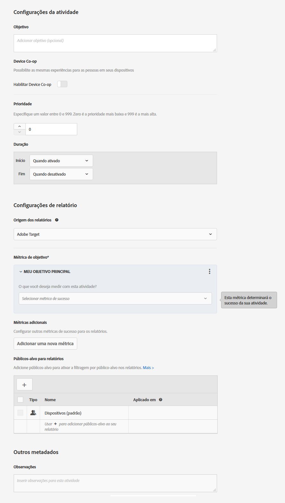

# Metas e Configurações{#goals-and-settings}

A página de Metas e Configurações é onde você insere informações sobre as metas do teste.

* Configurações de atividade
* Configurações da geração de relatórios
* Outros metadados

As configurações disponíveis dependem se você usa o Target ou Analytics como a fonte de dados.

## Configurações de atividade {#section_DCBDC354261F420EBD4B43EA34947BAC}

As seguintes configurações estão disponíveis:

### Objetivo

Digite um objetivo opcional. O objetivo pode ser qualquer informação que ajuda você e os membros da sua equipe a identificarem a campanha.

### Prioridade

Dependendo das configurações, a interface do usuário e as opções de Prioridade variam. É possível usar as configurações herdadas de Baixo, Médio ou Alto, ou pode ativar as prioridades otimizadas de 0 a 999.

A prioridade é usada se várias atividades forem atribuídas para o mesmo local com o mesmo público-alvo. Se duas ou mais atividades forem atribuídas ao local, a atividade com a maior prioridade é exibida.

Se essa opção não estiver ativada em S[!UICONTROL Administration] > [!UICONTROL Relatórios] (o padrão), especifique uma prioridade: Baixa, Média ou Alta.

Para ativar prioridades refinadas, clique em [!UICONTROL Administração] > [!UICONTROL Relatórios] e, em seguida, alterne a opção Ativar prioridades granuladas para a posição &quot;Ligado&quot;.

Se esta opção estiver ativada, especifique um valor entre 0 e 999:

* 0 = Baixo
* 999 = Alto

Para atividades criadas em versões anteriores do Target Standard/Premium, a prioridade Baixa é convertida para 0, a Média é convertida para 5 e a Alta é convertida para 10. É possível ajustar esses valores conforme necessário.

>[!NOTE]
>
>Antes de poder desabilitar esta opção após o uso de prioridades otimizadas, todas as prioridades devem ser ajustadas novamente para 0, 5 e 10.

### Duração

A atividade pode começar quando aprovada ou você pode definir data e hora específicas. Da mesma maneira, a atividade não pode terminar quando é desativada, ou você pode definir uma data e hora. O seletor de hora usa um relógio de 24 horas, sendo 00h a meia-noite. O fuso horário é definido para o que foi configurado no navegador. Para usar um fuso horário diferente, defina o navegador para outro fuso horário e reinicie-o.

## Configurações da geração de relatórios {#section_13119392051044FBA6387D9B3B1C43CF}

As seguintes configurações estão disponíveis:

### Solução de relatório

Especifique se os dados são coletados do Adobe Target ou do Adobe Analytics. Consulte [Adobe Analytics como fonte de relatório para o Target](/help/c-integrating-target-with-mac/a4t/a4t.md) para saber quais são as diferenças entre as soluções de relatório e as vantagens de cada uma.

Ao selecionar o Analytics como fonte de relatórios para o Target, você seleciona um conjunto de relatórios do Analytics para receber os dados de atividade do Target. Para fazer isso, primeiro escolha uma das empresas do Analytics vinculadas à sua conta e, em seguida, selecione o conjunto de relatórios apropriado para a atividade. Somente conjuntos de relatórios provisionados para se conectar ao Adobe Target estarão disponíveis para seleção. Se não vir os conjuntos de relatórios esperados, primeiro, experimente sair e entrar na Adobe Experience Cloud para tentar novamente. Se o conjunto de relatórios ainda estiver ausente na lista, entre em contato com o atendimento ao cliente.

O Analytics for Target exige que um servidor de rastreamento informe os resultados corretamente. Um servidor de rastreamento padrão aparecerá no campo Servidor de rastreamento. Se você usar mais de um servidor de rastreamento, verifique se incluiu o servidor de rastreamento correto nesse campo. Consulte [Usar um servidor de rastreamento do Analytics](/help/c-integrating-target-with-mac/a4t/analytics-tracking-server.md#task_72077BA7E93C4A65A715A18F32228823) para obter mais informações.

Se uma solução de relatório for especificada nas suas configurações da conta, a solução especificada será usada e essa configuração não ficará visível.

>[!NOTE]
>
>Não é possível alterar a fonte de relatórios depois que a atividade entra em vigor para manter os relatórios consistentes.

### Meta

Selecione a ação executada por um visitante para atingir a meta. Por exemplo, escolha uma métrica de Conversão e defina os parâmetros que determinam quando o sucesso é obtido.

>[!NOTE]
>
>Se a solução de relatório for definida como Analytics, a única métrica de objetivo disponível será Conversão. As métricas do Analytics não podem ser selecionadas como uma meta.

Quando você selecionar sua métrica de sucesso, um seletor será exibido. Use esse seletor para escolher as especificações da métrica de sucesso.

Se estiver habilitado, o campo Valor estimado de Conversão (não disponível para as métricas de Pontuação da página) fornece um valor para a meta, mas não para outras métricas. Este valor permite que o Target calcule a estimativa de aumento da receita. Este campo é opcional, mas a receita incremental para qualquer métrica que não seja de receita não pode ser calculada sem ele. Para todas as métricas de receita (Receita por visitante, Valor médio de pedido, Total de vendas e Pedidos), a estimativa usa a Receita por visitante. O tipo de dados é a moeda.

Após atingir o objetivo da atividade, um visitante continua vendo o conteúdo da atividade, a menos que o visitante esteja qualificado para uma atividade de prioridade mais alta. Se o visitante atingir o objetivo novamente, será contado como outra conversão. Isso é diferente do comportamento padrão no Target Classic, que conta os visitantes como novos se eles veem o teste novamente.

### Métricas adicionais

Crie métricas de sucesso adicionais.

Essa configuração não estará disponível se a solução de relatório estiver definida como Analytics. Nesse caso, as métricas definidas para o conjunto de relatórios do Analytics serão aplicadas.

Públicos-alvo para geração de relatórios

### Por padrão, os relatórios mostram os resultados para todos os visitantes qualificados. Você pode incluir públicos-alvo do relatório para mostrar apenas informações sobre públicos-alvo específicos.

## Configurações avançadas {#section_E2FE441AFB324E498793ABB025ED9974}

As configurações avançadas estão disponíveis para as métricas de meta do Teste multivariado.

>[!NOTE]
>
>Caso use o Adobe Analytics como fonte de geração de relatórios, as configurações serão gerenciadas pelo servidor do Analytics. A opção de configurações avançadas não estará disponível.

### Qual métrica de sucesso deve ser atingida antes do aumento dessa métrica?

Use esta opção para contar alguém que atingiu a métrica de sucesso somente se essa pessoa tiver atingido uma métrica de sucesso diferente antes. Por exemplo, uma conversão de teste só pode ser válida se o visitante clica na oferta ou alcança a uma página específica antes da conversão.

É possível fornecer dependência em várias métricas, juntamente com a flexibilidade para escolher se a métrica deve ser alcançada ou não para que a contagem seja incrementada.

Você deve definir ambas as métricas de sucesso (ou várias) para poder tornar uma dependente da outra.

A opção Adicionar dependência permite que a métrica de sucesso seja incrementada se outra métrica de sucesso for ou não alcançada.

Para adicionar uma dependência:

1. Depois de adicionar outras métricas, clique em **[!UICONTROL Configurações avançadas]**.
2. Clique na opção Adicionar dependência:

   

3. Arraste e solte as métricas desejadas do painel esquerdo para o painel direito e clique em **[!UICONTROL Alcançado]** para alternar a configuração entre Alcançado e Não alcançado .

   

É possível editar ou remover dependências depois de adicioná-las.

### O que acontece depois que um usuário atinge esta métrica de meta?

Há três opções para o que acontece depois que um visitante atinge a métrica de meta:

* Selecione Aumentar a contagem e manter o usuário na atividade para especificar como é feito o aumento da contagem.
* Selecione Aumentar a contagem, liberar o usuário e permitir a reentrada para especificar a experiência que o usuário vê ao entrar na atividade novamente.
* Selecione Aumentar a contagem, liberar o usuário e impedir a reentrada para especificar o que o usuário vê em lugar do conteúdo da atividade.

Consulte [Métricas de sucesso](/help/c-activities/r-success-metrics/success-metrics.md#reference_D011575C85DA48E989A244593D9B9924) para obter mais informações sobre configurações avançadas.

## Outros metadados {#section_2E8917BEFB954480A4206B9E9E917F80}

A seguinte configuração está disponível:

### Notas

Digite qualquer informação sobre sua atividade que seja útil para manter ao seu alcance ou de outros membros da equipe. O painel de Observações é redimensionável.

## Vídeos de treinamento

Os vídeos a seguir contêm mais informações sobre os conceitos discutidos neste artigo.

### Configurações de atividade (3:02) 

Este vídeo inclui informações sobre as configurações da atividade.

* Inserir um objetivo para a atividade
* Definir o nível de prioridade das atividades
* Programar as horas de início e término da atividade
* Adicionar públicos-alvo para relatórios a fim de criar filtros de relatórios
* Inserir observações para a atividade

>[!VIDEO](https://video.tv.adobe.com/v/17381)

### Criando testes multivariados (9:25) 

Este vídeo mostra como criar um teste multivariado usando o fluxo de trabalho orientado de três etapas do Target. Metas e configurações são discutidas a partir de 7:00.

* Definir e projetar um teste multivariado
* Criar um teste multivariado

>[!VIDEO](https://video.tv.adobe.com/v/17395)