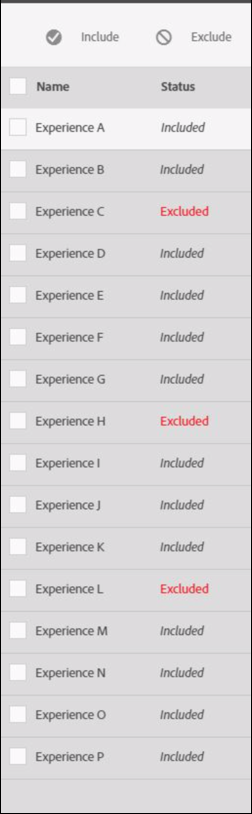

# Experiências de visualização para um Teste multivariado{#preview-experiences-for-a-multivariate-test}

Como um teste multivariado compara várias experiências em uma página, é útil visualizar a página com cada experiência.

1. No Experience Composer, clique em **[!UICONTROL Visualizar]**.

   Uma lista de todas as experiências é exibida.

   

1. Clique em uma experiência na lista para exibi-la.

1. Para excluir uma experiência do teste multivariado, selecione-a e clique em **[!UICONTROL Excluir]**.

   

   Você pode excluir uma experiência que mostra variações conflitantes ou que não esteja esteticamente equilibrada.

   >[!NOTE]
   >
   >Ao criar testes multivariados, é possível excluir mais de 10% das experiências do teste, desde que você reconheça o aviso de que deve usar relatórios offline para análise.

   Por padrão, todas as experiências são incluídas no teste multivariado. Para incluir uma experiência que tenha sido excluída, selecione-a e clique em **[!UICONTROL Incluir]**.

Clique em **[!UICONTROL Sair do modo de visualização]** para voltar para o Experience Composer e fazer alterações, ou clique em **[!UICONTROL Continuar]** para ir para o resumo do teste.

