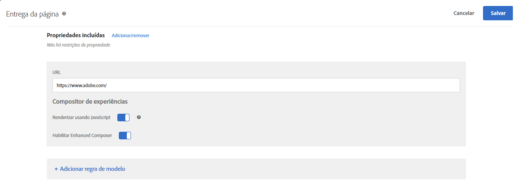

# URL da atividade{#activity-url}

O URL da atividade determina a página que é usada no teste e que é aberta quando o teste é criado.

Quando solicitado durante a criação da atividade, insira o URL da atividade. Digite o URL completo (incluindo `https://`) e clique em **[!UICONTROL Criar atividade]**.

>[!NOTE]
>
>[!DNL Target] não diferencia os protocolos de URL ([!DNL https] e [!DNL http]). Como resultado, [!DNL `https://www.adobe.com`] e [!DNL `http://www.adobe.com`] têm correspondência.

Por padrão, o Visual Experience Composer abre a página especificada nas suas Preferências da conta. Você pode especificar uma página diferente durante a criação da atividade.

Para exibir uma página diferente depois que o Visual Experience Composer for aberto, clique em **[!UICONTROL Configurar]** e selecione **[!UICONTROL URL]** e, em seguida, insira o URL na caixa de URL da atividade.

Clique em **[!UICONTROL Adicionar regra ao modelo]para adicionar mais páginas ou seções à atividade.**

Regras adicionais podem ser baseadas em qualquer um dos seguintes:

* URL
* Domínio
* Caminho
* Fragmento em hash (#)
* Consulta
* Parâmetro da mbox

Regras adicionais podem ser unidas no URL da atividade com AND ou OR. Todas regras que você adicionar são avaliadas contra si próprias com AND.

Clique em **[!UICONTROL Salvar]quando tiver concluído.**

>[!NOTE]
>
>Caso tenha inserido um URL para um site que não inclui o código JavaScript do Target Standard, você não pode selecionar elementos da página.

Por padrão, o [!UICONTROL Visual Experience Composer] não permite alterações a elementos que contenham JavaScript, como banners giratórios. Você pode desativar a opção **[!UICONTROL Renderizar usando JavaScript]** se quiser alterar esses elementos usando o [!UICONTROL Visual Experience Composer].

>[!NOTE]
>
>Se você alterar o URL após fazer alterações de uma ou mais experiências em uma página, a experiência será redefinida usando a nova página, e as alterações que você fez são perdidas.

