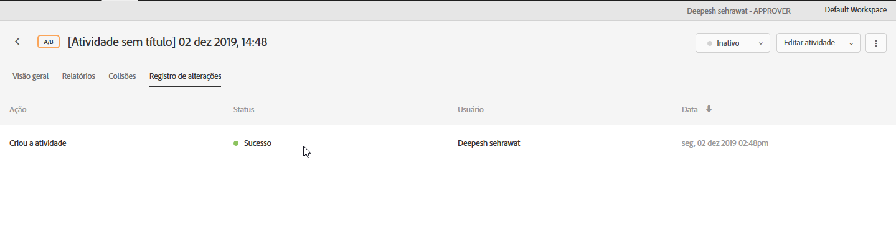

# Log de alterações da atividade{#activity-change-log}

O log de alterações fornece um registro de quem alterou suas atividades e quais foram as alterações.

1. Abra a atividade e clique em **[!UICONTROL Registro de alterações]**.

   

   A data e o usuário são listados sempre que uma atividade é criada, atualizada, ativada ou desativada. As alterações nas metas e ofertas personalizadas utilizadas na atividade também são indicadas. A coluna Status mostra se a ação está concluída, pendente ou com falha.

   Atualize a página para ver as alterações de status.
