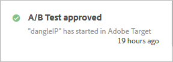

# Notificações de atividade{#activity-notifications}

O Target pode trocar notificações com outras soluções da Adobe Experience Cloud usando o Adobe Pulse. O Target envia dois tipos de notificações para todos os tipos de atividades: quando uma atividade se torna ativa e quando uma atividade é desativada.

As notificações de [!DNL Target] podem ser vistas em todas as soluções por usuários que têm um [!DNL Experience Cloud]contexto de produto de [!DNL Target Standard/Premium].

Para obter informações sobre como configurar Notificações, consulte [Notificações](https://marketing.adobe.com/resources/help/en_US/mcloud/notifications.html) na [!DNL Adobe Experience Cloud] documentação.

Acesse as notificações de qualquer local no [!DNL Target], Exceto de dentro do fluxo de Trabalho de criação da atividade. Clique no ícone de sino no cabeçalho da página para exibir ou ocultar o dispositivo de notificações.

O [!DNL Target] envia dois tipos de notificações para todos os tipos de atividade:

* Quando uma atividade se torna ativa e começa a entrega de oferta:

   Por exemplo:

   

* Quando uma atividade é desativada e para a entrega de oferta:

   Por exemplo:

   

As notificações similares também aparecem quando uma atividade agendada alcança à data de início e quando ela termina ao alcançar a data final.

Todas as notificações do [!DNL Target] exibem o nome da atividade que foi aprovada ou desativada, e incluem as palavras &quot;Adobe Target&quot; para facilitar a identificação.

Se uma única atividade envia várias notificações do mesmo tipo, elas são combinadas em um único cartão com várias notificações exibidas nela. Por exemplo:

Clique no cartão de notificação para visualizar os detalhes de cada notificação.

Por exemplo, se você clicar no cartão mostrado acima, as três notificações são exibidas:

## Limitações {#section_B466EB20B2554CE7B1915374B39F4322}

* As notificações não indicam a você quem aprovou, desativou ou importou a atividade.
* As notificações de MVT aparecem como &quot;Teste A/B&quot; pois são sincronizadas como campanhas A/B no [!DNL Target Classic].

