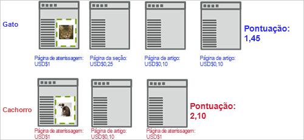
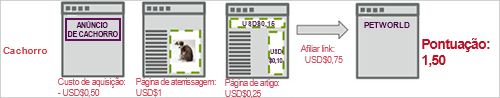

# Pontuação de captura{#capture-score}

The Capture Score engagement metric calculates an aggregated score based on the value assigned to pages visited on the site, from the point the visitor first sees the campaign&#39;s first display [!DNL Target] request.

O exemplo a seguir mostra como o envolvimento da pontuação é calculado em uma campanha que testa duas experiências, uma com uma imagem de um gato e outra com a imagem de um cão.

Nesse exemplo, o primeiro visitante acessa a experiência do gato. Assume that a global [!DNL Target] request passes in a page score based on the value of the page. If the marketer has captured page count engagement on a success metric associated with `**any Target request**`, the visit score accumulates for any request seen after the display request around the cat image.

A primeira página adiciona 1 à pontuação, a segunda página 0,25, a terceira 0,10, e a quarta 0,10 para um total de 1,45. Isto poderia ser interpretado como moeda ou pontos. Em uma visita separada, um visitante acessou a experiência do cão e, embora o visitante tenha visualizado um número menor de páginas, a pontuação é 2.10, maior do que a outra visita porque o visitante visualizou páginas com valor mais alto.

Você pode levar em consideração os custos de aquisição e receita de links associados ao enviar adboxes e redirecionadores, conforme demonstrado no fluxo da página a seguir. Notice that, in this example, both [!DNL Target] requests on the article page pass a score, possibly representing a known CPM.

**Atribuindo uma pontuação de página**

Você pode atribuir um valor à qualquer página em seu site, com base no quão valiosa é a página para você. Por exemplo, um site sobre culinária pode vender anúncios por valores mais altos nas páginas de artigo em destaque do que na seção de experiências. Logo, os artigos em destaque são mais valiosos do que a seção de experiências. A pontuação da página permite desenvolver um valor &quot;geral&quot; de uma visita, de forma que a pessoa que ler mais artigos em destaque obtenha mais &quot;pontos&quot; do que alguém que simplesmente navegue pela seção de experiências.

Existem dois métodos para atribuir uma pontuação a uma página:

* Na [!DNL Target] solicitação, crie um parâmetro chamado `mboxPageValue`.

   Exemplo: `('global_mbox', 'mboxPageValue=10');`

   The specified value is added to the score every time the page with that [!DNL Target] request is viewed. Se várias solicitações na página incluírem valores de pontuação, a pontuação da página será o total de todos os valores de solicitação. `mboxPageValue` é um parâmetro reservado usado para transmitir valores em uma solicitação de Público alvo para capturar uma pontuação de envolvimento. Valores positivos e negativos podem ser enviados. A soma é calculada no fim de cada visita para calcular a pontuação total para a visita.

* Passe o parâmetro `?mboxPageValue=n` no URL da página.

   Exemplo: `https://www.mydomain.com?mboxPageValue=5`

   Using this method, the specified value is added to the score for each [!DNL Target] request on the page. For example, if you pass the parameter `?mboxPageValue=10`and there are three [!DNL Target] requests on the page, the score for the page is 30.

>[!NOTE]
>
>As solicitações de público alvo localizadas acima da primeira [!DNL Target] solicitação de exibição de atividade não serão incluídas na pontuação.

Best practice is to assign values in the [!DNL Target] request. Isso permite que você seja preciso nos valores medidos, dependendo do conteúdo de cada solicitação.

>[!NOTE]
>
>Para obter uma manutenção mais simples, você pode configurar as atribuições de valor de pontuação do site no arquivo da [!DNL at.js] ou [!DNL mbox.js] com um pouco de lógica condicional JavaScript. Isso elimina a necessidade de adicionar mais código às suas páginas. Entre em contato com um consultor para obter ajuda.

Você pode combinar os dois métodos, mas isso pode resultar em uma pontuação maior do que a esperada. For example, if you assign a value of 10 to each of three [!DNL Target] requests and no score to a fourth request, then pass the URL parameter `?mboxPageValue=5`, your page score will be 50, 30 for the three requests with assigned values, and then 5 for each of the four requests on the page.

O contador start com a primeira solicitação de exibição, não a solicitação de entrada. Por exemplo, se você digitar a atividade na página inicial que não tem uma solicitação de exibição e, em seguida, se vincular à página do catálogo que contém uma solicitação de exibição, o contador será iniciado quando você mover para a página do catálogo.

Você também pode enviar valores negativos em páginas específicas que custam dinheiro ou não são boas para os visitantes visualizarem. Os valores negativos afetam a pontuação geral também. Essa técnica também pode ser utilizada em uma página que os visitantes acessam uma publicidade, para que você saiba qual foi o CPC. Isso também pode ser utilizado para uma página de suporte ou contato, onde você sabe que os visitantes podem ligar ou solicitar ajuda a partir dessa página.
