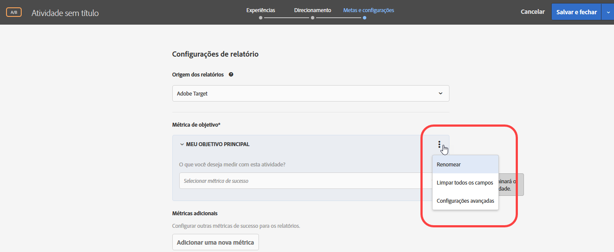
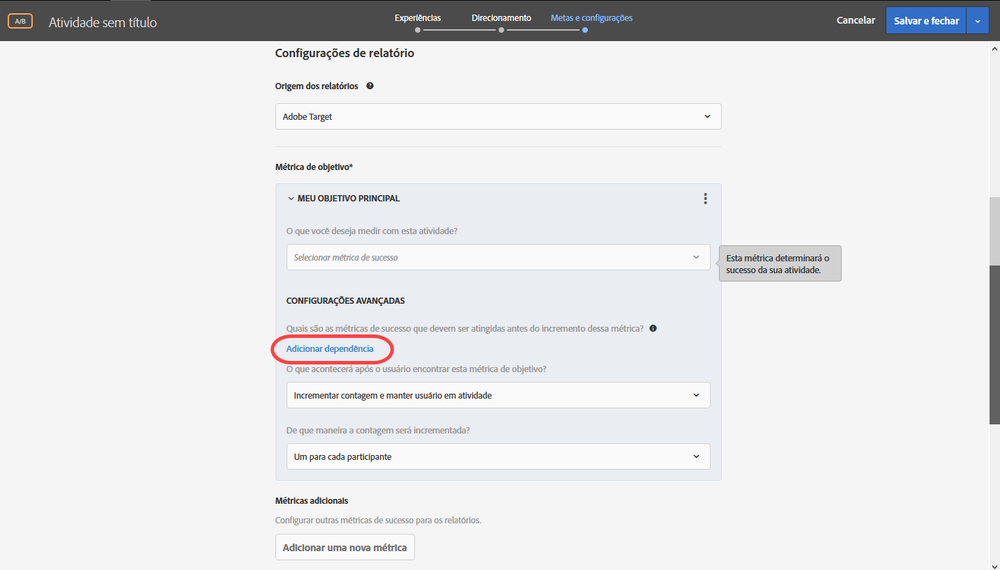

# Métricas de sucesso{#success-metrics}

No Target Standard, as métricas de sucesso são pré-configuradas para relatórios e rastreamento.

Métricas de sucesso são parâmetros usados para medir o sucesso de uma atividade. As métricas de sucesso incluem as principais medidas de negócios que permitem determinar o sucesso de uma dada experiência ou oferta em uma atividade do Target. Por exemplo, você pode determinar se uma nova oferta aumenta sua receita por visitante ou adiciona um item ao carrinho de compras. As métricas de sucesso podem ser úteis para descobrir problemas com registro, pedidos ou funis de compra, mas simplesmente com envolvimento de visitante ou cliente.

Ao manter a meta do [!DNL Target Standard] de simplificar a criação de testes, o aplicativo cuida de uma parte da configuração que é feita manualmente no [!DNL Target Classic]. Por exemplo, métricas de sucesso são pré-configuradas com as opções ideais.

Por padrão, os eventos de conversão são definidos para &quot;contar uma vez e manter o participante na atividade&quot; no [!DNL Target Standard]. As conversões são contabilizadas somente uma vez, nenhuma conversão repetida é contabilizada e o visitante sempre vê o conteúdo de teste.

As métricas de receita definidas para &quot;Incrementar a contagem e manter o usuário na atividade&quot; registram detalhes do pedido apenas para o primeiro pedido feito pelo mesmo visitante. Todos os pedidos subsequentes aumentam a contagem de conversões, mas não adicionam receita a RPV/AOV/Vendas e não serão incluídos no relatório de Detalhes do pedido.

As seguintes métricas estão disponíveis:

| Métrica de Sucesso | Abordagem de medida | Definição |
|--- |--- |--- |
| Conversão | Com base em conversão | A conversão ocorre quando um visitante realiza uma ação definida no site (clica em um botão, visualiza uma página, conclui uma pesquisa ou faz uma compra). Uma conversão pode ser contada uma vez por visitante ou cada vez que um visitante conclui uma conversão. |
| Receita | Com base em conversão | A receita gerada pela visita. Você pode escolher entre as seguintes métricas de campanha:<ul><li>Receita por Visitante (RPV)</li><li>Valor Médio de Pedido (AOV)</li><li>Vendas Totais</li></ul> |
| Exibições de página | Com base em participação | Cada visitante único é contado como uma conversão. |
| Tempo no Site | Com base em participação | O tempo gasto na visita (em segundos) a partir do momento em que o visitante visualiza a primeira mbox de exibição da atividade até o carregamento da página final com uma mbox na sessão. |
| Pontuação personalizada | Com base em participação | Uma pontuação agregada com base no valor atribuído às páginas visitadas no site, a partir do momento em que o visitante exibe a primeira mbox da atividade. |

Para métricas com base em participação (diferente de métricas com base em conversão e com base na receita), os visitantes devem se requalificar para a atividade em cada visita para incrementar a contagem dessa sessão. A métrica associada começa a incrementar após a requalificação e interrompe no final de cada sessão do visitante. Uma sessão é finalizada depois de 30 minutos de inatividade. Dessa forma, você não verá os resultados imediatamente durante os testes. Contudo, todos os resultados dessa sessão estarão disponíveis dentro de alguns minutos no final da sessão.

Também é possível criar métricas de sucesso personalizadas.

Depois de selecionar a métrica de sucesso, selecione a ação executada por um visitante para atingir essa meta. Por exemplo, escolha uma métrica de conversão, defina-a para ser contada uma vez por visitante e defina se o sucesso será atingido quando um visitante visualizar uma certa página (ou conjunto de páginas), visualizar uma determinada mbox ou clicar em um link específico.

Se estiver habilitado, o campo Valor estimado de um campo de conversão (não disponível para as métricas de Pontuação da página) fornece um valor para a meta, mas não para outras métricas. Este valor permite que o [!DNL Target] calcule a estimativa de aumento da receita. Este campo é opcional, mas a receita incremental para qualquer métrica que não seja de receita não pode ser calculada sem ele. Para todas as métricas de receita (Receita por visitante, Valor médio de pedido, Total de vendas e Pedidos), a estimativa usa a Receita por visitante. O tipo de dados é a moeda. Consulte [Aumento estimado na receita](../../administrating-target/r-target-account-preferences/estimating-lift-in-revenue.md#concept_32F875D8F91349CE86AF391F65BEAEEE) para obter mais informações.

As métricas de sucesso escolhidas para sua atividade estão disponíveis nas configurações de relatório quando você exibe um relatório da atividade.

Algumas métricas, como Pontuação Personalizada e Pontuação por Visitante, exigem uma implementação personalizada que passa informações como totais do pedido e IDs do pedido.

## Configurações avançadas {#section_7CE95A2FA8F5438E936C365A6D43BC5B}

Use as configurações avançadas para gerenciar a medição do sucesso. As opções incluem a contagem da métrica por impressão ou uma vez a cada visitante e a escolha entre manter o usuário na atividade ou removê-lo.

>[!NOTE]
>
>Se você usa o [!DNL Adobe Analytics] como a fonte de geração de relatórios, as configurações são gerenciadas pelo servidor do [!DNL Analytics]. A opção de configurações avançadas não estará disponível.

Também é possível usar as configurações avançadas para criar métricas de sucesso dependentes, incrementando somente uma métrica se um visitante atingir outra métrica primeiro.

Por exemplo, uma conversão de teste só pode ser válida se o visitante clica na oferta ou atinge uma página específica antes da conversão.

Métricas de sucesso dependentes são suportadas nas atividades de teste A/B, Personalização automatizada, Direcionamento de experiência e teste multivariado. As atividades do Recommendations atualmente não suportam métricas de sucesso dependentes.

>[!NOTE]
>
>As métricas de sucesso dependentes não serão convertidas nos seguintes casos:

* Se você criar uma dependência circular na qual a métrica1 é dependente da métrica2 e a métrica2 é dependente da métrica1, nenhuma métrica poderá ser convertida.
* As atividades de Personalização automatizada liberam os usuários e reiniciam a atividade quando as métricas de conversão são atingidas; portanto, qualquer métrica dependente da métrica de conversão não será convertida.

Use as configurações avançadas para determinar o que acontece depois que um usuário atinge a métrica de meta. A tabela a seguir mostra as opções disponíveis.

| Depois que um usuário atinge esta métrica de meta | Opções |
|--- |--- |
| Incrementar contagem e manter o usuário na atividade | Especifique como a contagem é incrementada:<ul><li>Uma vez por participante (padrão)</li><li>Em todas as impressões, excluindo as atualizações de página</li><li>Em cada impressão</li></ul> |
| Incrementar a contagem, liberar o usuário e permitir reentrada | Selecione a experiência que o visitante vê ao entrar na atividade novamente:<ul><li>Mesma experiência (padrão)</li><li>Experiência aleatória</li><li>Experiência invisível</li></ul> |
| Incrementar a contagem, liberar o usuário e proibir a reentrada do usuário | Determine o que o usuário vê no lugar do conteúdo da atividade:<ul><li>Mesma experiência, sem rastreamento (padrão)</li><li>Conteúdo padrão ou outro conteúdo da atividade</li></ul> |

## Vídeo de treinamento: métricas de atividade

Estes vídeos mostram como usar métricas de atividade.

* Compreender métricas de &quot;meta&quot;
* Entender e construir métricas de conversão, receita e envolvimento
* Criar uma métrica de rastreamento de cliques

>[!VIDEO](https://video.tv.adobe.com/v/17380)