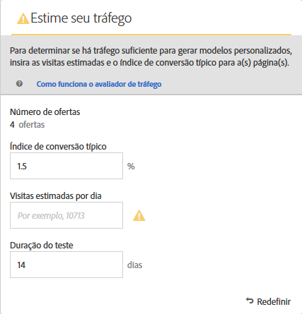
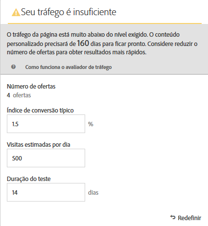
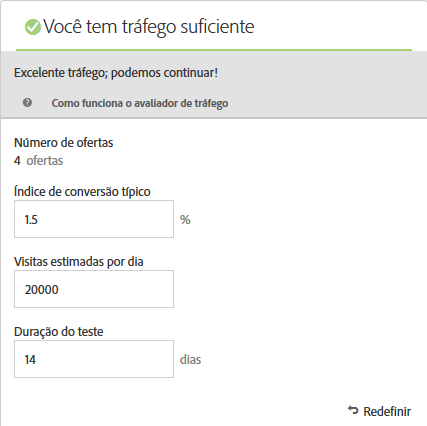

#  Estimativa do tráfego necessário para o sucesso{#estimate-the-traffic-required-for-success}

The [!UICONTROL Traffic Estimator] provides feedback that lets you know whether you have sufficient traffic for your [!DNL Adobe Target] activity to succeed.

Because an [!UICONTROL Automated Personalization] activity uses multiple offer combinations, it is important to know how much traffic is required to provide meaningful results. The [!UICONTROL Traffic Estimator] uses statistics about your page and the number of experiences being tested to estimate the amount of traffic and the test duration needed to make the activity successful.

The [!UICONTROL Traffic Estimator] determines if there is enough traffic to generate personalized models, by comparing the estimated page impressions and typical conversion rate for the pages. Idealmente, para uma atividade bem-sucedida, o tamanho de amostra correto garante que o conteúdo personalizado esteja pronto em 50% da duração da atividade ou 14 dias, o que for menor. Isso proporciona tempo suficiente para obter um conteúdo personalizado e aprender sobre qual conteúdo disponibilizar.

Remember that [!DNL Target] randomly serves experiences until the personalization algorithms are built. The checkmark icon beside each offer shows when the model for that offer is ready and [!DNL Target] is able to begin delivering personalized content. Como aumento é esperado somente depois que os modelos estão prontos, a indicação visual permite definir a expectativa correta. Use the [!UICONTROL Traffic Estimator] in the [!UICONTROL Visual Experience Composer] (VEC) to get a guideline of when the models will be ready.

## Usar o Estimador de Tráfego

1. From the [!UICONTROL Visual Experience Composer], click **[!UICONTROL Traffic]**.

   

   The [!UICONTROL Traffic Estimator] opens. Você pode clicar em **[!UICONTROL Tráfego]**[!UICONTROL  novamente para ocultar o Avaliador de tráfego].

   

1. Forneça o índice de conversão típico (ou o índice de conversão que você espera dessa atividade), as impressões de atividade estimadas por dia e a duração do teste.

   * **Número de Ofertas**: Calculado automaticamente com base no número de experiências que estão sendo criadas como parte da sua atividade após quaisquer exclusões.
   * **Taxa de conversão típica**: a taxa de conversão é expressa como uma porcentagem, com base na estimativa ou dados anteriores do sistema de análise.
   * **Visitas estimadas por dia**: Este é o número de visitas por dia de visitantes que podem visualização a atividade, com base nos critérios de definição de metas. Isso pode se basear nos dados da análise. Observe que esse número deve ser de visitas e não de visitantes únicos.
   * **Duração do teste**: a quantidade de dias de duração da execução da atividade.

   The [!UICONTROL Traffic Estimato]r uses these statistics to determine what adjustments are needed to run a successful test.

   Near the top of the [!UICONTROL Traffic Estimator], the values you entered are calculated and the results are shown.

   

   A estimativa muda, à medida que você muda os números. For example, if you are testing a large number of combinations and your conversion rate and impressions are too low, the [!UICONTROL Traffic Estimator] shows how long the test will need to run to be successful. Or, if your traffic is low, the [!UICONTROL Traffic Estimator] might suggest a lower number of offer combinations so you can run the test the desired number of days.

   Caso não tenha tráfego suficiente, é possível fazer uma ou todas as opções a seguir:

   * Consider using an [Auto-Target](/help/c-activities/auto-target-to-optimize.md) activity instead of [!UICONTROL Automated Personalization] to create experiences with several offer changes in one experience variation.
   * Reduce the number of offer combinations within your [!UICONTROL Automated Personalization] activity.
   * Aumente a duração da atividade.

   Adjust the numbers until the [!UICONTROL Traffic Estimator] says you have sufficient traffic, then design your test accordingly.

   

   If the traffic is sufficient, the [!UICONTROL Traffic] icon shows a green check. Se não for suficiente, o ícone mostrará um rótulo de aviso vermelho.

## Perguntas frequentes sobre o Estimador de tráfego

Considere as seguintes perguntas frequentes enquanto trabalha com o Avaliador de [!UICONTROL tráfego]:

### Por que [!DNL Target] não está construindo modelos personalizados quando minha atividade AP tem tráfego suficiente?

Em determinadas circunstâncias, seu tráfego pode ser grande o suficiente para um modelo personalizado ser construído, mas esse tráfego pode informar [!DNL Target] que não há diferença significativa entre o modelo personalizado e o aleatório. Embora o modelo seja construído [!DNL Target] e testado, ele não será implantado porque o modelo não é significativamente melhor do que o aleatório.

Uma possível razão para o modelo não ser melhor do que aleatório pode ser que as ofertas não sejam significativamente diferentes umas das outras. Se esse for o caso, você pode tentar aumentar as diferenças nas ofertas tornando-as visualmente diferentes ou alterando o conteúdo em si.
