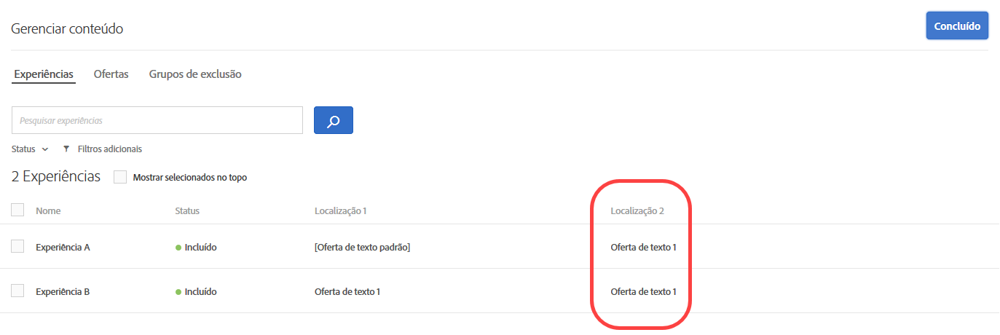
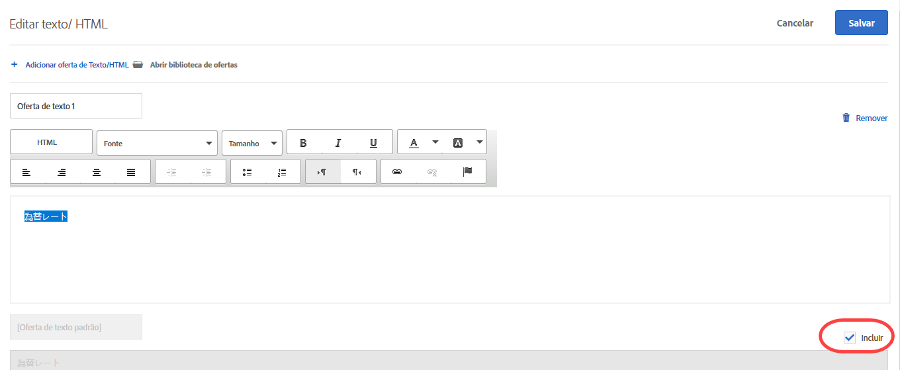
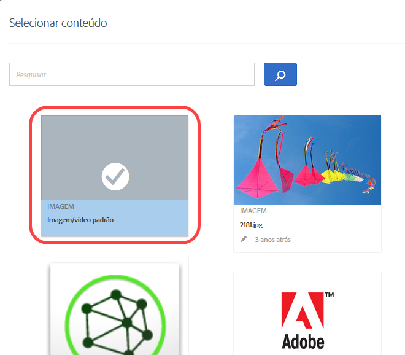

#  Gerenciar exclusões{#manage-exclusions}

Gerencie exclusões criando grupos de exclusão e excluindo ofertas duplicadas, experiências específicas e o conteúdo padrão nas atividades de Personalização automatizada (AP).

## Criar grupos de exclusão {#task_AAAA6C7239A84F7696C8492F04B575A2}

Crie grupos de exclusão em atividades de Personalização automatizada (AP) para garantir que as experiências com as ofertas designadas sejam excluídas automaticamente.

Os grupos de exclusão são uma maneira excelente de garantir que as ofertas incompatíveis não sejam apresentadas na mesma experiência em diferentes locais. Por exemplo, pressuponha que você tenha duas ofertas: uma de desconto de 20% para todas as mercadorias e outra de desconto de 15%. Você não gostaria que essas duas ofertas sejam apresentadas para os visitantes na mesma experiência. Se você adicionar essas duas ofertas a um grupo de exclusão, pode garantir que isso nunca ocorra.

Você também pode limitar quais públicos-alvo podem ver as ofertas específicas nas atividades de AP. Para obter mais informações, consulte [Ofertas de Personalização automatizada do Target](/help/c-activities/t-automated-personalization/ap-target-offers.md).

**Para criar um grupo de exclusão:**

1. Ao [criar ou editar uma atividade de AP](/help/c-activities/t-automated-personalization/create-ap-activity.md), clique em **[!UICONTROL Gerenciar conteúdo]** na barra de cabeçalho.

   

1. Na caixa de diálogo [!UICONTROL Gerenciar conteúdo], clique em **[!UICONTROL Grupo de exclusão]**.

   

   Se você criou previamente os grupos de exclusão, eles são exibidos na lista. Se você ainda não criou um grupo de exclusão, será solicitado a criar um.

1. Clique em **[!UICONTROL Criar grupo de exclusão.]**

   

1. (Obrigatório) Especifique um nome descritivo para o grupo de exclusão.

   Um nome descritivo ajuda você e outras pessoas a localizarem e compreenderem rapidamente o propósito de um grupo.

1. Localize e selecione as ofertas desejadas que deseja adicionar ao grupo de exclusão.

   Você pode selecionar várias ofertas do mesmo local em um grupo de exclusão.

1. Clique em **[!UICONTROL Salvar]**.

As ofertas no grupo de exclusão serão automaticamente excluídas das mesmas experiência, a partir daí.

## Excluir ofertas duplicadas {#concept_4EF78013F80E48EFA024AE0274C9F037}

Evita a duplicação das ofertas da biblioteca de ofertas, quando usadas em locais diferentes nas atividades de [!UICONTROL Personalização automatizada].

Você pode ter uma atividade, por exemplo, seis locais na página com 12 ofertas. Há uma chance de que a mesma oferta possa ser colocada em um ou mais locais na atividade. Esse recurso evita a exibição e ofertas duplicadas ao mesmo tempo em locais diferentes, dentro da mesma atividade.

Clique em **[!UICONTROL Configurar]** > **[!UICONTROL Duplicar ofertas]**, em seguida, clique em **[!UICONTROL Permitir duplicatas]** ou **[!UICONTROL Não permitir duplicatas]**.

## Excluir experiências especificas {#task_C17D36EF58AF4908B17A3D84CA6DE85A}

Exclui experiências específicas se você deseja excluir determinadas combinações de ofertas na sua atividade de Personalização automatizada.

Pode haver certas combinações que não funcionam bem juntos, ou você pode limitar o número de experiências testadas para diminuir os requisitos de tráfego para sua atividade.

1. Ao [criar ou editar uma atividade de AP](/help/c-activities/t-automated-personalization/create-ap-activity.md), clique em **Gerenciar conteúdo** na barra de cabeçalho.

   

   A lista [!UICONTROL Experiências] mostra cada experiência gerada com permutas de todas as opções de conteúdo e locais.

1. Exclua as experiências, conforme desejado.

   Você pode excluir as experiências específicas ao passar o cursor do mouse sobre a experiência desejada e clicar no ícone de exclusão.

   

   Ou você pode excluir/incluir em lote as experiências marcando a caixa de seleção das experiências relevantes e, em seguida, clicando no ícone **[!UICONTROL Excluir]** no canto superior direito da caixa de diálogo. O ícone [!UICONTROL Excluir] é exibido quando uma ou mais experiências são marcadas.

   

   É possível filtrar essa visualização de lista para ver apenas as atividades excluídas ou incluídas, clicando na lista suspensa [!UICONTROL Status].

   Agora, as experiências serão excluídas da atividade e seus [!UICONTROL Status] serão mostrados como [!UICONTROL Excluídos].

   

## Excluir conteúdo padrão {#task_DCB4528989DF4C05A3A4729E5891D18F}

Em alguns casos, você pode não desejar incluir o conteúdo padrão como parte da sua Atividade personalizada. A maneira pela qual você acessa essa configuração é diferente da criação de grupos de exclusão. Você pode usar esse método para ter somente uma oferta (diferente do conteúdo padrão) em uma localização, como parte da sua atividade de AP.

Excluir o conteúdo padrão é uma excelente maneira de alterar a aparência do restante da página, a fim de adequar as ofertas que você estiver testando com a atividade de AP. Por exemplo, pressuponha que você deseja corresponder a paleta de cores das ofertas que está testando, poderia alterar a cor do fundo da sua página e excluir a cor do fundo padrão.

**Para excluir o conteúdo padrão usando o Visual Experience Composer (VEC):**

1. While [creating or editing an AP activity](/help/c-activities/t-automated-personalization/create-ap-activity.md), select the content you want to replace and click to access **[!UICONTROL Change Text/HTML]**, **[!UICONTROL Change Image]**, or **[!UICONTROL Change Background Color]**.
1. Na caixa de diálogo, crie seu novo conteúdo e desmarque **Incluir** à direita do conteúdo padrão (ou desmarque Imagem/Vídeo padrão na tela de Conteúdo selecionado).

   Dependendo do tipo de conteúdo/oferta, a caixa de seleção [!UICONTROL Incluir] fica em um local diferente.

   Para conteúdo de texto/HTML:

   

   Para conteúdo de imagem/vídeo:

   

   Para cor do fundo:

   

1. Clique em **[!UICONTROL Salvar]**.

   Você pode visualizar as experiências criadas nas ofertas que especificou em [!UICONTROL Gerenciar conteúdo]. Você verá que nenhuma experiência é criada em [!UICONTROL Gerenciar conteúdo] usando a oferta padrão que você excluiu.

   

**Para excluir o conteúdo usando o Experience Composer baseado em formulário:**

1. Ao criar ou editar uma atividade de AP, clique em **[!UICONTROL Alterar texto/HTML]** ou **[!UICONTROL Alterar oferta de imagem]** em **[!UICONTROL Conteúdo]**.
1. Na caixa de diálogo, crie seu novo conteúdo e desmarque **[!UICONTROL Incluir]** à direita do conteúdo padrão (ou desmarque Imagem/Vídeo padrão na tela de Conteúdo selecionado).

   Dependendo do tipo de conteúdo/oferta, a caixa de seleção Incluir fica em um local diferente.

   Para conteúdo de texto/HTML:

   

   Para conteúdo de imagem/vídeo:

   

1. Clique em **[!UICONTROL Salvar]**.

   Você pode visualizar as experiências criadas nas ofertas que especificou em [!UICONTROL Gerenciar conteúdo]. Você verá que nenhuma experiência é criada em [!UICONTROL Gerenciar conteúdo] usando a oferta padrão que você excluiu.

   
