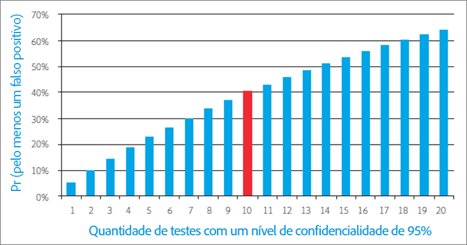
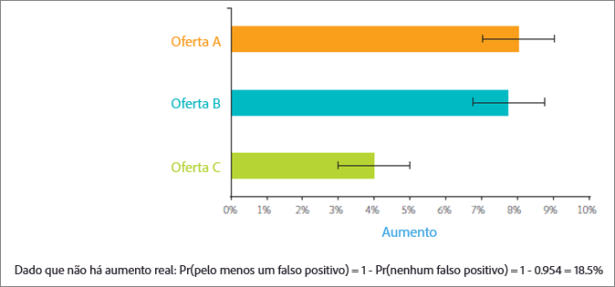
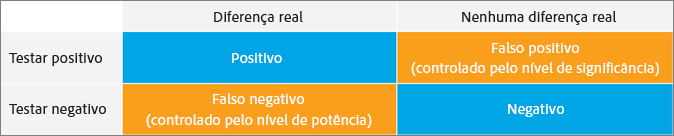
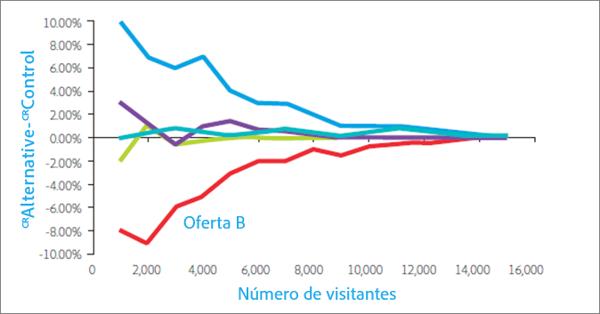
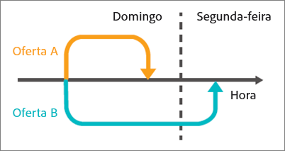
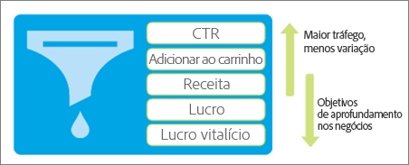

# Dez erros comuns em testes A/B e como evitá-los

O teste A/B em [!DNL Adobe Target] forma a espinha dorsal da maioria dos programas de otimização de marketing digital, ajudando os profissionais de marketing a oferecer experiências otimizadas e direcionadas para seus visitantes e clientes. Esta seção descreve dez das armadilhas mais importantes para as quais as empresas são presas ao realizar testes A/B. Ela também inclui meios de evitá-los, para que sua empresa possa obter um ROI maior com seus esforços de teste e ter mais confiança em seus resultados de teste A/B relatados.

## Armadilha 1: Ignorando os efeitos do nível de significância {#section_55F5577A13C6470BA1417C2B735C6B1D}

Qual é a probabilidade de o seu teste relatar uma diferença significativa na taxa de conversão entre duas ofertas quando, na verdade, não há nenhuma? Isso é o que o *nível de significância* de um teste ajuda a determinar. Tais descobertas enganosas são frequentemente chamadas de falso positivo e, no mundo das estatísticas, são chamadas de erro Tipo I (se você rejeitar incorretamente a hipótese nula que é realmente verdadeira).

Quando você especifica o nível de significância de um teste A/B, você está fazendo uma compensação entre sua tolerância para aceitar que uma experiência é melhor que a outra quando realmente não é (erro Tipo I ou &quot;falso positivo&quot;) versus não ver diferença estatística entre as experiências quando realmente existe uma diferença verdadeira (erro tipo II ou &quot;falso negativo&quot;). O *nível de confiança* é determinado antes da execução de um teste.

O *intervalo de confiança*, que é determinado após a conclusão de um teste, é impactado por três fatores principais: tamanho da amostra do teste, nível de significância e desvio padrão da população. Como o profissional de marketing selecionou o nível de significância antes do teste ser projetado e o desvio padrão da população não pode ser afetado, o único fator &quot;controlável&quot; é o tamanho da amostra. O tamanho da amostra necessário para um intervalo de confiança com o qual você se sente confortável e o tempo resultante para alcançar esse tamanho de amostra é uma decisão importante que um profissional de marketing deve determinar durante o design do teste.

Outro termo diretamente relacionado, o *nível de confiança*, é mais do que uma abordagem equilibrada. Em vez de indicar a probabilidade de obter um falso positivo, conforme o nível de significância, o nível de confiança representa a probabilidade de o teste não cometer esse erro.

O nível de confiança e nível de significância estão diretamente relacionados porque:

100% - nível de confiança = nível de significância

Nos testes A/B, os profissionais de marketing geralmente usam níveis de confiança de 95%. Claramente, com base na equação acima, isso corresponde a um nível de significância de 5%. Testar com um nível de confiança de 95% significa que você tem 5% de chance de detectar um aumento estatisticamente significativo, mesmo quando, na realidade, não há diferença entre as ofertas.

Como o gráfico abaixo ilustra, quanto mais testes você executar, mais provavelmente, pelo menos um desses testes resultará em um falso positivo. Por exemplo, se você executar 10 testes usando um nível de confiança de 95%, haverá aproximadamente 40% de chance de detectar um ou mais falsos positivos (dado que não há um aumento real: Pr (pelo menos um falso positivo) = 1 - Pr (sem falsos positivos) = 1 - 0,95 ^ 10 = 40%).

Em uma organização de marketing, 95% geralmente constitui uma compensação razoável entre o risco de um falso positivo e o falso negativo.

No entanto, duas situações justificam prestar muita atenção ao nível de significância e suas implicações para os resultados dos testes: segmentação pós-teste e teste de várias ofertas.

* **Segmentação pós-teste:** os profissionais de marketing geralmente fracionam e dividem os resultados de um teste com base nos segmentos de visitantes depois a conclusão do teste A/B. Segmentos comuns incluem tipo de navegador, tipo de dispositivo, áreas geográficas, hora do dia e visitantes novos versus visitantes recorrentes. Essa prática, conhecida como segmentação pós-teste, fornece excelente percepção dos segmentos de visitantes. Por sua vez, os profissionais de marketing podem usar esses insights para criar conteúdo melhor direcionado, mais relevante e diferenciado.

   Se não houver diferença real na taxa de conversão, cada vez que você testar um segmento, a probabilidade de um falso positivo é igual ao nível de significância. E, como mencionado, quanto mais testes você executar, maior a probabilidade de você ter pelo menos um falso positivo entre esses testes. Em essência, cada segmento de pós-teste representa um teste separado. Com um nível de significância de 5%, em média, você será vítima de um falso positivo toda vez que olhar para 20 segmentos de pós-teste. O gráfico acima mostra como essa probabilidade aumenta.

   Como mencionado acima, quanto mais testes você executar, maior a probabilidade de você ter pelo menos um falso positivo entre esses testes. Em essência, cada segmento de pós-teste representa um teste separado, o que aumenta a probabilidade de um falso positivo. Esse aumento pode ser ainda mais significativo se os segmentos estiverem correlacionados.

   Você deveria simplesmente não fazer segmentação pós-teste? Não, os segmentos de pós-teste são valiosos. Em vez disso, para evitar esse problema de falso positivo cumulativo com a segmentação pós-teste, depois de identificar um segmento de pós-teste, considere testá-lo em um novo teste. Alternativamente, você pode aplicar a correção de Bonferroni, discutida a seguir.

* **Teste de várias ofertas:** os profissionais de marketing testam com frequência mais de duas ofertas (ou experiências) entre si. É por isso que às vezes você vê soluções de teste A/B chamadas de teste A/B/n, onde n é o número de ofertas que você está testando simultaneamente.

   É importante observar que *cada* oferta testada tem uma taxa de falso positivo igual ao nível de significância, conforme descrito acima. Novamente, você está executando efetivamente vários testes quando várias ofertas são comparadas em um único ambiente de teste. Por exemplo, se você comparar cinco ofertas em um teste A/B/C/D/E, efetivamente formará quatro comparações: controle para B, controle para C, controle para D, controle para E. Com um nível de confiança de 95%, em vez da probabilidade de 5% de um falso positivo, você realmente tem 18,5%. 2

   Para manter seu nível de confiança geral em 95% e evitar esse problema, aplique o que é conhecido como a correção de Bonferroni. Usando esta correção, você simplesmente divide o nível de significância pelo número de comparações para chegar ao nível de significância necessário para atingir um nível de confiança de 95%.

   Aplicando a correção de Bonferroni ao exemplo acima, você usaria um nível de significância de 5%/4 = 1,25%, que é o mesmo que um nível de confiança de 98,75% para um teste individual (100% - 1,25% = 98,75%). Esse ajuste mantém o nível de confiança efetivo em 95% quando você tem quatro testes, como no exemplo descrito.

## Armadilha 2: Declarando vencedores de vários testes de oferta sem diferença estatisticamente significativa {#section_FA83977C71DB4F69B3D438AF850EF3B6}

Com vários testes de ofertas, os profissionais de marketing geralmente declaram a oferta com o maior aumento como vencedora do teste, embora não haja diferença estatisticamente significativa entre o vencedor e o segundo lugar. Esta situação ocorre quando a diferença entre as alternativas é menor que a diferença entre as alternativas e o controle. A figura abaixo ilustra esse conceito, com as barras de erro pretas representando intervalos de confiança de elevação de 95%. O verdadeiro aumento para cada oferta em relação à oferta de controle é 95% provável de ser incluído dentro do intervalo de confiança, ou seja, o intervalo mostrado pelas barras de erro.

As ofertas A e B têm o maior aumento observado durante o teste, e seria improvável que a oferta C superasse essas ofertas em um teste futuro, porque o intervalo de confiança de C nem sequer se sobrepõe aos intervalos de confiança de A ou B. Contudo, mesmo que a oferta A tenha o maior aumento observado durante o teste, é bem possível que a oferta B possa ter um melhor desempenho em um teste futuro, porque os intervalos de confiança se sobrepõem.

A praticidade aqui é que ambas as ofertas A e B devem ser consideradas vencedoras do teste.

Normalmente, não é viável executar o teste por tempo suficiente para identificar o verdadeiro desempenho relativo das alternativas e, muitas vezes, a diferença de desempenho entre as alternativas é muito pequena para afetar substancialmente a taxa de conversão. Nesses casos, você pode interpretar o resultado como um empate e usar outras considerações, como estratégia ou alinhamento com outros elementos da página, para determinar qual oferta implementar. Com vários testes, você deve estar aberto a mais de um vencedor, o que, em alguns casos, abre consideravelmente as possibilidades de direcionamento para o desenvolvimento do seu site.

Observe que, se você quiser identificar a oferta com a maior taxa de conversão, estará comparando todas as ofertas a todas as outras ofertas. No exemplo acima, você tem n = 5 ofertas. Você precisa fazer n (n-1)/2 comparações, ou 5*(5-1)/2 = 10 comparações. Neste caso, a correção de Bonferroni exige que o nível de significância do teste seja de 5%/10 = 0,5%, o que corresponde a um nível de confiança de 99,5%. No entanto, um nível de confiança tão alto pode exigir que você execute o teste por um período de tempo excessivamente longo.

## Armadilha 3: Ignorando os efeitos da potência estatística {#section_0D517079B7D547CCAA75F80981CBE12A}

O poder estatístico é a probabilidade de um teste detectar uma diferença real na taxa de conversão entre as ofertas. Por causa da natureza aleatória, ou como os estatísticos gostam de chamá-la, &quot;estocástica&quot;, dos eventos de conversão, um teste pode não mostrar uma diferença estatisticamente significativa, mesmo quando existe uma diferença real na taxa de conversão entre duas ofertas a longo prazo. Chame de má sorte ou de acaso. Não detectar uma diferença real na taxa de conversão é chamado de falso negativo ou erro de tipo II.

Existem dois fatores principais que determinam o poder de um teste. O primeiro é o tamanho da amostra, ou seja, o número de visitantes incluídos no teste. O segundo é a magnitude da diferença na taxa de conversão que você deseja que o teste detecte. Talvez isso seja um pouco intuitivo, mas se você estiver interessado em detectar apenas grandes diferenças de taxa de conversão, há uma probabilidade muito maior de que o teste realmente detecte grandes diferenças, como descobrir que você tem um elefante na sala de estar versus uma mosca enquanto olha através de um tubo de papel toalha. Ao longo dessas linhas, quanto menor a diferença que você deseja detectar, maior o tamanho da amostra e, portanto, o tempo para obter esse tamanho de amostra maior que você precisa.

Os profissionais de marketing de hoje subestimam um número notável de testes. Em outras palavras, eles usam um tamanho de amostra muito pequeno. Isso significa que eles têm uma pequena chance de detectar verdadeiros positivos, mesmo quando realmente existe uma diferença substancial na taxa de conversão. De fato, se você executar continuamente testes de baixa potência, o número de falsos positivos pode ser comparável ou até mesmo dominar o número de positivos verdadeiros. Isso geralmente leva à implementação de alterações neutras em um site (perda de tempo) ou a alterações que realmente reduzem as taxas de conversão.

Para evitar subutilizar seu teste, considere que um padrão típico para um teste potente inclui um nível de confiança de 95% e um poder estatístico de 80%. Esse teste oferece uma probabilidade de 95% de que você evite um falso positivo e uma probabilidade de 80% de evitar um falso negativo.

## Etapa 4: Uso de testes unilaterais {#section_8BB136D1DD6341FA9772F4C31E9AA37C}

Testes unilaterais exigem uma menor diferença observada nas taxas de conversão entre as ofertas para chamar um vencedor em um determinado nível de significância. Isso parece atraente porque os vencedores podem ser chamados antes e com mais frequência do que quando se usa testes bilaterais. Mas, de acordo com o ditado, &quot;Nada é de graça&quot;, os testes unilaterais custam caro.

Em um teste unilateral, você testa se a oferta B é melhor que a oferta A. A direção do teste deve ser determinada antes do início do teste, ou &quot;a priori&quot; em estatística. Em outras palavras, você deve decidir se testa para B sendo melhor que A ou A sendo melhor que B *antes* de iniciar o teste. No entanto, se você observar os resultados do teste A/B e ver que B está melhor que A e, *em seguida,* decidir fazer um teste unilateral para ver se essa diferença é estatisticamente significativa, estará violando as suposições por trás do teste estatístico. Violar as suposições do teste significa que seus intervalos de confiança não são confiáveis e o teste tem uma taxa de falsos positivos mais alta do que você esperava.

Você pode ver um teste unilateral como uma oferta em julgamento com um juiz que já tomou uma decisão. Em um teste unilateral, você já decidiu qual será a oferta vencedora e está prestes a prová-la, em vez de dar a cada experiência uma chance igual de se provar como a vencedora. Testes unilaterais devem ser usados somente nas raras situações em que você está interessado apenas em saber se uma oferta é melhor que a outra e não o contrário. Para evitar a emissão do teste unilateral, use uma solução de teste A/B que sempre usa testes bilaterais, como o [!DNL Adobe Target].

## Armadilha 5: Monitoramento de testes {#section_EA42F8D5967B439284D863C46706A1BA}

Os profissionais de marketing monitoram frequentemente os testes A/B até que o teste determine um resultado significativo. Afinal, por que testar depois de obter significância estatística?

Infelizmente, não é tão simples. Sem intenção de prejudicar, mas acontece que o monitoramento dos resultados afeta negativamente a significância estatística efetiva do teste. Na verdade, aumenta muito a probabilidade de falsos positivos e faz com que seus intervalos de confiança não sejam confiáveis.

Isso pode parecer confuso. Parece que estamos dizendo que apenas observando seus resultados no meio do teste, você pode fazer com que eles percam sua significância estatística. Isso não é exatamente o que está acontecendo. O exemplo a seguir explica por quê.

Digamos que você simule 10.000 eventos de conversão de duas ofertas, onde as duas ofertas têm taxas de conversão de 10%. Como as taxas de conversão são as mesmas, você não deve detectar diferença no aumento da conversão quando testar as duas ofertas comparando uma com a outra. Usando um intervalo de confiança de 95%, o teste resulta na taxa esperada de falsos positivos de 5% quando é avaliado após a coleta de todas as 10.000 observações. Portanto, se executarmos 100 desses testes, em média, obteremos cinco falsos positivos (na verdade, todos os positivos são falsos neste exemplo porque não há diferença na taxa de conversão entre as duas ofertas). No entanto, se avaliarmos o teste 10 vezes durante o teste, a cada 1.000 observações, a taxa de falsos positivos aumenta para 16%. Monitorar o teste mais do que triplicou o risco de falsos positivos! Como isso pode acontecer?

Para entender porque isso ocorre, você deve considerar as diferentes ações tomadas quando um resultado significativo é detectado e quando não é detectado. Quando um resultado estatisticamente significativo é detectado, o teste é interrompido e um vencedor é declarado. No entanto, se o resultado não for estatisticamente significativo, deixamos o teste continuar. Essa situação favorece bastante o resultado positivo e, portanto, distorce o nível de significância efetiva do teste.

Para evitar este problema, você deve determinar um período de tempo adequado durante o qual o teste será executado antes de iniciar o teste propriamente dito. Embora seja bom examinar os resultados do teste durante o teste para certificar-se de que você implementou o teste corretamente, não tire conclusões ou interrompa o teste antes que o número necessário de visitantes seja alcançado. Em outras palavras, não fique espiando!

## Armadilha 6: Interromper testes prematuramente {#section_DF01A97275E44CA5859D825E0DE2F49F}

É tentador parar um teste se uma das ofertas tiver um desempenho muito melhor ou pior do que os outros nos primeiros dias do teste. No entanto, quando o número de observações é baixo, há uma alta probabilidade de que um aumento positivo ou negativo seja observado apenas por acaso, porque a taxa de conversão é calculada em média por um número baixo de visitantes. À medida que o teste coleta mais pontos de dados, as taxas de conversão convergem para seus valores verdadeiros de longo prazo.

A figura abaixo mostra cinco ofertas que têm a mesma taxa de conversão de longo prazo. A Oferta B teve uma taxa de conversão baixa para os primeiros 2.000 visitantes, e leva muito tempo até que a taxa de conversão estimada retorne à taxa real de longo prazo.

Esse fenômeno é conhecido como &quot;regressão à média&quot; e pode levar ao desapontamento quando uma oferta que teve bom desempenho durante os primeiros dias de um teste não consegue manter esse nível de desempenho a longo prazo. Também pode levar à perda de receita quando uma boa oferta não é implementada porque aconteceu de ter um desempenho ruim nos primeiros dias de um teste, apenas por acaso.

Assim como a armadilha de monitorar seu teste, a melhor maneira de evitar esses problemas é determinar um número adequado de visitantes antes de executar o teste e, em seguida, permitir que o teste seja executado até que esse número de visitantes tenha sido exposto às ofertas.

## Armadilha 7: Alteração da alocação de tráfego durante o período de teste {#allocation}

Recomendamos que você não altere as porcentagens de alocação de tráfego durante o período de teste, pois isso pode distorcer os resultados do teste até que os dados normalizem.
Por exemplo, suponha que você tenha uma atividade de Teste A/B na qual 80% do tráfego seja atribuído à Experiência A (o controle) e 20% do tráfego seja atribuído à Experiência B. Durante o período de teste, você altera a alocação para 50% para cada experiência. Alguns dias depois, você altera a alocação de tráfego para 100% para a Experiência B.

Nesse cenário, como os usuários são atribuídos às experiências?

Se você alterar manualmente a divisão de alocação para 100% para a Experiência B, os visitantes que foram originalmente alocados para a Experiência A (o controle) permanecerão em sua experiência atribuída inicialmente (Experiência A). A alteração na alocação de tráfego afeta apenas os novos participantes.

Se você quiser alterar as porcentagens ou afetar o fluxo de visitantes em cada experiência, recomendamos criar uma nova atividade ou copiar a atividade e editar as porcentagens de alocação de tráfego.

Se você alterar as porcentagens de diferentes experiências durante o período de teste, levará alguns dias para os dados normalizarem, especialmente se muitos compradores forem visitantes recorrentes.
Como outro exemplo, se a alocação de tráfego do Teste A/B for dividida em 50/50 e você alterar a divisão para 80/20, nos primeiros dias após essa alteração, os resultados podem parecer distorcidos. Se o tempo médio para conversão for alto, o que significa que é necessário várias horas ou até mesmo dias para fazer uma compra, essas conversões atrasadas podem afetar seus relatórios. Assim, naquela primeira experiência em que o número passou de 50% para 80% e o tempo médio para conversão é de dois dias, apenas visitantes de 50% da população estão convertendo no primeiro dia do teste, embora hoje 80% da população esteja entrando na experiência. Isso faz com que pareça que a taxa de conversão caiu, mas normalizará novamente depois que esses 80% dos visitantes tiverem levado dois dias para converter.

## Armadilha 8: Não considerando efeitos de novidade {#section_90F0D24C40294A8F801B1A6D6DEF9003}

Outras coisas inesperadas podem acontecer se não permitirmos tempo suficiente para executar um teste. Desta vez, o problema não é um problema de estatística; é simplesmente uma reação à mudança pelos visitantes. Se você alterar uma parte bem estabelecida do seu site, os visitantes recorrentes poderão, a princípio, se envolver menos com a nova oferta devido a alterações no fluxo de trabalho normal. Isso pode temporariamente fazer com que uma nova oferta superior tenha um desempenho menos ideal até que os visitantes recorrentes se acostumem a ela. Um pequeno preço a pagar, dados os ganhos de longo prazo que a oferta superior oferecerá.

Para determinar se a nova oferta tem um desempenho inferior devido a um efeito inovador ou porque é realmente inferior, você pode segmentar seus visitantes em visitantes novos e recorrentes e comparar as taxas de conversão. Se é apenas o efeito de novidade, a nova oferta vai ganhar com novos visitantes. Eventualmente, conforme os visitantes recorrentes se acostumam com as novas mudanças, a oferta também ganhará sua confiança.

O efeito de novidade também pode funcionar em sentido inverso. Os visitantes costumam reagir positivamente a uma mudança apenas porque ela introduz algo novo. Depois de um tempo, quando o novo conteúdo se torna obsoleto ou menos excitante para o visitante, a taxa de conversão cai. Esse efeito é mais difícil de identificar, mas monitorar cuidadosamente as alterações na taxa de conversão é a chave para detectar esse problema.

## Armadilha 9: Não considerando diferenças no período de consideração {#section_B166731B5BEE4E578816E351ECDEA992}

O período de consideração é o período desde o momento em que a solução de teste A/B apresenta uma oferta a um visitante até quando o visitante converte. Isso pode ser importante com ofertas que afetam substancialmente o período de consideração. Por exemplo, uma oferta que implique em um prazo, como &quot;Oferta por tempo limitado - Compre até domingo&quot;.

Essas ofertas incentivam os visitantes a converter mais cedo e serão favorecidas se o teste for interrompido imediatamente após o término da oferta, porque a oferta alternativa pode ter um prazo mais longo ou nenhum prazo e, portanto, um período de consideração mais longo. A alternativa receberia conversões no período após o término do teste, mas se você interromper o teste no final do prazo, conversões adicionais não serão contadas para a taxa de conversão de teste.

A figura abaixo mostra duas ofertas que dois visitantes diferentes veem ao mesmo tempo em uma tarde de domingo. O período de consideração para a oferta A é curto e o visitante converte mais tarde naquele dia. No entanto, a oferta B tem um período de consideração mais longo, e o visitante que viu a oferta B pensa na oferta por algum tempo e acaba convertendo na manhã da segunda-feira. Se você interromper o teste no domingo à noite, a conversão associada à oferta A será contada para a métrica de conversão da oferta A, enquanto a conversão associada à oferta B não será contada para a métrica de conversão da oferta B. Isso coloca a oferta B em uma desvantagem significativa.

Para evitar essa armadilha, reserve um tempo para que os visitantes expostos às ofertas de teste sejam convertidos depois que uma nova entrada no teste for interrompida. Este passo proporciona uma comparação justa das ofertas.

## Armadilha 10: Uso de métricas que não refletem objetivos de negócios {#section_F0CD6DC7993B4A6F9BEEBB31CD1D9BEE}

Os profissionais de marketing podem se sentir tentados a usar métricas de conversão de alto tráfego e baixa variação no funil superior, como taxa de cliques (CTR), para alcançar um número adequado de conversões de teste mais rapidamente. No entanto, considere cuidadosamente se a CTR é um proxy adequada para a meta de negócios que você deseja atingir. Ofertas com CTRs mais altas podem facilmente levar a uma receita menor. Isso pode acontecer quando as ofertas atraem visitantes com menor propensão a comprar, ou quando a própria oferta, por exemplo, uma oferta de desconto, simplesmente leva a uma receita menor.

Considere a oferta de esqui abaixo. Ela gera uma CTR muito maior do que a oferta de bicicletas, mas como os visitantes gastam muito mais dinheiro em média quando acompanham a oferta de bicicletas, a receita esperada de colocar a oferta de bicicletas na frente de um visitante é maior. Portanto, um teste A/B com CTR como métrica selecionaria uma oferta que não maximiza a receita, o que seria o objetivo comercial fundamental.

Para evitar esse problema, monitore suas métricas de negócios com cuidado para identificar o impacto comercial das ofertas ou, melhor ainda, use uma métrica mais próxima de sua meta de negócios, se possível.

## Conclusão: Sucesso com testes A/B, reconhecendo e contornando as armadilhas {#section_54D33248163A481EBD4421A786FE2B15}

Depois de aprender sobre as armadilhas comuns dos testes A/B, esperamos que você possa identificar quando e onde você pode ter sido vítima deles. Esperamos também que você tenha uma melhor compreensão de alguns dos conceitos de probabilidade e estatística envolvidos nos testes A/B, que muitas vezes parecem ser do domínio de pessoas com formação em matemática.

As etapas abaixo ajudam a evitar essas armadilhas e concentram-se em obter melhores resultados de seu teste A/B:

* Considere cuidadosamente a métrica certa para o teste com base em objetivos comerciais relevantes.
* Decida em um nível de confiança antes do início do teste e siga esse limite ao avaliar os resultados após o término do teste.
* Calcule o tamanho da amostra (número de visitantes) antes do início do teste.
* Aguarde até que o tamanho de amostra calculado seja alcançado antes de interromper o teste.
* Ajuste o nível de confiança ao fazer a segmentação pós-teste ou avaliar mais de uma alternativa. Por exemplo, usando a correção de Bonferroni.
