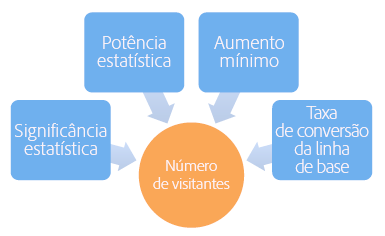
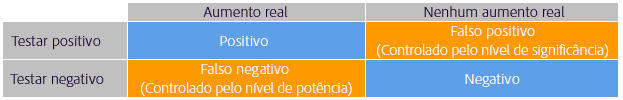
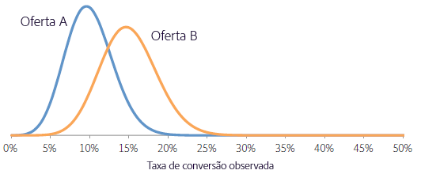
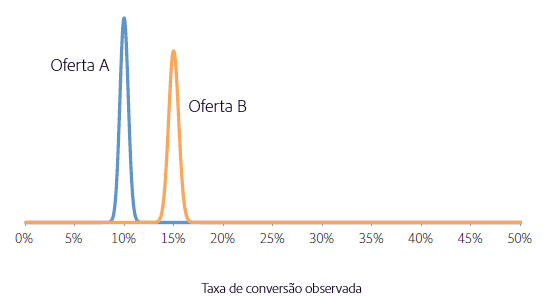
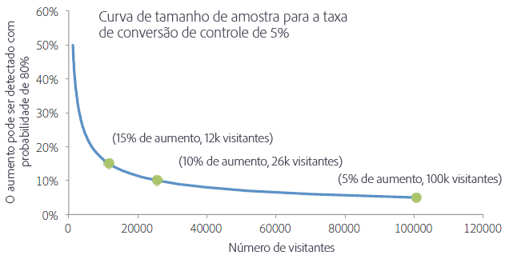

# Por quanto tempo você deve executar um teste A/B?

Uma atividade [!UICONTROL Teste A/B] bem-sucedida em [!DNL Adobe Target] requer visitantes suficientes (tamanho da amostra) para melhorar sua taxa de conversão. Como você sabe por quanto tempo executar um teste A/B? Este artigo contém informações sobre as atividades de [!UICONTROL Alocação automática] e a Calculadora de tamanho de amostra do Adobe Target] para ajudar a garantir que sua atividade tenha visitantes suficientes para atingir suas metas.[!UICONTROL 

É tentador parar uma atividade se uma das ofertas tiver um desempenho muito melhor ou pior do que os outros nos primeiros dias da atividade. No entanto, quando o número de observações é baixo, há uma alta probabilidade de que um aumento positivo ou negativo seja observado por acaso, porque a taxa de conversão é calculada em média por um número baixo de visitantes. À medida que a atividade coleta mais pontos de dados, as taxas de conversão convergem para seus valores verdadeiros de longo prazo.

>[!IMPORTANT]
>
>Parar uma atividade prematuramente é uma das dez armadilhas significativas em que você pode cair quando realiza testes A/B. Para obter mais informações, consulte [Dez erros comuns em testes A/B e como evitá-los](/help/c-activities/t-test-ab/common-ab-testing-pitfalls.md#concept_578A7947C9554868B30F12DFF9E3F8E3).

[!DNL Adobe Target] O fornece ferramentas para ajudar a garantir que sua atividade tenha um tamanho de amostra grande o suficiente para atingir suas metas de conversão: Alocação automática.

## Alocação automática {#auto-allocate}

Uma atividade de [Alocação automática](/help/c-activities/automated-traffic-allocation/automated-traffic-allocation.md) é um tipo de teste A/B que identifica um vencedor entre duas ou mais experiências. Um teste de Alocação automática realoca automaticamente mais tráfego para o vencedor a fim de aumentar as conversões enquanto o teste continua a ser executado e aprendido.

Os testes A/B padrão têm um custo inerente. Você deve gastar o tráfego para medir o desempenho de cada experiência e, por meio de análise, descobrir a experiência vencedora. A distribuição do tráfego permanece fixa mesmo depois de você reconhecer que algumas experiências estão superando outras. Além disso, é complicado descobrir o tamanho da amostra, e a atividade deve ser executada em sua totalidade para que você possa agir em um vencedor. E ainda há uma chance de o vencedor identificado não ser um verdadeiro vencedor.

A solução é [!UICONTROL Alocação automática]. [!UICONTROL A alocação automática reduz esse custo e a sobrecarga de determinar uma experiência vencedora. ] [!UICONTROL A alocação automática monitora o desempenho da métrica de meta de todas as experiências e envia mais novos participantes para as experiências de alto desempenho proporcionalmente. ] Há tráfego suficiente reservado para explorar as outras experiências. Você pode ver os benefícios da atividade em seus resultados, mesmo enquanto a atividade ainda estiver em execução: a otimização ocorre em paralelo ao aprendizado.

[!UICONTROL A alocação automática move os visitantes para experiências vencedoras gradativamente, em vez de exigir que você aguarde o fim de uma atividade para determinar um vencedor. ] Você se beneficia do incentivo mais rapidamente porque os participantes da atividade que teriam sido enviados para experiências de menor sucesso recebem experiências vencedoras potenciais.

Ao usar o recurso [!UICONTROL Alocação automática], o [!DNL Adobe Target] exibe um emblema na parte superior da página da atividade, indicando &quot;Ainda não há vencedor&quot; até que a atividade atinja o número mínimo de conversões com confiança suficiente. [!DNL Target]O declara a experiência vencedora exibindo um emblema no topo da página da atividade.

Para obter mais informações, consulte [Visão geral da alocação automática](/help/c-activities/automated-traffic-allocation/automated-traffic-allocation.md).

## Calculadora de tamanho da amostra do Adobe Target   {#section_6B8725BD704C4AFE939EF2A6B6E834E6}

Se você optar por usar uma atividade [!UICONTROL Teste A/B] manual em vez de [!UICONTROL Alocação automática], a Calculadora de tamanho de amostra [!DNL Target] ajudará a determinar o tamanho de amostra necessário para um teste bem-sucedido. Um teste A/B manual é um teste de horizonte fixo, então a calculadora é útil. O uso da calculadora para uma atividade de [!UICONTROL Alocação automática] é opcional, pois [!UICONTROL A Alocação automática] declara um vencedor para você. A calculadora fornece uma estimativa aproximada do tamanho da amostra necessário. Continue a let para obter mais informações sobre como usar a calculadora.

Antes de configurar seu teste A/B, acesse a calculadora de tamanho de amostra do Adobe Target [a1/>.](https://docs.adobe.com/content/target-microsite/testcalculator.html)

É importante determinar um tamanho de amostra adequado (número de visitantes) antes de fazer qualquer teste A/B para estabelecer o tempo em que a atividade deve ser executada antes da avaliação dos resultados. Basta monitorar a atividade até que a significância estatística seja alcançada e o intervalo de confiança seja muito subestimado, tornando o teste não confiável. Com base nesse resultado imagina-se que, caso um resultado estatisticamente significativo seja detectado, o teste será interrompido e um vencedor declarado. No entanto, se o resultado não for estatisticamente significativo, o teste poderá continuar. Esse procedimento favorece bastante o resultado positivo, o que aumenta a taxa de falsos positivos e, portanto, distorce o nível de significância efetiva do teste.

Isso pode resultar em muitos falsos positivos, o que leva à implementação de ofertas que não entregam o aumento previsto no final. O aumento fraco em si é um resultado insatisfatório, mas uma consequência ainda mais grave é que, com o tempo, a incapacidade de prever aumentos com precisão prejudica a confiança organizacional nos testes como uma prática.

Este artigo discute os fatores que devem ser equilibrados quando um tamanho de amostra é determinado e introduz uma calculadora de planilha para estimar um tamanho de amostra adequado. O cálculo do tamanho da amostra usando a calculadora de tamanho da amostra (link fornecido acima) antes do início de qualquer teste A/B garante que você sempre execute testes A/B de alta qualidade em conformidade com os padrões estatísticos.

Há cinco parâmetros estabelecidos pelo usuário que definem um teste A/B. Esses parâmetros são interligados de modo que quando quatro deles forem estabelecidos, o quinto poderá ser calculado:

* Significância estatística
* Potência estatística
* Aumento mínimo detectável de confiabilidade
* Índice de conversão de linha de base
* Número de visitantes

Para um teste A/B, a significância estatística, a potência estatística, o aumento mínimo detectável de confiabilidade e a taxa de conversão da linha de base são definidos pelo analista e, em seguida, o número necessário de visitantes é calculado com base nesses números. Este artigo discute esses elementos e fornece diretrizes sobre como determinar essas métricas para um teste específico.

A figura abaixo mostra os quatro resultados possíveis de um teste A/B:

É desejável não obter falsos positivos ou falsos negativos. No entanto, a obtenção de zero falsos positivos nunca pode ser garantida por um teste estatístico. Sempre é possível que as tendências observadas não sejam representativas das taxas de conversão subjacentes. Por exemplo, em um teste para ver se cara ou coroa em um flip de moeda era mais provável, mesmo com uma moeda boa, você poderia pegar dez cabeças em dez jogadas por acaso. A significância e a potência estatísticas nos ajudam a quantificar as taxas de falsos positivos e falsos negativos e nos permitem mantê-las em níveis razoáveis para um determinado teste.

### Significância estatística {#section_8230FB9C6D1241D8B1786B72B379C3CD}

O nível de significância de um teste determina a probabilidade de o teste relatar uma diferença significativa nas taxas de conversão entre duas ofertas diferentes quando, de fato, não há diferença real. Essa situação é conhecida como um falso positivo ou um erro do Tipo I. O nível de significância é um limite especificado pelo usuário e é uma compensação entre a tolerância para falsos positivos e o número de visitantes que devem ser incluídos no teste.

Em um teste A/B, presume-se inicialmente que ambas as ofertas têm a mesma taxa de conversão. Assim, a probabilidade do resultado observado é calculada com base dessa suposição. Se essa probabilidade (o valor p) for menor do que algum limite predefinido (o nível de significância), [!DNL Target] concluirá que a suposição inicial - que ambas as ofertas têm a mesma taxa de conversão - está incorreta. E, portanto, as taxas de conversão de A e B são estatisticamente diferentes no nível de significância especificado.

Um nível de significância geralmente usado em testes A/B é 5%, o que corresponde a um nível de significância de 95% (nível de confiança = 100% - nível de significância). Um nível de confiança de 95% significa que cada vez que você faz um teste, há uma chance de 5% de detectar um aumento na significância estatística, mesmo que não exista diferença entre as ofertas.

As interpretações típicas do nível de confiança são resumidas na tabela abaixo:

| Nível de confiança | Interpretação |
|--- |--- |
| Menos de 90% | Nenhuma evidência de que haja diferença entre as taxas de conversão |
| 90 a 95% | Evidência fraca de que haja diferença entre as taxas de conversão |
| 95 a 99% | Evidência moderada de que haja diferença entre as taxas de conversão |
| 99 a 99,9% | Evidência forte de que haja diferença entre as taxas de conversão |
| Mais de 99,9% | Evidência muito forte de que haja diferença entre as taxas de conversão |

É recomendável sempre usar um nível de confiança de 95% ou acima.

É desejável usar o nível de confiança mais alto possível, para que o teste gere poucos falsos positivos. No entanto, um nível de confiança mais alto requer um número maior de visitantes, o que aumenta o tempo necessário para o teste. Além disso, um aumento no nível de confiança causa uma queda na potência estatística.

### Potência estatística {#section_1169C27F8E4643719D38FB9D6EBEB535}

A potência estatística de um teste A/B é a probabilidade de detectar uma diferença real na taxa de conversão de uma certa magnitude. Devido à natureza aleatória (estocástica) dos eventos de conversão, é possível que uma diferença estatisticamente significativa não seja observada - apenas por acaso -- mesmo que haja uma diferença real na taxa de conversão entre as duas ofertas. Esse cenário é chamado de falso negativo ou erro do Tipo II.

A potência estatística é frequentemente ignorada porque a determinação dessa potência, em comparação com a significância estatística, não é necessária para realizar um teste A/B. No entanto, ao ignorar a potência estatística, há uma grande possibilidade de as diferenças reais entre as taxas de conversão de ofertas diferentes não serem detectadas pelo teste porque o tamanho da amostra é muito pequeno. Por isso, os testes são dominados por falsos positivos.

É desejável ter alta potência estatística para que o teste tenha grandes chances de identificar uma diferença real nas taxas de conversão e gerar menos falsos negativos. No entanto, um número maior de visitantes é necessário para aumentar a potência estatística de detectar um determinado aumento, o que aumenta o tempo necessário para fazer o teste.

Um valor geralmente usado para potência estatística é 80%, o que significa que o teste tem 80% de chance de detectar uma diferença igual ao aumento mínimo detectável da confiabilidade. O teste tem uma probabilidade menor de detectar aumentos menores e uma probabilidade maior de detectar aumentos maiores.

### Aumento mínimo detectável de confiabilidade {#section_6101367EE9634C298410BBC2148E33A9}

A maioria das organizações quer medir a menor diferença possível na taxa de conversão, pois vale implementar até mesmo um pequeno aumento. No entanto, se você quiser que o teste A/B tenha uma alta probabilidade de detectar um pequeno aumento, o número de visitantes que devem ser incluídos no teste seria proibitivamente grande. O motivo para isso é que, se a diferença na taxa de conversão for pequena, ambas as taxas de conversão devem ser estimadas com alta precisão para identificar a diferença, o que requer muitos visitantes. Portanto, o aumento mínimo detectável da confiabilidade deverá ser determinado pelos requisitos empresariais, considerando as compensações entre a detecção de pequenos aumentos e a execução do teste por períodos de tempo maiores.

Por exemplo, vamos supor que duas ofertas (A e B) tenham taxas de conversão verdadeiras de 10% e 15%, respectivamente. Se essas ofertas forem mostradas a 100 visitantes, há uma chance de 95% de observar taxas de conversão na faixa de 4% a 16% para a oferta A e 8% a 22% para a oferta B devido à natureza aleatória das conversões. Essas faixas são conhecidas como intervalos de confiança em estatísticas. Elas representam a confiança na precisão das taxas de conversão estimadas. Quanto maior for o tamanho da amostra (mais visitantes), mais certeza você poderá ter de que as estimativas das taxas de conversão sejam precisas.

A figura abaixo mostra essas distribuições de probabilidade.

Devido à grande sobreposição entre os dois intervalos, o teste não pode determinar se as taxas de conversão são diferentes. Assim, esse teste com 100 visitantes não pode distinguir entre as duas ofertas. No entanto, se o Target expõe as ofertas a 5.000 visitantes cada, há uma chance de 95% de as taxas de conversão observadas caírem nos intervalos de 9% a 11% e 14% a 16%, respectivamente.

Nesse caso, é improvável que o teste chegue a uma conclusão incorreta, portanto, o teste com 5.000 visitantes pode distinguir entre as duas ofertas. O teste com 5.000 visitantes tem um intervalo de confiança de aproximadamente +/-1%. Isso significa que o teste pode detectar diferenças de cerca de 1%. Assim, ainda mais visitantes seriam necessários se as taxas de conversão verdadeiras das ofertas fossem, por exemplo, 10% e 10,5%, em vez de 10% e 15%.

### Índice de conversão de linha de base {#section_39380C9CA3C649B6BE6E1F8A06178B05}

A taxa de conversão da linha de base é a taxa de conversão da oferta de controle (oferta A). Com frequência, você tem uma boa noção do nível de conversão da oferta com base na experiência anterior. Se esse não for o caso, por exemplo, porque há um novo tipo de oferta ou criação, o teste poderá ser executado por um dia mais ou menos para obter uma estimativa aproximada da taxa de conversão da linha de base que pode ser usada no cálculo do tamanho da amostra.

### Número de visitantes {#section_19009F165505429E95291E6976E498DD}

Talvez seja difícil equilibrar os custos da oportunidade de executar um teste por um período longo com o risco de falsos positivos e falsos negativos. Obviamente, você não quer tomar as decisões erradas, mas ficar paralisado por padrões de teste muito restritos ou rígidos também não é desejável.

Como diretriz geral, um nível de confiança de 95% e uma potência estatística de 80% são recomendáveis.

A calculadora de tamanhos de amostra (link fornecido acima) solicita que você decida a significância estatística (recomendação: 95%) e a potência estatística (recomendação: 80%). Após a especificação da taxa de conversão da linha de base e do tráfego diário entre as ofertas, a planilha gera o número de visitantes necessários para detectar um aumento de 1%, 2%, 5%, 10%, 15% e 20% com uma probabilidade igual à potência especificada do teste. A planilha também permite que o usuário insira um aumento mínimo detectável da confiabilidade personalizado. Além disso, a planilha gera o número de semanas necessário para o teste com base no nível de tráfego especificado pelo usuário. O número necessário de semanas é arredondado para o número inteiro mais próximo para evitar a influência de efeitos de dias de semana nos resultados.

Há uma compensação ente o aumento mínimo que pode ser identificado com confiança pelo teste e o número necessário de visitantes. A figura abaixo, que é válida para uma taxa de conversão da linha de base (controle) de 5%, mostra forte redução dos retornos para aumentar o número de visitantes. O aumento mínimo que pode ser detectado com confiança aumenta bastante durante a adição dos primeiros visitantes ao teste, mas é necessário um número cada vez maior de visitantes para melhorar o teste. A figura ajuda a encontrar uma compensação adequada entre o tempo necessário para executar o teste (conforme determinado pelo número de visitantes necessário e o tráfego do site) e o aumento mínimo que pode ser detectado com confiança pelo teste.

Neste exemplo, você pode decidir ser capaz de detectar um aumento de 5% (correspondente a uma taxa de conversão da oferta alternativa de (100+5%)*5% = 5,25%) em 80 de 100 testes é adequado, portanto, você precisa de um tamanho de amostra de 100.000 visitantes para cada oferta. Se o site tiver 20.000 visitantes por dia e você estiver testando duas ofertas, o teste deverá ter permissão para ser 2*100.000/20.000 = 10 dias antes de poder determinar se a oferta alternativa é estatisticamente significativa superior à oferta de controle.

Novamente, é recomendável que o tempo necessário sempre seja arredondado para o número inteiro de semana mais próximo possível, para evitar efeitos de dia da semana. Assim, neste exemplo, o teste deverá ser executado por duas semanas antes da avaliação do resultado.

### Receita por métrica de visita   {#section_C704C0861C9B4641AB02E911648D2DC2}

Ao usar a Receita por visita (RPV) como uma métrica, uma fonte adicional de variação será adicionada porque a RPV é o produto da receita por pedido e taxa de conversão (RPV = Receita / # de visitantes = (Receita por pedido * # de pedidos) / # de visitantes = Receita por pedido * (# de visitantes * CTR) / # de visitantes = Receita por pedido * CTR), cada um com sua variação. A variação da taxa de conversão pode ser estimada diretamente usando um modelo matemático, mas a variação da receita por pedido é específica para a atividade. Portanto, use o conhecimento dessa variação de atividades anteriores ou execute o teste A/B por alguns dias para estimar a variação na receita. A variação é calculada com base nos valores da Soma de vendas, Soma de vendas quadrada e Número de visitantes encontrados no arquivo de download CSV. Depois que isso for estabelecido, use a planilha para calcular o tempo necessário para concluir o teste.

A calculadora do tamanho da amostra (link fornecido acima) pode ajudá-lo a configurar a métrica de RPV. Ao abrir a calculadora, você verá uma guia rotulada como [!UICONTROL Métrica de RPV]. Você precisará das informações a seguir ao usar a versão de RPV da calculadora:

* Número de visitantes para a oferta de controle
* Receita total para a oferta de controle

   Verifique se o filtro de pedido extremo está selecionado.

* A soma das receitas elevadas ao quadrado para a oferta de controle

   Lembre-se de marcar o filtro de ordens extremas.

Em geral, o uso de RPV como métrica requer de 20 a 30% mais tempo para atingir o mesmo nível de confiança estatística para o mesmo nível de incentivo medido. Isso ocorre porque o RPV tem a variação adicionada de diferentes tamanhos de pedido por conversão. Isso deve ser uma consideração ao escolher entre taxa de conversão direta e RPV como a métrica na qual basear sua decisão comercial final.

## Correção para comparar várias ofertas {#section_1474113764224D0B85472D8B023CCA15}

Cada vez que você compara duas ofertas, a possibilidade de receber um falso positivo (observando uma diferença significativamente estatística, até mesmo quando não há diferença na taxa de conversão) é igual ao nível de significância. Por exemplo, se houver cinco ofertas, A/B/C/D/E, e A for a oferta de controle, quatro comparações serão feitas (controle para B, controle para C, controle para D e controle para E) e a probabilidade de um falso positivo será de 18,5%, até mesmo quando o nível de confiança for 95%, pois Pr(pelo menos um falso positivo) = 1 - Pr(sem falsos positivos) = 1 - 0,95 = 18,5%. Um falso positivo está nesse contexto definido como o controle sendo relatado como melhor do que a alternativa ou a alternativa sendo relatada como melhor do que o controle quando, de fato, não há diferença entre elas.

## Conclusão   {#section_AEA2427B90AE4E9395C7FF4F9C5CA066}

Ao usar uma atividade de [!UICONTROL Alocação automática], [!DNL Target] identifica um vencedor entre duas ou mais experiências e realoca automaticamente mais tráfego para o vencedor a fim de aumentar as conversões enquanto o teste continua a ser executado e aprendido. [!UICONTROL A alocação automática facilita a conquista das metas de conversão, além de remover a adivinhação.]

Ao usar a calculadora de tamanho de amostra (link fornecido acima) introduzida neste artigo e permitir a execução do teste pelo tempo sugerido, você pode garantir que sempre esteja realizando testes A/B de alta qualidade que seguem as taxas de falsos positivos e falsos negativos estabelecidas como adequadas para o teste específico. Isso assegura que os testes sejam consistentes e possam detectar com confiança o aumento que você está procurando.
