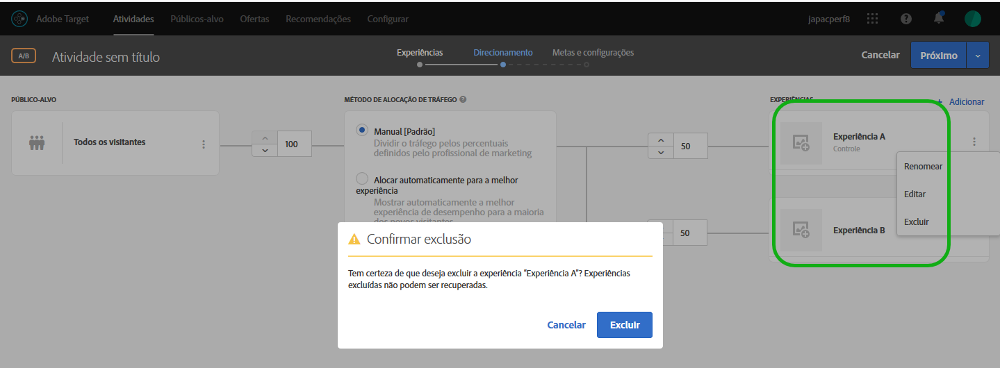

# Adicionar experiência{#add-experience}

O Visual Experience Composer fornece uma interface visual para editar as experiências em sua página.

Para obter mais detalhes sobre experiências, consulte [Experiências](../../../c-experiences/experiences.md#concept_A2E10F6AFB3D4AEAB6951EE14688848D).

1. Clique em **[!UICONTROL Adicionar experiência]**.

   >[!NOTE]
   >
   >Se você estiver direcionando uma experiência para um público-alvo, selecione-o antes de incluir uma experiência. Aparece uma mensagem para lembrá-lo de escolher seu público-alvo.

1. Quando solicitado, insira o URL da atividade. Digite o URL completo (incluindo `https://`) e clique em **[!UICONTROL Continuar]**.

   O Experience Composer (consulte [Experiências](../../../c-experiences/experiences.md#concept_1D011219034B492BB03C08B3BB80E3F0)) abre a página que está especificada nas Preferências da conta. Para exibir uma página diferente, clique no ícone de Globo e insira o URL na caixa Selecionar URL no Experience Composer e clique em **[!UICONTROL Continuar]**. Caso tenha inserido um URL para um site que não inclui o código JavaScript do Target Standard, você não pode selecionar elementos da página.

   Por padrão, o Visual Experience Composer não permite alterações a elementos que contenham JavaScript, como banners giratórios. Você pode desativar o JavaScript se deseja poder alterar esses elementos usando o Visual Experience Composer.

   >[!NOTE]
   >
   >Se você alterar o URL após fazer alterações de uma ou mais experiências em uma página, a experiência será redefinida usando a nova página, e as alterações que você fez são perdidas.

1. Selecione os elementos que você deseja alterar e faça as modificações desejadas.

   À medida que passa o mouse sobre os elementos da página, eles são destacados. Qualquer elemento destacado pode ser alterado usando o Experience Composer.

   Se você criou uma mbox na página usando o Target Classic, (antes Test&amp;Target), essa mbox aparece como um elemento que mostra o seu nome e pode ser modificada como qualquer outro elemento.

   Para ver uma lista de ações que podem ser executadas em um elemento de uma página exibida para alterar a experiência, consulte [Opções do Visual Experience Composer](/help/c-experiences/c-visual-experience-composer/viztarget-options.md).

   >[!NOTE]
   >
   >Se você apresentar uma imagem de uma fonte diferente da sua página principal (como uma imagem hospedada em akamai.net e oferecida em dell.com), ela não será exibida na miniatura da página mostrada no diagrama de fluxo.

1. Clique no botão Marca de seleção quando tiver terminado de criar a experiência.

   O diagrama da atividade é exibido:

   

   Se uma experiência incluir conteúdo entre domínios, a miniatura poderá não ser exibida corretamente e será substituída por um ícone.

1. Especifique o percentual de visitantes que verão cada experiência na atividade.

   Você pode mostrar várias experiências no mesmo público-alvo. Um diagrama é exibido mostrando um público-alvo selecionado e as experiências que você incluiu na atividade. Especifique o percentual de vezes que deseja que cada experiência seja exibida. Você pode dividir os percentuais igualmente entre todas as experiências ou especificar percentuais maiores ou menores para cada experiência. O total de experiências deve ser igual a 100%. Você também pode clicar em **[!UICONTROL Adicionar experiência]para adicionar uma outra experiência à atividade.**

   Clique em **[!UICONTROL Continuar]ao concluir esta etapa.**

## Renomear, editar ou excluir uma experiência

Observe que você pode clicar no ícone Mais (três elipses verticais) em uma experiência em uma atividade de Teste A/B ou de Direcionamento de experiência (XT) e escolher as seguintes opções, conforme necessário:

* Renomear
* Editar
* Excluir

Observe que quando você nomeia ou renomeia uma experiência, os seguintes caracteres não são permitidos:

| Caractere | Descrição |
|--- |--- |
| / | Barra |
| ? | Ponto de interrogação |
| # | Sinal numérico |
| : | Dois-pontos |
| = | Igual a |
| + | Plus |
| - | menos |
| @ | Sinal de arroba |

## Duplicar uma experiência

Você pode copiar uma experiência em um teste A/B para fazer pequenas alterações nele sem precisar recriar a experiência do zero.

Na página **[!UICONTROL Experiências]** (a primeira etapa no fluxo de trabalho guiado de três etapas), clique nos três elipses verticais &gt; **[!UICONTROL Duplicar]**.

## Vídeo de treinamento: uso do Visual Experience Composer

O vídeo abaixo contém informações sobre o uso das opções do Visual Experience Composer. (7:17)

* Alterar o conteúdo de uma página
* Alterar o layout de uma página

>[!VIDEO](https://video.tv.adobe.com/v/17399)
