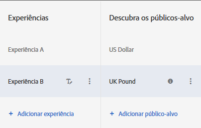

# Vários públicos-alvo de uma experiência em um Teste A/B{#multiple-experience-versions-in-an-a-b-test}

É possível direcionar versões da mesma experiência para públicos-alvo diferentes em atividades A/B. Você pode definir múltiplos públicos-alvo para uma experiência no Visual Experience Composer ou no Experience Composer baseado em formulários.

Usuários podem alternar entre públicos-alvo de experiência conforme seu perfis mudam. Eles não ficam presos na mesma experiência pela duração da atividade.

Por exemplo, se seu site usa um design consistente em suas páginas ou produtos e você quer usar a mesma experiência para vários públicos-alvo (como visitantes com navegadores em idiomas diferentes), você pode definir várias versões da experiência. Você pode apresentar a mesma experiência para visitantes que falam inglês e japonês, sendo a única diferença o texto apresentado no idioma do visitante. Dados são coletados para a experiência, independentemente do idioma, para que o relatório apresente a performance da experiência, em vez da versão.

Sem a habilidade de definir versões de experiência, você teria que definir testes diferentes para cada idioma (neste exemplo), e então agregar os resultados manualmente para tentar obter uma ideia de como seria o desempenho de uma única experiência com dois idiomas. Isso produz resultados menos precisos. Para alguns testes, estes cálculos podem até mesmo não serem úteis devido ao modo que visitantes são randomizados.

Ao criar versões diferentes de uma experiência, você recebe informações mais precisas sem a necessidade de cálculos manuais e suposições.

**Cenário**

Você está testando duas experiências, um banner direcionado geograficamente contra um banner genérico. O banner para cada geografia precisa ser diferente, mas o teste geral irá determinar se o geolocalização é melhor do que exibir conteúdo genérico. Se você definir uma experiência separada para cada local, na verdade você estaria medindo o desempenho de cada região contra a outra, em vez de se o geolocalização ajuda a atender suas metas de sucesso quando medidos contra o banner genérico.

Neste caso, o que você precisa são versões geograficamente específicas da experiência, para que você possa testar a experiência direcionada por região contra um controle não direcionado.

1. [Crie uma atividade A/B](../../../c-activities/t-test-ab/t-test-create-ab/test-create-ab.md#task_68C8079BF9FF4625A3BD6680D554BB72) normalmente.

   Ao configurar a experiência que terá múltiplas versões, selecione o público-alvo para cada versão, conforme os passos a seguir.

1. Selecione a experiência, clique em **[!UICONTROL Configurar]** > **[!UICONTROL Públicos-alvo]** > **[!UICONTROL Múltiplos públicos-alvo]**.

   

1. Clique em **[!UICONTROL Adicionar público-alvo]** e selecione o primeiro público-alvo que deseja direcionar. Repita para cada público-alvo.

   

   Se o público-alvo ainda não existir, clique em [Criar público-alvo](../../../c-target/c-audiences/create-audience.md#task_E18BD77A9A8F4ED0AC50569F94556558) e configure-o.

   Se um visitante se qualifica para mais de um público-alvo, o conteúdo para todos públicos-alvo são exibidos, com o último na lista renderizando a página.

1. Continue configurando a atividade.

**Práticas recomendadas**

* Escolha públicos-alvo mutualmente exclusivos. Se a atividade foi criada no VEC, se um visitante fizer parte de mais de um público-alvo, o conteúdo para cada público-alvo é exibido, com o conteúdo do último público-alvo na lista exibindo a página.
* Públicos-alvo de entrada de atividade definidos no diagrama são combinados com os públicos-alvo da experiência usando uma condição E. Para entrar na atividade, um visitante deve fazer parte do público-alvo da atividade e um dos públicos-alvo da experiência.
* Adicione os mesmos públicos-alvo como segmentos para relatórios. Isto ajuda a observar nos resultados do teste no nível alto da experiência A contra B e no nível baixo da experiência A contra B por apenas &quot;browser lang ja_JP.&quot; Isto funciona somente em relatórios baseados no Target e não em relatórios baseados no Analytics.

