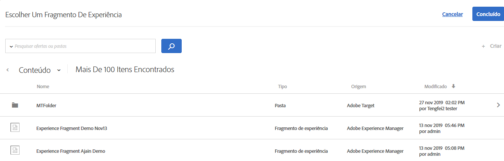

# Fragmentos de experiência do AEM

Informações sobre como usar fragmentos de experiência criados em [!DNL Adobe Experience Manager] (AEM) em [!DNL Target] atividades para ajudar na otimização ou personalização.

>[!NOTE]
>
>Este recurso exige que você seja um cliente [!DNL Adobe Experience Manager] ([!DNL AEM]). Para obter mais informações, consulte os [Requisitos](/help/c-experiences/c-manage-content/aem-experience-fragments.md#section_AE6F0971E1574B3AA324003599B96E5A) abaixo.

## Visão geral {#section_95A91830530F493B81C5C9CDB9B783EA}

O uso de fragmentos de experiência criados em [!DNL AEM] no [!DNL Target] atividade permite combinar a facilidade de uso e o poder de [!DNL AEM] com recursos avançados de Inteligência automatizada (AI) e Aprendizagem de máquina (ML) em [!DNL Target] para testar e personalizar experiências em escala.

[!DNL AEM]O reúne todo o seu conteúdo e ativos em um local central para alimentar sua estratégia de personalização. [!DNL AEM]O permite que você crie conteúdo facilmente para desktops, tablets e dispositivos móveis em um único local sem escrever código. Não há necessidade de criar páginas para cada dispositivo. [!DNL AEM] ajusta automaticamente cada experiência usando seu conteúdo.

[!DNL Target]O permite entregar experiências personalizadas em escala com base em uma combinação de abordagens de aprendizagem de máquina baseadas em regras e AI que incorporam variáveis comportamentais, contextuais e offline. Com [!DNL Target] você pode facilmente configurar e executar [Teste A/B](/help/c-activities/t-test-ab/test-ab.md) e [atividades multivariadas](/help/c-activities/c-multivariate-testing/multivariate-testing.md) (MVT) para determinar as melhores ofertas, conteúdo e experiências.

Os fragmentos de experiência representam um enorme passo à frente para vincular os criadores e gerentes de conteúdo/experiência aos profissionais de otimização e personalização que impulsionam os resultados de negócios usando o [!DNL Target].

## Exigências {#section_AE6F0971E1574B3AA324003599B96E5A}

Você deve estar provido da funcionalidade dos fragmentos de experiência dentro do [!DNL Target]. Além disso, você deve estar usando [!DNL AEM] 6.3 com o service pack adequado ou [!DNL AEM] 6.4 (ou posterior). Seu representante de conta pode ajudar a assegurar que você atenda aos requisitos para usar este recurso:

* [!DNL Adobe Experience Manager] 6.4 (ou posterior).
* [!DNL Adobe Experience Manager] 6.3 SP2 (ou posterior).
* [!DNL Adobe Target Standard] ou  [!DNL Adobe Target Premium] conta.
* Entre em contato com o [Atendimento ao cliente da Adobe Target](/help/cmp-resources-and-contact-information.md#reference_ACA3391A00EF467B87930A450050077C) para habilitar a integração e fornecer detalhes de autenticação.

## Criação e configuração de fragmentos de experiência em [!DNL AEM] {#section_745C8EFE29F547A2958FDBF61A5ADF7B}

Para usar [!DNL AEM] fragmentos de experiência em [!DNL Target], execute as seguintes etapas:

### Etapa 1: Integrar [!DNL AEM] com [!DNL Target]

Para obter mais informações, consulte:

* **[!DNL AEM]6.3**:  [Aceitar o Adobe Analytics e o Adobe ](https://docs.adobe.com/docs/en/aem/6-3/administer/integration/marketing-cloud/opt-in.html) Target na  _documentação do Adobe Experience Manager 6.3_ .
* **[!DNL AEM]6.4**:  [Aceitar o Adobe Analytics e o Adobe ](https://helpx.adobe.com/experience-manager/6-4/sites/administering/using/opt-in.html) Target na  _documentação do Adobe Experience Manager 6.4_ .
* **[!DNL AEM]6.5**:  [Aceitar o Adobe Analytics e o Adobe ](https://helpx.adobe.com/experience-manager/6-5/sites/administering/using/opt-in.html) Target na  *documentação do Adobe Experience Manager 6.5* .

### Etapa 2: criar o fragmento de experiência

Fragmentos de experiência são criados no [!DNL AEM]. Para obter mais informações, consulte:

* **[!DNL AEM]6.3**:  [Experimente ](https://docs.adobe.com/docs/en/aem/6-3/author/experience-fragments.html) Fragmentos na  *documentação do Adobe Experience Manager 6.3* .
* **[!DNL AEM]6.4**:  [Experimente ](https://helpx.adobe.com/experience-manager/6-4/sites/authoring/using/experience-fragments.html) Fragmentos na  *documentação do Adobe Experience Manager 6.4* .
* **[!DNL AEM]6.5**:  [Experimente ](https://helpx.adobe.com/experience-manager/6-5/sites/authoring/using/experience-fragments.html) Fragmentos na  *documentação do Adobe Experience Manager 6.5* .

### Etapa 3: Configure [!DNL AEM] para compartilhar o fragmento de experiência com [!DNL Target]

1. Em [!DNL AEM], selecione o fragmento de experiência desejado ou a pasta que o contém e clique em **[!UICONTROL Propriedades]**.
2. Clique na guia **[!UICONTROL Serviços em nuvem]**, em seguida, na lista suspensa **[!UICONTROL Configuração do serviço em nuvem]**, selecione **[!UICONTROL Adobe Target]**.

   >[!NOTE]
   >
   >A etapa anterior supõe que alguém em sua organização tenha criado a configuração [!DNL Adobe Target].

3. Clique em **[!UICONTROL Salvar e fechar]**.

### Etapa 4: publique o fragmento de experiência e exporte-o para o [!DNL Target]

Dependendo da versão [!DNL AEM], consulte os seguintes links para obter instruções detalhadas:

* **[!DNL AEM]6.3**:  [Exportar um fragmento de experiência para o ](https://helpx.adobe.com/experience-manager/6-3/sites/administering/using/experience-fragments-target.html) Target na  *documentação do Adobe Experience Manager 6.3* .
* **[!DNL AEM]6.4**:  [Exportar um fragmento de experiência para o ](https://experienceleague.adobe.com/docs/experience-manager-64/administering/integration/experience-fragments-target.html) Target na  *documentação do Adobe Experience Manager 6.4* .
* **[!DNL AEM]6.5**:  [Exportar um fragmento de experiência para o ](https://helpx.adobe.com/experience-manager/6-5/sites/administering/using/experience-fragments-target.html) Target na  *documentação do Adobe Experience Manager 6.5* .

## Uso de fragmentos de experiência no Público alvo atividade {#section_17CE4BE6B2B74CCEBAE0C68DEB84ABB9}

Depois de executar as tarefas anteriores, o fragmento de experiência é exibido na página [!UICONTROL Ofertas] no [!DNL Target].

>[!NOTE]
>
>[!DNL Target]No momento, o procura fragmentos de experiência a cada dez minutos. O fragmento de experiência importado deve estar disponível em [!DNL Target] dentro de dez minutos, mas esse intervalo de tempo deve encurtar para frente.

>[!IMPORTANT]
>
>O fragmento de experiência é importado em [!DNL Target] como uma oferta HTML. Observe que a versão &quot;primária&quot; do fragmento de experiência permanece em [!DNL AEM]. Você não pode editar o fragmento de experiência no [!DNL Target].

Você pode passar o mouse sobre um fragmento de experiência na lista e, em seguida, clicar no ícone [!UICONTROL Visualização]  para ver informações adicionais sobre o fragmento de experiência, incluindo seu URL de delivery de oferta pública e seu caminho [!DNL AEM].

Você pode consumir fragmentos de experiência em [!DNL Target] atividades usando o [Visual Experience Composer](/help/c-experiences/c-visual-experience-composer/visual-experience-composer.md) (VEC) ou o [Criador de experiências baseado em forma](/help/c-experiences/form-experience-composer.md).

>[!NOTE]
>
>Para utilizar totalmente a funcionalidade [!DNL Target] AI e ML, você pode selecionar [Autoalocar](/help/c-activities/automated-traffic-allocation/automated-traffic-allocation.md#concept_A1407678796B4C569E94CBA8A9F7F5D4) ou [Autoalocar](/help/c-activities/automated-traffic-allocation/automated-traffic-allocation.md) ao criar um Teste A/B.

**Para consumir fragmentos de experiência usando o VEC:**

1. Em [!DNL Target], ao criar ou editar uma experiência no [Visual Experience Composer](/help/c-experiences/experiences.md#concept_A2E10F6AFB3D4AEAB6951EE14688848D), clique no local na página onde deseja inserir o conteúdo [!DNL AEM] e selecione a opção desejada para exibir a lista [!UICONTROL Escolher um fragmento de experiência].

   * [!UICONTROL Inserir antes]
   * [!UICONTROL Inserir depois de]
   * [!UICONTROL Trocar por fragmento de experiência]

   A lista [!UICONTROL Fragmento de experiência][!DNL AEM] exibe todo o conteúdo criado no que está agora nativamente disponível dentro do [!DNL Target].

   >[!NOTE]
   >
   >A opção [!UICONTROL Trocar com fragmento de experiência] não está disponível para imagens. Se você quiser usar essa opção com uma imagem, clique no elemento de contêiner que contém a imagem desejada.

   

1. Selecione o fragmento de experiência desejado e clique em **[!UICONTROL Concluído]**.
1. Termine configurando a atividade.

   Para obter mais informações sobre a configuração de vários tipos de atividades, consulte os tópicos a seguir:

   * **Teste A/B:** [criar um teste A/B](/help/c-activities/t-test-ab/t-test-create-ab/test-create-ab.md)
   * **Autoalocação:** [autoalocação](/help/c-activities/automated-traffic-allocation/automated-traffic-allocation.md#concept_A1407678796B4C569E94CBA8A9F7F5D4)
   * **Público alvo automático:Público alvo** [automático](/help/c-activities/auto-target/auto-target-to-optimize.md)
   * **Para obter mais informações, consulte** [Criação de uma atividade de Personalização automatizada](/help/c-activities/t-automated-personalization/create-ap-activity.md#task_8AAF837796D74CF893CA2F88BA1491C9)
   * **Direcionamento de experiência (XT):** [criar uma atividade de direcionamento de experiência](/help/c-activities/t-experience-target/t-xt-create/xt-create.md#task_D6B3429AC31549E1A70EDF04B3DDC765)
   * **Teste multivariado (MVT):** [criar um teste multivariado](/help/c-activities/c-multivariate-testing/t-create-multivariate-test/create-multivariate-test.md#task_BF870FA60A8245AB8F0B775BE32EA710)
   * **Recommendations:** [criar uma atividade do Recommendations](/help/c-recommendations/t-create-recs-activity/create-recs-activity.md#task_6874328773C64C44A73F0A130AD3F96F)

**Para consumir fragmentos de experiência usando o Criador de experiências baseado em forma:**

1. Em [!DNL Target], ao criar ou editar uma experiência no [Criador de experiências baseado em forma](/help/c-experiences/form-experience-composer.md#task_FAC842A6535045B68B4C1AD3E657E56E), selecione o local na página onde deseja inserir o conteúdo [!DNL AEM] e selecione **[!UICONTROL Alterar fragmento de experiência]** para exibir a lista [!UICONTROL Escolher um fragmento de experiência].

   

   A lista [!UICONTROL Fragmento de experiência][!DNL AEM] exibe todo o conteúdo criado no que está agora nativamente disponível dentro do [!DNL Target].

1. Selecione o fragmento de experiência desejado e clique em **[!UICONTROL Salvar]**.
1. Termine configurando a atividade.

## Considerações {#considerations}

* [!DNL Target]No momento, o procura fragmentos de experiência a cada dez minutos. O fragmento de experiência importado deve estar disponível em [!DNL Target] dentro de dez minutos, mas esse intervalo de tempo deve encurtar para frente.
* O fragmento de experiência é importado em [!DNL Target] como uma oferta HTML. Observe que a versão &quot;primária&quot; do fragmento de experiência permanece em [!DNL AEM]. Você não pode editar o fragmento de experiência no [!DNL Target].
* Você pode importar ofertas JSON como fragmentos de experiência para [!DNL Target]. No entanto, essas ofertas são importadas como ofertas HTML. As ofertas JSON (fragmentos de experiência) atualmente não são totalmente compatíveis com a interface do usuário [!DNL Target].
* Não é possível criar fragmentos de experiência usando Adobe IO. É necessário criar fragmentos de experiência usando AEM, como explicado acima.

## Vídeo de treinamento: Uso AEM fragmentos de experiência com Adobe Target  {#section_C0EDC54063464F41A182492D2045BC64}

O vídeo a seguir mostra como configurar e usar fragmentos de experiência:

>[!VIDEO](https://video.tv.adobe.com/v/22383)

>[!NOTE]
>
>O recurso de deep link [!DNL AEM] discutido às 4:54 foi removido.

Para obter mais informações, consulte [Usando fragmentos de experiência com Adobe Target](https://experienceleague.adobe.com/docs/experience-manager-learn/sites/personalization/experience-fragment-target-offer-feature-video-use.html) na página *Vídeos e Tutorials AEM Sites*.
