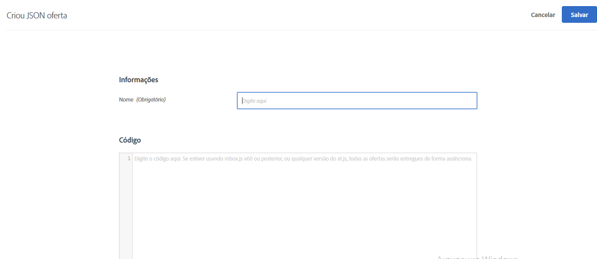
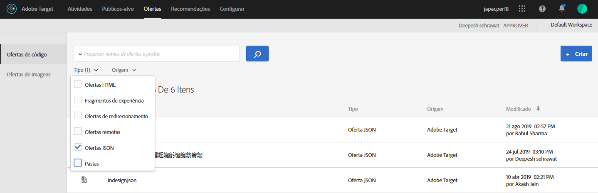

# Criar ofertas JSON{#create-json-offers}

Crie ofertas JSON na [!UICONTROL Biblioteca de Ofertas] em [!DNL Adobe Target] para uso no [!UICONTROL Criador de experiências baseado em forma].

As ofertas JSON podem ser usadas em atividades baseadas em formulários, permitindo habilitar os casos em que a decisão do Target é necessária para enviar uma oferta no formato JSON para consumo na estrutura do SPA ou integrações no lado do servidor.

Considere as informações a seguir ao trabalhar com ofertas JSON:

* Ofertas JSON estão atualmente disponíveis apenas para atividades AB e XT.
* Ofertas JSON podem ser usadas somente em atividades baseadas em formulário.
* A oferta JSON pode ser recuperada diretamente quando você está usando a API do lado do servidor, o SDK para dispositivos móveis ou o SDK do NodeJS.
* No navegador, as ofertas JSON podem ser recuperadas APENAS via at.js 1.2.3 (ou posterior) e usando  [getOffer()](/help/c-implementing-target/c-implementing-target-for-client-side-web/adobe-target-getoffer.md) filtrando ações com o uso da ação `setJson`.
* As ofertas JSON são entregues como objetos JSON nativos, e não como cadeia de caracteres. Os consumidores desses objetos não precisam mais manipular objetos como cadeia de caracteres e convertê-los em objetos JSON.
* As ofertas JSON não são aplicadas automaticamente em oposição a outras ofertas (como ofertas de HTML) porque as ofertas JSON são ofertas não visuais. Os desenvolvedores devem escrever o código para obter explicitamente a oferta usando  [getOffer()](/help/c-implementing-target/c-implementing-target-for-client-side-web/adobe-target-getoffer.md).
* Ofertas JSON não são suportadas se você estiver usando mbox.js.

## Criação de uma oferta JSON {#section_BB9C72D59DEA4EFB97A906AE7569AD7A}

1. Clique em **[!UICONTROL Ofertas]** e selecione a guia **[!UICONTROL Ofertas de código]**.
1. Clique em **[!UICONTROL Criar]** > **[!UICONTROL Oferta JSON]**.

   

1. Insira um nome de oferta.
1. Insira ou cole seu código JSON na caixa **[!UICONTROL Código]**.
1. Clique em **[!UICONTROL Salvar]**.

## Exemplo {#section_A54F7BB2B55D4B7ABCD5002E0C72D8C9}

As ofertas JSON são suportadas apenas em atividades criadas usando o Experience Composer baseado em formulário. Atualmente, a única maneira de possível de usar as ofertas JSON é por meio de chamadas diretas à API.

Exemplo:

```json
adobe.target.getOffer({ 
  mbox: "some-mbox", 
  success: function(actions) { 
    console.log('Success', actions); 
  }, 
  error: function(status, error) { 
    console.log('Error', status, error); 
  } 
});
```

As ações passadas para o retorno de chamada de sucesso são uma matriz de objetos. Supondo que tenhamos uma única oferta JSON, que tenha esse conteúdo:

```json
{ 
  "demo": {"a": 1, "b": 2} 
}
```

A matriz de ações terá essa estrutura:

```json
[ 
 { 
   action: "setJson", 
   content: [{ 
     "demo": {"a": 1, "b": 2} 
   }] 
 }  
]
```

Para extrair a oferta JSON, faça uma iteração por meio de ações e encontre a ação com a ação `setJson` e, em seguida, percorra a matriz de conteúdo.

## Caso de uso {#section_85B07907B51A43239C8E3498EF58B1E5}

Digamos que a seguinte oferta JSON seja entregue em sua página da Web:

```json
{ 
    "_id": "5a65d24d8fafc966921e9169", 
    "index": 0, 
    "guid": "7c006504-c6f7-468d-a46f-f72531ea454c", 
    "isActive": true, 
    "balance": "$2,075.06", 
    "picture": "https://placehold.it/32x32", 
    "tags": [ 
      "esse", 
      "commodo", 
      "excepteur", 
    ], 
    "friends": [ 
      { 
        "id": 0, 
        "name": "Carla Lyons" 
      }, 
      { 
        "id": 1, 
        "name": "Ollie Mooney" 
      }, 
    ], 
    "greeting": "Hello, Stephenson Fernandez! You have 4 unread messages.", 
    "favoriteFruit": "strawberry" 
} 
  
```

O código a seguir mostra como acessar o atributo &quot;saudação&quot;:

```json
adobe.target.getOffer({   
  "mbox": "name_of_mbox", 
  "params": {}, 
  "success": function(offer) {           
        console.log(offer[0].content[0].greeting); 
  },   
  "error": function(status, error) {           
      console.log('Error', status, error); 
  } 
});
```

## Filtrando ofertas por tipo de oferta JSON   {#section_52533555BCE6420C8A95EB4EB8907BDE}

Você pode filtrar a Biblioteca de ofertas por tipo de oferta JSON ao clicar na lista suspensa **[!UICONTROL Tipo]** e selecionar a caixa de verificação **[!UICONTROL JSON.]**



