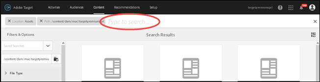
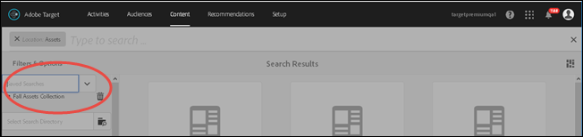

# Pesquisar o conteúdo e criar coleções inteligentes{#search-content-and-create-smart-collections}

Pesquise recursos por palavras-chave e salve as pastas de pesquisa, chamadas de coleções inteligentes, que são atualizadas automaticamente com os resultados da pesquisa.

Esta seção contém as seguintes informações:

* [Pesquisar por ativos usando palavra-chave](/help/c-experiences/c-manage-content/filter-and-search-content.md#section_2465A71BC95942588F586B1EC8B9E5DB)
* [Salvar conjunto inteligente](/help/c-experiences/c-manage-content/filter-and-search-content.md#section_5C95159543B5405EB8C8E47B518DF4AB)

## Pesquisar por ativos usando palavra-chave   {#section_2465A71BC95942588F586B1EC8B9E5DB}

1. Clique em **[!UICONTROL Ofertas]** > **[!UICONTROL Ofertas de imagem]** para acessar a [!UICONTROL Biblioteca de ativos].

   Você pode clicar no ícone de [!UICONTROL Exibição de cartão], no canto superior direito, para exibir os ativos em formato de exibição de cartão.

   Ou

   Você pode clicar no ícone de [!UICONTROL Exibição de lista], no canto superior direito, para exibir os ativos em formato de exibição de lista.

1. Clique no ícone de **[!UICONTROL Conteúdo somente]** no canto superior esquerdo para exibir a caixa de pesquisa.

   

1. Na caixa de pesquisa, digite uma palavra-chave para o ativo que deseja localizar, em seguida, pressione Enter.

## Salvar conjunto inteligente   {#section_5C95159543B5405EB8C8E47B518DF4AB}

Você pode criar pesquisas salvas, chamadas coleções inteligentes, para economizar tempo ao realizar pesquisas similares. Uma pesquisa salva cria uma coleção inteligente que é automaticamente atualizada com os resultados de pesquisa.

1. Clique em **[!UICONTROL Ofertas]** > **[!UICONTROL Ofertas de imagem]** para acessar a [!UICONTROL Biblioteca de ativos].

   

1. Clique no ícone de **[!UICONTROL Conteúdo somente]** no canto superior esquerdo para exibir o painel [!UICONTROL Filtro e opções] à esquerda.
1. Clique no ícone de **[!UICONTROL Navegar]** para exibir a caixa de diálogo [!UICONTROL Selecionar caminho].

   

1. Navegue até a pasta desejada e a selecione para basear a coleção inteligente, em seguida, clique no ícone **[!UICONTROL Confirmar.]**

   

1. (Opcional) Selecione dentre várias opções para filtrar ainda mais, por exemplo, tipo de arquivo e tamanho.
1. Clique em **[!UICONTROL Salvar coleção inteligente]** na parte inferior do painel [!UICONTROL Filtro e opções] para exibir as opções Salvar.

   

1. Especifique um nome para a coleção inteligente, marque a caixa de seleção **[!UICONTROL Publicar]** se deseja que todos os usuários na sua conta do [!DNL Target] acesse essa pequena coleção e, em seguida, clique em **[!UICONTROL Salvar]**.

   A coleção inteligente é adicionada à sua liste de pesquisas salvas para uso futuro:

   

Você pode editar uma coleção inteligente salva, ao selecioná-la na lista suspensa [!UICONTROL Pesquisas salvas] para abri-la, em seguida, ao clicar em [!UICONTROL Editar coleção inteligente].
