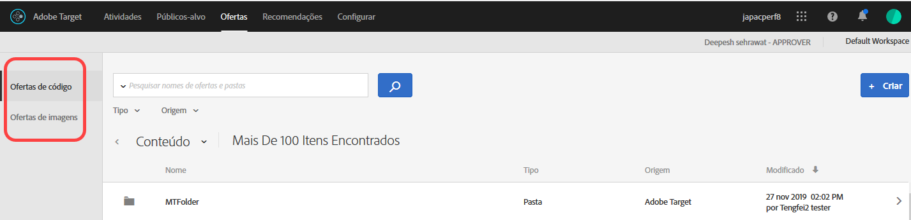
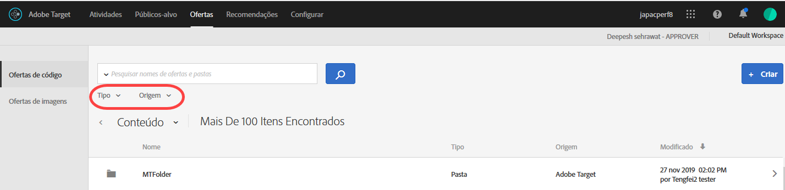
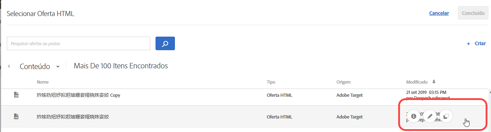
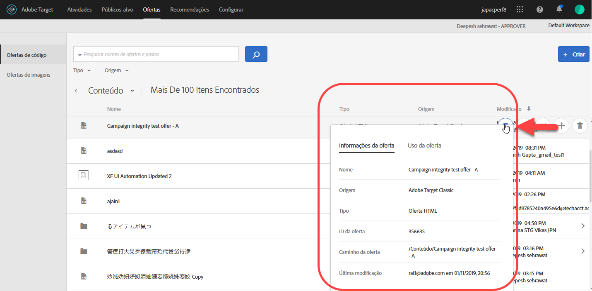
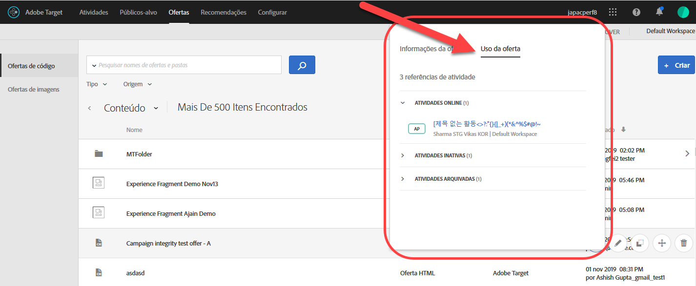
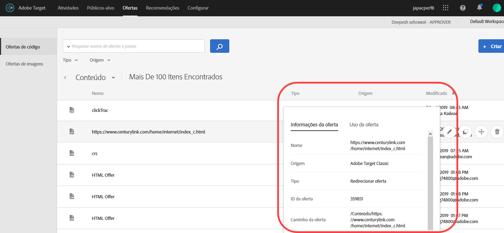
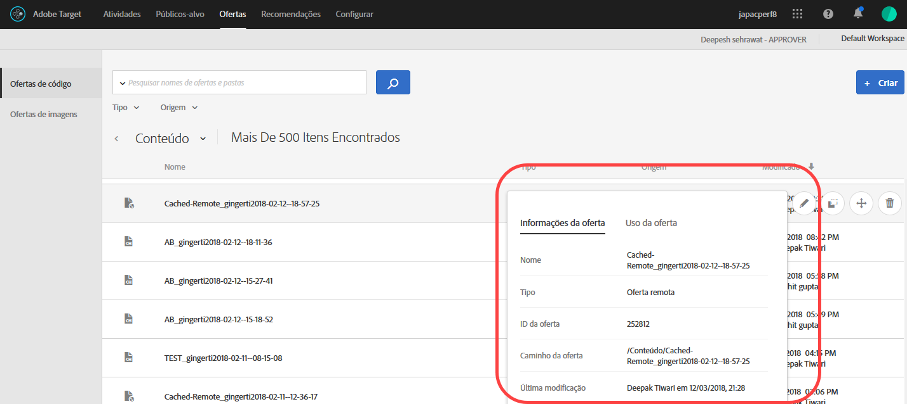

# Ofertas{#offers}

Use a biblioteca de Ofertas para gerenciar sua oferta de códigos e conteúdo de oferta de imagem.

>[!NOTE]
>
>Na versão de janeiro de 2017, as ofertas criadas com [!DNL Target Classic], [!DNL Adobe Experience Manager] (AEM), [!DNL Adobe Mobile Services] (AMS) e APIs estão visíveis na interface do usuário do [!DNL Target Standard/Premium]. As ofertas atualizadas nos últimos dois anos usando esses métodos estarão visíveis (ou seja, a partir de janeiro de 2015). A sincronização inicial ocorrerá na primeira vez que qualquer usuário na sua empresa abrir a página [!UICONTROL Ofertas]. A quantidade de tempo da sincronização inicial dependerá da quantidade de dados. Após a sincronização inicial, os dados serão sincronizados de forma incrementar. Se você tiver códigos e imagens na mesma pasta antes desta versão, o [!DNL Target] os dividirá em duas pastas duplicadas. Observe que a data e hora atualizadas se referem à hora que a pasta foi migrada e não reflete a data em que você criou originalmente a pasta.

Clique em **[!UICONTROL Ofertas]** para abrir a biblioteca. A biblioteca contém as ofertas que foram configuradas por [!DNL Target Standard/Premium] [!DNL Target Classic], [!DNL Adobe Experience Manager] (AEM), [!DNL Adobe Mobile Services] (AMS) e APIs. As ofertas criadas em [!DNL Target Classic] ou outras soluções são editáveis [!DNL Target Standard/Premium].

A página [!UICONTROL Ofertas] tem duas guias à direita: Ofertas de código e Ofertas de imagem que permitem a você visualizar as ofertas por tipo.

Você pode filtrar as ofertas por tipo (Oferta HTML, Oferta de redirecionamento, Oferta remota ou Pasta) e por origem (Adobe Target, Adobe Target Classic, Adobe Experience Manager, Adobe Mobile Services ou API).

Você pode editar ou copiar uma pasta ou oferta ao passar o mouse sobre o item desejado, em seguida, clicando nos ícones Editar ou Copiar.

## Exibição de definições das ofertas   {#section_6B059DD121434E6292CAB393507D010E}

É possível ver os detalhes da definição da oferta em um cartão pop-up na Biblioteca de ofertas, sem precisar abrir a oferta.

Por exemplo, o cartão de definição de oferta a seguir para uma oferta HTML é acessado ao passar o cursor do mouse sobre a Lista de conteúdos e, em seguida, clicar no ícone de informações:

As informações a seguir estão disponíveis:

* Nome
* Fonte
* Tipo
* ID da oferta
* Caminho da oferta
* Última modificação

Clique na guia [!UICONTROL Utilização da oferta] para visualizar as atividades que fazem referência a uma oferta de código no cartão pop-up de definição de cada oferta. Esta funcionalidade não se aplica às ofertas de imagem. Dessa forma, é possível evitar um impacto nas outras atividades ao editar as ofertas. As informações incluem Atividades ao vivo e Atividades inativas.

A seguir, um cartão de definição de oferta para uma Oferta de redirecionamento:

As informações a seguir estão disponíveis:

* Nome
* Fonte
* Tipo
* ID da oferta
* Caminho da oferta
* Última modificação
* Redirecionar url
* Incluir todos os parâmetros de URL (ligados ou desligados)
* Envie a ID de sessão da mbox (ligada ou desligada)

A seguir, um cartão de definição de oferta para uma Oferta remota:

As informações a seguir estão disponíveis:

* Nome
* Fonte
* Tipo
* ID da oferta
* Caminho da oferta
* Última modificação
* Redirecionar tipo de URL
* URL absoluto ou relativo

## Vídeo de treinamento: o repositório de conteúdo  

Este vídeo inclui informações sobre o gerenciamento de ofertas.

* Conexão entre a [biblioteca de ativos da Experience Cloud](https://experienceleague.adobe.com/docs/core-services/interface/assets/creative-cloud.html) e a biblioteca de conteúdo do Target
* Ofertas HTML personalizadas
* Ofertas HTML personalizadas no Visual Experience Composer

>[!VIDEO](https://video.tv.adobe.com/v/17387)