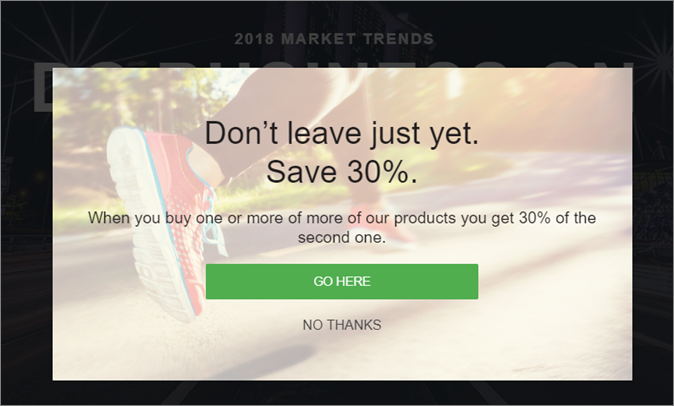

# Modelos de experiência

Informações sobre [!DNL Adobe Target] Modelos de experiência para uso no código personalizado. [!DNL Target]Os Modelos de experiência do são amostras pré-codificadas com entradas configuráveis a serem usadas para executar casos de uso de profissionais de marketing comuns.

Estes Modelos de experiência são fornecidos gratuitamente para desenvolvedores e profissionais de marketing como ponto de partida para executar casos de uso comuns, seja via VEC ou Experience Composer baseado em formulário.

Os modelos a seguir estão disponíveis atualmente no Adobe Experience Cloud GitHub, consulte [Target-Experiência-Modelos](https://github.com/Adobe-Marketing-Cloud/target-experience-templates).

## A galeria de banner Carousel com miniaturas {#section_BEEE51D47CC44A478264BBF3FEC70DAE}

O modelo de experiência da [Galeria do banner com miniaturas é um carrossel giratório](https://github.com/Adobe-Marketing-Cloud/target-experience-templates/tree/master/banner-carousel-thumbnails), comumente usado em páginas iniciais e páginas de aterrissagem ou outras páginas de entrada de alto volume. Esta galeria não irá girar automaticamente pelas imagens e pode ter interação direta clicando nas imagens menores abaixo da imagem principal.

## Galeria do banner   {#section_725D4C0C4FCD41FA92BCFC910A216E2A}

O modelo de experiência da [Galeria do banner é um carrossel giratório](https://github.com/Adobe-Marketing-Cloud/target-experience-templates/tree/master/banner-carousel), comumente usado em páginas iniciais e páginas de aterrissagem ou outras páginas de entrada de alto volume. Esta galeria não irá girar automaticamente pelas imagens e pode ter interação direta clicando nas setas esquerda e direita.

## Contagem regressiva do banner   {#section_ED9501FE096C4CD7B6D9933E0322B4AD}

O [modelo de experiência da Contagem regressiva do banner](https://github.com/Adobe-Marketing-Cloud/target-experience-templates/tree/master/banner-countdown) é um banner grande com uma contagem regressiva central, comumente usado em páginas iniciais e páginas de aterrissagem ou outras páginas de entrada de alto volume.

## Criador de botão {#section_DBDD1C9A9F294FB6BABBC04B4454E59B}

O [modelo de experiência do Criador de botão](https://github.com/Adobe-Marketing-Cloud/target-experience-templates/tree/master/button) é um pequeno botão com um texto de chamada para a ação. O botão é configurável e pode ser colocado em qualquer lugar da página para adicionar um novo apelo à ação ou substituir um botão existente por uma alternativa mais configurável.

## Lightbox com contagem regressiva   {#section_E1177C52F1294EA5AC48312727CD3DF4}

O [modelo de experiência do Lightbox com contagem regressiva](https://github.com/Adobe-Marketing-Cloud/target-experience-templates/tree/master/lightbox-countdown) é um pop-up de sobreposição de lightbox com uma contagem regressiva central, comumente usado em páginas iniciais e páginas de aterrissagem ou outras páginas de entrada de alto volume.

## Lightbox com intenção de saída {#section_E624C867E4CD4F2294CFC7917EFAEBD7}

O [modelo de experiência do Lightbox com intenção de saída](https://github.com/Adobe-Marketing-Cloud/target-experience-templates/tree/master/lightbox-exit-intent) é um pop-up de sobreposição de lightbox acionado na intenção de saída (mover o mouse para o canto superior direito da tela) e pode ser implantado em qualquer propriedade da Web onde você deseja ter uma última chance de capturar atenção.

## Lightbox {#section_EF4FBA08CE55407CAFB334340C6C1577}

O [modelo de experiência do Lightbox](https://github.com/Adobe-Marketing-Cloud/target-experience-templates) é um pop-up de sobreposição do lightbox com atraso integrado, usado em geral nas páginas iniciais e de aterrissagem ou outras páginas de entrada de alto volume.

## Fita {#section_CCBB656265F140AEA1B200409D719000}

O [modelo de experiência de fita](https://github.com/Adobe-Marketing-Cloud/target-experience-templates/tree/master/ribbon) é uma faixa de 100% largura inserida na parte superior da página da Web, normalmente usada para indicar uma promoção rápida, envio gratuito, segurança, evento climático ou outro anúncio importante.

