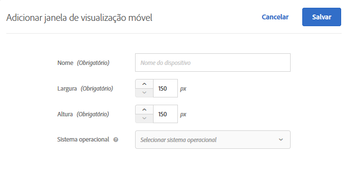
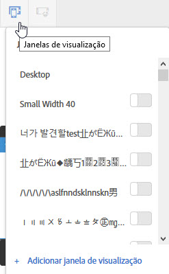

# Janelas de visualização móvel para experiências responsivas{#mobile-viewports-for-responsive-experiences}

Os visores móveis ajudam a visualizar como as atividades aparecem em telas de vários tamanhos.

O recurso de visualização do visor móvel é projetado para sites responsivos. Use visores móveis se o seu site for responsivo e os mesmos elementos na sua página de desktop forem usados na sua página móvel em uma configuração diferente. Se você tiver um site móvel separado com uma estrutura separada, como [!DNL m.mysite.com], use uma [atividade multipáginas](../../c-experiences/c-visual-experience-composer/multipage-activity.md#concept_277E096063E14813AC5D8EDFA1D2ED48).

>[!NOTE]
>
>Os visores móveis não estarão disponíveis se sobrepostos por uma oferta de redirecionamento.

Uma visor é definido pelo tamanho do retângulo preenchido por uma página da Web na sua tela. É o tamanho da janela do navegador, menos as barras de rolagem e as barras de ferramentas. Os navegadores usam &quot;pixels CSS&quot;. Em vários dispositivos, como os com telas de retina, o visor é menor que a resolução de dispositivo anunciada.

Abaixo, estão visores e resoluções para alguns dispositivos populares. Lembre-se de usar um tamanho de visor no Target.

| Dispositivo | Tamanho do visor | Resolução do dispositivo |
|---|---|---|
| iPhone X | 375 de largura x 812 de altura | 1125 de largura x 2436 de altura |
| iPhone 8 Plus | 414 de largura x 736 de altura | 1080 de largura x 1920 de altura |
| iPhone 8 | 375 de largura x 667 de altura | 750 de largura x 1334 de altura |
| iPhone 7 Plus | 414 de largura x 736 de altura | 1080 de largura x 1920 de altura |
| iPhone 7 | 375 de largura x 667 de altura | 750 de largura x 1334 de altura |
| iPhone 6 | 375 de largura x 667 de altura | 750 de largura x 1334 de altura |
| iPhone 6s | 414 de largura x 736 de altura | 1080 de largura x 1920 de altura |
| iPad Pro | 1024 de largura x 1366 de altura | 2048 de largura x 2732 de altura |
| iPad de terceira e quarta generação | 768 de largura x 1024 de altura | 1536 de largura x 2048 de altura |
| iPad Air 1 e 2 | 768 de largura x 1024 de altura | 1536 de largura x 2048 de altura |
| iPad Mini | 768 de largura x 1024 de altura | 768 de largura x 1024 de altura |
| iPad Mini 2 e 3 | 768 de largura x 1024 de altura | 1536 de largura x 2048 de altura |
| Nexus 6P | 411 de largura x 731 de altura | 1440 de largura x 2560 de altura |
| Nexus 5X | 411 de largura x 731 de altura | 1080 de largura x 1920 de altura |
| Google Pixel | 411 de largura x 731 de altura | 1080 de largura x 1920 de altura |
| Google Pixel XL | 411 de largura x 731 de altura | 1440 de largura x 2560 de altura |
| Google Pixel 2 | 411 de largura x 731 de altura | 1080 de largura x 1920 de altura |
| Google Pixel 2 XL | 411 de largura x 731 de altura | 1440 de largura x 2560 de altura |
| Samsung Galaxy Note 5 | 480 de largura x 853 de altura | 1440 de largura x 2560 de altura |
| LG G5 | 480 de largura x 853 de altura | 1440 de largura x 2560 de altura |
| One Plus 3 | 480 de largura x 853 de altura | 1080 de largura x 1920 de altura |
| Samsung Galaxy S9 | 360 de largura x 740 de altura | 1440 de largura x 2960 de altura |
| Samsung Galaxy S9+ | 360 de largura x 740 de altura | 1440 de largura x 2960 de altura |
| Samsung Galaxy S8 | 360 de largura x 740 de altura | 1440 de largura x 2960 de altura |
| Samsung Galaxy S8+ | 360 de largura x 740 de altura | 1440 de largura x 2960 de altura |
| Samsung Galaxy S7 | 360 de largura x 640 de altura | 1440 de largura x 2560 de altura |
| Samsung Galaxy S7 Edge | 360 de largura x 640 de altura | 1440 de largura x 2560 de altura |
| Nexus 7 (2013) | 600 de largura x 960 de altura | 1200 de largura x 1920 de altura |
| Nexus 9 | 768 de largura x 1024 de altura | 1536 de largura x 2048 de altura |
| Samsung Galaxy Tab 10 | 800 de largura x 1280 de altura | 800 de largura x 1280 de altura |
| Chromebook Pixel | 1280 de largura x 850 de altura | 2560 de largura x 1700 de altura |

Vários sites listam os tamanhos da janela de visualização de dispositivos populares. Por exemplo, consulte [https://mediag.com/news/popular-screen-resolutions-designing-for-all/](https://mediag.com/news/popular-screen-resolutions-designing-for-all/) ou consultar o site do fabricante do dispositivo.

Se você deseja fornecer uma atividade a pessoas em um determinado dispositivo, escolha o público-alvo apropriado para ele no diagrama de atividade. Use o Mobile Web Composer para editar a página na atividade daquele dispositivo. Se deseja executar uma atividade em toda a sua experiência digital e certificar-se de que ela funcione em todos os dispositivos, não aplique o direcionamento, e use visores móveis para visualizar a atividade em cada tela.

Se você tiver um site responsivo, normalmente ele é projetado para abrir em uma exibição diferente, quando acessado por um dispositivo com uma tela específica. Esses tamanhos de tela que acionam as novas exibições são conhecidas como *pontos de interrupção de CSS*. Salve seus pontos de interrupção de CSS no Target, para que você possa visualizar as suas experiências para cada exibição que definir. Cada uma dessas experiências é exibida em um visor móvel na interface do Target. Abra a exibição em cada tamanho de tela ao clicar no visor ao longo da parte superior do visor.

Se o seu site não for responsivo, você ainda poderá usar o Mobile Web Composer para exibir um site, se sua atividade estiver direcionada para um dispositivo específico.

>[!NOTE]
>
>Embora você edite uma experiência nos visores móveis, essas alterações se aplicam a todos os visores e dispositivos, não somente no visor em que está trabalhando. Da mesma forma, editar uma experiência na exibição de desktop normal altera a página para todos os tamanhos de tela, não somente a exibição de desktop atual. Atualmente, não suportamos alterações de página específicas do visor.

## Configuração da janela de visualização móvel {#task_B4B161499DC0470584ED922A4D20FCAB}

Configure as janelas de visualização móvel que você deseja disponibilizar ao criar suas experiências.

1. Clique em **[!UICONTROL Configuração]** &gt; **[!UICONTROL Preferências]**.
1. Na seção de Configuração de janelas de visualização móvel da página Preferências da conta, clique em **[!UICONTROL Adicionar novo]** para adicionar uma janela de visualização móvel.

   Para alterar a configuração de uma janela de visualização móvel existente, selecione a janela e clique no ícone Editar (lápis).

   

1. Digite um nome para a janela de visualização móvel.

   Use um nome descritivo que seja fácil de reconhecer. O nome pode ter até 36 caracteres.
1. Insira o tamanho da tela do dispositivo móvel: largura e altura.

   A largura pode estar entre 150 e 968 pixels. A altura pode estar entre 150 e 1280 pixels.

   >[!NOTE]

1. (Opcional) Selecione o sistema operacional do dispositivo.

   Opções:

   * Android
   * iOS
   * Windows
   * Symbian
   * BlackBerry
   Se você usa o [Enhanced Experience Composer](../../c-experiences/experiences.md#section_34265986611B4AB8A0E4D6ACC25EF91D) e selecionar um sistema operacional, o Target emula aquele dispositivo quando você visualiza a página. Se, por exemplo, há uma aparência diferente para Android e iOS no seu site responsivo, o Target irá simular este comportamento.
1. Clique em **[!UICONTROL Salvar]**.

## Criar experiência responsiva {#task_D6332438B5EE48CCA8AF199270F1CAEF}

Adicione janelas de visualização móvel às atividades do Target para criar experiências responsivas para telas de dispositivos móveis.

1. Crie uma atividade.
1. No Visual Experience Composer, clique no ícone de engrenagem **[!UICONTROL Configurações]** e selecione **[!UICONTROL Adicionar janelas de visualização móvel]**.
1. Clique no ícone **[!UICONTROL Dispositivos]** e ative cada dispositivo com um visor móvel.

   

   As janelas de visualização móvel estão listadas da menor para a maior de acordo com a largura.
1. Edite as janelas de visualização móvel conforme desejado.

   Qualquer alteração feita em uma experiência (por exemplo, se você alterar o texto em um cabeçalho) será aplicada na experiência em todos dispositivos.

   Passe o mouse sobre o nome de uma janela para ver o tamanho da janela.
1. Caso desejar, altere entre os modos retrato e paisagem ao clicar no ícone de orientação.

   * Retrato: 
   * Paisagem: 

## Caso de uso: duas versões de iPhone do Target {#task_CC3144BF5BA54034996E1D3DB0BC1A35}

Este caso de uso mostra como configurar experiências em duas versões de iPhone, o iPhone 6 e o iPhone 6 Plus, usando a função janelas de visualização móvel do Target Standard.

1. No Target Standard, clique em **[!UICONTROL Configuração]** &gt; **[!UICONTROL Preferências]**.
1. Na seção Configuração de janela de visualização móvel da página de Preferências, crie janelas de visualização móvel para iPhone 6 e iPhone 6 Plus.

   Use as seguintes configurações para cada janela:

   | Nome | Largura | Altura | Sistema operacional |
   |---|---|---|---|
   | iPhone 6 | 375 | 667 | iOS |
   | iPhone 6 Plus | 414 | 736 | iOS |

   

1. Crie uma atividade com a experiência que gostaria no Target.
1. Selecione a experiência que deseja exibir para visitantes que acessarem seu site com um iPhone 6 ou iPhone 6 Plus.
1. Ao selecionar sua meta, clique em **[!UICONTROL Criar público-alvo]** e configure um público como mostrado na imagem abaixo:

   

   Como o celular pode ficar na posição paisagem, o requerimento de altura e largura serem maior que 320 simultaneamente cria uma condição que somente o 6 e o 6 Plus podem atender, quando combinado com o modelo do dispositivo iPhone.
1. Clique em **[!UICONTROL Salvar]**.
1. Continue configurando sua atividade como normalmente faria.

## Vídeos de treinamento

Os vídeos a seguir contêm mais informações sobre os conceitos discutidos neste artigo.

### Visual Experience Composer (2 de 2) (7:29)

O vídeo de demonstração a seguir inclui informações sobre o uso do Visual Experience Composer para funcionar com visores móveis:

* Renomear e duplicar uma experiência
* Criar uma experiência de redirecionamento
* Direcionar uma atividade para um único URL ou um grupo de URLs
* Criar uma atividade multipáginas
* Visualizar e criar a experiência para sites responsivos
* Use sobreposições para destacar tipos de elementos

>[!VIDEO](https://video.tv.adobe.com/v/17401)

### Preferências de conta no Adobe Target

Este vídeo inclui informações sobre configurar janelas de visualização móvel nas preferências da conta, a partir de 4:40.

>[!VIDEO](https://video.tv.adobe.com/v/17379)