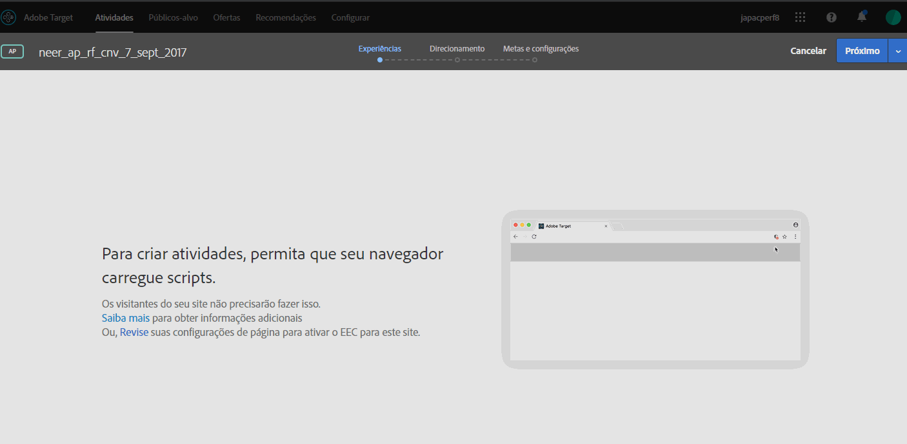

# Ativar conteúdo misto no navegador{#enabling-mixed-content-in-your-browser}

Alguns navegadores bloqueiam a exibição de uma página se o conteúdo seguro estiver misturado com conteúdo inseguro.

## Ativar conteúdo misto no navegador {#concept_46D022D50280468C9EF6D5DF6EFC911C}

Alguns navegadores bloqueiam a exibição de uma página se o conteúdo seguro estiver misturado com conteúdo inseguro.

Se o Visual Experience Composer (VEC) tentar abrir uma página com conteúdo (seguro e não seguro), uma mensagem é exibida mostrando como desativar o bloqueio no seu navegador, para que você possa abrir um site HTTP ou um site com chamadas mistas (HTTPS e HTTP).

Antes, quando um conteúdo misto não era permitido, você ainda poderia realizar algumas ações na Etapa 1 do fluxo de trabalho guiado de três etapas, ao criar atividades. O Target agora bloqueia as ações na Etapa 1. Quando essa mensagem é exibida, você deve ativar o conteúdo misto, antes de continuar.

As configurações de segurança do seu navegador pode bloquear o conteúdo misto ou não seguro (HTTP) carregado em uma página segura (HTTPS) ou quadro (como VEC). Se você não quiser desativar as configurações de segurança do seu navegador, é necessário ter um site HTTPS.

Se o seu site estiver executando em um domínio inseguro (HTTP), precisa permitir que o VEC carregue o conteúdo ativo misto.

>[!NOTE]
>
>Permitir o conteúdo misto afeta somente o VEC e não o site ativo.

Para obter mais informações, consulte [Conteúdo misto](https://developer.mozilla.org/en-US/docs/Web/Security/Mixed_content) no site *Mozilla Developer Network* (MDN).

## Habilitar conteúdo misto no Firefox {#task_5448763B8DC941FD80F84041AEF0A14D}

Por padrão, o Firefox bloqueia páginas que misturem conteúdo seguro e inseguro. É recomendável alterar essa definição permanentemente para usar o [!DNL Target].

<!-- 

target/t_mixed_content_firefox.xml

 -->

1. No Firefox, digite `about:config` na barra de endereços.
1. Confirme a mensagem de aviso exibida pelo Firefox.
1. Na barra de pesquisa, digite `block_active`.
1. Clique duas vezes em ` **[!UICONTROL security.mixed_content.block_active_content]**`.

   O valor altera de "Verdadeiro" para "Falso". Quando o valor mostrar "Falso", você terá concluído. Recomenda-se reiniciar o computador após alterar essas definições.

## Habilitar conteúdo misto no Internet Explorer {#task_59E7D13C04DF486C92CD78D0C63DDDE8}

Por padrão, o Internet Explorer bloqueia páginas que misturem conteúdo seguro e inseguro. É recomendável alterar essa definição permanentemente para usar o Target Standard.

<!-- 

target/t_mixed_content_ie.xml

 -->

1. No Internet Explorer, clique no ícone de configurações &gt; **[!UICONTROL Opções da Internet]**.
1. Abra a guia [!UICONTROL Segurança.]
1. Selecione **[!UICONTROL Internet]** e clique em **[!UICONTROL Nível personalizado]**.
1. Selecione **[!UICONTROL Diversos]**.
1. Em [!UICONTROL Miscelânea]**, ative[!UICONTROL Exibir conteúdo misto]**.
1. Clique em **[!UICONTROL OK]** &gt; **[!UICONTROL Sim]** &gt; **[!UICONTROL Aplicar]**.

Recomenda-se reiniciar o computador após alterar essas definições.

## Habilitar conteúdo misto no Chrome {#task_FF297A08F66E47A588C14FD67C037B3A}

Se você está acessando um site através de uma conexão segura, o Google Chrome irá verificar se o conteúdo da página da Web foi transmitida em segurança.

<!-- 

target/t_mixed_content_chrome.xml

 -->

Consulte [Esta página possui conteúdo não seguro](https://support.google.com/chrome/answer/1342714?hl=en) na Ajuda do Chrome.
