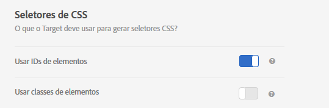

# Seletores de elementos usados no Visual Experience Composer{#element-selectors-used-in-the-visual-experience-composer}

Um seletor de elemento é uma expressão CSS que pode identificar um ou mais elementos.

Você pode encontrar informações básicas sobre os seletores de CSS no documento [Seletores](https://developer.mozilla.org/en-US/docs/Web/Guide/CSS/Getting_started/Selectors) no site Mozilla Developer Network (MDN).

Você pode definir se deseja usar elemento em classes ou ID de elemento nas suas preferências de conta. Clique em **[!UICONTROL Administração > Visual Experience Composer]** e escolha os seletores de CSS preferidos.



>[!NOTE]
>
>As Classes de elementos estão disponíveis como seletores em atividades de Teste A/B, Personalização automatizada e Teste multivariado.

Para obter informações sobre quando usar seletores de CSS e quando usar IDs exclusivas, consulte [Práticas recomendadas e limitações do Visual Experience Composer](../../c-experiences/c-visual-experience-composer/experience-composer-best-practices.md#concept_E284B3F704C04406B174D9050A2528A6).

## Como o Adobe Target gera um seletor para um elemento {#section_D89D954BCBFB486CA081BE183776A475}

O Target usa um algoritmo simples para criar um seletor. Esta é uma breve explicação da lógica de geração:

1. Se um elemento tiver uma id, por exemplo `id="container"`, o seletor do elemento é `#container`.

   Por exemplo:

   ```
   <div class="wrapper">
     <div id="container"> <!-- Selector is computed for this element -->
       <ul class="navigation">
         <li class="item active"> Home </li>
         <li class="item"> Men </li>
         <li class="item"> Women </li>
         <li class="item"> Kids </li>
       </ul>
     </div>
   </div>
   ```

1. Se um elemento contiver um atributo de classe, o Target tentará utilizar a primeira classe de qualquer classe presente no elemento.

   O Target tenta analisar o elemento pai até encontrar o elemento `<HTML>` ou um elemento com uma id. Sempre que um elemento contiver uma id e o seletor for calculado no elemento filho descendente, a ID desse elemento contribuirá para o seletor.

   Por exemplo:

   ```
   <div class="wrapper">
     <div id="container"> <!-- id is present here. It contributes to selector -->
       <ul class="navigation">
         <li class="item active"> Home </li> <!-- Selector is computed for this element -->
         <li class="item"> Men </li>
         <li class="item"> Women </li>
         <li class="item"> Kids </li>
       </ul>
     </div>
   </div>
   ```

   Neste exemplo:

   Seletor: `#container` > `ul.navigation:eq(0)` > `li.item:eq(0)` (&quot; > &quot; indica o filho imediato.)

   `eq` informa ao índice que há um elemento com &quot;tagName = UL&quot; e a primeira classe é `navigation`. Portanto, `index` é 0. Consulte o artigo [Seletores](https://developer.mozilla.org/en-US/docs/Web/Guide/CSS/Getting_started/Selectors) no site MDN para obter mais informações.

1. Se um elemento não contiver uma classe, o Target usará `tagName` para o elemento e navegará pelo elemento pai até que o elemento `<HTML>` ou um elemento com uma id seja encontrado.

   Por exemplo:

   ```
   <div class="wrapper">
     <div id="container"> <!-- id is present here. It contributes to selector -->
       <ul class="navigation">
         <li> Home </li>
         <li> Men </li>
         <li class="active"> Women </li>
         <li> Kids </li><!-- Selector is computed for this element -->
       </ul>
     </div>
   </div>
   ```

   Seletor: `#container` > `ul.navigation(0)` > `li:nth-of-type(4)`

   Saiba mais sobre [nth-of-type na página da Web de Dicas de CSS](https://css-tricks.com/almanac/selectors/n/nth-of-type/).

No processo acima:

* Você pode usar qualquer seletor de CSS, desde que ele identifique exclusivamente um elemento no DOM.
* A abordagem acima é a usada pelo Target. O Target não exige que você use essa abordagem. Você pode adicionar qualquer seletor, desde que o ponto 1 seja verdadeiro.
* Você pode usar qualquer atributo no seletor. Este documento usa apenas o nome da classe como exemplo.

