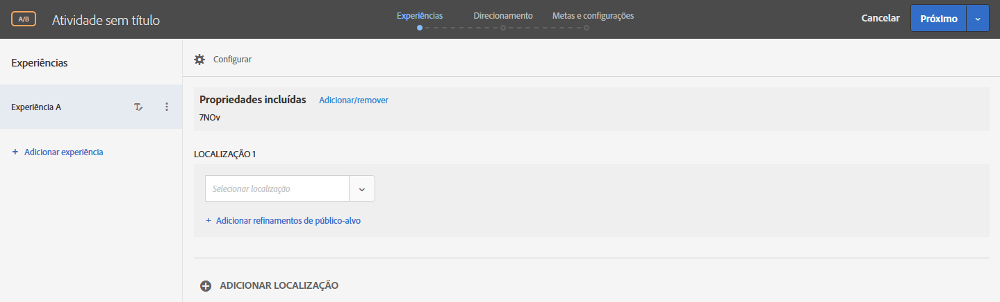
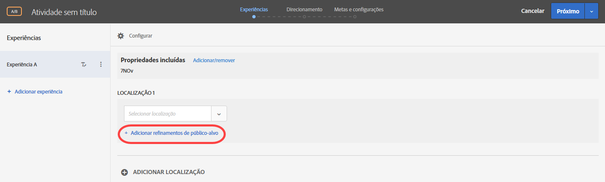
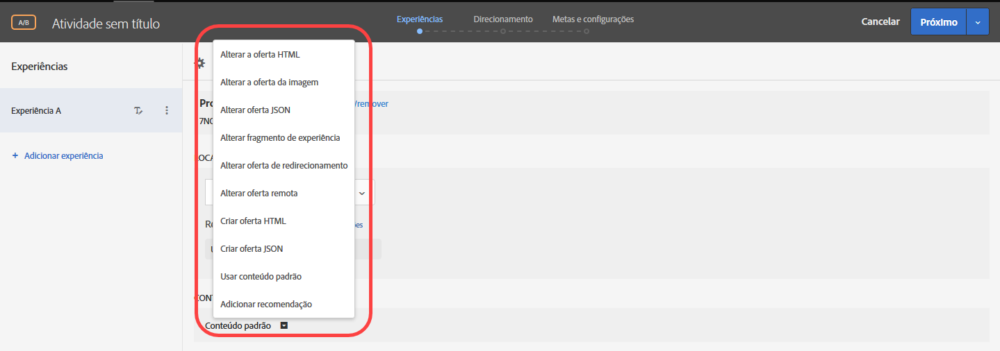
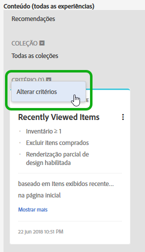
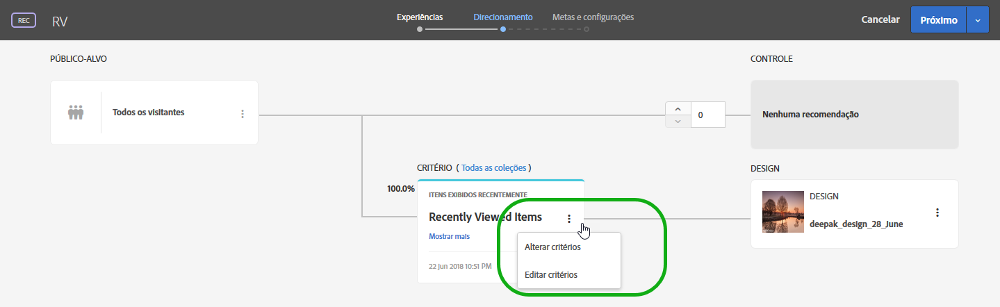

# Experience Composer baseado em formulário{#form-based-experience-composer}

O Experience Composer baseado em formulário é uma experiência não visual e uma interface de criação de ofertas útil para criar experiências para uso em atividades de Testes A/B, Direcionamento de experiência, Personalização automatizada e Recommendations, quando o Visual Experience Composer não estiver disponível ou for prático para uso. Por exemplo, você pode usar o composer baseado em formulário para criar experiências e ofertas para entrega em emails, quiosques e assistentes de voz.

Se você está criando uma atividade do Recommendations, não há experiências. Escolha seu critério e design. Se você escolher vários critérios ou designs, o Target gera as experiências automaticamente.

1. Clique em **[!UICONTROL Criar atividade]** e selecione o tipo de atividade que deseja criar.

   O Experience Composer baseado em formulário está disponível para testes A/B, direcionamento de experiência, personalização automatizada e atividades do Recommendations.
1. Selecione **[!UICONTROL Criador de experiências baseado em forma]** na caixa de diálogo [!UICONTROL Nova atividade].

   O Experience Composer baseado em formulário irá abrir.

   

   Essa tela é diferente se você estiver criando uma atividade do Recommendations. Atividades do Recommendations não incluem experiências.
1. Nomeie a atividade.
1. Selecione um local.

   When you click in the [!UICONTROL Select Location] box, a list of available locations appears. Selecione um desses locais. Para usar o local global entregue pela target.js, escolha &quot;target-global-mbox.&quot;

   Você também pode inserir um local que não esteja listado. Isto pode ser útil se a mbox ainda não foi criada ou visualizada em uma página. Insira o nome do local. Cuidado ao inserir um local que ainda não existe. Se a grafia ou capitalização não for compatível com a grafia e capitalização quando a chamada da mbox for feita, a atividade não será entregue. Os locais inseridos manualmente são salvos na lista de locais disponíveis. Na próxima vez que você tentar selecionar um local inserido manualmente, ele estará disponível na lista suspensa [!UICONTROL Selecionar local] para essa atividade.

   >[!NOTE]
   >
   >A criação de um local inserido manualmente durante a criação da atividade não cria automaticamente um novo local. O nome do local é salvo somente no contexto da atividade. O local é criado quando há uma chamada de delivery de conteúdo. Depois do local que está sendo criado, ele estará disponível para uso em outras atividades, para criação de audiências etc. na lista suspensa de locais disponíveis.

1. Clique em **[!UICONTROL Adicionar refinamentos de público-alvo]** e escolha um ou mais [públicos-alvo](/help/c-target/target.md#concept_A782F8481A5041EBA75103CB26376522) para esta atividade.

   

   No Experience Composer baseado em formulários, os refinamentos foram substituídos pela funcionalidade completa de público-alvo. Os refinamentos das atividades existentes foram migrados para  [públicos-alvo somente de atividades](/help/c-target/creating-activity-only-audience.md#concept_A6BADCF530ED4AE1852E677FEBE68483).
1. Selecione o tipo de conteúdo que você quer que apareça naquele local.

   

1. Para o tipo de conteúdo que você selecionou, especifique o conteúdo.

   **Alterar oferta HTML:** escolha uma oferta HTML.

   **Alterar oferta da imagem:** escolha uma imagem salva na biblioteca de conteúdo no Target.

   Você também pode adicionar um link para uma imagem (click-through, destino, aterrissagem e assim por diante.)

   1. Clique em [!UICONTROL Alterar oferta de imagem].
   1. Selecione a imagem desejada e clique em [!UICONTROL Editar links].
   1. Especifique o URL desejado ou página no seu site e clique em [!UICONTROL Atualizar].

   **Altere a oferta JSON:** escolha uma oferta json.

   **Alterar fragmento de experiência:** escolha um fragmento de experiência.

   **Alterar oferta de redirecionamento:** escolha uma oferta de redirecionamento.

   **Alterar oferta remota:** escolha uma oferta remota.

   **Criar uma oferta HTML:**

   1. Clique em [!UICONTROL Ofertas] e selecione a guia [!UICONTROL Ofertas de código].
   1. Clique em [!UICONTROL Criar] > [!UICONTROL Oferta HTML].
   1. Insira um nome de oferta.
   1. Digite ou cole seu código HTML na caixa Código.
   1. Clique em [!UICONTROL Salvar].

   **Criar oferta JSON:**

   1. Clique em [!UICONTROL Ofertas] e selecione a guia [!UICONTROL Ofertas de código].
   1. Clique em [!UICONTROL Criar] > [!UICONTROL Oferta JSON].
   1. Insira um nome de oferta.
   1. Insira ou cole seu código JSON na caixa Código.
   1. Clique em [!UICONTROL Salvar].

   Em uma atividade do Recommendations, o menu suspenso Conteúdo oferece uma opção Adicionar recomendação. Clique em **[!UICONTROL Adicionar recomendação]** e selecione o tipo de página. Depois siga as etapas normais como definido na interface para [criar uma atividade do Recommendations](/help/c-recommendations/t-create-recs-activity/create-recs-activity.md).

   Ao selecionar o critério do Recommendations no Experience Composer baseado em formulário, agora há um link para o cartão Critérios selecionado, para que possa editar fácil e rapidamente os critérios.

   

   Na página Direcionamento do fluxo de trabalho guiado de três etapas do Target:

   

1. (Optional, for AB activities, Automated Personalization, and Experience Targeting) To repeat this process for additional locations, click **[!UICONTROL Add Location]** and configure the location and content.
1. Click **[!UICONTROL Next]**, then complete the activity creation steps as usual for your activity type.

* [Criar um teste A/B](/help/c-activities/t-test-ab/t-test-create-ab/test-create-ab.md)
* [Criar uma atividade de direcionamento de experiência](/help/c-activities/t-experience-target/t-xt-create/xt-create.md#task_D6B3429AC31549E1A70EDF04B3DDC765)
* [Criar uma atividade do Recommendations](/help/c-recommendations/t-create-recs-activity/create-recs-activity.md#task_6874328773C64C44A73F0A130AD3F96F)

## Vídeo de treinamento: criador baseado em forma 

Este vídeo oferece uma demonstração do compositor baseado em formulário.

* Criar uma atividade usando o Experience Composer baseado em formulário
* Entenda quando usar o Experience Composer baseado em formulário ou o Visual Experience Composer
* Use refinamentos para direcionar um local

>[!VIDEO](https://video.tv.adobe.com/v/17390)