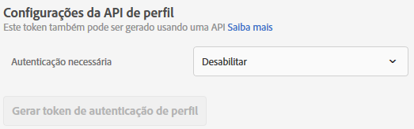
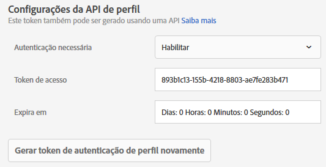

# Configurações da API de perfil

Ative ou desative a autenticação para atualizações em lote por meio de APIs Adobe Target e gere um token de autenticação de perfil.

[!DNL Adobe Target]O cria e mantém um perfil para cada usuário individual. Este perfil é armazenado no cluster de borda [!DNL Target] e é atualizado em tempo real após cada visita; no entanto, você pode atualizar um perfil individualmente ou em massa por meio da API.

Para maior segurança, você pode fazer com que uma chamada de API de atualização em massa solicite um token de acesso válido a ser enviado no cabeçalho da solicitação.

**Para solicitar a autenticação e gerar um token de acesso usando a interface de usuário do Target:**

1. Clique em **[!UICONTROL Administração]** > **[!UICONTROL Implementação]**.
1. Em **[!UICONTROL API de Perfil]** deslize o botão **[!UICONTROL Exigir autenticação]** para alternar para a posição ativada ou desativada.

   

1. (Condicional) Se você ativou os requisitos de autenticação, clique em **[!UICONTROL Gerar novo token de autenticação de Perfil]**.

   

   O token expira de acordo com o tempo listado na caixa [!UICONTROL Expira em].

   Você deve ter uma das seguintes permissões de usuário para gerar um token de autenticação:

   * Pelo menos [!UICONTROL Permissão do editor] (ou [!UICONTROL Aprovador])

      Para obter mais informações sobre clientes [!DNL Target Standard], consulte [Especificar funções e permissões](/help/administrating-target/c-user-management/c-user-management/user-management.md#roles-permissions) em *Usuários*. Para obter mais informações sobre clientes [!DNL Target Premium], consulte [Configurar permissões corporativas](/help/administrating-target/c-user-management/property-channel/properties-overview.md).

   * Função de administrador no nível do espaço de trabalho/perfil do produto

      Os espaços de trabalho estão disponíveis somente para [!DNL Target Premium] clientes. Para obter mais informações, consulte [Configurar permissões corporativas](/help/administrating-target/c-user-management/property-channel/properties-overview.md).

   * Direitos de administrador (permissão do Sysadmin) no nível do produto [!DNL Adobe Target]
   >[!NOTE]
   >
   >Também é possível gerar um token de autenticação de perfil por meio da API. Para obter mais informações, consulte [Perfis](https://developers.adobetarget.com/api/#profiles) no site de [desenvolvedores do Adobe Target](https://developers.adobetarget.com/).

1. Copie o token e inclua-o no cabeçalho da solicitação, em formato: &quot;Autorização&quot; : &quot;Portador&quot;

Clique em [!UICONTROL Gerar novo token de autenticação de Perfil] para gerar novamente o token, conforme necessário.

>[!IMPORTANT]
>
>Redefinir esse token resulta em falha das chamadas de API usando o token atual. Isso necessitará da atualização de qualquer script ou aplicativo que use esse token.
