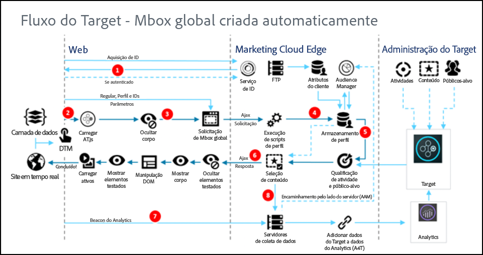

# Como a at.js funciona{#how-at-js-works}

Para implementar [!DNL Adobe Target] o cliente, você deve usar a biblioteca do at. js.

Em uma implementação do cliente, [!DNL Adobe Target][!DNL Target] fornece as experiências associadas a uma atividade diretamente para o navegador cliente. O navegador decide qual experiência será exibida e a exibe. Com uma implementação do cliente, você pode usar um editor WYSIWYG, o [Visual Experience Composer](/help/c-experiences/c-visual-experience-composer/visual-experience-composer.md) (VEC) ou uma interface não visual, o [Criador](/help/c-experiences/form-experience-composer.md)de experiências baseado em forma, para criar experiências de teste e personalização.

## O que é o at. js?

A biblioteca [da at.js](/help/c-implementing-target/c-implementing-target-for-client-side-web/t-mbox-download/c-target-atjs-implementation/target-atjs-implementation.md#concept_8AC8D169E02944B1A547A0CAD97EAC17) é a nova biblioteca de implementação do Target. A biblioteca at.js melhora os tempos de carregamento de página de implementações da Web e fornece opções de implementações melhores para aplicativos de página única. A at.js é a biblioteca de implementação recomendada e é atualizada frequentemente com novos recursos. Recomendamos que todos os clientes implementem ou migrem para a [última versão da at.js](/help/c-implementing-target/c-implementing-target-for-client-side-web/target-atjs-versions.md#reference_DBB5EDB79EC44E558F9E08D4774A0F7A).

Para obter mais informações, consulte [Bibliotecas do javascript do Target](/help/c-intro/how-target-works.md#libraries).

Na [!DNL Target] implementação ilustrada abaixo, as [!DNL Adobe Experience Cloud] seguintes soluções são implementadas: Analytics, Target e Gerenciamento de público-alvo. Além disso, os seguintes serviços principais da Experience Cloud são implementados: Adobe Launch, Audiences e Serviço de ID do visitante.

## Qual é a diferença entre os fluxogramas de trabalho do at.js 1.*diagramas de fluxo de trabalho x* e at. js 2. x?

Consulte [Atualização de at. js 1. x para at. js 2. x](/help/c-implementing-target/c-implementing-target-for-client-side-web/upgrading-from-atjs-1x-to-atjs-20.md) para obter mais informações sobre as diferenças introduzidas em 2. O de 1.*x*.

A partir de uma exibição de alto nível, há algumas diferenças entre as duas versões:

* O at. js 2. x não tem um conceito global de solicitação de mbox, mas sim uma solicitação de carregamento de página. Uma solicitação de carregamento de página pode ser visualizada como uma solicitação para recuperar o conteúdo que deve ser aplicado no carregamento da página inicial do site.
* O at. js 2. x gerencia conceitos de Exibições que são usadas para Aplicativos de página única (spas). at.js 1.*x* não está ciente deste conceito.

## diagramas at.js 2.x

Os diagramas a seguir ajudam você a entender o fluxo de trabalho do at. js 2. x com Exibições e como isso aprimora a integração de SPA. Para obter uma melhor introdução dos conceitos usados em at. js 2. x, consulte [Implementação de aplicativos de página única](/help/c-implementing-target/c-implementing-target-for-client-side-web/how-to-deployatjs/target-atjs-single-page-application.md).

| Etapa | Detalhes |
| --- | --- |
| 1 | A chamada retorna o [!DNL Experience Cloud ID] caso o usuário seja autenticado; outra chamada sincroniza a ID do cliente. |
| 2 | A biblioteca at.js é carregada de modo síncrono e oculta o corpo do documento. O at.js também pode ser carregado de forma assíncrona com uma opção que oculta previamente o trecho implementado na página. |
| 3 | Uma solicitação de carregamento de página é feita, incluindo todos os parâmetros configurados (MCID, SDID e ID do cliente). |
| 4 | Os scripts de perfil executam e, em seguida, fazem o feed na Loja do perfil. A Loja solicita que os públicos-alvos qualificados da Biblioteca de público-alvos (por exemplo, públicos alvos compartilhados do Adobe Analytics, Gerenciamento de público-alvo etc.). Os atributos do cliente são enviados à Loja de perfis em um processo em lote. |
| 5 | Com base nos parâmetros de solicitação de URL e dados de perfil, [!DNL Target] decide quais atividades e experiências retornarão ao visitante para a página atual e para as exibições futuras. |
| 6 | O conteúdo direcionado é enviado de volta para a página, incluindo, opcionalmente, valores de perfil para personalização adicional. O conteúdo direcionado na página atual é revelado o mais rápido possível sem cintilação do conteúdo padrão. Conteúdo direcionado para exibições que são mostradas como resultado das ações do usuário em um SPA, que é armazenado em cache no navegador para que possa ser aplicado instantaneamente, sem uma chamada de servidor adicional, quando as exibições forem acionadas `triggerView()`. |
| 7 | Os dados do Analytics são enviados ao servidores de Coleção de dados. |
| 8 | Os dados direcionados correspondem aos dados do Analytics por meio da SDID e são processados no armazenamento de relatórios do Analytics. Em seguida, os dados do Analytics podem ser visualizados no Analytics e no Target pelos relatórios do Analytics for Target (A4T). |

Agora, onde quer `triggerView()` que seja implementada em seu SPA, as Exibições e as ações são recuperadas do cache e mostradas ao usuário sem uma chamada de servidor. `triggerView()` também faz uma solicitação de notificações ao backend [!DNL Target] para aumentar e registrar contagens de impressão. Para obter mais informações sobre o at.js para SPAS com Exibições, consulte [Implementação de aplicativos de página única](/help/c-implementing-target/c-implementing-target-for-client-side-web/how-to-deployatjs/target-atjs-single-page-application.md).

| Etapa | Detalhes |
| --- | --- |
| 1 | `triggerView()` é chamado no SPA para renderizar a Exibição e aplicar ações para modificar elementos visuais. |
| 2 | O conteúdo direcionado para a exibição é lido do cache. |
| 3 | O conteúdo direcionado é revelado o mais rápido possível sem oscilação do conteúdo padrão. |
| 4 | A solicitação de notificação é enviada para a [!DNL Target] Loja de perfil para contar o visitante nas métricas de atividade e incremento. |
| 5 | Os dados do Analytics são enviados aos Servidores de coleta de dados. |
| 6 | Os dados do Target são correspondidos aos dados do Analytics pela SDID, e processados no armazenamento de relatório do Analytics. Em seguida, os dados do Analytics podem ser visualizados no Analytics e no Target pelos relatórios do A4T. |

## diagrama do at.js 1.x

| Etapa | Descrição | Chama | Descrição |
|--- |--- |--- |--- |
| 1 | A chamada retornará a [!DNL Experience Cloud ID] (MCID) se o usuário estiver autenticado; outra chamada sincroniza a ID do cliente. | 2 | A biblioteca at.js é carregada de modo síncrono e oculta o corpo do documento. |
| 3 | Uma solicitação mbox global é feita, incluindo todos os parâmetros configurados, MCID, SDID e ID do cliente (opcional). | 4 | Os scripts de perfil executam e, em seguida, fazem o feed na Loja do perfil. A Loja solicita públicos qualificados da Biblioteca [!UICONTROL de público-alvo] (por exemplo, públicos-alvo compartilhados de [!DNL Adobe Analytics], [!DNL Audience Manager], etc.). Os atributos do cliente são enviados para o [!DNL Profile Store] em um processo em lote. |
| 5 | Com base no URL, nos parâmetros mbox e nos dados do perfil, o [!DNL Target] decide quais atividades e experiências são retornadas ao visitante. | 6 | O conteúdo direcionado é retornado à página, opcionalmente incluindo os valores de perfil para personalização adicional. A experiência é revelada o mais rápido possível sem cintilação do conteúdo padrão. |
| 7 | Os dados do [!DNL Analytics] são enviados ao servidores de Coleção de dados. | 8 | Os dados do [!DNL Target] são correspondidos aos dados do [!DNL Analytics] pela SDID, e processados no armazenamento de relatório do [!DNL Analytics]. [!DNL Analytics] Os dados podem ser exibidos no [!DNL Analytics] e no [!DNL Target] pelos relatórios do [!DNL Analytics for Target] (A4T). |

## Vídeo de treinamento: diagrama de arquitetura at. js 2. x

O at. js 2. x melhora o suporte do Adobe Target para spas e integra-se com outras soluções da Experience Cloud. Este vídeo explica como tudo se une.

>[!VIDEO](https://video.tv.adobe.com/v/26250)

Consulte [Entendendo como at. js 2. x funciona](https://helpx.adobe.com/target/kt/using/atjs20-diagram-technical-video-understand.html) para obter mais informações.