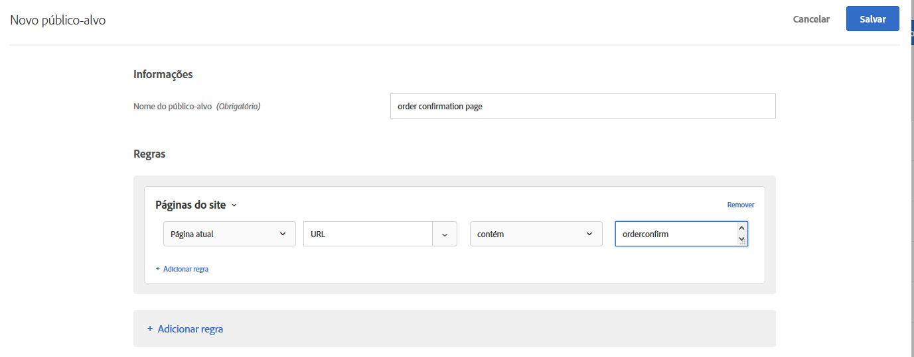
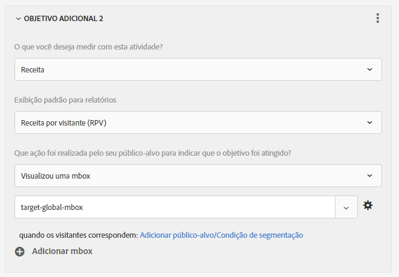

# Perguntas frequentes sobre a Mbox global

Lista de perguntas frequentes sobre as mboxes globais.

## Posso ter mais de uma mbox global se minha conta [!DNL Target] for configurada em vários domínios? {#section_B7252BA6C3BB4EF4AE9E53F47FD58ABD}

Somente uma mbox global é suportada na sua conta.

Você pode limitar o local de execução das atividades, ao adicionar as regras de URL às suas atividades. Para obter mais informações, consulte [Incluir a mesma experiência em páginas semelhantes](/help/c-experiences/c-visual-experience-composer/temtest.md#task_2539D51A18044F82B0D9895636546781).

Você também pode passar um parâmetro para a página usando [targetPageParams](/help/c-implementing-target/c-implementing-target-for-client-side-web/targetpageparams.md) e depois selecionar esses parâmetros na seção &quot;configurar URL&quot; no [!UICONTROL Visual Experience Composer] (VEC) ou adicionar os parâmetros como &quot;refinamentos&quot; no Experience Composer baseado em formulário.

## Como transfiro os dados de receita em uma mbox global [!DNL Target]? {#section_17AEA933BADA4D169CCEDF5833C41306}

Para coletar informações de receita e pedidos na target-global-mbox, &quot;parâmetros da mbox&quot; devem ser enviados para o Target. Esses parâmetros são os pares de nome/valor usados para enviar mais informações ao Target. O Target automaticamente procura esses parâmetros (nomes reservados) para preencher os dados da receita.

Para o `orderConfirmPage`, você deve transmitir `orderTotal`, `orderId`e `productPurchasedId`. Para obter mais informações, consulte [Criar uma mbox de confirmação de pedido - mbox.js](/help/c-implementing-target/c-implementing-target-for-client-side-web/t-mbox-download/orderconfirm-create.md#task_0036D5F6C062442788BB55E872816D82).

Esses mesmos parâmetros devem ser enviados para o target-global-mbox via `targetPageParams()`. Para obter mais informações, consulte [Passar parâmetros para uma mbox global](/help/c-implementing-target/c-implementing-target-for-client-side-web/t-mbox-download/c-understanding-global-mbox/pass-parameters-to-global-mbox.md#concept_33362A04146C4E3C8E7089B65F38B5E5).

Você também quer adicionar direcionamento ao pedaço de conversa, de modo que o Target somente conte as conversas no target-global-mbox quando a página de confirmação de pedido tiver sido visualizada, conforme mostrado a seguir:

A seção Páginas do site ilustradas acima contém as seguintes seções: Página atual, URL, contém, orderconfirm.

As opções na ilustração acima incluem as configurações a seguir:

* **O que você deseja medir com essa atividade:** Receita
* **Exibição padrão para geração de relatório:** Receita por visitante (RPV)
* **Qual ação foi realizada pelo seu público-alvo para indicar que a sua meta foi alcançada?** Visualizada uma mbox, target-global-mbox
