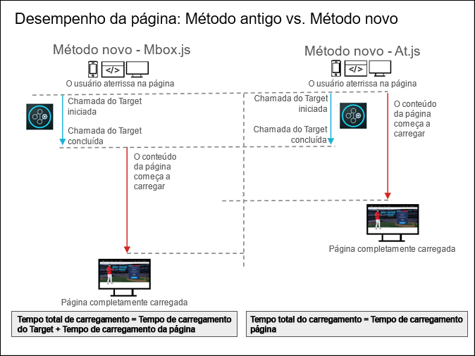

# Perguntas frequentes sobre at.js

Respostas às perguntas frequentes sobre a at.js.

## Quais as vantagens de usar a at.js versus a mbox.js? {#section_FE30D01A577C46ACB0F787B85F5E0F6B}

A biblioteca [!DNL at.js] substitui [!DNL mbox.js]. A biblioteca [!DNL mbox.js] não é mais suportada. No entanto, para a maioria das pessoas, [!DNL at.js] oferece vantagens em relação a [!DNL mbox.js].

Entre outros benefícios, a [!DNL at.js] melhora os tempos de carregamento de página para implementações da Web, melhora a segurança e fornece opções de implementações melhores para aplicativos de página única.

O diagrama a seguir ilustra o desempenho do carregamento de página usando a mbox.js versus a at.js.



Como ilustrado acima, usando a mbox.js, o conteúdo da página não começou a ser carregado até que a chamada [!DNL Target] fosse concluída. Usando a at.js, o conteúdo da página inicia o carregamento ao iniciar a chamada do [!DNL Target] e não espera até que ela seja concluída.

## Qual é o impacto da at.js e da mbox.js nos tempos de carregamento de página? {#page-load}

Muitos clientes e consultores querem saber o impacto da [!DNL at.js] e da [!DNL mbox.js] no tempo de carregamento de página, principalmente no contexto de usuários novos e recorrentes. Infelizmente, é difícil medir e fornecer números concretos sobre como a [!DNL at.js] ou a [!DNL mbox.js] influenciam no tempo de carregamento de página devido à implementação de cada cliente.

No entanto, se a API de visitante estiver presente na página, [!DNL Target] poderá entender melhor como [!DNL at.js] e [!DNL mbox.js] influenciam no tempo de carregamento de página.

>[!NOTE]
>
>A API do visitante e a [!DNL at.js] ou a [!DNL mbox.js] têm um impacto no tempo de carregamento de página apenas quando estiver usando a mbox global (por causa da técnica de ocultação do corpo). As mboxes regionais não são afetadas pela integração da API do visitante.

As seções a seguir descrevem a sequência de ações para visitantes novos e recorrentes:

### Novos visitantes

1. A API do visitante é carregada, analisada e executada.
1. A at.js / mbox.js é carregada, analisada e executada.
1. Se a criação automática da mbox global estiver ativada, a biblioteca JavaScript do Target:

   * Iniciará o objeto do visitante.
   * A biblioteca do Target tentará recuperar os dados de ID de visitante da Experience Cloud.
   * Como esse visitante é um novo, a API de visitante enviará uma solicitação de domínio cruzado para demdex.net.
   * Depois que os dados de ID de visitante da Experience Cloud forem recuperados, será enviada uma solicitação para o Target.

### Visitantes que retornam

1. A API do visitante é carregada, analisada e executada.
1. A at.js / mbox.js é carregada, analisada e executada.
1. Se a criação automática da mbox global estiver ativada, a biblioteca JavaScript do Target:

   * Iniciará o objeto do visitante.
   * A biblioteca do Target tentará recuperar os dados de ID de visitante da Experience Cloud.
   * A API de visitante recuperará os dados dos cookies.
   * Depois que os dados de ID de visitante da Experience Cloud forem recuperados, será enviada uma solicitação para o Target.

>[!NOTE]
>
>Para novos visitantes, quando a API de visitante estiver presente, o Target precisará transmitir as informações várias vezes para garantir que as solicitações do Target contenham os dados de ID de visitante da Experience Cloud. Para os visitantes recorrentes, o Target transmitirá as informações apenas para recuperar o conteúdo personalizado.

## Por que parece que vejo tempos de resposta mais lentos após a atualização de uma versão anterior da at.js para a versão 1.0.0? {#section_DFBA5854FFD142B49AD87BFAA09896B0}

A versão da [!DNL at.js] 1.0.0 e posteriores acionam todas as solicitações paralelamente. As versões anteriores executam as solicitações sequencialmente, o que significa que elas são colocadas em uma fila e o Target aguarda até que a primeira seja concluída antes de passar para a próxima solicitação.

A forma como as versões anteriores da [!DNL at.js] executam as solicitações é suscetível ao chamado &quot;bloqueio do topo da linha&quot;. Nas versões da [!DNL at.js] 1.0.0 e posteriores, o Target muda para a execução de solicitação paralela.

Por exemplo, se você verificar a cascata da guia de rede para a versão da [!DNL at.js] 0.9.1, verá que a próxima solicitação do não será iniciada até que a anterior tenha terminado. [!DNL Target] Essa sequência não é o caso com [!DNL at.js] 1.0.0 e posterior, onde todas as solicitações são iniciadas basicamente ao mesmo tempo.

De uma perspectiva de tempo de resposta, matematicamente, essa sequência pode ser resumida assim

<ul class="simplelist"> 
 <li> versão at.js 0.9.1: tempo de resposta de todas as solicitações do Target = soma do tempo de resposta das solicitações </li> 
 <li> at.js 1.0.0 e posteriores: tempo de resposta de todos as solicitações do Target = máximo do tempo de resposta das solicitações </li> 
</ul>

A biblioteca [!DNL at.js] versão 1.0.0 conclui as solicitações mais rapidamente. Além disso, as solicitações da [!DNL at.js] são assíncronas, por isso o não bloqueia a renderização da página. [!DNL Target] Mesmo que as solicitações levem alguns segundos para serem concluídas, você ainda verá a página renderizada, mas apenas algumas partes da página ficarão em branco até que o Target receba uma resposta da borda do Target.

## Posso carregar a biblioteca [!DNL Target] de forma assíncrona? {#section_AB9A0CA30C5440C693413F1455841470}

A versão da at.js 1.0.0 permite carregar a biblioteca do Target de forma assíncrona.

Para carregar a at.js de forma assíncrona:

* A abordagem recomendada é por meio de tags em [!DNL Adobe Experience Platform].
* Também é possível carregar a at.js de forma assíncrona, adicionando o atributo async à tag do script que carrega a at.js. Use algo assim:

   ```
   <script src="<URL to at.js>" async></script>
   ```

* Você também pode carregar a at.js de forma assíncrona usando este código:

   ```
   var script = document.createElement('script'); 
   script.async = true; 
   script.src = "<URL to at.js>"; 
   document.head.appendChild(script);
   ```

Carregar a at.js de forma assíncrona é uma ótima maneira de evitar o bloqueio de renderização do navegador. No entanto, essa técnica pode levar à cintilação na página da Web.

Você pode evitar a cintilação usando um trecho oculto previamente, que oculta a página (ou partes especificadas) e a revela depois que a at.js e a solicitação global são carregadas. O trecho deve ser adicionado antes de carregar a at.js.

Se estiver implantando a at.js por meio de uma implementação assíncrona [!DNL Adobe Experience Platform], certifique-se de incluir o trecho pré-ocultação diretamente nas páginas, antes de Implementar [!DNL Target] usando [!DNL Adobe Experience Platform] código Incorporado.

Se estiver implantando a at.js por meio de uma implementação DTM síncrona, o snippet de pré-ocultação pode ser adicionado por uma regra de Carregamento de página acionada na parte superior da página.

Para obter mais informações, consulte [Como o at.js gerencia a cintilação](/help/c-implementing-target/c-implementing-target-for-client-side-web/c-how-atjs-works/manage-flicker-with-atjs.md).

## A at.js é compatível com a integração do Adobe Experience Manager (Experience Manager)? {#section_6177AE10542344239753764C6165FDDC}

O [!DNL Adobe Experience Manager] 6.2 com FP-11577 (ou posterior) agora é compatível com implementações da [!DNL at.js] com a integração do [!UICONTROL Adobe Target Cloud Services]. 

## Como posso evitar a cintilação de carregamento de página usando a at.js? {#section_4D78AAAE73C24E578C974743A3C65919}

O Target fornece várias maneiras de evitar a cintilação do carregamento de página. Para obter mais informações, consulte [Como evitar a cintilação com o at.js](/help/c-implementing-target/c-implementing-target-for-client-side-web/c-how-atjs-works/manage-flicker-with-atjs.md#concept_AA168574397D4474B993EEAB90865EBA).

## Qual é o tamanho do arquivo da at.js? {#section_6A25C9A14C66441785A7635FEF5C4475}

O arquivo da at.js tem aproximadamente 109 KB quando baixado. No entanto, como a maioria dos servidores compacta automaticamente os arquivos para diminuir os tamanhos, a at.js fica com aproximadamente 34 KB quando é compactada (usando GZIP ou outro método) em seu servidor e é carregada conforme os usuários visitam o site. As configurações de compactação no servidor onde a at.js foi instalada determinam o seu tamanho compactado real.

## Por que o at.js é maior que o mbox.js? {#section_AA1C43897E46448FA3E26EEC10ED7E51}

As implementações da at.js usam uma única biblioteca ([!DNL at.js]), enquanto as implementações de mbox.js na verdade usam duas bibliotecas, ([!DNL mbox.js] e [!DNL target.js]). Por isso, uma comparação mais justa seria de at.js versus mbox.js *e* `target.js`. Comparação entre os tamanhos gzipped das duas versões, a at.js versão 1.2 tem 34 KB e a mbox.js versão 63 tem 26.2 KB. ``

A at.js é maior, pois realiza muito mais análise de DOM em comparação à mbox.js. Isso é necessário porque a at.js recebe dados &quot;brutos&quot; na resposta JSON e precisa entender isso. mbox.js usado `document.write()` e toda a análise foi feita pelo navegador.

Embora o tamanho do arquivo seja maior, nossos testes indicam que as páginas carregam mais rápido com a at.js versus a mbox.js. Além disso, a at.js é superior do ponto de vista de segurança, pois não carrega arquivos adicionais dinamicamente ou usa `document.write`.

## A at.js contém um jQuery? Posso remover essa parte da at.js já que tenho o jQuery no meu site? {#section_E4604E46E7B34460B8DD6A78D9B476F9}

A at.js atualmente usa partes do jQuery e, portanto, você vê a notificação de licença do MIT na parte superior da at.js. O jQuery não está exposto e não interfere na biblioteca do jQuery que já existe na sua página, que pode ser de uma versão diferente. A remoção do código do jQuery na at.js não é suportado.

## A at.js é compatível com o Safari e com o domínio cruzado definido como somente x? {#section_114EC271A6E045E1B2183B66F1B71285}

Não, se o domínio cruzado estiver definido como somente x e o Safari tiver cookies de terceiros desativados, o [!DNL mbox.js] e o at.js definirão um cookie desativado e nenhuma solicitação de mbox será executada para o domínio desse cliente específico.

Para auxiliar os visitantes do Safari, um Domínio X melhor seria &quot;desativado&quot; (define apenas um cookie primário) ou &quot;ativado&quot; (define apenas um cookie primário no Safari, enquanto define cookies primários e de terceiros em outros navegadores).

## Posso usar o [!DNL Target] Visual Experience Composer (VEC) em meus aplicativos de página única? {#section_459C1BEABD4B4A1AADA6CF4EC7A70DFB}

Sim, você pode usar o VEC para sua SPA se usar a at.js 2.x. Para obter mais informações, consulte [Página única (SPA) Visual Experience Composer](/help/c-experiences/spa-visual-experience-composer.md).

## Posso usar o depurador da Adobe Experience Cloud com implementações da at.js? {#section_FF3CF4C5FD2F4DB1BF1A6B39DA161637}

Sim. Também é possível usar a mboxTrace para fins de depuração ou as Ferramentas de desenvolvedor do navegador para inspecionar as solicitações da rede, filtrando como &quot;mbox&quot;, a fim de isolar as chamadas da mbox.

## Posso usar caracteres especiais em nomes de mbox com a at.js? {#section_8E31D2E8A27642098934D7DACFB2A600}

Sim, o mesmo que ocorre com a mbox.js.

## Por que as mboxes não estão sendo acionadas nas minhas páginas da Web? {#section_4BA5DA424B734324AAB51E4588FA50F5}

Os clientes do, às vezes, usam instâncias baseadas em nuvem com o [!DNL Target]Target para testes ou fins de prova de conceito simples. Esses domínios e muitos outros fazem parte da [Lista de sufixos públicos](https://publicsuffix.org/list/public_suffix_list.dat).

Os navegadores modernos não salvam cookies se estiver usando esses domínios, a menos que você personalize a configuração `cookieDomain` usando targetGlobalSettings(). Para obter mais informações, consulte [Uso de instâncias baseadas em nuvem com o Target](/help/c-implementing-target/c-implementing-target-for-client-side-web/c-target-debugging-atjs/targeting-using-cloud-based-instances.md).

## Os endereços IP podem ser usados como o domínio de cookie ao usar a at.js? {#section_8BEEC91A3410459D9E442840A3C88AF7}

Sim, se estiver usando [a at.js versão 1.2 ou posterior](/help/c-implementing-target/c-implementing-target-for-client-side-web/target-atjs-versions.md#reference_DBB5EDB79EC44E558F9E08D4774A0F7A). No entanto, o Adobe recomenda que você se mantenha atualizado com a versão mais recente.

>[!NOTE]
>
>Os seguintes exemplos não são necessários se estiver usando a at.js versão 1.2 ou posterior.

Dependendo de como você usa [targetGlobalSettings](/help/c-implementing-target/c-implementing-target-for-client-side-web/targetgobalsettings.md), talvez seja necessário fazer modificações adicionais no código depois de baixar a at.js. Por exemplo, se você precisava de configurações ligeiramente diferentes para as implementações do [!DNL Target] em vários sites e não pode defini-las dinamicamente usando o JavaScript personalizado, faça essas personalizações manualmente depois de baixar o arquivo e antes de fazer upload para os respectivos sites.

Os exemplos a seguir permitem usar a função `targetGlobalSettings()` at.js para inserir um trecho de código para suportar endereços IP:

Este exemplo é para um único endereço IP:

```
if (window.location.hostname === '123.456.78.9') { 
    window.targetGlobalSettings = window.targetGlobalSettings || {}; 
    window.targetGlobalSettings.cookieDomain = window.location.hostname; 
}
```

Este exemplo é para uma série de endereços IP:

```
if (/^123\.456\.78\..*/g.test(window.location.hostname)) { 
    window.targetGlobalSettings = window.targetGlobalSettings || {}; 
    window.targetGlobalSettings.cookieDomain = window.location.hostname; 
}
```

## Por que vejo mensagens de aviso, como &quot;ações com seletores ausentes&quot;?  {#section_C36BED5B16634361A1BA46FCB731489D}

Essas mensagens não estão relacionadas à funcionalidade [!DNL at.js] . A biblioteca [!DNL at.js] tenta informar tudo que não pode ser encontrado no DOM.

Caso veja esta mensagem de aviso, as possíveis causas raiz podem ser as seguintes:

* A página está sendo criada dinamicamente e a at.js não pode encontrar o elemento .
* A página está sendo criada lentamente (devido a uma rede lenta) e a at.js não consegue encontrar o seletor no DOM.
* A estrutura de página em que a atividade está sendo executada foi alterada. Se você reabrir a atividade no Visual Experience Composer (VEC), deverá receber uma mensagem de aviso. Atualize a atividade para que todos os elementos necessários possam ser encontrados.
* A página subjacente faz parte de um Aplicativo de página única (SPA, Single Page Application) ou a página contém elementos que são exibidos mais abaixo e o &quot;mecanismo de buscas do seletor&quot; da [!DNL at.js] não consegue encontrá-los. Aumentar o `selectorsPollingTimeout` pode ajudar. Para obter mais informações, consulte [targetGlobalSettings()](/help/c-implementing-target/c-implementing-target-for-client-side-web/targetgobalsettings.md).
* Todas as métricas de rastreamento de cliques tentam se adicionar a cada página, independentemente do URL em que a métrica foi configurada. Embora inofensiva, essa situação faz com que muitas dessas mensagens sejam exibidas.

   Para obter melhores resultados, baixe e use a versão mais recente da [!DNL at.js]. Para obter mais informações, consulte [Detalhes da versão da at.js](/help/c-implementing-target/c-implementing-target-for-client-side-web/target-atjs-versions.md) e [Download at.js](/help/c-implementing-target/c-implementing-target-for-client-side-web/how-to-deployatjs/implementing-target-without-a-tag-manager.md).

## Qual é o domínio tt.omtrdc.net para o qual as chamadas de servidor [!DNL Target] são direcionadas? {#section_999C29940E8B4CAD8A957A6B1D440317}

O [!DNL tt.omtrdc.net] é o nome de domínio da rede EDGE da Adobe, usado para receber todas as chamadas do Target.

## Por que a at.js e mbox.js não usam os sinalizadores de cookies HttpOnly e Seguro? {#section_74527E3B41B54B0A83F217C3E664ED1F}

HttpOnly pode ser definido somente pelo código do lado do servidor. Os cookies do Target, como mbox, são criados e salvos pelo código JavaScript, para que o Target não possa usar o sinalizador de cookies HttpOnly.

Seguro pode ser definido somente por JavaScript, quando a página tiver sido carregada por HTTPS. Se a página inicialmente carregar por meio de HTTP, o JavaScript não poderá definir esse sinalizador. Além disso, se o sinalizador Seguro for usado, o cookie estará disponível somente em páginas HTTPS.

Para garantir que o Target possa rastrear os usuários corretamente e, como os cookies são gerados no lado do cliente, o Target não usa nenhum desses sinalizadores.

## Com que frequência a at.js dispara uma solicitação de rede?  {#section_57C5235DF7694AF093A845D73EABADFD}

O Adobe Target executa todas as suas decisões no lado do servidor. Isso significa que a at.js dispara uma solicitação de rede sempre que a página é recarregada ou uma API pública da at.js é chamada.

## Na melhor das hipóteses, podemos esperar que o usuário não tenha nenhum efeito visível no carregamento da página relacionado à ocultação, substituição e exibição de conteúdo? {#section_CB3C566AD61F417FAC0EC5AC706723EB}

A at.js tenta evitar ocultar previamente o HTML BODY ou outros elementos DOM por um período estendido, mas isso depende das condições da rede e da configuração da atividade. O at.js fornece [configurações](/help/c-implementing-target/c-implementing-target-for-client-side-web/targetgobalsettings.md) que você pode usar para personalizar o estilo CSS de ocultação do BODY, de modo que, em vez de esvaziar todo o HTML BODY, você possa pré-ocultar apenas algumas partes da página. A expectativa é que essas partes contenham elementos DOM que precisam ser &quot;personalizados&quot;.

## Qual é a sequência de eventos em um cenário médio em que um usuário se qualifica para uma atividade?  {#section_56E6F448E901403FB77DF02F44C44452}

A solicitação da at.js é uma `XMLHttpRequest` assíncrona, para a execução das seguintes etapas:

1. A página é carregada.
1. A at.js pré-oculta o HTML BODY. Há uma configuração para pré-ocultar um determinado contêiner em vez do HTML BODY.
1. A solicitação da at.js é disparada.
1. Depois que a resposta do Target é recebida, o Target extrai os seletores de CSS.
1. Usando seletores de CSS, o Target cria tags STYLE para pré-ocultar os elementos DOM que serão personalizados.
1. O HTML BODY que pré-oculta o STYLE é removido.
1. O Target inicia a pesquisa de elementos DOM.
1. Se um elemento DOM for encontrado, o Target aplicará as alterações do DOM, e o elemento pré-ocultando STYLE será removido.
1. Se os elementos DOM não forem encontrados, um tempo limite global revelará os elementos para evitar uma página quebrada.

## Com que frequência o conteúdo da página é totalmente carregado e visível quando a at.js finalmente desmarca remove a ocultação do elemento que a atividade está mudando? {#section_01AFF476EFD046298A2E17FE3ED85075}

Considerando o cenário acima, com que frequência o conteúdo da página é totalmente carregado e visível quando a at.js finalmente desmarca remove a ocultação do elemento que a atividade está mudando? Em outras palavras, a página é totalmente visível, exceto pelo conteúdo da atividade, que é revelado um pouco após o restante do conteúdo.

A at.js não bloqueia a renderização da página. Um usuário pode notar algumas regiões em branco na página, que representam elementos personalizados por [!DNL Target]. Se o conteúdo a ser aplicado não tiver muitos recursos remotos, como SCRIPTs ou IMGs, tudo deverá ser renderizado rapidamente.

## Como uma página totalmente armazenada em cache afetaria o cenário acima? Seria mais provável que o conteúdo da atividade se tornasse visível depois que o restante do conteúdo da página fosse carregado?  {#section_CE76335A3E0B41CB8253DEE5E060FCDA}

Se uma página for armazenada em cache em um CDN próximo à localização do usuário, mas não próximo à borda do Target, esse usuário poderá ver alguns atrasos. As bordas do Target são bem distribuídas em todo o mundo, portanto, isso não é um problema na maioria das vezes.

## É possível que uma imagem herói seja exibida e depois removida após um pequeno atraso?  {#section_C25B07B25B854AAE8DEE1623D0FA62A3}

Considere o seguinte cenário:

O tempo limite do Target é de cinco segundos. Um usuário carrega uma página que possui uma atividade para personalizar uma imagem herói. A at.js envia a solicitação para determinar se há uma atividade a ser aplicada, mas não há resposta inicial. Suponha que o usuário veja o conteúdo regular da imagem herói, porque nenhuma resposta foi recebida do Target sobre alguma atividade associada. Após quatro segundos, o Target retorna uma resposta com o conteúdo da atividade.

Nessa etapa, seria possível mostrar a versão alternativa? Então, depois de quatro segundos, a imagem herói pode ser removida e o usuário pode perceber essa troca de imagem?

Inicialmente, o elemento DOM da imagem herói está oculto. Depois que uma resposta do Target é recebida, at.js aplica as alterações do DOM, como a substituição do IMG e a exibição da imagem herói personalizada.

## Qual doctype HTML é exigido pela at.js?

A at.js exige o doctype HTML 5.

Esta sintaxe é:

`<!DOCTYPE html>`

O doctype HTML 5 garante que a página carregue no modo padrão. Ao carregar no modo quirks, algumas APIs de JS das quais a at.js depende são desativadas. O Target desativa a at.js no modo quirks.
