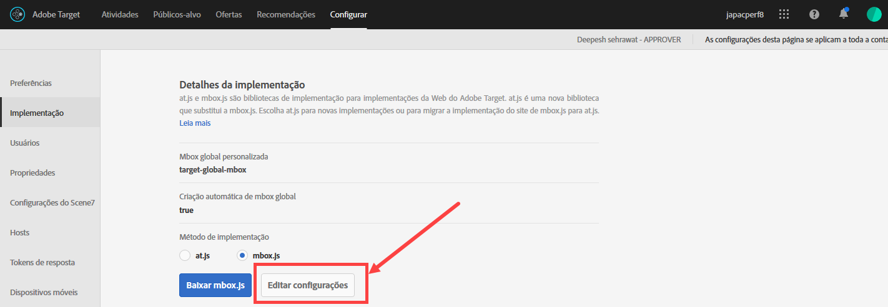
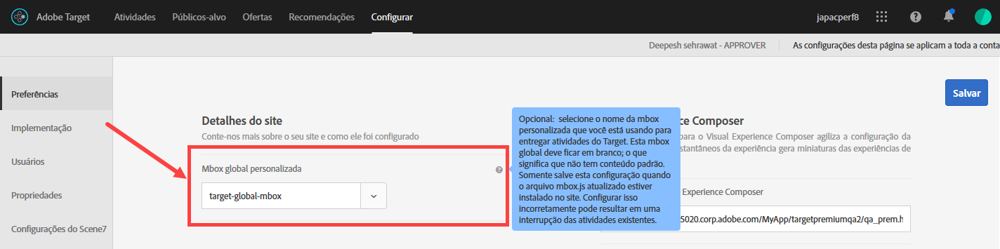

# Personalizar uma mbox global{#customize-a-global-mbox}

Informações para ajudar você a personalizar uma mbox global para at.js e mbox.js

1. Edite a mbox.js

   Go to **[!UICONTROL Target]** > **[!UICONTROL Administration]** > **[!UICONTROL Implementation]**.

   * Para mbox.js, clique em **[!UICONTROL Editar configurações mbox.js]**.
   * Para [!DNL at.js]**[!UICONTROL , selecione at.js]** sob Método de implementação, depois clique em **[!UICONTROL Editar configurações mbox.js]**.

   

1. Edite [!DNL mbox.js] ou [!DNL at.js].

   Desabilite **[!UICONTROL Criar mbox global automaticamente]**, depois adicione o nome da mbox global personalizada que gostaria de usar para entregar atividades do [!DNL Target Standard/Premium]. Essa mbox global personalizada também será usada para rastreamento de cliques.

   

   Clique em **[!UICONTROL Salvar]** ao terminar.
1. Implemente a biblioteca [!DNL mbox.js] ou [!DNL at.js] no seu site.

* Para mbox.js, consulte [Implementação da mbox.js](../../../../c-implementing-target/c-implementing-target-for-client-side-web/t-mbox-download/mbox-download.md#task_4EAE26BB84FD4E1D858F411AEDF4B420).
* Para at.js, consulte [Implementação da at.js](../../../../c-implementing-target/c-implementing-target-for-client-side-web/t-mbox-download/c-target-atjs-implementation/target-atjs-implementation.md#concept_8AC8D169E02944B1A547A0CAD97EAC17).

1. Organize a transição com seu lançamento.

   Assim que estiver pronto para que o [!DNL Target Standard/Premium] comece a usar sua mbox global para todas atividades dali em diante, você pode prosseguir com esta etapa.

   Atualize o nome da mbox global personalizada para o mesmo nome usado no passo 2 acima.

   

   >[!IMPORTANT]
   >
   >Quando você salvar, todas atividades em sua conta sincronizam com essa mbox. Se essa mbox não está no seu site, todas atividades param de funcionar.

   Clique em **[!UICONTROL Salvar]**.
