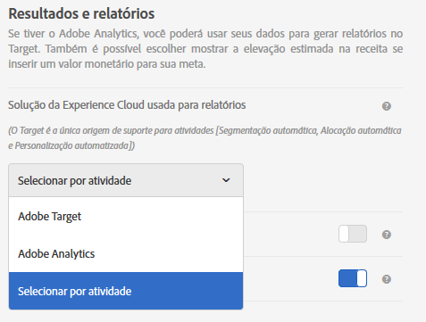

# Configurações de atividade - Perguntas frequentes sobre o A4T

This topic contains answers to questions that are frequently asked about activity setup and using [!DNL Analytics] as the reporting source for [!DNL Target] (A4T).

## Quais tipos de atividade são compatíveis com o Analytics como fonte de geração de relatórios (A4T)? {#section_5E4F58CD25A5424E869E6FE0803968EF}

Para obter uma lista completa, consulte &quot;Tipos de atividade suportados&quot; no [Adobe Analytics como a Fonte de relatórios do Adobe Target (A4T)](/help/c-integrating-target-with-mac/a4t/a4t.md#concept_7540C8C04259434AB6EE33B09F47A1DE).

## Acabei de criar um atividade. Por que não vejo nenhum dado chegando?  {#section_9F8092BE4225442896F926540292F221}

When an activity is created, [!DNL Target] sends a classification file to [!DNL Analytics]. Although [!DNL Analytics] is capturing the and processing the data, it does not show in the reports until the classification file has been updated. Isso pode levar até 24 horas. Se depois de 48 horas você não visualizar seus dados, [entre em contato com o Atendimento ao Cliente](/help/cmp-resources-and-contact-information.md#reference_ACA3391A00EF467B87930A450050077C). Alternativamente, se você sabe que vai iniciar uma atividade, você pode criar a atividade alguns dias antes e as classificações serão enviadas quando a atividade for salva. Dessa forma, os dados aparecem nos relatórios logo no início. Observe que leva de 45 a 90 minutos para que os dados sejam processados no [!DNL Analytics].

## Por que não consigo selecionar o Analytics como minha fonte de geração de relatórios quando eu crio uma nova atividade?  {#section_9F4F69C3085F4C2480AF439127EB27CD}

You can change your [!UICONTROL Reporting Settings] options in [!UICONTROL Administration].

1. Em [!DNL Target], clique em **[!UICONTROL Administração]**.
1. Na solução **[!UICONTROL Experience Cloud usada para a lista suspensa de]** relatórios, clique em **[!UICONTROL Selecionar por atividade]**.

A lista suspensa de **[!UICONTROL Fonte de geração de relatório]** está habilitada na tela **[!UICONTROL Meta e configurações]** para criar e editar atividades.

To always use [!DNL Analytics] as the reporting source, select **[!UICONTROL Adobe Analytics]** from the drop-down list in [!UICONTROL Administration].

## Um visitante pode alternar entre experiências direcionadas e controladas em visitas diferentes em uma atividade de Público alvo automático que usa A4T?

O seguinte é verdadeiro, desde que a visitorId não seja alterada para um visitante entre visitas.

Se a porcentagem de alocação de tráfego for ajustada para atividade média, é possível que um visitante se mova entre as experiências de direcionamento e controle.

Se as porcentagens não forem ajustadas no meio da atividade, um visitante que inicialmente visualizar o controle sempre será enviado para controle. Um visitante enviado para experiências direcionadas sempre será enviado para experiências direcionadas.

* Depois de estar no &quot;bucket&quot; de tráfego direcionado, o visitante pode ser enviado a uma experiência diferente da visita para a visita se os modelos de aprendizado de máquina determinarem que uma experiência diferente é relevante para a nova visita.
* Depois de ser atribuído ao &quot;bucket&quot; de controle do tráfego, um visitante sempre visualizará a mesma experiência, pois a atribuição da experiência é baseada em um hash pseudo-aleatório determinístico do visitorId do visitante.

## É recomendável usar o modelo personalizado para Público alvo automático e A4T com uma divisão 90(Controle)/10(Direcionado) até que os modelos sejam criados?

Sua divisão de alocação de tráfego ideal depende do que você deseja realizar.

Se sua meta é personalizar o máximo de tráfego possível, você pode manter 90% de direcionamento e 10% de controle durante a vida útil da atividade. Se sua meta é executar um experimento comparando o quão bem os algoritmos personalizados fazem versus o controle, então uma divisão 50/50 é melhor.

