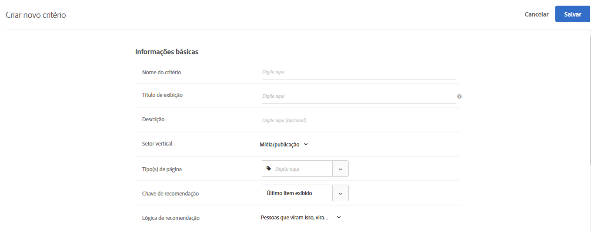

#  PREMIUM

Criteria in [!DNL Adobe Target] [!DNL Recommendations] are rules that determine which products or content to recommend based on a predetermined set of visitor behaviors. Os critérios podem ser baseados em tendências populares, nos comportamentos atuais e passados de um visitante ou em produtos e conteúdo semelhantes. Você pode comparar vários tipos de recomendação por meio da adição de vários critérios.

As seções a seguir explicam mais sobre chaves de critérios e a lógica de recomendação que pode ser usada para cada chave. Clique nos links para obter informações mais detalhadas.

## Vertical do setor {#section_936BCFCF234C49A2BEC1C38AAC2D71AF}

While creating a criteria, you select an industry vertical based on the goals of your recommendations activity.

| Vertical do setor | Meta |
|--- |--- |
| Varejo/Comércio eletrônico | Conversão resultando em compra |
| Geração de lead/B2B/Serviços financeiros | Conversão sem compra |
| Mídia/Publicação | Envolvimento |

Outras opções de critério mudam de acordo com o negócio vertical que você selecionar. Você pode definir seu negócio vertical padrão no **[!UICONTROL Recommendations > Configurações]** ou você pode especificar o negócio vertical para cada critério.

## Algorithm Type {#section_885B3BB1B43048A88A8926F6B76FC482}

The algorithm type you select determines the available algorithms. There are several algorithm types, which are represented as criteria cards when you set up a [!DNL Recommendations] activity.

A tabela a seguir explica os vários tipos de algoritmos e seus algoritmos associados.

| Tipo de algoritmo | Quando usar | Algoritmos disponíveis |
| --- | --- | --- |
| [!UICONTROL Baseado em carrinho] | Faça recomendações com base no conteúdo do carrinho do usuário. | <ul><li>Pessoas que visualizaram estes, visualizaram aqueles</li><li>People Who Viewed These, Bought Those</li><li>People Who Bought These, Bought Those</li></ul>Para obter mais informações, consulte [Baseado em carrinho](/help/c-recommendations/c-algorithms/base-the-recommendation-on-a-recommendation-key.md#cart-based) em *Basear a recomendação em uma chave de recomendação*. |
| [!UICONTROL Baseado em popularidade] | Faça recomendações com base na popularidade geral de um item em seu site ou na popularidade dos itens em uma categoria favorita ou mais exibida do usuário, marca, gênero e assim por diante. | <ul><li>Mais visualizados no site</li><li>Mais visualizados por categoria</li><li>Mais visualizados por atributo de item</li><li>Top Sellers Across the Site</li><li>Mais vendidos por categoria</li><li>Principais Vendedores por Atributo de Item</li><li>Principais por métrica do Analytics</li></ul> |
| [!UICONTROL Item-Based] | Faça recomendações baseadas em encontrar itens semelhantes a um item que o usuário está visualizando ou visualizou recentemente. | <ul><li>Pessoas que visualizaram isto, visualizaram aquilo</li><li>Pessoas que visualizaram isto, compraram aquilo</li><li>Pessoas que compraram isto, compraram aquilo</li><li>Items with Similar Attributes</li></ul> |
| [!UICONTROL Baseado em usuário] | Faça recomendações com base no comportamento do usuário. | <ul><li>Itens visualizados recentemente </li><li>Recomendado para você</li></ul> |
| [!UICONTROL Critérios personalizados] | Faça recomendações com base em um arquivo personalizado que você fez upload. | <ul><li>Algoritmo personalizado</li></ul> |

Para obter mais informações sobre cada algoritmo, consulte [Basear a recomendação em uma chave de recomendação](/help/c-recommendations/c-algorithms/base-the-recommendation-on-a-recommendation-key.md).

## Usar uma chave de recomendação personalizada {#custom-key}

You can also base recommendations on the value of a custom profile attribute.

>[!NOTE]
>
>Custom profile parameters can be passed to [!DNL Target] through JavaScript, API, or integrations. Para obter mais informações sobre atributos de perfil personalizados, consulte [Perfis do visitante](/help/c-target/c-visitor-profile/visitor-profile.md).

For example, suppose that you want to display recommended movies based on the movie that a user most recently added to the queue.

1. Clique em **[!UICONTROL Recommendations]** > **[!UICONTROL Critérios]**.

1. Clique em **[!UICONTROL Criar critérios]** > **[!UICONTROL Criar critérios]**.

1. Fill in the information in the [Basic Information section](/help/c-recommendations/c-algorithms/create-new-algorithm.md#info).

1. In the [Recommended Algorithm](/help/c-recommendations/c-algorithms/create-new-algorithm.md#rec-algo) section, select **[!UICONTROL Item Based]** from the **[!UICONTROL Algorithm Type]** list.

1. Select **[!UICONTROL People Who Viewed This, Viewed That]** from the **[!UICONTROL Algorithm]** list.

1. Select your custom profile attribute from the **[!UICONTROL Recommendation Key]** list (for example, [!UICONTROL Last Show Added to Watchlist]).

   

## Viewing criteria information {#section_7162DE58E4594FD688A4D7FDB829FD8B}

Você pode exibir os detalhes dos critérios em um cartão pop-up, passando o mouse sobre ele e clicando no ícone Informações, sem precisar abrir os critérios.

Clique na guia **[!UICONTROL Informações do algoritmo]** para exibir as informações gerais sobre os critérios selecionados, incluindo Nome, Descrições, Vertical do setor, Tipos de página, Chave de recomendação, Lógica de recomendação e ID do algoritmo.

Clique na guia **[!UICONTROL Uso do algoritmo]** para exibir uma lista de atividades que fazem referência aos critérios selecionados. O cartão lista atividades ativas, inativas e de rascunho. Clique nas listas suspensas Atividades ao vivo/Atividades inativas/Atividades de rascunho para exibir toda a lista de atividades que fazem referência a esse critério. Você pode clicar no link da atividade para abri-la para edição.

>[!NOTE]
>
>O [!UICONTROL Uso de algoritmo] No momento, o recurso é compatível somente com atividades do Recommendations. This feature is not currently supported for A/B Test, Auto-Allocate, Auto-Target, and Experience Targeting (XT) activities that include [recommendations as an offer](/help/c-recommendations/recommendations-as-an-offer.md).
