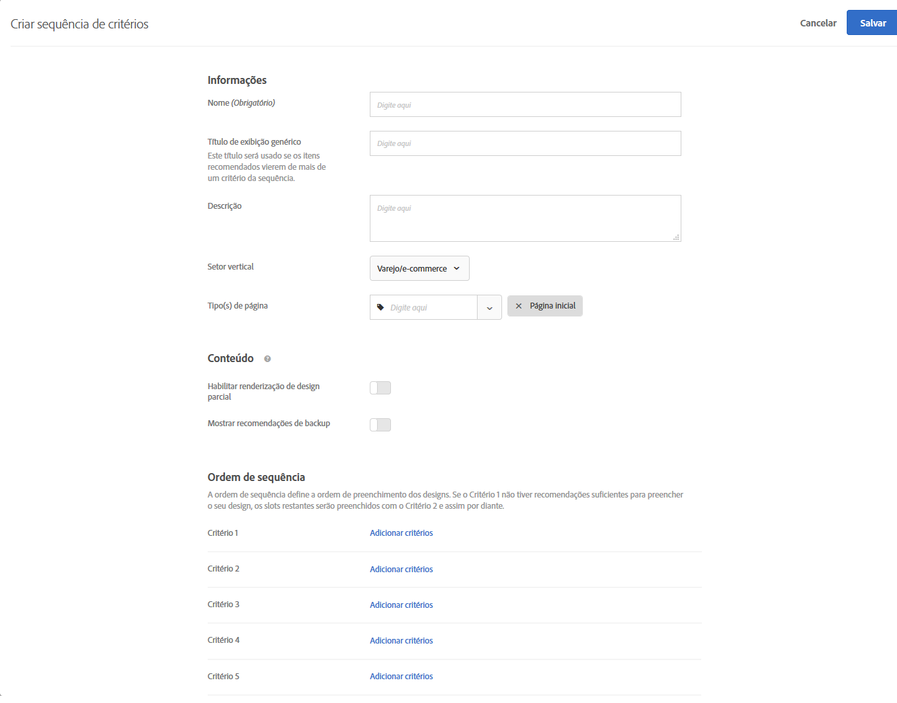

#  Criar sequência de critérios

Use sequências de até cinco critérios para exercer maior controle dos itens que aparecem em suas atividades do [!UICONTROL Recommendations. ] Você também pode limitar o número de itens retornados (às vezes chamados de &quot;controle de nível de slot&quot;).

>[!NOTE]
>
>As sequências de critérios não podem ser usadas com as [!UICONTROL atividades do Recommendations] criadas antes da versão de outubro de 2016 [!DNL Target Premium].

Para criar uma sequência de critérios, você deve primeiro criar o critério que deseja incluir na sequência. Consulte [Criar critérios](/help/c-recommendations/c-algorithms/create-new-algorithm.md) para obter mais informações.

Ao usar uma sequência de critérios, você pode fornecer recomendações direcionadas adicionais, em vez de usar recomendações de backup mais genéricas, quando um critério não retorna resultados o suficiente para preencher seu design. Normalmente, uma sequência de critérios continuará de direcionamento mais específico, que pode retornar menos resultados, para direcionamento mais geral, que geralmente retorna mais resultados.

Suas sequências de critérios podem variar dependendo do tipo de página, como mostrado nos seguintes exemplos:

| Tipo de página | Possível ordem de sequência |
| --- | --- |
| Página do produto | <ol><li>Baseado no item atual, da mesma marca</li><li>Baseado no item atual, de todas as marcas</li><li>Baseado na semelhança de conteúdo</li><li>Baseado nos mais vendidos</li><li>Baseado nos itens mais visualizados por todo site</li></ol> |
| Home page | <ol><li>Baseado na última compra do visitante </li><li>Baseado no item favorito do visitante</li><li>Baseado na categoria favorita do visitante</li><li>Baseado nos mais vendidos</li><li>Baseado nos mais visualizados por todo site</li></ol> |

## Criar uma sequência de critérios

Crie sequências de critérios na tela [!UICONTROL Criar Sequência de Critérios].

Existem vários meios de alcançar a tela [!UICONTROL Criar sequência de critérios]. Algumas opções de tela variam de acordo com o modo que você chegar na tela.

* Na tela de biblioteca **[!UICONTROL Recomendações]** > **[!UICONTROL Critérios]**, clique em **[!UICONTROL Criar critério]** > **[!UICONTROL Criar sequência de critérios]**. Critérios que você criar aqui ficam disponíveis automaticamente para todas atividades do [!UICONTROL Recommendations].
* Quando estiver criando uma atividade [!UICONTROL Recommendations], na tela Selecionar critérios, clique em **[!UICONTROL Criar novo]** > **[!UICONTROL Criar sequência de critérios]**. Você terá a opção de salvar sua nova sequência de critérios para uso com outras atividades do [!UICONTROL Recommendations].
* Quando estiver editando uma atividade [!UICONTROL Recommendations], clique em uma caixa [!UICONTROL Local do Recommendations] na sua página e selecione **[!UICONTROL Critérios de Alteração]**. Na tela [!UICONTROL Selecionar critério], clique em **[!UICONTROL Criar novo]** > **[!UICONTROL Criar sequência de critérios]**. Você terá a opção de salvar seu novo critério para uso com outras atividades do [!UICONTROL Recommendations].

As etapas a seguir pressupõem que você acesse a tela [!UICONTROL Criar sequência de critérios] usando o primeiro método: a tela da biblioteca **[!UICONTROL Recommendations]** > **[!UICONTROL Criteria]**.

1. Clique em **[!UICONTROL Recommendations]** > **[!UICONTROL Critérios]**.

1. Clique em **[!UICONTROL Criar Critérios]** > **[!UICONTROL Criar Sequência de Critérios]**.

   

1. Preencha as informações na seção [Informações básicas](/help/c-recommendations/c-algorithms/create-new-algorithm.md#info).

1. Na seção **[!UICONTROL Sequência de critérios]**, clique em **[!UICONTROL Adicionar critérios]**.

   A ordem de sequência define a ordem em que um design é preenchido. Se o Critério 1 não tiver recomendações suficientes para preencher seu design, os slots restantes serão preenchidos com o Critério 2 e assim por diante.

   

1. Na tela [!UICONTROL Selecionar critérios], selecione um critério e clique em **[!UICONTROL Adicionar]**.

   Você pode usar a caixa Pesquisar e os menus suspensos do filtro para localizar os critérios desejados.

   

1. (Opcional) Deslize **[!UICONTROL Limite o número de itens retornados]** para a posição &quot;ligado&quot; e especifique o número de itens (entre 1 e 50).

   

   Para ajudá-lo a entender o valor da opção [!UICONTROL Limitar o número de itens retornados] (às vezes chamada de &quot;controle de nível de slot&quot;), considere os seguintes casos de uso:

   * **Caso de uso 1**: Você deseja ter uma combinação de diferentes tipos de itens em uma única bandeja de recomendações. Por exemplo, você quer mostrar uma mistura de roupas (casacos) e tampas (camisas, camisas). Para isso, use uma Coleção para a atividade que inclua todos os tipos de produto potenciais que você deseja em qualquer slot do seu design. Em seguida, configure seus primeiros critérios com um filtro estático limitando os critérios para incluir apenas desgaste externo e configure seus segundo critérios com um filtro estático limitando os critérios para incluir somente os demais. Por fim, adicione ambos os critérios a uma sequência de critérios e limite o primeiro critério a 2 slots.

      A bandeja de recomendações pode ser parecida com esta no seu site:

      

   * **Caso de uso 2**: Você deseja uma combinação de itens alternativos e complementares. Configure um critério para usar um algoritmo exibido/exibido e use um filtro dinâmico que limite os itens recomendados à categoria do item atual. Configure o segundo critério para usar um algoritmo visualizado/comprado e usar um filtro dinâmico que inclua apenas itens recomendados que não correspondam à categoria do item atual. Por fim, adicione ambos os critérios a uma sequência e limite o primeiro critério a 2 slots.

1. Continue adicionando critérios adicionais à sua sequência. Você pode adicionar até cinco critérios em uma sequência.

1. Habilite [opções de Conteúdo de Backup](/help/c-recommendations/c-algorithms/create-new-algorithm.md#content).

1. Clique em **[!UICONTROL Salvar]**.

   A sequência de critérios irá aparecer na lista de critérios.

   Para obter mais informações sobre as opções de lógica de recomendação, consulte [Critérios](/help/c-recommendations/c-algorithms/algorithms.md).

## Vídeo de treinamento: criar critérios no Recommendations (12:33)  

Este vídeo contém as seguintes informações:

* Criar critérios
* Criar sequências de critérios
* Upload dos critérios personalizados

>[!VIDEO](https://video.tv.adobe.com/v/27694?quality=12)
