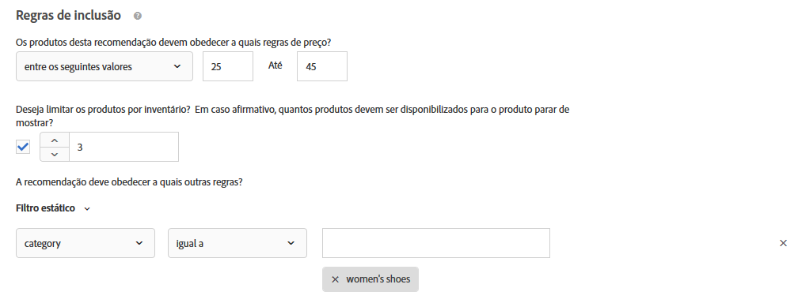

#  Carregar critérios personalizados{#upload-custom-criteria}

Faça upload de um CSV para personalizar suas recomendações.

## Acesse a tela Criar novo critério

Existem vários meios de alcançar a tela [!UICONTROL Criar novos critérios]. Algumas opções de tela variam de acordo com o modo que você chegar na tela.

* On the **[!UICONTROL Recommendations]** > **[!UICONTROL Criteria]** library screen, click **[!UICONTROL Create Criteria]** > **[!UICONTROL Create Criteria]**. Critérios que você criar aqui ficam disponíveis automaticamente para todas atividades do [!DNL Recommendations].
* Ao criar uma [!DNL Recommendations] atividade usando o [!UICONTROL Visual Experience Composer] (VEC), você será levado imediatamente para a tela [!UICONTROL Selecionar critérios] depois de selecionar um elemento na página e clicar em [!UICONTROL Substituir com o Recommendations], [!UICONTROL Inserir o Recommendations Antes]ou Inserir o Recommendations Depois. Você pode selecionar um critério disponível ou clicar em **[!UICONTROL Criar critérios]**. Se você criar um novo critério, terá a opção de salvar seus critérios para uso com outras [!DNL Recommendations] atividades. For more information, see [Create a Recommendations activity](/help/c-recommendations/t-create-recs-activity/create-recs-activity.md).
* Ao editar uma [!DNL Recommendations] atividade, clique em uma caixa de [!UICONTROL Localização do Recommendations] em sua página e selecione **[!UICONTROL Alterar critérios]**. On the [!UICONTROL Select Criteria] screen, click **[!UICONTROL Create Criteria]**. Você terá a opção de salvar seu novo critério para uso com outras atividades do [!DNL Recommendations].

As etapas a seguir pressupõem que você acesse a tela [!UICONTROL Criar novo critério] usando o primeiro método: a tela **[!UICONTROL Recommendations]** > **[!UICONTROL Criteria]** Library (Biblioteca de critérios).

1. Clique em **[!UICONTROL Recommendations]** > **[!UICONTROL Critérios]**.

1. Clique em **[!UICONTROL Criar critérios]** > **[!UICONTROL Carregar critérios]** personalizados.

1. Configure as informações nas seções a seguir.

## Informações básicas  {#info}

1. Digite um **[!UICONTROL Nome dos critérios]**.

   Este é o nome &quot;interno&quot; usado para descrever o critério. Por exemplo, você pode chamar seu critério de &quot;Produtos com margem mais alta&quot;, mas não quer que o título seja exibido publicamente. Veja a próxima etapa para definir o título aberto ao público.

   

1. Insira um **[!UICONTROL Título de exibição]** aberto ao público que irá aparecer na página para qualquer recomendação que use este critério.

   Por exemplo, você pode decidir exibir &quot;Pessoas que viram isto também viram aquilo&quot; ou &quot;Produtos parecidos&quot; quando usar este critério para exibir recomendações.

1. Digite uma breve **[!UICONTROL Descrição]** dos critérios.

   A descrição deve ajudá-lo a identificar os critérios e pode incluir informações sobre a finalidade dos critérios.

1. Selecione um **[!UICONTROL negócio vertical]**:

   * [!UICONTROL Varejo/Comércio eletrônico]
   * [!UICONTROL Geração de lead/B2B/Serviços financeiros]
   * [!UICONTROL Mídia/Publicação]

   Outras opções de critério irão mudar de acordo com o negócio vertical que você selecionar.

1. Selecione um **[!UICONTROL Tipo de página]**.

   Você pode selecionar vários tipos de página.

   Juntos, o negócio vertical e tipos de página são usados para categorizar seu critério salvo, tornando mais fácil o reuso de critérios para outras atividades do [!DNL Recommendations].

1. Selecione uma **[!UICONTROL Chave de recomendação]**.

   Para obter mais informações sobre como basear os critérios em uma chave, consulte [Basear a recomendação em uma chave de recomendação](/help/c-recommendations/c-algorithms/base-the-recommendation-on-a-recommendation-key.md).

1. Selecione a Lógica **[!UICONTROL de Recomendação]**.

   Para obter mais informações sobre as opções de lógica de recomendação, consulte [Critérios](../../c-recommendations/c-algorithms/algorithms.md).

   >[!NOTE]
   >
   >If you select **[!UICONTROL Items]**/ **[!UICONTROL Media with Similar Attributes]**, you will have the option to set [content similarity rules](#similarity).

## Conteúdo {#content}

Content rules determine what happens if the number of recommended items does not fill your [recommendations design](/help/c-recommendations/c-design-overview/design-overview.md). It is possible for [!DNL Recommendations] criteria to return fewer recommendations than your design calls for. Por exemplo, se seu design tiver slots para quatro itens, mas seus critérios fazem com que apenas dois itens sejam recomendados, você pode deixar os slots restantes vazios ou usar recomendações de backup para preencher os slots extras.

1. (Opcional) Deslize a opção Renderização **** parcial do design para a posição &quot;ligado&quot;.

   O maior número possível de slots será preenchido, mas o modelo de design pode incluir espaço em branco para os slots restantes. Se essa opção estiver desativada e não houver conteúdo suficiente para preencher todos os slots disponíveis, as recomendações não serão atendidas e o conteúdo padrão será exibido.

   Ative essa opção se desejar que as recomendações sejam servidas com slots em branco. Use as recomendações de backup se desejar que os slots de recomendação sejam preenchidos com conteúdo baseado em seus critérios com slots vazios preenchidos com conteúdo semelhante ou popular do site, conforme explicado na próxima etapa.

1. (Opcional) Deslize a opção **[!UICONTROL Mostrar Recommendations]** de backup para a posição &quot;ligado&quot;.

   Preencha todos os slots vazios restantes no design com uma seleção aleatória dos produtos mais visualizados de todo o site.

   O uso das recomendações de backup garante que o design da sua recomendação preencha todos os slots disponíveis. Suponha que você tenha um design de 4 x 1, conforme ilustrado abaixo:

   

   Suponha que seus critérios façam com que apenas dois itens sejam recomendados. Se você ativar a opção Renderização  parcial do design, os dois primeiros slots serão preenchidos, mas os dois restantes permanecerão vazios. No entanto, se você ativar a opção [!UICONTROL Mostrar Recommendations] Backup, os dois primeiros slots serão preenchidos com base nos critérios especificados e os dois slots restantes serão preenchidos com base nas recomendações de backup.

   A matriz a seguir mostra o resultado que você observará ao usar as opções [!UICONTROL Parcial de renderização] de design e [!UICONTROL Backup Recommendations] :

   | Renderização parcial de design | Recommendations de backup | Resultado |
   |--- |--- |--- |
   | Desativado | Desativado | Se forem retornadas menos recomendações do que o design solicita, o design das recomendações será substituído pelo conteúdo padrão, e nenhuma recomendação será exibida. |
   | Ativado | Desativado | O design é renderizado, mas pode incluir um espaço em branco se forem retornadas menos recomendações do que o design solicita. |
   | Ativado | Ativado | As recomendações de backup preencherão os &quot;slots&quot; de design disponíveis, renderizando totalmente o design. Se a aplicação de regras de inclusão às recomendações de backup limitar o número de recomendações de backup qualificadas ao ponto de não ser possível preencher o design, o design será parcialmente renderizado. Se os critérios não retornarem nenhuma recomendação e as regras de inclusão limitarem as recomendações de backup a zero, o design será substituído pelo conteúdo padrão. |
   | Desativado | Ativado | As recomendações de backup preencherão os &quot;slots&quot; de design disponíveis, renderizando totalmente o design. Se a aplicação de regras de inclusão às recomendações de backup limitar o número de recomendações de backup qualificadas ao ponto de não ser possível preencher o design, o design será substituído pelo conteúdo padrão, e nenhuma recomendação será exibida. |

   Para obter mais informações, consulte [Usar uma recomendação](/help/c-recommendations/c-algorithms/backup-recs.md)de backup.

1. (Condicional) Se você selecionou **[!UICONTROL Mostrar Recommendations]** de backup na etapa anterior, poderá ativar **[!UICONTROL Aplicar regras de inclusão às recomendações]** de backup.

   As regras de inclusão determinam quais itens são incluídos em suas recomendações. As opções disponíveis dependem do seu negócio vertical.

   Para obter mais detalhes, consulte  [Especifique as regras](#inclusion) de inclusão abaixo.

1. (Opcional) Deslize os itens **** recomendados anteriormente comprados para alternar para a posição &quot;ligado&quot;.

   Esta configuração é baseada no `productPurchasedId`. O comportamento padrão é não recomendar itens comprados anteriormente. Na maioria dos casos, você não deseja promover itens que um cliente comprou recentemente. Ela é útil se você vende itens que pessoas geralmente compram apenas uma vez, como caiaques. Se você vender itens que as pessoas voltam a comprar novamente repetidamente, como shampoo ou outros itens pessoais, você deve ativar essa opção.

## Regras de inclusão {#inclusion}

Várias opções ajudam a limitar os itens que são exibidos em suas recomendações. Você pode usar regras de inclusão ao criar critérios ou promoções.

Regras de inclusão são opcionais; no entanto, configurar esses detalhes oferece mais controle sobre os itens que aparecem em suas recomendações. Cada detalhe que você configura limita ainda mais os critérios de exibição.

Por exemplo, você pode escolher exibir apenas sapatos femininos que tenham um inventário de mais de 50 e o preço entre $ 25 e $ 45. Também é possível pesar cada atributo para que os itens mais importantes para sua empresa tenham mais chances de aparecer.

Como outro exemplo, você pode escolher exibir vagas de emprego para visitantes que acessem seu site somente de certas cidades e que tenham os graus acadêmicos necessários.

Opções de regras de inclusão variam pelo negócio vertical. Por padrão, regras de inclusão são aplicadas em recomendações de backup.

>[!IMPORTANT]
>
>Você deve usar regras de inclusão com cuidado. Ela é útil se, por exemplo, sua organização tem regras que exijam que uma marca não seja recomendada se outra está sendo mostrada. No entanto, há um custo de oportunidade para este recurso. Você possivelmente perderia uma porcentagem de elevação ao restringir a exibição de alguns itens, quando, normalmente, seriam exibidos pelos critérios de atividade.

Regras de inclusão são unidas por um E. Todas as regras devem ser cumpridas para incluir um item em uma recomendação.

Para criar uma regra de inclusão simples, como mencionado anteriormente, para exibir apenas sapatos femininos que tenham um inventário de mais de 50 e o preço entre $ 25 e $ 45, siga os seguintes passos:

1. Defina um intervalo de preço para os produtos que deseja recomendar.
1. Defina o inventário mínimo para os produtos que deseja recomendar.
1. Configure a recomendação para que exiba itens que satisfaçam os critérios.

   

   Você pode especificar que os itens sejam incluídos apenas quando um dos atributos na lista atender ou não corresponder a uma ou mais condições especificadas.

   Os avaliadores disponíveis dependem do valor que você escolheu na primeira lista suspensa. Você pode listar vários itens. Esses itens são avaliados com OR.

   Regras múltiplas são combinadas com um AND.

   >[!NOTE]
   >
   >Essa opção limita os itens exibidos na recomendação. Isso não afeta em quais páginas a recomendação é exibida. Para limitar onde a recomendação é exibida, selecione as páginas no compositor de experiência.

For more information, see [Use dynamic and static inclusion rules](/help/c-recommendations/c-algorithms/use-dynamic-and-static-inclusion-rules.md).

## Carregar CSV

1. Selecione o **[!UICONTROL local]** do seu arquivo CSV.

   

   O arquivo CSV deve estar formatado corretamente para ser carregado com sucesso. Clique em **[!UICONTROL Baixar o modelo CSV]** para obter um arquivo CSV formatado corretamente.

   Você tem duas opções de local:

   * **FTP:** para carregar seu arquivo CSV de um servidor FTP, selecione **[!UICONTROL FTP]** e insira as informações necessárias. Você tem a opção de usar SSL, que usa o protocolo FTPS para transferir seu arquivo CSV em segurança.
   * **URL:** Para carregar o arquivo CSV de um URL, selecione o **[!UICONTROL URL]** e insira o URL do feed.

1. Clique em **[!UICONTROL Salvar]**.

   >[!NOTE]
   >
   >As entidades com critérios personalizados (linhas) podem conter até 1.000 itens recomendados (colunas).

As atualizações de critérios personalizados são &quot;cumulativas&quot; por padrão. Os novos pares de valor-chave especificados no arquivo de upload CSV substituem os pares existentes. Os pares de valores chave existentes que não têm teclas especificadas no upload de CSV ainda estarão disponíveis para entrega e expirarão em 31 dias a partir do momento em que forem carregados pela última vez, como parte do arquivo CSV.

Entre em contato com o Atendimento ao Cliente para habilitar a configuração para descartar os resultados existentes que não estão inclusos upload CSV. Se essa configuração estiver habilitada, somente as chaves presentes no arquivo de feed CSV personalizado estarão disponíveis para entrega. Essa configuração se aplica a todos os critérios personalizados.

Os feeds de critérios personalizados atualizam uma vez a cada 24 horas.

você pode ver os status de carregamento e sincronização do seu critério personalizado na parte de baixo de cada cartão de critério na página Recommendations > Critérios. Você também pode ver o status na caixa de diálogo Editar ao editar critérios personalizados.

O fluxo para um carregamento sem erros deve ser Agendado > Baixando arquivo de feed > Importando > Sucesso.

The following are possible error messages you might receive if [!DNL Target] encounters a problem with the upload:

| Mensagem de erro | Detalhes |
|--- |--- |
| Erro desconhecido | Indica um erro interno técnico. |
| Erro de análise | Provavelmente há um problema com o formato do arquivo de feed. Corrija o formato do arquivo e salve o algoritmo novamente, o que irá reiniciar o processo de download do arquivo. |
| Servidor não encontrado | Forneça um IP ou nome de host que seja visível na internet. |
| Erro de credenciais | Forneça um usuário e senha válidos para uma conta ativa no servidor. |
| Diretório não encontrado | Forneça um diretório que exista no servidor. |
| Arquivo não encontrado | Forneça o nome de um arquivo que exista no servidor dentro do diretório indicado. |

## Vídeo de treinamento: criar critérios no Recommendations (12:33) 

Este vídeo contém as seguintes informações (os detalhes sobre como fazer upload de critérios personalizados começam às 11:43):

* Criar critérios
* Criar sequências de critérios
* Upload dos critérios personalizados

>[!VIDEO](https://video.tv.adobe.com/v/27694?quality=12)