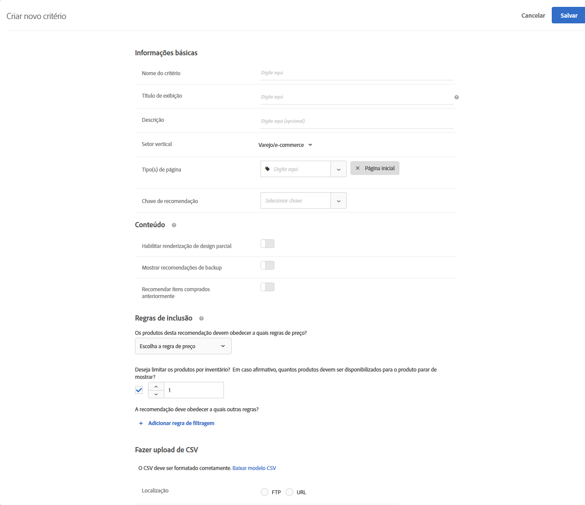

#  Carregar critérios personalizados{#upload-custom-criteria}

Faça upload de um CSV para personalizar suas recomendações.

Existem vários meios de alcançar a tela [!UICONTROL Criar novos critérios]. Algumas opções de tela variam de acordo com o modo que você chegar na tela.

* Quando você criar uma atividade de [!UICONTROL Recommendations], clique em **[!UICONTROL Criar novo]** na tela [!UICONTROL Selecionar critério]. Você terá a opção de salvar seu novo critério para uso com outras atividades do [!UICONTROL Recommendations].
* Quando você editar uma atividade de [!UICONTROL Recommendations], clique em uma caixa de [!UICONTROL Localização das Recommendations] na sua página e selecione **[!UICONTROL Alterar critério]**. Na tela [!UICONTROL Selecionar critério], clique em **[!UICONTROL Criar novo]**. Você terá a opção de salvar seu novo critério para uso com outras atividades do [!UICONTROL Recommendations].
* Na tela da biblioteca **[!UICONTROL Recomendações]** > **[!UICONTROL Critério]**, clique em **[!UICONTROL Criar critério]**. Critérios que você criar aqui ficam disponíveis automaticamente para todas atividades do [!UICONTROL Recommendations].

1. Clique em **[!UICONTROL Criar critério]**.

   

1. Selecione **[!UICONTROL Carregar critérios personalizados]**.

   

1. Digite um **[!UICONTROL Nome dos critérios]**.

   Este é o nome &quot;interno&quot; usado para descrever o critério.  Por exemplo, você pode chamar seu critério de &quot;Produtos com margem mais alta&quot;, mas não quer que o título seja exibido publicamente. Veja a próxima etapa para definir o título aberto ao público.
1. Insira um **[!UICONTROL Título de exibição]** aberto ao público que irá aparecer na página para qualquer recomendação que use este critério.

   Por exemplo, você pode decidir exibir &quot;Pessoas que viram isto também viram aquilo&quot; ou &quot;Produtos parecidos&quot; quando usar este critério para exibir recomendações.
1. Digite uma breve **[!UICONTROL Descrição]** dos critérios.

   A descrição deve ajudar a identificar o critério e pode incluir informações sobre o propósito do critério.
1. Selecione um **[!UICONTROL negócio vertical]**.

   Outras opções de critério podem mudar dependendo do negócio vertical que você selecionar.

1. Selecione um **[!UICONTROL Tipo de página]**.

   Você pode selecionar vários tipos de página.

   Juntos, o negócio vertical e tipos de página são usados para categorizar seu critério salvo, tornando mais fácil o reuso de critérios para outras atividades do [!UICONTROL Recommendations].
1. Selecione uma **[!UICONTROL Chave de recomendação]**.

   Para obter mais informações sobre como basear os critérios em uma chave, consulte [Baseie a recomendação em uma Chave de recomendação](../../c-recommendations/c-algorithms/create-new-algorithm.md#task_2B0ED54AFBF64C56916B6E1F4DC0DC3B).
1. Defina suas **[!UICONTROL regras de conteúdo]**.

   Regras de conteúdo determinam o que acontece se o número de itens recomendados não preencher seu design. Por exemplo, se o seu design tem espaço para cinco itens mas seus critérios fazem com que apenas três itens sejam recomendados, você pode deixar os espaços restantes vazios ou pode usar recomendações de backup para preencher o espaço adicional. Selecione as opções apropriadas. Consulte [Configurações de conteúdo](../../c-recommendations/c-algorithms/create-new-algorithm.md#concept_BC16005C7A1E4F1A87E33D16221F4A96).
1. Defina suas **[!UICONTROL Regras de inclusão]**.

   Regras de inclusão ajudam a limitar os itens que são exibidos em suas recomendações. Consulte [Regras de inclusão](../../c-recommendations/c-algorithms/create-new-algorithm.md#task_28DB20F968B1451481D8E51BAF947079). 1. Selecione o **[!UICONTROL local]** do seu arquivo CSV.

   O arquivo CSV deve estar formatado corretamente para ser carregado com sucesso. Clique em **[!UICONTROL Baixar o modelo CSV]** para obter um arquivo CSV formatado corretamente.

   Você tem duas opções de local:

   * **FTP:** para carregar seu arquivo CSV de um servidor FTP, selecione **[!UICONTROL FTP]** e insira as informações necessárias. Você tem a opção de usar SSL, que usa o protocolo FTPS para transferir seu arquivo CSV em segurança.
   * **URL:** para carregar seu arquivo CSV de um URL, selecione **[!UICONTROL URL]** e insira um URL de feed.

1. Clique em **[!UICONTROL Salvar]**.

   >[!NOTE]
   >
   >As entidades com critérios personalizados (linhas) podem conter até 1.000 itens recomendados (colunas).

As atualizações de critérios personalizados são &quot;cumulativas&quot; por padrão. Os novos pares de valor-chave especificados no arquivo de upload CSV substituem os pares existentes. Os pares de valores chave existentes que não têm teclas especificadas no upload de CSV ainda estarão disponíveis para entrega e expirarão em 31 dias a partir do momento em que forem carregados pela última vez, como parte do arquivo CSV.

Entre em contato com o Atendimento ao Cliente para habilitar a configuração para descartar os resultados existentes que não estão inclusos upload CSV. Se essa configuração estiver habilitada, somente as chaves presentes no arquivo de feed CSV personalizado estarão disponíveis para entrega. Essa configuração se aplica a todos os critérios personalizados.

Os feeds de critérios personalizados atualizam uma vez a cada 24 horas.

você pode ver os status de carregamento e sincronização do seu critério personalizado na parte de baixo de cada cartão de critério na página Recommendations > Critérios. Você também pode ver o status na caixa de diálogo Editar ao editar critérios personalizados.

O fluxo para um carregamento sem erros deve ser Agendado > Baixando arquivo de feed > Importando > Sucesso.

Você pode receber as mensagens de erro a seguir se o Target encontrar um problema com o carregamento:

| Mensagem de erro | Detalhes |
|--- |--- |
| Erro desconhecido | Indica um erro interno técnico. |
| Erro de análise | Provavelmente há um problema com o formato do arquivo de feed. Corrija o formato do arquivo e salve o algoritmo novamente, o que irá reiniciar o processo de download do arquivo. |
| Servidor não encontrado | Forneça um IP ou nome de host que seja visível na internet. |
| Erro de credenciais | Forneça um usuário e senha válidos para uma conta ativa no servidor. |
| Diretório não encontrado | Forneça um diretório que exista no servidor. |
| Arquivo não encontrado | Forneça o nome de um arquivo que exista no servidor dentro do diretório indicado. |

## Vídeo de treinamento: criar critérios no Recommendations (12:33) 

Este vídeo contém as seguintes informações (os detalhes sobre como fazer upload de critérios personalizados começam às 11:43):

* Criar critérios
* Criar sequências de critérios
* Upload dos critérios personalizados

>[!VIDEO](https://video.tv.adobe.com/v/27694?quality=12)