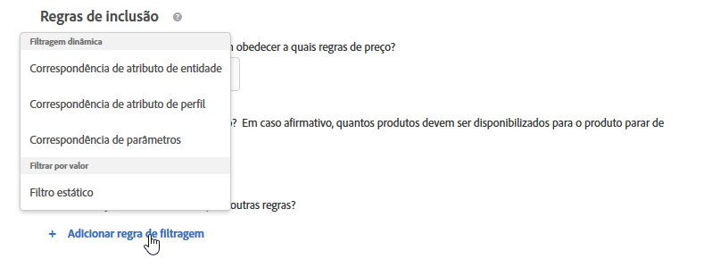
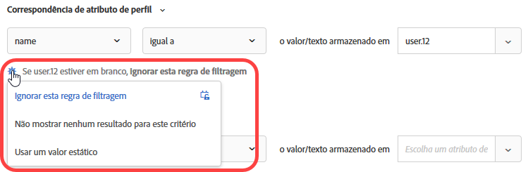
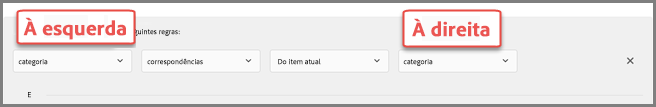

#  Uso das regras de inclusão estática e dinâmica

Informações sobre como criar regras de inclusão para critérios e promoções em [!DNL Adobe Target] e adicionar regras de filtragem dinâmica ou estática para obter melhores resultados para suas recomendações.

O processo para criar e usar regras de inclusão para critérios e promoções é semelhante, assim como os casos de uso e exemplos. Os critérios e promoções e o uso de regras de inclusão são abordados nesta seção.

## Adicionar regras de filtragem aos critérios {#section_CD0D74B8D3BE4A75A78C36CF24A8C57F}

Ao [criar um critério](/help/c-recommendations/c-algorithms/create-new-algorithm.md#task_8A9CB465F28D44899F69F38AD27352FE), clique em **[!UICONTROL Adicionar regra de filtragem]** em **[!UICONTROL Regras de inclusão]**.

As opções disponíveis variam, dependendo do vertical do setor selecionado e da chave de recomendação.

## Adicionar regras de filtragem às promoções   {#section_D59AFB62E2EE423086281CF5D18B1076}

Ao [criar uma promoção](/help/c-recommendations/t-create-recs-activity/adding-promotions.md#task_CC5BD28C364742218C1ACAF0D45E0E14), selecione **[!UICONTROL Promover por atributo]** e clique em **[!UICONTROL Adicionar regra de filtragem]**.

## Tipos de filtro {#section_0125F1ED10A84C0EB45325122460EBCD}

As seções a seguir listam os tipos de opções de filtragem para [!UICONTROL Filtragem Dinâmica] e [!UICONTROL Filtrar por Valor] para ambos os critérios e promoções:

### Filtragem dinâmica

As regras de inclusão dinâmica são mais eficientes do que as regras de inclusão estática e proporcionam melhores resultados e envolvimento. Considere o seguinte:

* As regras de inclusão dinâmica fornecem recomendações ao corresponder um atributo no parâmetro do perfil de um usuário ou em uma chamada de mbox.

   Por exemplo, você pode criar uma recomendação de &quot;Critérios mais populares&quot;. Do conjunto de recomendações retornadas, você pode filtrar quaisquer recomendações (em tempo real) contra um atributo passado quando o usuário acessa uma página onde as recomendações são exibidas.

* Use regras estáticas para limitar quais itens são incluídos na recomendação (em vez de usar coleções).

* Você pode criar quantas regras de inclusão dinâmica forem necessárias. As regras de inclusão são unidas por um operador E. Todas as regras devem ser cumpridas para incluir um item em uma recomendação.

As seguintes opções estão disponíveis para filtragem dinâmica:

| Opção de filtragem dinâmica | Detalhes |
| --- | --- |
| [Correspondência de atributos de entidade](/help/c-recommendations/c-algorithms/entity-attribute-matching.md) | Filtre dinamicamente comparando um conjunto de possíveis itens de recomendações a um item específico com o qual os usuários interagiram. Use a  [!UICONTROL Correspondência de atributos de ] entidade quando desejar mostrar recomendações que provavelmente serão atraídas ao visitante, como a marca favorita do visitante. |
| [Correspondência de atributos de perfil](/help/c-recommendations/c-algorithms/profile-attribute-matching.md) | Filtre dinamicamente comparando os itens (entidades) com um valor no perfil do usuário. Use a  [!UICONTROL Correspondência de atributos ] de perfil quando quiser mostrar recomendações que correspondem a um valor armazenado no perfil do visitante, como tamanho ou marca favorita. |
| [Correspondência de parâmetros](/help/c-recommendations/c-algorithms/parameter-matching.md) | Filtre dinamicamente comparando itens (entidades) com um valor na solicitação (API ou mbox). Use a  [!UICONTROL Correspondência ] de parâmetros para recomendar o conteúdo que corresponda aos parâmetros da página ou aos parâmetros do visitante, como dimensões de dispositivo ou localização geográfica. |

### Filtrar por valor

A seguinte opção está disponível para filtragem por valor:

| Opção Filtrar por valor | Detalhes |
| --- | --- |
| [Filtro estático](/help/c-recommendations/c-algorithms/static-value.md) | Insira manualmente um ou mais valores estáticos para filtrar. |

## Operadores disponíveis {#operators}

Os critérios e as promoções dinâmicas são muito mais eficientes do que os critérios e promoções estáticas e geram melhores resultados e envolvimento.

Os exemplos a seguir fornecem ideias gerais sobre como você pode usar promoções e exclusões dinâmicas em seus esforços de marketing:

| Operador | Exemplos |
| --- | --- |
| Igual a (Disponível com Correspondência de atributos de entidade, Correspondência de atributos de perfil, Correspondência de parâmetros e Filtro estático.) | Usando o operador &quot;equals&quot; em promoções dinâmicas, quando um visitante visualizar um item no seu site (como um produto, artigo ou filme), será possível promover outros itens de:<ul><li>A mesma marca</li><li>A mesma categoria</li><li>A mesma categoria E da marca própria</li><li>A mesma loja</li></ul> |
| Não é igual a (Disponível com Correspondência de atributos de entidade, Correspondência de atributos de perfil, Correspondência de parâmetros e Filtro estático.) | Usando o operador &quot;não é igual&quot; em promoções dinâmicas, quando um visitante visualizar um item no seu site (como um produto, artigo ou filme), será possível promover outros itens de:<ul><li>Uma série de TV diferente</li><li>Um gênero diferente</li><li>Uma série de produtos diferente</li><li>Uma ID de estilo diferente</li></ul> |
| Não Contém subsequência de caracteres (Disponível com Correspondência de atributos de entidade, Correspondência de atributos de perfil, Correspondência de parâmetros e Filtro estático.) | Usando o operador &quot;não contém substring&quot;, quando um visitante visualizar um item no seu site (como um produto), será possível promover outros itens que:<ul><li>O título não contém uma palavra de juramento</li></ul> |
| Começa com (Disponível com Correspondência de atributos de entidade, Correspondência de atributos de perfil, Correspondência de parâmetros e Filtro estático.) | Usando o operador &quot;inicia com&quot;, quando um visitante visualizar um item no seu site (como um produto), será possível promover outros itens que:<ul><li>O nome do produto começa com iPhone</li></ul> |
| Termina com (Disponível com Correspondência de atributos de entidade, Correspondência de atributos de perfil, Correspondência de parâmetros e Filtro estático.) | Usando o operador &quot;termina com&quot;, quando um visitante visualizar um item no seu site (como um produto), será possível promover outros itens que:<ul><li>O conteúdo termina com EN, que indica inglês</li></ul> |
| É maior que ou igual a (Disponível com Correspondência de atributos de entidade, Correspondência de atributos de perfil, Correspondência de parâmetros e Filtro estático.) | Usando o operador &quot;é maior ou igual a&quot;, quando um visitante visualizar um item no seu site (como um produto), será possível promover outros itens que:<ul><li>Custo igual ou mais caro</li></ul> |
| Is Less Than or Equal To (Disponível com Correspondência de atributos de entidade, Correspondência de atributos de perfil, Correspondência de parâmetros e Filtro estático.) | Usando o operador &quot;é menor que ou igual a&quot;, quando um visitante visualizar um item no seu site (como um produto), será possível promover outros itens que:<ul><li>Custo igual ou menor</li><li>Excluir itens menos caros</li></ul> |
| Está entre (Disponível com Correspondência de atributos de entidade, Correspondência de atributos de perfil e Correspondência de parâmetros.) | Usando o operador &quot;is between&quot; nas promoções dinâmicas, quando um visitante visualizar um item no seu site (como um produto, artigo ou filme), será possível promover outros itens que sejam:<ul><li>Mais caro</li><li>Menos caro</li><li>Custo mais ou menos 30%</li><li>Episódios mais tarde na mesma estação</li><li>Livros anteriores em uma série</li></ul> |
| Está contida em List (Disponível com Correspondência de atributos de perfil e Correspondência de parâmetros.) | Usando o operador &quot;is contained in list&quot; na correspondência de atributos de perfil, quando um visitante visualizar um item no seu site (como um produto, artigo ou filme), será possível promover outros itens que sejam:<ul><li>Disponível na geografia do visitante</li></ul>**Exemplo**: Você deseja recomendar somente itens que estão disponíveis na área geográfica de um visitante. Sua regra de filtro pode ter a seguinte aparência:  `availableGeographies list contains an item in user.currentGeography` **Observação**: Ao usar esse operador, uma lista é esperada no  [lado ](#caveats) direito da regra. |
| Não está contido em List (Disponível com Correspondência de atributos de perfil e Correspondência de parâmetros.) | Usando o operador &quot;não está contido na lista&quot; na correspondência de atributos de perfil, quando um visitante visualizar um item no seu site (como um produto, artigo ou filme), será possível excluir outros itens que sejam:<ul><li>Na lista dos últimos dez itens que o visitante visualizou</li></ul></ul>**Exemplo**: Você não deseja promover itens que o visitante visualizou recentemente e nos quais não mostrou interesse. Sua regra de filtragem pode ter a seguinte aparência:  `id is not contained in list user.lastViewedItems` **Observação**: Ao usar esse operador, uma lista é esperada no  [lado ](#caveats) direito da regra. |
| Lista Contém um item em (Disponível com Correspondência de atributos de entidade, Correspondência de atributos de perfil e Correspondência de parâmetros.) | Usando o operador &quot;list contains an item in&quot; na correspondência de atributos de perfil, quando um visitante visualizar um item no seu site (como um evento esportivo ou um concerto), será possível promover outros itens que sejam:<ul><li>Associado a uma das equipes favoritas do visitante</li></ul>**Exemplo**: Você deseja recomendar jogos associados a uma das equipes favoritas do visitante. Sua regra de filtragem pode ter a seguinte aparência:  ` teamsPlaying list contains an item in user.favoriteTeams` **Observação**: Ao usar esse operador, uma lista é esperada em  [ambos os ](#caveats) lados da regra. |
| A lista não contém um item em (Disponível com Correspondência de atributos de entidade, Correspondência de atributos de perfil e Correspondência de parâmetros). | Usando o operador &quot;list does not contains an item in&quot; na correspondência de atributos de parâmetro, quando um visitante visualizar um item no seu site (como um produto, artigo ou filme), você poderá excluir outros itens que sejam:<ul><li>Contido numa lista de tipos proibidos</li></ul>**Exemplo**: Você deseja excluir itens que estão disponíveis para visitantes adultos, como cigarro e álcool. Sua regra de filtragem pode ter a seguinte aparência:  `itemType is not contained in list mbox.prohibitedTypes` **Observação**: Ao usar esse operador, uma lista é esperada em  [ambos os ](#caveats) lados da regra. |
| A Lista Contém Todos os Itens em (Disponível com Correspondência de Atributos de Entidade, Correspondência de Atributos de Perfil e Correspondência de Parâmetros.) | Usando o operador &quot;lista contém todos os itens em&quot; na correspondência de atributos de perfil, quando um visitante visualizar um item no seu site (como uma publicação de trabalho ou receita), você poderá promover outros itens que:<ul><li>Incluir um conjunto de habilidades</li><li>Incluir um conjunto de ingredientes necessários</li></ul>**Exemplo 1**: Suponha que um visitante tenha um conjunto de habilidades (Java, C++ e HTML). Os itens no catálogo são trabalhos com as habilidades necessárias (Java e HTML). Você deseja garantir que o perfil do visitante contenha todas as habilidades necessárias antes de recomendar a tarefa ao visitante. Sua regra de filtragem pode ter a seguinte aparência:  `profile.jobSeekerSkills contains all items in entity.requiredSkills` **Exemplo 2**: Suponha que um usuário tenha uma lista de ingredientes para pavor. A receita tem uma lista de ingredientes necessários. Você deseja garantir que o perfil do visitante contenha todos os ingredientes necessários antes de recomendar a receita ao visitante. Sua regra de filtragem pode ter a seguinte aparência:  `profile.ingredientsInPantry contains all items in recipe.ingredientsRequired` **Observação**: Ao usar esse operador, uma lista é esperada em  [ambos os ](#caveats) lados da regra. |
| A lista não contém todos os itens em (Disponível com Correspondência de atributos de entidade, Correspondência de atributos de perfil e Correspondência de parâmetros). | Usando o operador &quot;lista não contém todos os itens em&quot; na correspondência de atributos de entidade, quando um visitante visualizar um item no seu site (como evento esportivo ou concerto), será possível promover outros itens que:<ul><li>Não incluir um conjunto de equipes</li></ul>**Exemplo**: Suponha que um evento esportivo inclua duas equipes: Houston Astros e Milwaukee Brewer. O perfil do visitante indica que ele não deseja visualizar os jogos para essas equipes. Certifique-se de não recomendar um jogo se essas equipes estiverem jogando. Sua regra de filtragem pode ter a seguinte aparência:  `profile.leastfavoriteTeams does not contain all items in entity.teamsPlaying` **Observação**: Ao usar esse operador, uma lista é esperada em  [ambos os ](#caveats) lados da regra. |

## Lidar com valores em branco ao filtrar por Correspondência de atributos de entidade, Correspondência de atributos de perfil e Correspondência de parâmetros {#section_7D30E04116DB47BEA6FF840A3424A4C8}

Você pode escolher várias opções para lidar com valores em branco ao filtrar por [!UICONTROL Correspondência de atributos de entidade], [!UICONTROL Correspondência de atributos de perfil] e [!UICONTROL Correspondência de parâmetros] para critérios e promoções de saída.

Anteriormente, nenhum resultado era retornado se um valor estivesse em branco. A lista suspensa &quot;se *x* estiver em branco&quot; permite escolher a ação apropriada a ser executada se o critério tiver valores em branco, conforme mostrado na ilustração a seguir:

Para selecionar a ação desejada, passe o mouse sobre o ícone de engrenagem (), em seguida, escolha a ação desejada:

| Ação | Disponível para | Detalhes |
|--- |--- |--- |
| [!UICONTROL Ignorar esta regra de filtragem] | [!UICONTROL Correspondência de atributos de perfil ] e correspondência  [!UICONTROL de parâmetros] | Esta ação é o padrão para [!UICONTROL Correspondência de atributos de perfil] e [!UICONTROL Correspondência de parâmetros]. Esta opção especifica que a regra será ignorada. Por exemplo, se houver três regras de filtragem e a terceira regra não passar nenhum valor, em vez de não retornar nenhum resultado, você poderá simplesmente ignorar a terceira regra com os valores em branco. |
| [!UICONTROL Não mostrar nenhum resultado para este critério]  (somente Critérios) | [!UICONTROL Correspondência de atributos de entidade], Correspondência de atributos  [!UICONTROL de perfil] e Correspondência de  [!UICONTROL parâmetros] | Esta ação é o padrão para [!UICONTROL Correspondência de atributos de entidade]. Esta ação é a forma como os valores vazios são  [!DNL Target] tratados antes da adição desta opção: nenhum resultado é mostrado para este critério. |
| [!UICONTROL Não promover nenhum item  (somente Promoções)] | [!UICONTROL Correspondência de atributos de entidade], Correspondência de atributos  [!UICONTROL de perfil] e Correspondência de  [!UICONTROL parâmetros] | Esta ação é o padrão para [!UICONTROL Correspondência de atributos de entidade]. Esta ação é a forma como os valores vazios são  [!DNL Target] tratados antes da adição desta opção: nenhum resultado é mostrado para este critério. |
| [!UICONTROL Usar um valor estático] | [!UICONTROL Correspondência de atributos de entidade], Correspondência de atributos  [!UICONTROL de perfil] e Correspondência de  [!UICONTROL parâmetros] | Se um valor estiver em branco, você poderá optar por usar um valor estático. |

## Avisos {#caveats}

>[!IMPORTANT]
>
>Atributos de tipo de dados diferentes podem não ser compatíveis em critérios ou promoções dinâmicas durante o tempo de execução com os operadores “é igual a” e “não é igual a”. Use os valores [!UICONTROL Value], [!UICONTROL Margin], [!UICONTROL Inventory] e [!UICONTROL Environment] de forma inteligente no lado direito se o lado esquerdo tiver atributos predefinidos ou atributos personalizados.

A tabela a seguir mostra regras em vigor e regras que podem não ser compatíveis durante o tempo de execução:

| Regras compatíveis | Regras potencialmente incompatíveis |
|--- |--- |
| valor - está entre - 90% e 110% do item atual - salesValue | salesValue - está entre - 90% e 110% do item atual - valor |
| valor - está entre - 90% e 110% do item atual - valor | clearancePrice - está entre - 90% e 110% do item atual - margem |
| margem - está entre - 90% e 110% do item atual - margem | storeInventory - é igual a - item atual - inventário |
| inventário - igual a - item atual - inventário |  |
