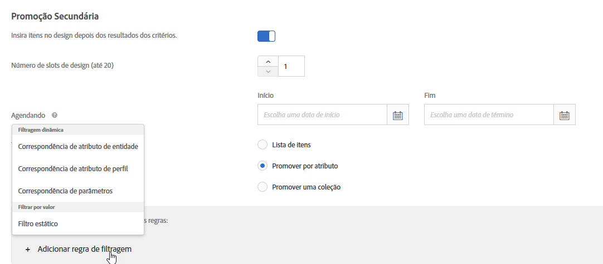
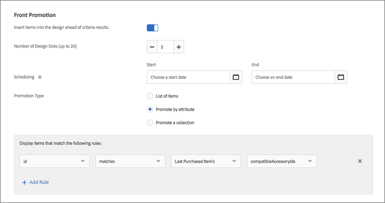

#  Uso das regras de inclusão estática e dinâmica{#use-dynamic-and-static-inclusion-rules}

Informações sobre como criar regras de inclusão para critérios e promoções e adicionar regras de filtragem dinâmica ou estática adicionais para alcançar melhores resultados.

O processo para criar e usar regras de inclusão para critérios e promoções é semelhante, assim como os casos de uso e exemplos. Os critérios e as promoções e o uso de regras de inclusão são abordados neste tópico.

## Adicionar regras de filtragem aos critérios {#section_CD0D74B8D3BE4A75A78C36CF24A8C57F}

Ao [criar um critério](../../c-recommendations/c-algorithms/create-new-algorithm.md#task_8A9CB465F28D44899F69F38AD27352FE), clique em **[!UICONTROL Adicionar regra de filtragem]** em **[!UICONTROL Regras de inclusão]**.


As opções disponíveis variam, dependendo do vertical do setor selecionado e da chave de recomendação.

## Adicionar regras de filtragem às promoções {#section_D59AFB62E2EE423086281CF5D18B1076}

Ao [criar uma promoção](../../c-recommendations/t-create-recs-activity/adding-promotions.md#task_CC5BD28C364742218C1ACAF0D45E0E14), selecione **[!UICONTROL Promover por atributo]** e clique em **[!UICONTROL Adicionar regra de filtragem]**.



## Tipos de filtro {#section_0125F1ED10A84C0EB45325122460EBCD}

A tabela a seguir lista os tipos de opções de filtragem para os critérios e as promoções:

| Tipo | Opção | Operadores disponíveis |
|--- |--- |--- |
| **Filtragem dinâmica** | **Correspondência de atributos de entidade:** filtre dinamicamente comparando um conjunto de possíveis itens de recomendações a um item específico com o qual os usuários interagiram.<br>Por exemplo, recomende somente itens que correspondam à marca do item atual. | é igual a<br>não é igual a<br>está entre<br>contém<br>não contém<br>começa com<br>termina com<br>valor está presente<br>valor não está presente<br>é maior que ou igual a<br>é menor que ou igual a |
|  | **Correspondência de atributos de perfil:** filtre dinamicamente comparando os itens (entidades) com um valor no perfil do usuário.<br>Por exemplo, recomende somente itens que correspondam à marca favorita do visitante. | é igual a<br> não é igual a<br>contém<br>não contém<br>começa com<br>termina com<br>é maior que ou igual a<br>é menor que ou igual a<br>está entre |
|  | **Correspondência de parâmetros:** filtre dinamicamente comparando itens (entidades) com um valor na solicitação (API ou mbox).<br>Por exemplo, recomende somente o conteúdo que corresponda ao parâmetro de página do &quot;setor&quot;.<br>**Importante:** se a atividade foi criada antes de 31 de outubro de 2016, ocorrerá falha na sua entrega se o filtro &quot;Correspondência de parâmetros&quot; for usado. Para resolver este problema:<ul><li>Crie uma nova atividade e adicione nela seus critérios.</li><li>Use um critério que não contenha o filtro &quot;Correspondência de parâmetros&quot;.</li><li>Remova o filtro &quot;Correspondência de parâmetros&quot; de seus critérios.</li></ul> | igual a<br>não é igual a<br>contém<br>não contém<br>começa com<br>termina com<br>é maior que ou igual a<br>é menor que ou igual a<br>está entre |
| **Filtrar por valor** | **Filtro estático:** insira manualmente um ou mais valores estáticos para filtrar.<br>Por exemplo, apenas recomende um conteúdo com uma classificação MPAA de &quot;G&quot; ou &quot;PG&quot;. | é igual a<br>não é igual a<br>contém<br>não contém<br>começa com<br>termina com<br>valor está presente<br>valor não está presente<br>é maior que ou igual a<br>é menor que ou igual a |

>[!NOTE]
>
>Se você estiver familiarizado com a configuração das regras de inclusão antes do Target versão 17.6.1 (junho de 2017), perceberá que algumas opções e operadores foram alterados. Somente os operadores aplicáveis à opção selecionada são exibidos e alguns operadores foram renomeados (&quot;matches&quot; agora é &quot;equals&quot;) para ficarem mais consistentes e intuitivos. Todas as regras de exclusão existentes criadas antes desta versão foram migradas automaticamente para a nova estrutura. Nenhuma reestruturação é necessária da sua parte.

Você pode criar a quantidade de regras de inclusão necessária. As regras de inclusão são unidas por um operador E. Todas as regras devem ser cumpridas para incluir um item em uma recomendação.

As promoções e os critérios dinâmicos são muito mais eficientes do que os estáticos e geram melhores resultados e envolvimento. Os seguintes exemplos fornecem ideias sobre como você pode usar promoções dinâmicas em seus esforços de marketing:

**Igual a:** usando o operador &quot;equals&quot; em promoções dinâmicas, quando um visitante visualizar um item no seu site (como um produto, artigo ou filme), será possível promover outros itens de:

* mesma marca
* mesma categoria
* mesma categoria E de marca própria
* mesma loja

**Não é igual:** usando o operador &quot;não é igual&quot; em promoções dinâmicas, quando um visitante visualizar um item no seu site (como um produto, artigo ou filme), será possível promover outros itens de:

* uma série de TV diferente
* um gênero diferente
* uma série diferente de produtos
* uma ID de estilo diferente

**Está entre:** usando o operador &quot;is between&quot; nas promoções dinâmicas, quando um visitante visualizar um item no seu site (como um produto, artigo ou filme), será possível promover outros itens que sejam:

* mais caros
* mais baratos
* com custo de mais ou menos 30%
* episódios posteriores na mesma temporada
* livros anteriores em uma série

## Lidar com valores em branco ao filtrar por Correspondência de atributos de entidade, Correspondência de atributos de perfil e Correspondência de parâmetros {#section_7D30E04116DB47BEA6FF840A3424A4C8}

Você pode escolher várias opções para lidar valores em branco ao filtrar por Correspondência de atributos de entidade, Correspondência de atributos de perfil e Correspondência de parâmetros para critérios e promoções de saída.

Anteriormente, nenhum resultado era retornado se um valor estivesse em branco. A lista suspensa &quot;se *x* estiver em branco&quot; permite escolher a ação apropriada a ser executada se o critério tiver valores em branco, conforme mostrado na ilustração a seguir:


Para selecionar a ação desejada, passe o mouse sobre o ícone de engrenagem (), em seguida, escolha a ação desejada:

| Ação | Disponível para | Detalhes |
|--- |--- |--- |
| Ignorar esta regra de filtragem | Correspondência de atributo de perfil<br>Correspondência de parâmetros | Esta é a ação padrão para a Correspondência de atributos de perfil e a Correspondência de parâmetros.<br>Esta opção especifica que a regra será ignorada. Por exemplo, se houver três regras de filtragem e a terceira regra não passar nenhum valor, em vez de não retornar nenhum resultado, você poderá simplesmente ignorar a terceira regra com os valores em branco. |
| Não mostrar nenhum resultado para este critério | Correspondência de atributos de entidade<br>Correspondência de atributo de perfil<br>Correspondência de parâmetros | Esta é a ação padrão para a Correspondência de atributos de entidade.<br>Esta ação é a forma como o Target lidava com os valores em branco antes da adição desta opção: nenhum resultado será mostrado para este critério. |
| Usar um valor estático | Correspondência de atributos de entidade<br>Correspondência de atributo de perfil<br>Correspondência de parâmetros | Se um valor estiver em branco, você poderá optar por usar um valor estático. |

Como exemplo de como lidar com valores em branco, considere o [Cenário 9](../../c-recommendations/c-algorithms/use-dynamic-and-static-inclusion-rules.md#section_9873E2F22E094E479569D05AD5BB1D40) abaixo:

## Cenários de filtro dinâmico {#section_9873E2F22E094E479569D05AD5BB1D40}

**Cenário 1:** em vez de corresponder um item em um catálogo a outros itens usando um filtro estático, você pode usar um filtro dinâmico para corresponder um item em um catálogo a um atributo do perfil do visitante.

Por exemplo, você pode usar a opção de [!UICONTROL Correspondência de atributos de perfil] para criar uma regra que recomenda itens apenas onde a marca é igual ao valor ou ao texto armazenado no `profile.favoritebrand`. Com essa regra, se um visitante estiver olhando para shorts de corrida de uma marca específica, apenas as recomendações exibirão a correspondência dessa marca favorita do usuário (o valor armazenado em `profile.favoritebrand` no perfil do visitante).

**Cenário 2:** antes do Target adicionar o recurso para usar informações de atributos do perfil de um visitante, caso estivesse configurando anúncios de emprego que seriam exibidos apenas para candidatos de um local específico e com um diploma universitário específico, você teria que configurar muitas atividades com diferentes públicos-alvo (uma para cada cidade e diploma). Se você tiver anúncios de emprego em muitas cidades, essa tarefa se tornou complexa.

Agora você pode usar as regras de inclusão para corresponder a localização e o diploma de um candidato a emprego de seu perfil de visitante a um anúncio de emprego, conforme mostrado no exemplo a seguir:


O anúncio de emprego no lado esquerdo exige que o visitante esteja em São Francisco, Nova York ou Los Angeles (`entity.jobCity`) e tenha um diploma de BSCS ou MBA ( `entity.requiredDegree`).

Este candidato a emprego no lado direito está em Los Angeles (`profile.usersCity`) e tem um diploma de MBA ( `profile.degree`).

Usando um filtro dinâmico com correspondência de atributos de perfil, você poderá criar o filtro exibido na parte inferior da ilustração acima, que recomendará apenas anúncios de emprego para os quais esse visitante se qualifica, com base na localização e no diploma.

Os critérios para esses filtros são os seguintes:

```
entity.jobCity - equals - the value/text stored in - profile.usersCity
```

e

```
entity.requiredDegree - equals - the value/text stored in - profile.degree
```

Os filtros dinâmicos que usam correspondência de atributos de perfil permitem que você faça mais com menos atividades, conforme mostrado abaixo:


O diagrama na parte superior da ilustração acima mostra como funcionam os filtros dinâmicos que usam os atributos de perfil. Você pode criar um público-alvo que usa critérios (no cenário acima, cidade e diploma) para exibir um anúncio de emprego para a qual o visitante se qualifica. Este filtro funciona para um número quase infinito de possibilidades em termos de localização e diploma.

Os diagramas na parte inferior da ilustração representam apenas dois dos muitos públicos-alvo que você teria que definir caso não estivesse configurando um critério ou uma promoção com filtros dinâmicos usando os atributos de perfil. Você teria que definir um público-alvo diferente para cada cidade e para cada diploma. O número de públicos-alvo necessário pode rapidamente tornar-se não gerenciável, principalmente se você tiver um grande número de anúncios de emprego em várias cidades.

Sem usar os atributos de perfil, seus públicos-alvo e experiências seriam parecidos com a metade superior da ilustração a seguir, mas com pares adicionais de público-alvo/experiência para cada cenário concebível.


Os filtros dinâmicos que usam atributos de perfil, que correspondem atributos de entidade a atributos de usuário, permitem a configuração de um público-alvo que, dinamicamente e em tempo real, fornece a experiência desejada, conforme mostrado na metade inferior da ilustração acima.

Contanto que você tenha as informações exigidas incorporadas em cada anúncio de emprego e esteja capturando as informações necessárias nos perfis de usuários, a criação e o gerenciamento de públicos-alvo e experiências são bastante simplificados.

**Cenário 3:** uma empresa esportiva quer mostrar artigos em seu site de equipes que um usuário acha interessante. Todos os artigos poderiam ter um campo com `entity.featuredTeams`, que inclui todas as equipes discutidas no artigo. Cada atributo de perfil pode ter uma lista de equipes favoritas nas quais o usuário está se &quot;inscrevendo&quot;.

Uma regra de inclusão de amostra poderia se parecer com a seguinte:

Inclua apenas quando `entity.featuredTeam` tiver um ou mais valores correspondentes a `profile.favoriteTeams`.

Ao considerar os exemplos a seguir, lembre-se de que pelo menos um valor de cadeia de caracteres inteiro precisa ter correspondência (completamente). Se nenhuma das cadeias de caracteres corresponder, não haverá correspondência. Observe o desacoplamento dos atributos de entidade nas regras de correspondência. Isso permite a correspondência entre diferentes campos de metadados.

Exemplos/descrições

`"entity.featuredTeam" - "Athletics,Red Sox" equals "profile.favoriteTeams" - "Athletics"`

Considerado uma correspondência, pois &quot;Athletics&quot; é igual a, apesar de &quot;Red Sox&quot; não ser.

`"entity.featuredTeam" - "Athletics,Red Sox" equals "profile.favoriteTeams" - "Athletics,Red Sox"`

Considerado uma correspondência, pois &quot;Athletics&quot; e &quot;Red Sox&quot; são iguais, embora não seja necessário que ambos os times sejam correspondentes.

`"entity.featuredTeam" - "Athletics" equals "profile.favoriteTeams" - "Athletics,Red Sox"`

Considerado uma correspondência, pois &quot;Athletics&quot; é igual a, apesar de &quot;Red Sox&quot; não ser.

`"entity.featuredTeam" - "Athletics" equals "profile.favoriteTeams" - "Athletic"`

Não corresponde, pois &quot;Athletics&quot; (plural) não é igual a &quot;Athletic&quot; (singular).

Alternativamente, você pode usar &quot;contém&quot;, em vez de &quot;equals&quot; para fazer uma correspondência.

`"entity.featuredTeam" - "Athletic" equals "profile.favoriteTeams" - "Athletics"`

Não corresponde, pois &quot;Athletic&quot; (singular) não é igual a &quot;Athletics&quot; (plural).

Alternativamente, você poderia usar &quot;começa com&quot;, em vez de &quot;equals&quot; para fazer uma correspondência.

**Cenário 4:** a ilustração a seguir demonstra como usar os operadores &quot;equals&quot; e &quot;is between&quot; para promover itens mais caros que sejam da mesma categoria e da mesma marca. Por exemplo, uma empresa de vestuário esportivo pode promover calçados de corrida mais caros em um esforço de fazer uma venda agregada a um visitante que esteja procurando shorts de corrida.


As seguintes regras são usadas neste exemplo:

```
category - equals - current item's - category 
And 
brand - equals - current item's - brand 
And 
value - is between - 100% and 1000% of - current item's - value
```

>[!NOTE]
>
>Não é possível alterar a chave em uma promoção dinâmica com várias regras (a terceira lista suspensa nas duas primeiras regras denominada &quot;Item atual&quot; na ilustração).

**Cenário 5:** a segunda ilustração demonstra como usar os operadores &quot;equals&quot; e &quot;is between&quot; para promover itens mais caros que sejam da mesma categoria, da mesma marca e de marca própria. Por exemplo, uma empresa de material de escritório pode promover cartuchos de toner mais caros, da mesma marca e da marca própria da empresa, em um esforço de fazer uma venda agregada a um visitante que esteja à procura de impressoras.


As seguintes regras são usadas neste exemplo:

```
category - equals - current item's - category 
And 
IsHouseBrand - equals - true 
And 
value - is between - 100% and 1000% of - current item's - value
```

Observe que este exemplo usa duas regras dinâmicas e uma regra estática.

**Cenário 6:** a terceira ilustração demonstra como usar o operador &quot;não é igual a&quot; para promover uma série que não seja igual à série que o visitante está visualizando no momento. Por exemplo, um site de mídia pode promover uma série de televisão diferente da série que o visitante está visualizando no momento.


A seguinte regra é usada neste exemplo:

```
series - does not equal - current item's - series
```

**Cenário 7:** a quarta ilustração demonstra como promover itens de acessórios compatíveis com o último item adquirido pelo visitante. Por exemplo, se alguém comprou uma nova TV, você pode promover dinamicamente um cabo de HDMI.



As seguintes regras são usadas neste exemplo:

```
id - equals - last purchased item's - compatibleAccessoryids
```

**Cenário 8:** a próxima ilustração demonstra como promover itens que estejam à venda entre 90 e 110% do valor do item que o visitante está visualizando no momento. Por exemplo, se alguém estiver procurando por uma TV, você poderá promover dinamicamente TVs semelhantes que estejam à venda na mesma faixa de preço.


As seguintes regras são usadas neste exemplo:

```
salesPrice - is between - 90% and 110% of - current item's - price
```

**Cenário 9:** considere o seguinte cenário de um site de mídia esportiva sobre como lidar com valores em branco, como explicado na seção [Lidar com valores em branco ao filtrar por Correspondência de atributos de entidade, Correspondência de atributos de perfil e Correspondência de parâmetros](../../c-recommendations/c-algorithms/use-dynamic-and-static-inclusion-rules.md#section_7D30E04116DB47BEA6FF840A3424A4C8) acima:

A equipe de conteúdo de um site de mídia esportiva deseja mostrar aos usuários o conteúdo de seus times favoritos. Se um usuário especificou um time favorito, a equipe mostrará a mídia para esse time. Se um usuário não tiver especificado um time favorito, a equipe poderá usar a lista suspensa &quot;Se *x* estiver em branco&quot; para fazer um dos seguintes procedimentos:

* Use a opção [!UICONTROL Ignorar esta regra de filtragem] para ignorar completamente o filtro de time, como mostrado na ilustração a seguir:

   

* Use a opção [!UICONTROL Não mostrar nenhum resultado para este critério] para não exibir nenhuma mídia como parte desse critério, como mostrado na ilustração a seguir:

   

* Use a opção [!UICONTROL Usar um valor estático] para exibir a mídia de um time específico (por exemplo, 49ers), como na ilustração a seguir:

   

## Avisos {#section_A889FAF794B7458CA074DEE06DD0E345}

>[!IMPORTANT]
>
>Atributos de tipo de dados diferentes podem não ser compatíveis em critérios ou promoções dinâmicas durante o tempo de execução com os operadores “é igual a” e “não é igual a”. Caso o lado esquerdo tenha atributos predefinidos ou personalizados, use com prudência os valores de Valor, Margem, Inventário e Ambiente no lado direito.


A tabela a seguir mostra regras em vigor e regras que podem não ser compatíveis durante o tempo de execução:

| Regras compatíveis | Possíveis regras incompatíveis |
|--- |--- |
| valor - está entre - 90% e 110% do item atual - salesValue | salesValue - está entre - 90% e 110% do item atual - valor |
| valor - está entre - 90% e 110% do item atual - valor | clearancePrice - está entre - 90% e 110% do item atual - margem |
| margem - está entre - 90% e 110% do item atual - margem | storeInventory - é igual a - item atual - inventário |
| inventário - igual a - item atual - inventário |