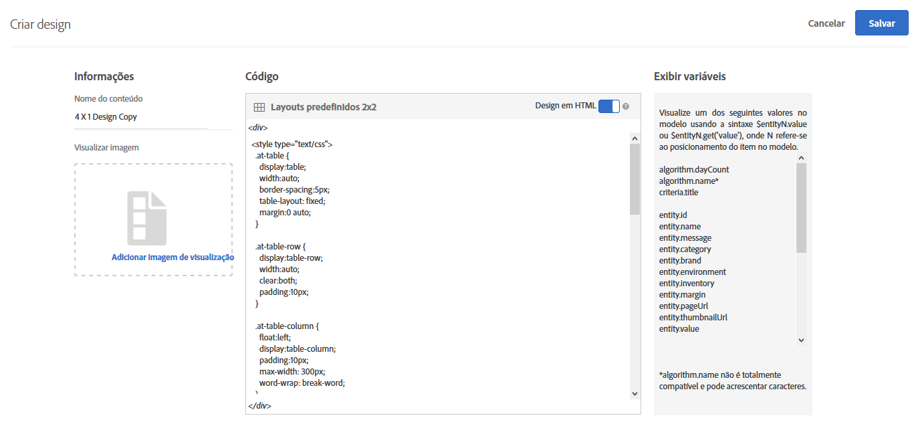
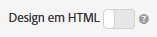

#  Criar um design {#create-a-design}

Um design define como as recomendações são exibidas em uma página.

Você pode criar um design de [!UICONTROL recomendações] usando um design padrão ou criando um design personalizado. A tela **[!UICONTROL Recommendations > Designs]** exibe os cartões de design padrão e quaisquer designs que foram criados em sua conta.

Lembre-se das seguintes informações ao trabalhar com designs:

* Você pode criar um design de recomendações usando um design padrão ou pode criar um design personalizado.
* Não é possível editar ou excluir um design padrão.
* Você pode editar, copiar ou excluir um design personalizado.
* Para criar um design com base em um design padrão, primeiro copie o design e edite a cópia.

Esta ilustração mostra o design padrão 1 x 4:


Esta ilustração mostra um design personalizado:


Você pode criar um design durante o processo de criação de atividades a partir do Visual Experience Composer (VEC) ou da biblioteca de design fora da criação de atividades. As seções a seguir supõem que você esteja criando designs a partir da biblioteca, mas as etapas são semelhantes.

## Criar designs

Você pode criar um design com base em um design padrão ou pode criar um design personalizado.

### Criar um design com base em um design padrão

1. Clique em **[!UICONTROL Recommendations]** > **[!UICONTROL Designs]** para exibir a biblioteca de [!UICONTROL Designs] .

   

1. Passe o mouse sobre o cartão para o design que deseja criar e clique no ícone **[!UICONTROL Copiar]** .

   

   A caixa de diálogo [!UICONTROL Criar design] é exibida.

   

1. No painel **[!UICONTROL Informações]** , adicione um Nome **[!UICONTROL de]** conteúdo e uma imagem de pré-visualização opcional para exibição no cartão de design.

   When you use a default design, the design name and &quot;Copy&quot; appears in the **[!UICONTROL Content Name]** field. Você pode editar o nome. Você também pode selecionar uma imagem para exibir no cartão de design.

1. (Condicional) Edite o **[!UICONTROL código]** de design, conforme desejado.

   Os designs de recomendação usam o idioma de design da Velocity de fonte aberta. Informações sobre a velocidade podem ser encontradas em [https://velocity.apache.org](https://velocity.apache.org) e em [Personalizar um design usando a Velocity](/help/c-recommendations/c-design-overview/customizing-a-template.md).

   Um design pode ser HTML ou não-HTML. Por padrão, os designs em HTML são envolvidos com uma tag `<div>` para permitir o rastreamento de cliques em um ambiente da Web. Designs não-HTML são para ambientes que não sejam da Web onde click-tracking não é possível. Deslize a opção Design  HTML para alternar para a posição &quot;desligado&quot; para usar código não HTML.

   >[!NOTE]
   >
   >O número máximo de entidades que podem ser referenciadas em um design, seja em código fixo ou via loops, é 99.

1. Clique em **[!UICONTROL Salvar]**.

### Criar um design personalizado

1. Clique em **[!UICONTROL Recommendations]** > **[!UICONTROL Designs]** para exibir a biblioteca de [!UICONTROL Designs] .

1. Clique em **[!UICONTROL Criar design]**.

   Se você quiser basear seu novo design personalizado em um design existente, passe o mouse sobre o design desejado e clique no ícone [!UICONTROL Copiar] . Em seguida, você pode editar a cópia para criar um novo design personalizado.

1. Adicione um Nome **[!UICONTROL de]** conteúdo e uma imagem de pré-visualização opcional.

1. (Condicional) Edite o **[!UICONTROL código]** de design, conforme desejado.

   Consulte as informações na Etapa 4 acima para obter mais informações.

1. Clique em **[!UICONTROL Salvar]**.

## Editar, copiar ou excluir um design

Lembre-se de que não é possível editar ou copiar um design padrão; você só pode copiar designs padrão.

Passe o mouse sobre o design desejado na biblioteca [!UICONTROL de design] e clique no ícone apropriado: editar, copiar ou excluir.


Você pode copiar um design existente para criar um design de duplicado que você pode modificar. Isso permite que você crie um design semelhante com menos esforço.

Esteja ciente de que os designs estão disponíveis em toda a conta. Considere isso antes de excluir um design. Os designs excluídos não podem ser recuperados.

## Exemplo de JSON {#section_75BFB2537CFF4FBD9B560F59EB32C8DD}

O exemplo a seguir mostra como as respostas JSON podem ser retornadas ao configurar uma atividade por meio do editor baseado em formulário.

1. Crie um design na biblioteca de design ou no fluxo de trabalho baseado em formulário. Se você tentar fazer isso dentro do fluxo de trabalho do Visual Experience Composer (VEC), poderá criar nada além de um design de HTML, que está envolvido com uma  `<div>` para fins de rastreamento de cliques.

1. Verifique se a opção &quot;HTML Design&quot; está desativada:

   

1. O código a seguir é um exemplo do que você poderia colar no design:

   ```javascript
       #* 
       * "Return a simple list of recommended entity ids"   
       *#
   
       {   
         "notes":{   
         "purpose": "Return a simple list of recommended entity ids",   
         "use-case": "Use this approach if you prefer to do a real-time lookup of entity attribute details (such as inventory, price, rating) from another system (such as a CMS, PIM or ecommerce platform)",   
         "version": "01"   
         },   
         "recommendedItems": {   
           "key": "$key.id",   
           "slot-01": "$entity1.id",   
           "slot-02": "$entity2.id",   
           "slot-03": "$entity3.id",   
           "slot-04": "$entity4.id",   
           "slot-05": "$entity5.id",   
           "slot-06": "$entity6.id",   
           "slot-07": "$entity7.id",   
           "slot-08": "$entity8.id",   
           "slot-09": "$entity9.id",   
           "slot-10": "$entity10.id"   
         }   
       }  
   ```

1. Set up a form-based [!DNL Recommendations] activity that uses this design.

   1. Navigate to the **[!UICONTROL Activities]** page.
   1. Clique em **[!UICONTROL Criar atividade]** > **[!UICONTROL Recomendações]**.
   1. Em **[!UICONTROL Escolher o Experience Composer]**, selecione **[!UICONTROL Formulário]** e clique em **[!UICONTROL Avançar]**.
   1. Em localização, digite o texto: &quot;Sample_Recs_Response&quot;
   1. Em **[!UICONTROL Conteúdo padrão]**, clique na seta para baixo e depois clique em **[!UICONTROL Adicionara recomendação]**.
   1. Selecione um tipo de página. Isso determina a filtragem inicial da próxima tela.
   1. Selecione um cartão de Critérios e depois clique em **[!UICONTROL Próximo]**.
   1. Select the design you created in the previous step, then click **[!UICONTROL Next]**.
   1. Complete o processo de configuração.
   1. Clique na seta à direita próximo a **[!UICONTROL Inativo]** e depois selecione **[!UICONTROL Ativar]**.

1. Depois que sua atividade estiver configurada e ativada, você pode configurar uma solicitação de amostra para recuperar a resposta limpa do JSON.

   From the time that you save your activity, [!DNL Target] will need to build a model to support the selected criteria configuration. Dependendo de vários fatores, isso pode levar algum tempo. Os resultados aparecem quando o modelo tiver sido criado.

   Por exemplo:

   ```
   https://[YOUR_CLIENT_CODE].tt.omtrdc.net/m2/YOUR_CLIENT_CODE/ubox/raw?mbox=[YOUR_MBOX_NAME]&mboxContentType=text/html&mboxXDomain=disabled&entity.id=[ENTITY_ID]&mboxHost=rawbox_sample&at_property=[AT_PROPERTY_TOKEN]&mboxNoRedirect=true&mboxPC=1234-4321&mboxSession=9876-7000
   ```

   onde

   | Parâmetro | Valor |
   |--- |--- |
   | `[YOUR_CLIENT_CODE]` | Código do cliente do público alvo (disponível em /help/target/products.html#recsSettings > Token da API do Recommendations > Código do cliente). |
   | `[YOUR_MBOX_NAME]` | O nome selecionado na seção &quot;Locais&quot; do Recommendations baseado em formulário, neste caso Sample_Recs_Response. |
   | `[ENTITY_ID` | O `entity.id` de um item em seu catálogo. |
   | `[AT_PROPERTY_TOKEN]` | (Opcional) Adicionar se você selecionou uma Propriedade (parte das Permissões da empresa) durante a configuração de sua atividade. |

Depois que seu algoritmo for executado e você obter os resultados, sua resposta deve ser:

{width=&quot;575px&quot;}

## Additional JSON object tips and tricks {#section_C305673C68944749969DB239E3221DC2}

Você também pode simplesmente enviar de volta uma lista simples de itens delimitados por vírgula, configurando um design com a seguinte sintaxe:

```
entity1.id, $entity2.id, $entity3.id, $entity4.id, $entity5.id, 
```

Como alternativa, você pode enviar informações adicionais na resposta. O seguinte arquivo de código é um exemplo mais complexo que retorna muito mais do que as IDs de entidade com seus slots associados (ordem). This design example also returns activity details, Target Profile details (as applicable), and other `entity.attributes` associated with the items returned.

```javascript
    {   
     "adobeRecommendations": {   
      "notes": {   
       "purpose": "Return a list of entity ids with their associated entity.attributes",   
       "use-case": "Use this approach to avoid looking up attribute details after receiving a response from Target",   
       "version": "01"   
      },   
      "recommendedItems": {   
       "slot-01": "$entity1.id",   
       "slot-02": "$entity2.id",   
       "slot-03": "$entity3.id",   
       "slot-04": "$entity4.id",   
       "slot-05": "$entity5.id",   
       "slot-06": "$entity6.id",   
       "slot-07": "$entity7.id",   
       "slot-08": "$entity8.id",   
       "slot-09": "$entity9.id",   
       "slot-10": "$entity10.id"   
      },   
      "activityDetails": {   
       "mbox.name": "email-mbox",   
       "campaign.name": "\${campaign.name}",   
       "campaign.id": "\${campaign.id}",   
       "campaign.recipe.name": "\${campaign.recipe.name}",   
       "campaign.recipe.id": "\${campaign.recipe.id}",   
       "offer.name": "\${offer.name}",   
       "offer.id": "\${offer.id}",   
       "criteria.title": "$criteria.title",   
       "algorithm.name": "$algorithm.name",   
       "algorithm.dayCount": "$algorithm.dayCount"   
      },   
      "visitorProfile": {   
       "profile.favorite-category": "\${profile.favorite-category}",   
       "profile.test": "\${profile.test}",   
       "user.endpoint.lastPurchasedEntity": "\${user.endpoint.lastPurchasedEntity}",   
       "user.endpoint.lastViewedEntity": "\${user.endpoint.lastViewedEntity}",   
       "user.endpoint.mostViewedEntity": "\${user.endpoint.mostViewedEntity}",   
       "user.endpoint.categoryAffinity": "\${user.endpoint.categoryAffinity}",   
       "profile.geolocation.city": "\${profile.geolocation.city}",   
       "profile.geolocation.dma": "\${profile.geolocation.dma}",   
       "profile.geolocation.state": "\${profile.geolocation.state}",   
       "profile.geolocation.country": "\${profile.geolocation.country}",   
       "profile.sessionCount": "\${profile.sessionCount}",   
       "profile.averageDaysBetweenVisits": "\${profile.averageDaysBetweenVisits}",   
       "profile.browserTime": "\${profile.browserTime}",   
       "user.activeActivities": "\${user.activeActivities}",   
       "user.pcId": "\${user.pcId}",   
       "user.isFirstSession": "\${user.isFirstSession}",   
       "user.isNewSession": "\${user.isNewSession}",   
       "user.header": "\${user.header}",   
       "user.parameter": "\${user.parameter}"   
      },   
      "recKey": {   
       "recKeyDetails": {   
        "id": "$key.id",   
        "name": "$key.name",   
        "category": "$key.category",   
        "pageUrl": "$key.pageUrl",   
        "thumbnailUrl": "$key.thumbnailUrl"   
       }   
      },   
      "recDetailedResults": {   
       "recEntity1Details": {   
        "id": "$entity1.id",   
        "name": "$entity1.name",   
        "category": "$entity1.category",   
        "pageUrl": "$entity1.pageUrl",   
        "thumbnailUrl": "$entity1.thumbnailUrl"   
       },   
       "recEntity2Details": {   
        "id": "$entity2.id",   
        "name": "$entity2.name",   
        "category": "$entity2.category",   
        "pageUrl": "$entity2.pageUrl",   
        "thumbnailUrl": "$entity2.thumbnailUrl"   
       },   
       "recEntity3Details": {   
        "id": "$entity3.id",   
        "name": "$entity3.name",   
        "category": "$entity3.category",   
        "pageUrl": "$entity3.pageUrl",   
        "thumbnailUrl": "$entity3.thumbnailUrl"   
       },   
       "recEntity4Details": {   
        "id": "$entity4.id",   
        "name": "$entity4.name",   
        "category": "$entity4.category",   
        "pageUrl": "$entity4.pageUrl",   
        "thumbnailUrl": "$entity4.thumbnailUrl"   
       },   
       "recEntity5Details": {   
        "id": "$entity5.id",   
        "name": "$entity5.name",   
        "category": "$entity5.category",   
        "pageUrl": "$entity5.pageUrl",   
        "thumbnailUrl": "$entity5.thumbnailUrl"   
       },   
       "recEntity6Details": {   
        "id": "$entity6.id",   
        "name": "$entity6.name",   
        "category": "$entity6.category",   
        "pageUrl": "$entity6.pageUrl",   
        "thumbnailUrl": "$entity6.thumbnailUrl"   
       },   
       "recEntity7Details": {   
        "id": "$entity7.id",   
        "name": "$entity7.name",   
        "category": "$entity7.category",   
        "pageUrl": "$entity7.pageUrl",   
        "thumbnailUrl": "$entity7.thumbnailUrl"   
       },   
       "recEntity8Details": {   
        "id": "$entity8.id",   
        "name": "$entity8.name",   
        "category": "$entity8.category",   
        "pageUrl": "$entity8.pageUrl",   
        "thumbnailUrl": "$entity8.thumbnailUrl"   
       },   
       "recEntity9Details": {   
        "id": "$entity9.id",   
        "name": "$entity9.name",   
        "category": "$entity9.category",   
        "pageUrl": "$entity9.pageUrl",   
        "thumbnailUrl": "$entity9.thumbnailUrl"   
       },   
       "recEntity10Details": {   
        "id": "$entity10.id",   
        "name": "$entity10.name",   
        "category": "$entity10.category",   
        "pageUrl": "$entity10.pageUrl",   
        "thumbnailUrl": "$entity10.thumbnailUrl"   
       }   
      }   
     }   
    }  
```

## Training video: Create custom designs in Recommendations (3:20) 

Este vídeo contém as seguintes informações:

* Criar um design personalizado
* Saiba como fazer referência às variáveis de exibição nos designs

>[!VIDEO](https://video.tv.adobe.com/v/27687)
