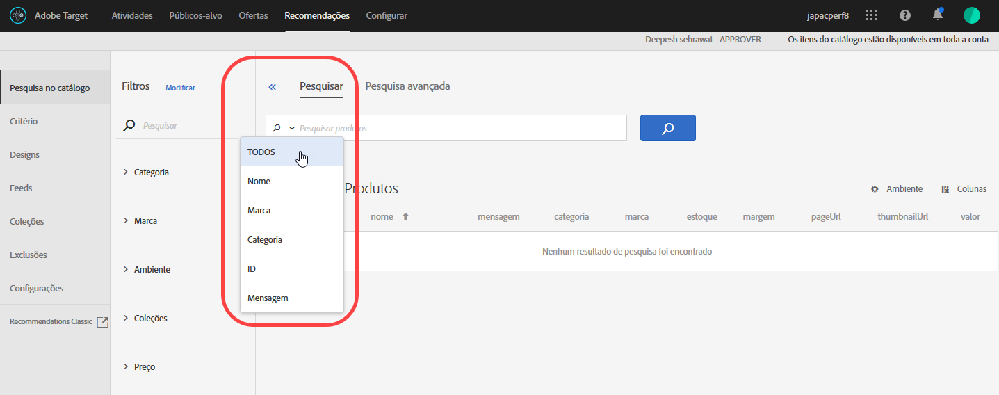

#  Pesquisa no catálogo {#catalog-search}

A página [!UICONTROL Pesquisa de catálogo] ajuda a localizar os produtos ou conteúdo no catálogo.

Os catálogos se referem a todo o conjunto de produtos (entidades). Seu catálogo pode conter muitas coleções, uma forma de organizar seus produtos em compartimentos lógicos.

Para acessar a página [!UICONTROL Pesquisa de catálogo], clique em **[!UICONTROL Recommendations]** > **[!UICONTROL Pesquisa de catálogo]**.

A tarefa mais básica que você pode executar nesta página é procurar um item. Além disso, você pode alterar o ambiente; salvar resultados de pesquisa em coleções ou exclusões; adicione, remova ou reorganize colunas na tabela e adicione novos aspectos de pesquisa ao painel [!UICONTROL Filtros].

## Procurar um item

Você pode usar uma pesquisa simples ou avançada para localizar itens no catálogo.

### Executar uma pesquisa simples

1. Digite um termo de pesquisa no campo **[!UICONTROL Produtos de pesquisa]**.

1. (Opcional) Você pode refinar a pesquisa selecionando uma opção de pesquisa no menu de opções que é exibido ao clicar na seta para baixo no campo de pesquisa.

   

   As opções de pesquisa incluem o seguinte:

   * TODAS - Pesquisa em todos os outros critérios de pesquisa, usando a lógica OU.
   * Nome
   * Marca
   * Categoria
   * ID
   * Mensagem

1. Agora você pode rolar pelos itens nos resultados da pesquisa para miniaturas de visualização e outras informações do produto.

   A ilustração a seguir mostra os resultados de &quot;bicicleta&quot; usando a opção Todos.

   

   O número que aparece ao lado de &quot;Produtos&quot; é o número de produtos que combinam com o termo de pesquisa, do total disponível no ambiente especificado.

   Observe que você pode usar a funcionalidade de pesquisa de preenchimento automático. Na ilustração a seguir, digitar &quot;bik&quot; retorna todos os produtos que contêm a palavra &quot;bike&quot;.

   

   >[!NOTE]
   >
   >Quando você realiza uma pesquisa de catálogo em um atributo personalizado com um valor numérico, os resultados tratam o atributo personalizado como um tipo de String em vez de um valor numérico.
   >
   >Atualmente, não há funcionalidade disponível que permita aos clientes alterar o tipo de um atributo. Para fazer uma alteração, [abra um problema do cliente](/help/cmp-resources-and-contact-information.md#reference_ACA3391A00EF467B87930A450050077C) referenciando os atributos que precisam do tipo alterados de string para numérico.

1. Você também pode usar filtros para encontrar o produto desejado. No exemplo a seguir, expandindo a faceta [!UICONTROL Collections] e selecionando &quot;Bike Tools&quot;, todas as ferramentas de bicicletas no catálogo são exibidas.

   

1. Você pode pesquisar mais na lista de resultados inserindo um termo de pesquisa, por exemplo, &quot;cadeia&quot;.

   

### Executar uma pesquisa avançada {#advanced-search}

Você pode usar [!UICONTROL Pesquisa avançada] para refinar ainda mais os resultados da pesquisa ou salvar os resultados da pesquisa como uma [coleção](/help/c-recommendations/c-products/collections.md) ou [exclusão](/help/c-recommendations/c-products/exclusions.md).

1. Clique no link **[!UICONTROL Pesquisa avançada]**.

   

1. Use as listas suspensas para especificar o parâmetro, o operador e os valores para sua pesquisa.

1. (Opcional) Clique em **[!UICONTROL Adicionar regra]** para adicionar uma regra de pesquisa adicional.

   Cada regra de pesquisa adicional é unida ao operador E.

1. Clique em **[!UICONTROL Pesquisa]**.

1. (Opcional) Clique em **[!UICONTROL Salvar como]** e, em seguida, clique em **[!UICONTROL Coleção]** ou **[!UICONTROL Exclusão]**.

   

   Para obter mais informações, consulte [Criar uma coleção ou exclusão com base na Pesquisa Avançada](#save-as) abaixo.

## Visualização dos detalhes de um item

Você pode visualização os detalhes de um item individual, incluindo ID, nome, mensagem, categoria e muito mais ao exibir seus detalhes.

1. Clique em um item nos resultados da pesquisa para visualização de seus detalhes.

   

## Remover um item do catálogo

1. Clique em um item nos resultados da pesquisa para visualização de seus detalhes.

1. Clique em **[!UICONTROL Remover do catálogo]**.

1. Confirme se deseja remover o item.

Todas as informações sobre esse item são removidas do índice de catálogo. O item será incluído no catálogo somente se for adicionado novamente em um feed de dados. Um item excluído deve ser excluído separadamente dos feeds.

## Atualizar o catálogo

O índice do catálogo é criado automaticamente quando você carrega seu primeiro feed e é atualizado de acordo com o [agendamento especificado](/help/c-recommendations/c-products/feeds.md#steps).

O catálogo é atualizado automaticamente quando as atualizações são recebidas por meio de arquivos de feed, API ou atualizações de mbox. Normalmente, as atualizações são concluídas em uma hora. Se houver atualizações em andamento, será exibida a hora em que a atualização mais recente foi iniciada. Se não houver atualizações em andamento, será exibida a hora em que a atualização mais recente foi iniciada e finalizada.

## Criar uma coleção ou exclusão com base na Pesquisa avançada  {#save-as}

Você pode criar [coleções](/help/c-recommendations/c-products/collections.md) ou [exclusões](/help/c-recommendations/c-products/exclusions.md) usando a Pesquisa avançada na página Pesquisa no catálogo ([!UICONTROL Recommendations] > [!UICONTROL Pesquisa no catálogo] > [!UICONTROL Pesquisa avançada]).

1. Execute uma [pesquisa avançada](#advanced-search).

1. Clique em **[!UICONTROL Salvar como]** e, em seguida, clique em **[!UICONTROL Coleção]** ou **[!UICONTROL Exclusão]**.

   

   >[!IMPORTANT]
   >
   >A funcionalidade [!UICONTROL Pesquisa avançada] não diferencia maiúsculas de minúsculas; no entanto, os produtos retornados no momento do delivery são baseados em pesquisas que diferenciam maiúsculas e minúsculas. Essa não correspondência pode levar à confusão. Certifique-se de considerar a diferenciação entre maiúsculas e minúsculas ao criar coleções ou exclusões com base nos resultados usando a funcionalidade [!UICONTROL Pesquisa avançada]. Por exemplo, se você realiza uma busca para &quot;Feriado&quot;, essa busca inicial lista os resultados contendo &quot;Feriado&quot; e &quot;feriado&quot;. Em seguida, se você criar um catálogo com a intenção de encontrar produtos contendo &quot;feriado&quot;, somente os produtos contendo &quot;feriado&quot; serão exibidos. Os produtos contendo &quot;Feriado&quot; não serão exibidos. As exclusões são tratadas de maneira semelhante.

## Alterar o ambiente

 AmbientalVocê organiza seus sites e ambientes de pré-produção para fácil gerenciamento e relatórios separado.

1. Clique no link Ambiente.

   

1. Selecione o ambiente desejado.

## Modificar a página Pesquisa de catálogo (filtros e colunas)

Você pode modificar temporariamente os filtros e colunas disponíveis na página [!UICONTROL Pesquisa de Catálogo] para a sessão atual.

### Modificar filtros

Você pode adicionar outros aspectos de filtro à página [!UICONTROL Pesquisa de catálogo].

1. No painel **[!UICONTROL Filtros]**, clique em **[!UICONTROL Modificar]**.

   

1. Selecione os aspectos de pesquisa desejados (ID, nome, mensagem etc.).

   

Lembre-se de que as facetas de filtro adicionais estão disponíveis somente na sessão atual.

### Modificar colunas

Você pode modificar temporariamente as colunas ativas na página [!UICONTROL Pesquisa de catálogo].

1. Clique no link **[!UICONTROL Colunas]**.

   

1. (Condicional) Para reordenar a ordem das colunas ativas, arraste e solte as colunas na seção **[!UICONTROL Colunas ativas]** na ordem desejada.

1. (Condicional) Arraste e solte itens de **[!UICONTROL Colunas ativas]** para **[!UICONTROL Colunas inativas]** (e vice-versa), conforme desejado.

   Você também pode clicar no ícone Excluir ( x ) ao lado da coluna que deseja mover da seção ativa para inativa.

Lembre-se de que todas as alterações feitas se aplicam somente à sessão atual.

