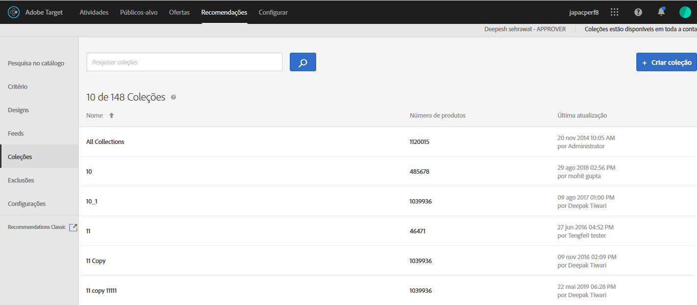

#  Coleções {#collections}

Uma coleção é um conjunto de produtos ou itens que são qualificados para uma recomendação. Uma coleção é definida especificando as condições que devem ser atendidas pelos itens para fazer parte dela.

Normalmente, uma coleção é um conjunto de itens semelhantes ou relacionados, como uma coleção de um único produto. No entanto, você pode agrupar qualquer item em uma categoria que faça sentido para a sua empresa, como produtos em uma determinada faixa de preços ou cor ou itens que provavelmente serão interessantes em uma área geográfica específica.

Use as coleções para organizar seus produtos em caixas lógicas. Por exemplo, se alguns itens estão disponíveis em uma região, mas não em outra, é possível criar uma coleção que exclua itens que não estão disponíveis na região do visitante. Você também pode usar as coleções para organizar os itens sazonais ou quaisquer outros parâmetros de organização que se aplicam ao seu negócio.

As [recomendações de backup](/help/c-recommendations/c-algorithms/backup-recs.md) geradas para cada critério dentro da recomendação também usam essa coleção, para que sejam incluídos na recomendação de backup apenas os itens na coleção. Com as coleções, você pode garantir que apenas os produtos que fazem sentido serão exibidos em um local.

As coleções são recriadas ou atualizadas cada vez que o critério for executado.

Você pode agrupar os produtos em catálogos, em seguida, criar recomendações separadas para cada coleção.

Os critérios de inclusão permitem que você realize ações semelhantes a uma coleção, mas devem ser configurados cada vez que uma atividade for criada. As coleções permitem a criação de um conjunto de itens de uma só vez. Depois disso, é possível usá-lo sempre que for apropriado, sem a necessidade de configurá-lo novamente.

Quando você está criando ou editando uma atividade do [!DNL Recommendations], o nome da coleção aparece ao lado da etiqueta de [!UICONTROL Critérios] no diagrama da atividade.

>[!NOTE]
>
>As coleções não são aplicadas quando você usa a chave de recomendação [!UICONTROL Itens recentemente visualizados].

## Crie uma coleta {#task_1256DFF6842141FCAADD9E1428EF7F08}

Crie uma coleção para organizar os produtos ou o conteúdo que deseja mostrar em suas recomendações.

1.  Clique em **[!UICONTROL Recommendations]** > **[!UICONTROL Coleções]** para exibir a lista de coleções existentes. 

   

   A página [!UICONTROL Coleções] exibe uma lista das coleções existentes. Para criar novas coleções, clique no botão [!UICONTROL Criar coleção] . Você também pode editar, copiar e excluir coleções existentes passando o mouse sobre a coleção desejada e clicando no ícone desejado.

   

   O “Número de itens” relatado para cada coleção na exibição de lista das [!UICONTROL Coleções] é o número de produtos que correspondem às regras da coleção no [grupo de hosts](/help/administrating-target/hosts.md) (ambiente) padrão configurado no Recommendations. Consulte [Configurações](/help/c-recommendations/plan-implement.md#concept_C1E1E2351413468692D6C21145EF0B84) para alterar o grupo de hosts padrão.

1. Clique em **[!UICONTROL Criar coleção]**.

1. (Condicional) Escolha um ambiente no filtro **[!UICONTROL Ambiente]** ao criar (ou atualizar) uma coleção para visualizar o conteúdo da coleção no ambiente. Por padrão, os resultados do grupo de hosts padrão são exibidos.

   

1. Digite um **[!UICONTROL Nome]** para a coleção.

   Você também pode inserir uma **[!UICONTROL Descrição opcional]**.

1. Defina as regras usadas para criar a coleção.

   Por exemplo, sua coleção pode ser criada em torno de uma ID de produto ou categoria, margem ou qualquer outro parâmetro na lista.

   Você pode adicionar regras para usar vários parâmetros para definir uma coleção. Várias regras são unidas a um operador AND. Todas as regras especificadas devem ser iguais para que a coleção seja aplicada.

1. Clique em **[!UICONTROL Salvar]**.

## Criar uma coleção usando a Pesquisa avançada

Você também pode criar coleções usando a Pesquisa avançada na página [Pesquisa no catálogo](/help/c-recommendations/c-products/catalog-search.md#save-as) ([!UICONTROL Recommendations] > [!UICONTROL Pesquisa no catálogo] > [!UICONTROL Pesquisa avançada]).

Após criar uma pesquisa usando &quot;id > contains&quot; por exemplo, você pode clicar em [!UICONTROL Salvar como] > [!UICONTROL Coleção].

>[!IMPORTANT]
>
>A funcionalidade de Pesquisa avançada não faz distinção entre maiúsculas e minúsculas; contudo, os produtos devolvidos no momento da entrega baseiam-se na pesquisa sensível a maiúsculas e minúsculas. Essa não correspondência pode levar à confusão. Certifique-se de considerar a sensibilidade a maiúsculas e minúsculas quando você cria coleções baseadas em resultados usando a funcionalidade Pesquisa avançada. Por exemplo, se você realiza uma busca para &quot;Feriado&quot;, essa busca inicial lista os resultados contendo &quot;Feriado&quot; e &quot;feriado&quot;. Em seguida, se você criar um catálogo com a intenção de encontrar produtos contendo &quot;feriado&quot;, somente os produtos contendo &quot;feriado&quot; serão exibidos. Os produtos contendo &quot;Feriado&quot; não serão exibidos.

## Editar, copiar ou excluir uma coleção

Passe o mouse sobre a coleção desejada na lista e clique no ícone apropriado: editar, copiar ou excluir.

Você pode copiar uma coleção existente para criar uma coleção de duplicados que você pode modificar. Isso permite criar uma exclusão semelhante com menos esforço.

Esteja ciente de que as coleções estão disponíveis em toda a conta. Considere isso antes de excluir uma coleção. Coleções excluídas não podem ser recuperadas.

## Usar uma coleção em uma atividade Recommendations

1. Crie uma coleção usando um dos métodos mencionados acima.

1. Clique em **[!UICONTROL Atividade]** e [crie uma nova atividade Recommendations](/help/c-recommendations/t-create-recs-activity/create-recs-activity.md) ou edite uma atividade existente.

1. Depois de selecionar um critério e um design, a página [!UICONTROL Opções] é exibida quando você seleciona a coleção desejada.

   

1. (Condicional) Para alterar uma configuração de coleção existente, na página **[!UICONTROL Experiências]** (etapa 2 do fluxo de trabalho guiado de três partes), clique em um local onde você inseriu as recomendações, clique em **[!UICONTROL Alterar coleção]** e selecione a coleção desejada.

   

## Training video: Create collections and exclusions in Recommendations (7:05) 

Este vídeo contém as seguintes informações:

* Criar uma coleção
* Criar uma exclusão

>[!VIDEO](https://video.tv.adobe.com/v/27689)