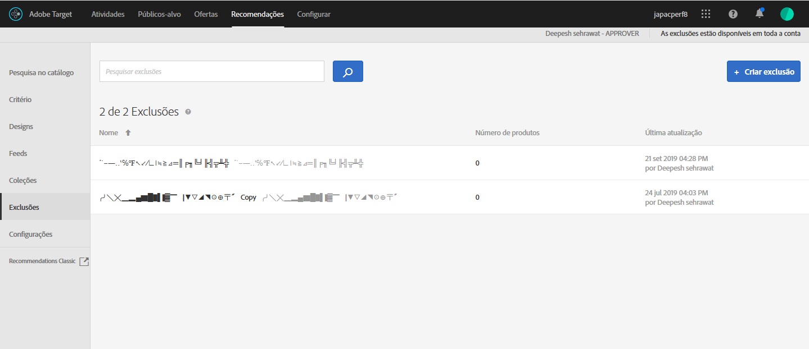

# Exclusões{#exclusions}

Crie uma exclusão para impedir que produtos ou conteúdo sejam recomendados para visitantes. [!DNL Adobe Target Recommendations]

Uma exclusão é um subconjunto de produtos ou conteúdo que não deve ser recomendado para seus visitantes. Por exemplo, você pode usar exclusões para impedir que produtos ou conteúdo sejam exibidos em recomendações que foram descontinuadas ou são sensíveis na natureza (como filmes com uma classificação não adequada para todas as idades).

>[!IMPORTANT]
>
>As regras de exclusão estáticas e dinâmicas são recursos poderosos que podem ajudá-lo com seus esforços de marketing. Para obter informações detalhadas, exemplos e cenários de caso de uso, consulte [Usar as regras de inclusão estática e dinâmica](../../c-recommendations/c-algorithms/use-dynamic-and-static-inclusion-rules.md#concept_4CB5C0FA705D4E449BD0B37B3D987F9F).

## Criar uma exclusão

1. Clique em **[!UICONTROL Recommendations]** > **[!UICONTROL Exclusões]** para exibir a lista de exclusões existentes.

   

   O “Número de itens” relatado para cada exclusão na exibição de lista das [!UICONTROL Exclusões] é o número de produtos que correspondem às regras da exclusão no [grupo de hosts](/help/administrating-target/hosts.md) (ambiente) padrão configurado no Recommendations. Consulte [Configurações](../../c-recommendations/plan-implement.md#concept_C1E1E2351413468692D6C21145EF0B84) para alterar o grupo de hosts padrão.

1. Clique em **[!UICONTROL Criar exclusão]**.

1. (Condicional) Escolha um ambiente no filtro **[!UICONTROL Ambiente]** ao criar (ou atualizar) uma exclusão para visualizar o conteúdo da exclusão no ambiente. Por padrão, os resultados do grupo de hosts padrão são exibidos.

   

1. Digite um **[!UICONTROL Nome]** de exclusão e insira uma descrição opcional.

1. Use o criador de regras para criar suas exclusões.

   Selecione um parâmetro na lista Regras, selecione um operador e, em seguida, insira um ou mais valores para identificar os produtos. Separe vários valores com vírgulas.

1. Clique em **[!UICONTROL Salvar]**.

## Criar uma exclusão usando a Pesquisa avançada

Você também pode criar exclusões usando Pesquisa avançada na página Pesquisa no catálogo ([!UICONTROL Recommendations] > [!UICONTROL Pesquisa no catálogo] > [!UICONTROL Pesquisa avançada]).

Após criar uma pesquisa usando &quot;id > contains&quot; Por exemplo, você pode clicar em [!UICONTROL Salvar como] > [!UICONTROL Exclusão]. Para obter mais informações, consulte [Pesquisa no catálogo](/help/c-recommendations/c-products/catalog-search.md#save-as).

>[!IMPORTANT]
>
>A funcionalidade de Pesquisa avançada não faz distinção entre maiúsculas e minúsculas; contudo, os produtos devolvidos no momento da entrega baseiam-se na pesquisa sensível a maiúsculas e minúsculas. Essa não correspondência pode levar à confusão. Certifique-se de considerar a sensibilidade a maiúsculas e minúsculas quando você cria exclusões baseadas em resultados usando a funcionalidade Pesquisa avançada. Por exemplo, se você realiza uma busca para &quot;Feriado&quot;, essa busca inicial lista os resultados contendo &quot;Feriado&quot; e &quot;feriado&quot;. Em seguida, se você criar uma exclusão com a intenção de excluir produtos contendo &quot;feriado&quot;, somente os produtos contendo &quot;feriado&quot; são excluídos. Os produtos contendo &quot;Feriado&quot; não são excluídos.

## Vídeo de treinamento: criar coleções e exclusões no Recommendations (7:05) 

Este vídeo contém as seguintes informações:

* Criar uma coleção
* Criar uma exclusão

>[!VIDEO](https://video.tv.adobe.com/v/27689)