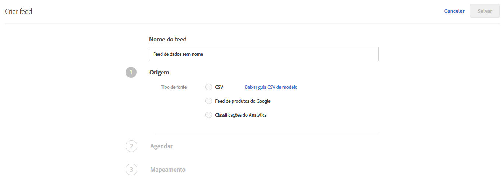
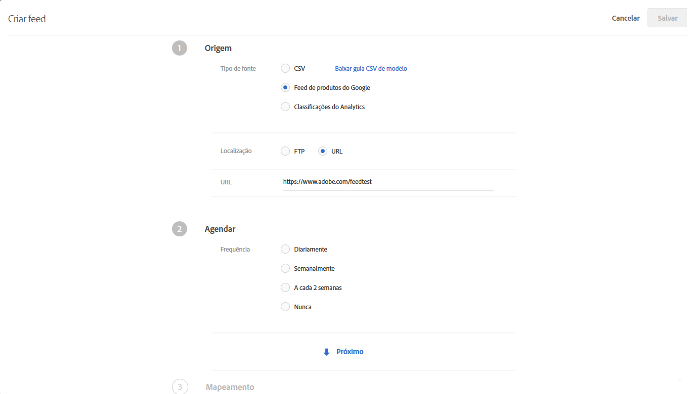
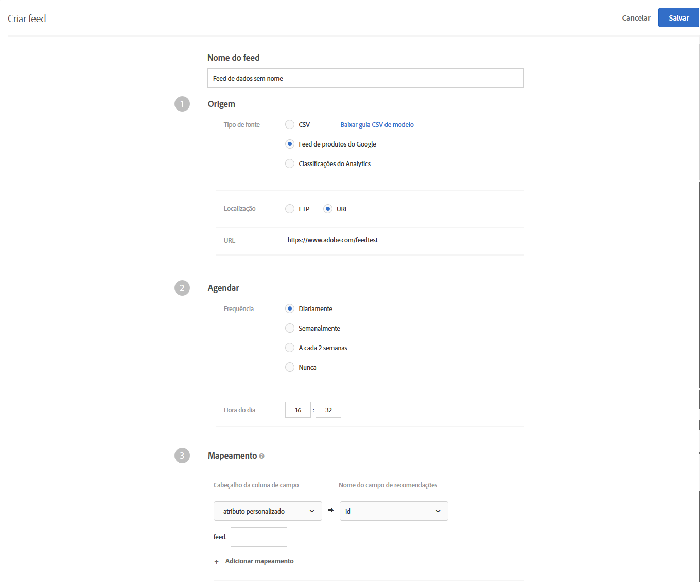

#  Feeds{#feeds}

Use os feeds para importar entidades no [!DNL Recommendations]. As entidades podem ser enviadas usando arquivos CSV, o formato de feed do Google Product Search e as classificações de produtos do Adobe Analytics.

## Visão geral dos feeds {#concept_D1E9C7347C5D4583AA69B02E79607890}

Os feeds permitem passar [Entidades](/help/c-recommendations/c-products/products.md) ou aumentar seus dados de mbox com informações que ou não estão disponíveis na página, ou não são seguras para serem enviadas diretamente da página, como margem, COGS e outros.

Você pode escolher quais colunas do seu arquivo de classificações do produto [!DNL Target] ou do arquivo do Google Product Search você deseja enviar para o servidor [!DNL Recommendations]. Estes dados sobre cada item podem ser usados na exibição de modelos e para controlar recomendações.

Se dados forem coletados tanto por feeds de entidade como por uma mbox, os dados mais recentes vencem. Normalmente, os dados mais recentes vêm de uma mbox, porque ela é vista com mais frequência. Se, por coincidência, dados do feed de entidade e da mbox cheguem ao mesmo tempo, os dados da mbox serão usados.

A lista [!UICONTROL Feeds] (**[!UICONTROL Recomendações]** > **[!UICONTROL Feeds]**) fornece informações sobre quaisquer feeds criados.


A página Feeds contém as seguintes colunas:

* **Nome**: o nome do feed especificado durante a criação. Para editar o nome de um feed, edite o próprio feed. Ao salvar com o novo nome, o feed é atualizado.
* **Tipo**: os tipos incluem [CSV](/help/c-recommendations/c-products/feeds.md#section_65CC1148C7DD448FB213FDF499D35FCA), [Feed do produto Google](/help/c-recommendations/c-products/feeds.md#section_8EFA98B5BC064140B3F74534AA93AFFF) e [Classificações do Analytics](/help/c-recommendations/c-products/feeds.md#section_79E430D2C75443BEBC9AA0916A337E0A).
* **Status**: o [status](/help/c-recommendations/c-products/feeds.md#concept_E475986720D1400999868B3DFD14A7A0) atual do feed.
* **Programação**: exibe a programação de atualização do feed: diariamente, semanalmente, a cada 2 semanas ou nunca.
* **Itens**: exibe o número de itens no feed.
* **Última atualização**: exibe a data e a hora em que o feed foi atualizado pela última vez e o nome da pessoa que atualizou o feed. Se a [!UICONTROL Última atualização] do feed indicar “indefinido”, o feed será recebido da [!DNL Recommendations Classic] e não poderá ser alterado em [!DNL Target Premium Recommendations].

>[!IMPORTANT]
>
>Entidades e atributos de entidade carregados expiram após 61 dias. Isso significa o seguinte:
>
>* Seu feed deve ser executado pelo menos mensalmente para garantir que o conteúdo do catálogo não expire.
>* Remover um item do arquivo de feed não remove esse item do catálogo. Para remover o item do catálogo, exclua manualmente o item por meio da interface do Público alvo ou da API. Ou modifique os atributos do item (como o inventário) para garantir que o item seja excluído da consideração.


## CSV {#section_65CC1148C7DD448FB213FDF499D35FCA}

Você pode criar um arquivo `.csv` usando o formato de upload CSV proprietário da Adobe. O arquivo contém as informações de exibição sobre os atributos reservados e personalizados para os seus produtos. Para fazer o upload dos atributos específicos à sua implementação, substitua `CustomN` na linha de cabeçalho pelo nome do atributo que deseja usar. No exemplo abaixo, `entity.Custom1` foi substituído por: `entity.availability`. Em seguida, você pode fazer o upload em massa do arquivo para o servidor [!DNL Recommendations].

Usar o formato .csv tem as seguintes vantagens em relação ao formato do Google Feed:

* Não precisa de mapeamentos de campo.
* Ele suporta atributos de vários valores (veja o exemplo abaixo).
* Ele suporta até 100 atributos personalizados. Se você precisar de mais de 100 atributos personalizados, pode criar um segundo arquivo de feed com um conjunto diferentes de atributos personalizados.

Use o método de carregamento em massa para enviar informações de exibição se você não possuir mboxes na sua página, ou se desejar complementar suas informações de exibição com itens que não estão disponíveis no seu site. Por exemplo, talvez você queira enviar informações sobre o inventário que podem não estar publicadas no seu site.

Qualquer dado carregado por meio do arquivo .csv, feed de produto do Google ou feed de classificação de produto do Analytics substitui o valor do atributo da entidade existente no nosso banco de dados. Se você enviar informações de preço via solicitações de mbox e depois enviar valores de preço diferentes no arquivo, os valores no arquivo substituem os valores enviados na solicitação de mbox. Uma exceção a essa regra é o atributo de entidade `categoryId` no qual os valores de categoria são anexados em vez de substituídos até o limite de 250 caracteres.

>[!IMPORTANT]
>
>Não coloque os valores entre aspas duplas ( &quot; ) no arquivo .csv, a menos que seja intencional. Se colocar os valores entre aspas duplas, você pode removê-los ao incluí-los em outro conjunto de aspas duplas. As aspas duplas que não forem removidas evitarão que o feed do Recommendations carregue corretamente.

Por exemplo, a sintaxe a seguir está incorreta:

```
"Apples "Bananas" Grapes"",
```

A sintaxe a seguir está correta:

```
"Apples ""Bananas"" Grapes""",
```

>[!NOTE]
>
>Não é possível substituir um valor existente por um valor em branco. É necessário aprovar outro valor para substituí-lo. Em caso de preço de venda, uma solução comum é aprovar um &quot;NULL&quot; ou alguma outra mensagem. Você poderá escrever uma regra do modelo para excluir itens com esse valor.

O produto estará disponível na interface de Admin aproximadamente duas horas depois de ter carregado a entidade com sucesso.

A seguir, encontra-se um código de exemplo para um arquivo .csv:

```
## RECSRecommendations Upload File 
## RECS''## RECS'' indicates a Recommendations pre-process header. Please do not remove these lines. 
## RECS 
## RECSUse this file to upload product display information to Recommendations. Each product has its own row. Each line must contain 19 values and if not all are filled a space should be left. 
## RECSThe last 100 columns (entity.custom1 - entity.custom100) are custom. The name 'customN' can be replaced with a custom name such as 'onSale' or 'brand'. 
## RECSIf the products already exist in Recommendations then changes uploaded here will override the data in Recommendations. Any new attributes entered here will be added to the product''s entry in Recommendations. 
## RECSentity.id,entity.name,entity.categoryId,entity.message,entity.thumbnailUrl,entity.value,entity.pageUrl,entity.inventory,entity.margin,entity.last_updated_by,entity.multi_english,entity.availability,entity.tax_country,entity.tax_region,entity.tax_rate,entity.product_type,entity.item_group_id,entity.color,entity.size,entity.brand,entity.gtin 
na3456,RipCurl Watch with Titanium Dial,Watches & Sport,Cutting edge titanium with round case,https://example.com/s7/na3456_Viewer,425,https://example.com/shop/en-us/na3456_RipCurl,24,0.25,csv,"[""New"",""Web"",""Sales"",""[1,2,34,5]""]",in stock,US,CA,9.25,Shop by Category > Watches,dz1,Titanium,44mm,RipCurl,"075380 01050 5" 
na3457,RipCurl Watch with Black Dial,Watches & Sport,Cutting edge matte black with round case,https://example.com/s7/na3457_Viewer,275,https://example.com/shop/en-us/na3457_RipCurl,24,0.27,csv,"[""New"",""Web"",""Sales"",""[1,2,34,5]""]",in stock,US,CA,9.25,Shop by Category > Watches,dz1,Black,44mm,RipCurl,"075340 01060 7"
```

## Google {#section_8EFA98B5BC064140B3F74534AA93AFFF}

O tipo de feed de pesquisa do produto do Google usa o formato do Google. Isso é diferente do formato de upload CSV do proprietário do Adobe.

Se você tiver um feed do produto Google existente, poderá usá-lo como arquivo de importação.

>[!NOTE]
>
>Não é necessário utilizar dados do Google. O [!DNL Recommendations] utiliza o mesmo formato que o Google. Você pode usar este método para atualizar qualquer dado que possua e usar os recursos de programação disponíveis. No entanto, você dever manter os nomes predefinidos dos atributos do Google ao configurar o arquivo.

Muitos revendedores carregam seus produtos no Google para que, quando um visitante usar a busca de produtos do Google, seus produtos apareçam. O [!DNL Recommendations] segue as especificações do Google de forma precisa para feeds de entidade. Entity feeds can be sent to [!DNL Recommendations] via [!DNL .xml], [!DNL .txt], or [!DNL .tsv], and can use the [attributes defined by Google](https://support.google.com/merchants/answer/188494?hl=en&amp;topic=2473824&amp;ctx=topic#US). Os resultados podem ser pesquisáveis nas [páginas de compra do Google](https://www.google.com/prdhp).

>[!NOTE]
>
>O método POST deve ser permitido no servidor que está hospedando o conteúdo de feed do Google.

Como os usuários do [!DNL Recommendations] já configuram os feeds [!DNL .xml] ou [!DNL .txt] para enviar ao Google, tanto via URL quanto via FTP, os feeds de entidade aceitam esses dados do produto e os usam para criar o catálogo de recomendações. Especifique onde esse feed existe, e o servidor de recomendações recuperará os dados.

Mesmo se usar o Google Product Search para a atualização de feed de uma entidade, ainda será necessário ter uma página mbox do produto na página se você desejar mostrar as recomendações ou acompanhar as visualizações do produto para entrega do algoritmo com base nas visualizações.

Os feeds do Google não suportam vários valores para um atributo personalizado.

O feed é executado no momento em que você salvar e ativá-lo. Ele é executado no momento em que você salvar o feed, e então todos os dias, uma hora depois.

A seguir, está um código de exemplo para um arquivo .xml do Google Product Search:

```
<?xml version="1.0" encoding="UTF-8" standalone="yes"?> 
<feed xmlns="https://www.w3.org/2005/Atom" xmlns:ns2="https://base.google.com/ns/1.0" xmlns:ns3="https://base.google.com/cns/1.0"> 
    <title>Product Feed</title> 
    <link href="https://example.com"/> 
    <updated>2017-12-13T08:45:04.918-08:00</updated> 
    <author> 
        <name>Product Feed Author</name> 
    </author> 
    <id>https://example.com</id> 
    <entry> 
        <title>RipCurl Watch with Titanium Dial</title> 
        <description>Cutting edge Titanium with Round case</description> 
        <ns2:id>na3452</ns2:id> 
        <ns2:link>https://example.com/shop/en-us/na3452_RipCurl</ns2:link> 
        <ns2:availability>in stock</ns2:availability> 
        <ns2:condition>NEW</ns2:condition> 
        <ns2:google_product_category>Watches &amp; Sport</ns2:google_product_category> 
        <ns2:gtin>075380 01050 5</ns2:gtin> 
        <ns2:image_link>https://example.com/s7/na3452_Viewer</ns2:image_link> 
        <ns2:mobile_link>https://m.example.com/s7/na3452_Viewer</ns2:mobile_link> 
        <ns2:mpn>71050</ns2:mpn> 
        <ns2:price>425</ns2:price> 
        <ns2:product_review_average>5.0</ns2:product_review_average> 
        <ns2:product_review_count>30</ns2:product_review_count> 
        <ns2:product_type>Shop by Category > Watches </ns2:product_type> 
        <ns2:brand>RipCurl</ns2:brand> 
        <ns2:sale_price>375</ns2:sale_price> 
        <ns2:tax> 
          <ns2:country>US</ns2:country> 
          <ns2:region>CA</ns2:region> 
          <ns2:rate>9.25</ns2:rate> 
          <ns2:tax_ship>y</ns2:tax_ship> 
        </ns2:tax> 
        <ns2:is_bundle>N</ns2:is_bundle> 
    </entry> 
    <entry> 
        <title>RipCurl Watch with Black Dial</title> 
        <description>Cutting edge matte black with Round case</description> 
        <ns2:id>na3453</ns2:id> 
        <ns2:link>https://example.com/shop/en-us/na3453_RipCurl</ns2:link> 
        <ns2:availability>in stock</ns2:availability> 
        <ns2:condition>NEW</ns2:condition> 
        <ns2:google_product_category>Watches &amp; Sport</ns2:google_product_category> 
        <ns2:gtin>075380 013450 5</ns2:gtin> 
        <ns2:image_link>https://example.com/s7/na3453_Viewer</ns2:image_link> 
        <ns2:mobile_link>https://m.example.com/s7/na3453_Viewer</ns2:mobile_link> 
        <ns2:mpn>71050</ns2:mpn> 
        <ns2:price>275</ns2:price> 
        <ns2:product_review_average>4.8</ns2:product_review_average> 
        <ns2:product_review_count>23</ns2:product_review_count> 
        <ns2:product_type>Shop by Category > Watches </ns2:product_type> 
        <ns2:brand>RipCurl</ns2:brand> 
        <ns2:sale_price>249</ns2:sale_price> 
        <ns2:tax> 
          <ns2:country>US</ns2:country> 
          <ns2:region>CA</ns2:region> 
          <ns2:rate>9.25</ns2:rate> 
          <ns2:tax_ship>y</ns2:tax_ship> 
        </ns2:tax> 
        <ns2:is_bundle>N</ns2:is_bundle> 
    </entry> 
</feed> 
```

A seguir, está um código de exemplo para um arquivo .tsv do Google Product Search:

```
id    title    description    link    price    condition    availability    image_link    tax    shipping_weight    shipping    google_product_category    product_type    item_group_id    color    size    gender    age_group    pattern    brand    gtin    mpn 
na3454    RipCurl Watch with Titanium Dial    Cutting edge titanium with round case    https://example.com/shop/en-us/na3454_RipCurl    425    new    in stock    https://example.com/s7/na3452_Viewer    US:CA:9.25:y    1.5 oz    US:::0.00 USD    Watches & Sport    Shop by Category > Watches    dz1    Black    44mm    male    adult    Solid    RipCurl    075380 01050 5    DZ1437 
na3455    RipCurl Watch with Black Dial    Cutting edge matte black with round case    https://example.com/shop/en-us/na3455_RipCurl    275    new    in stock    https://example.com/s7/na3452_Viewer    US:CA:9.25:y    1.5 oz    US:::0.00 USD    Watches & Sport    Shop by Category > Watches    dz1    Black    44mm    male    adult    Solid    RipCurl    075340 01060 7    DZ1446
```

## Classificações do produto Analytics  {#section_79E430D2C75443BEBC9AA0916A337E0A}

A classificação do Produto Analytics é a única classificação disponível para recomendações. For more information about this classification file, see [About classifications](https://docs.adobe.com/content/help/en/analytics/components/classifications/c-classifications.html) in the *Analytics Components* guide. É possível que nem todas as informações que você precisa para as recomendações estejam disponíveis em sua implementação atual do, por isso, siga o guia do usuário se desejar adicioná-las ao arquivo de classificações.

>[!IMPORTANT]
>
>Antes de importar os dados de entidade no Recommendations usando as classificações de produto do Analytics, esteja ciente de que esse não é o método preferido.
>
> Esteja ciente dos seguintes avisos:
>* As atualizações para os atributos da entidade têm um atraso adicional de até 24 horas.
>* O Target suporta somente as classificações do produto. O SKU do produto Analytics deve mapear no mesmo nível que a `entity.id` de Recomendações. As classificações do Analytics personalizada podem ser projetadas usando o Adobe Consulting Services. Entre em contato com o Gerente da conta em caso de dúvidas.


## Criar feed {#steps}

Crie um feed para inserir informações sobre os produtos ou serviços no [!DNL Recommendations].

1. Na interface do Target, clique em **[!UICONTROL Recomendações]** > **[!UICONTROL Feeds]** > **[!UICONTROL Criar feed]**.

   

1. Especifique um nome descritivo para o feed.
1. Selecione um **[!UICONTROL Tipo de Fonte]**.

   * CSV
   * Feed do produto Google
   * Classificações do Analytics

   Para obter informações sobre os tipos de feed CSV e Feed do produto Google, consulte [Visão geral dos feeds](../../c-recommendations/c-products/feeds.md#concept_D1E9C7347C5D4583AA69B02E79607890). You can also [download a model CSV guide](https://recspm2.experiencecloud.adobe.com/content/mac/default/target/files/EntityFileUploadTemplate.csv) to help you format the feed correctly.

1. (Condicional) Se você selecionou **[!UICONTROL CSV]** ou **[!UICONTROL Feed do produto Google]**, especifique o local em que o feed pode ser acessado.

   * **FTP**: se você selecionar FTP, forneça as informações do servidor FTP, as credenciais de logon, o nome do arquivo e o diretório do FTP. Você tem a opção de usar o FTP com SSL (FTPS) para uploads mais seguros.

      Configurações compatíveis do servidor FTP:

      * FTP e FTPS devem ser definidos para usar FTP passivo.
      * Para FTPS, configure o servidor para aceitar as conexões FTPS explícitas.
      * SFTP não é compatível.
      * Você pode especificar manualmente uma porta em que a conexão será iniciada (por exemplo, `ftp://ftp.yoursite.com:2121`). Se você não especificar uma porta, a porta FTP ou FTPS padrão será usada.
   * **URL**: se você selecionar o URL, especifique-o.


1. (Condicional) Se você selecionou **[!UICONTROL Classificações do Analytics]**, escolha o conjunto de relatórios na lista suspensa.

1. Clique na seta **[!UICONTROL Avançar]** para exibir as opções de [!UICONTROL Agendar.]

   

1. Selecione uma opção de atualização:

   * Diariamente
   * Semanalmente
   * A cada 2 semanas
   * Nunca: não programe uma atualização. Escolha essa opção se você não quiser que esse feed seja executado.

1. Especifique o tempo em que deseja que seu feed execute.

   Essa opção é baseada no fuso horário usado no seu navegador. Se desejar usar uma hora em um fuso horário diferente, deve calcular esse tempo de acordo com o seu fuso horário.

1. Clique na seta **[!UICONTROL Avançar]** para exibir as opções de [!UICONTROL Mapeamento], em seguida, especifique como deseja mapear seus dados para as definições do [!DNL Target].

   

1. (Opcional) se você deseja que o feed pertença a um ambiente (grupo de hosts), selecione o grupo de hosts.

   Por padrão, o feed pertence a todos os grupos de hosts. Isso garante que esses itens neste feed estejam disponíveis em qualquer ambiente. Para obter mais informações, consulte [Hosts](../../administrating-target/hosts.md#concept_516BB01EBFBD4449AB03940D31AEB66E).

1. Clique em **[!UICONTROL Salvar]**.

Após criar ou editar um feed, ele é executado imediatamente, em seguida, será atualizado de acordo com os parâmetros que você definiu. Demora um tempo até que todas as informações estejam disponíveis. Em primeiro lugar, o feed deve sincronizar, em seguida, ele deve ser processado e indexados antes que possa ser publicado e disponibilizado. O status atual aparece em  [Status do feed](/help/c-recommendations/c-products/feeds.md#status) na lista de Feeds. Você pode fechar o [!DNL Target] antes que o processo esteja completo e o mesmo continuará.

Enquanto a indexação estiver em andamento, os produtos e cabeçalhos de feed serão exibidos antes que os valores individuais sejam indexados. Isso permite que você pesquise e visualize os produtos para que possa criar coleções, exclusões, designs e atividades antes da indexação ser concluída.

Quando o Status apresentar a mensagem de &quot;Sucesso&quot;, isso significa que o arquivo foi encontrado e analisado corretamente. A informação não está disponível para o uso no [!DNL Recommendations] até que o arquivo seja indexado, o que pode levar algum tempo, dependendo do tamanho do seu arquivo. Se houver falha no processo, que o arquivo não foi encontrado (por exemplo, você usou um URL incorreto ou sua informação do FTP estava incorreta), ou ocorreu um erro de análise.

## Status do feed e indicadores  {#concept_E475986720D1400999868B3DFD14A7A0}

Informações sobre os status possíveis do feed e seus indicadores.

### Status do feed {#status}

A seguir, estão os possíveis status de um feed:

| Status | Descrição |
|--- |--- |
| Sincronização | Os detalhes de configuração do feed são salvos no Target. |
| Falha na sincronização | Os detalhes de configuração do feed não foram salvos no Target. Tente novamente. |
| Nenhuma execução do feed | Você criou um feed, mas ele não foi agendado (a frequência está definida como Nunca). |
| Agendado na *data e hora* | O feed não foi executado, mas está agendado para execução na data e hora especificada. |
| Aguardando o download | O Target está se preparando para baixar o arquivo de Feed. |
| Download do arquivo de feed | O Target está baixando o arquivo de Feed. |
| Importar itens | O Target está importando itens do arquivo de Feed. |
| Feed importado com êxito no *momento* | O Target importou o arquivo de feed para o sistema de entrega de conteúdo. Os atributos do item foram alterados no sistema de entrega de conteúdo e serão refletidos em breve nas recomendações entregues. Se você não observar as alterações esperadas, tente novamente em breve e atualize a página que contém as recomendações.<br>*Observação 1:*se as alterações nos atributos de um item resultarem na exclusão de um item das recomendações, a exclusão será refletida imediatamente. Se um item for recém-adicionado ou se as alterações nos atributos resultarem no* cancelamento *da exclusão de um item das recomendações, isso não será refletido até a atualização do próximo algoritmo, que ocorrerá em 24 horas.<br>*Observação 2:* quando esse status é exibido, as atualizações podem não ser refletidas ainda na interface do usuário da Pesquisa no catálogo. Um status separado é listado na Pesquisa no catálogo, indicando a última vez que o catálogo pesquisável foi atualizado. |
| Falha ao indexar | Ocorreu uma falha na operação de índice. Tente novamente. |
| Servidor não encontrado | Locais de FTP ou URL inválidos ou não acessíveis. |

Para atualizar um feed (por exemplo, para fazer alterações na sua configuração de feed ou arquivo de feed), abra o feed, faça qualquer alteração desejada e clique em **[!UICONTROL Salvar]**.

>[!IMPORTANT]
>
>As entidades carregadas expiram após 61 dias. Isso significa que o seu arquivo de feed deve ser carregado pelo menos a cada 60 dias para evitar uma interrupção nas atividades de recomendações. Se um item não estiver incluído em um arquivo de feed (ou em outro método de atualização de entidade) pelo menos uma vez a cada 60 dias, o Adobe Target deduzirá que ele não é mais relevante e o removerá do catálogo.

### Indicadores de status do feed {#section_3C8A236C5CB84C769A9E9E36B8BFABA4}

O indicadores de status do feed a seguir são exibidos na coluna [!UICONTROL Status]:

| Indicador de status | Descrição |
|--- |--- |
| Indicador de status verde | Quando um feed acaba de indexar de modo bem-sucedido, um ponto de status verde indica que o feed está em um estado bem-sucedido. |
| Indicador de status amarelo | Quando um feed ou índice de feed é atrasado em 25% da frequência de feed, um ponto de status amarelo é exibido. Por exemplo, um ponto de status amarelo é exibido para um feed definido para execução diária, se o índice ainda não concluiu seis horas após o tempo agendado.   Observação: assim que o status do feed for &quot;Aguardando para fila de índice&quot; os novos valores atualizados estarão disponíveis no processamento de entrega e critérios. |
| Indicador de status branco | Quando um feed não está agendado, um ponto de status branco indica que o feed ainda não foi executado. |
| Indicador de status vermelho | Se o feed não faz o upload dos dados para um servidor, um indicador de status vermelho é mostrado. |
Considere os exemplos a seguir:

**Exemplo 1:**

* Dia um: processos de feed diários às 9h PST
* Dia dois: são 15:30 e o feed aina não executou desde 9h.

O status deve ser amarelo, pois o índice deveria ter sido executado há aproximadamente 6,5 horas. 6,5 horas +24 é 127% da janela de feed.

**Exemplo 2:**

* Primeiro de janeiro: processos de feed mensais às 9h PST
* 03 de fevereiro: são 10h e o feed não executou há um mês, um dia e uma hora

O status deve ser amarelo, pois o índice deveria ter sido executado há aproximadamente um dia e uma hora. Embora isso seja somente (31+(1/25))/30 = 1,03% da configuração de frequência, ultrapassou o máximo de atraso de um dia.

## Vídeos de treinamento

Os vídeos a seguir contêm mais informações sobre os conceitos discutidos neste artigo.

### Noções básicas sobre feeds no Recommendations (3:01) 

Este vídeo contém as seguintes informações:

* Entender a finalidade dos feeds
* Entender o valor dos feeds

>[!VIDEO](https://video.tv.adobe.com/v/27695)

### Criar um feed (6:44) 

Este vídeo contém as seguintes informações:

* Configurar um feed
* Saber qual tipo de feed usar

>[!VIDEO](https://video.tv.adobe.com/v/27696)
