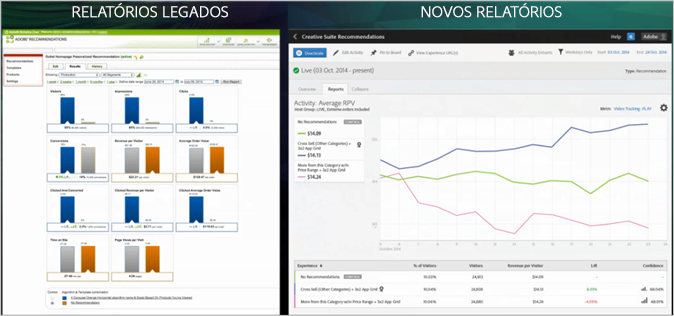

#  Atividades do Recommendations Classic versus Recommendations no Target Premium{#recommendations-classic-versus-recommendations-activities-in-target-premium}

Informações para ajudá-lo a escolher entre as atividades Recommendations Classic e Recommendations no Target Premium.

>[!NOTE]
>
>As atividades do Recommendations estão disponíveis como parte da solução do [!DNL Target Premium]. Elas não estão disponíveis no [!DNL Target Standard] sem uma licença do [!DNL Target Premium].

No produto do [!DNL Recommendations] clássico, as recomendações foram exibidas com a criação de uma mbox de coleta de dados em uma página seguida da adição de uma mbox de exibição em um local específico da página. A atividade do [!DNL Recommendations] no [!DNL Target Premium] permite a criação de recomendações em qualquer lugar da página, sem a necessidade de criar uma mbox para cada local onde deseja recomendar os produtos ou conteúdo. Uma simples referência de JavaScript no cabeçalho da página ativa o Recommendations em qualquer lugar da página. Use essa referência do JavaScript para enviar as chaves à mbox do [!DNL Target], como as chaves do `entity.id` e `entity.categoryId`.

O [!DNL Recommendations Classic] é exibido como o seu próprio cartão na interface do usuário da [!DNL Experience Cloud]. Uma atividade do [!DNL Recommendations] está disponível com o fluxo de trabalho do [!DNL Target Premium].

Os usuários do [!DNL Recommendations Classic] podem continuar a usar as mboxes do [!DNL Recommendations] no [!DNL Target Recommendations]. Eles também podem combinar as abordagens clássicas e [!DNL Target] ao manter as mboxes e usar o código do JavaScript no cabeçalho para ativar a funcionalidade do [!DNL Recommendations] para outros elementos da página. No entanto, para obter a funcionalidade total do [!DNL Target], os usuários do [!DNL Recommendations Classic] podem preferir excluir a mbox antiga e confiar somente no [!DNL Target Recommendations].

A atividade do [!DNL Recommendations] no [!DNL Target] aprimora o [!DNL Recommendations Classic] nas principais áreas a seguir:

## Recommendations como uma oferta

É possível incluir recomendações nas atividades de [!UICONTROL Teste A/B] (inclusive [!UICONTROL Alocação automática] e [!UICONTROL Direcionamento automático]) e [!UICONTROL Direcionamento de experiência] (XT).

Essa funcionalidade permite capacidades nunca antes vistas, como:

* Teste e direcione conteúdo de recomendações e não recomendações em uma mesma atividade.
* Experimente com facilidade a colocação de recomendações na página, incluindo a ordem de várias recomendações.
* Impulsione automaticamente o tráfego para a experiência do recommendations com melhor desempenho usando [!UICONTROL Alocação automática].
* Atribua de maneira dinâmica os visitantes a experiências de recomendação personalizadas com base em seus perfis usando o [!UICONTROL Direcionamento automático].

Para começar, crie uma atividade de [!UICONTROL Teste A/B] ou [!UICONTROL Direcionamento de experiência] usando o [!UICONTROL Visual Experience Composer] e use a ação [!UICONTROL Inserir antes], [!UICONTROL Inserir depois] ou [!UICONTROL Substituir por] para adicionar recomendações a uma experiência.

Para obter mais informações, consulte [Recommendations como uma oferta](/help/c-recommendations/recommendations-as-an-offer.md).

## Critérios {#section_117709846DAA404580EBE879FFCBD9BA}

[!DNL Target Recommendations] inclui uma biblioteca de critérios com conjuntos pré-embalados de regras e configurações. No [!DNL Recommendations Classic], cada recomendação foi criada manualmente através do preenchimento de um formulário e escolhida em uma grande lista de regras. Agora, ao criar uma atividade do [!DNL Recommendations], basta escolher um conjunto de critérios predefinidos. Você ainda pode criar recomendações personalizadas, mas a biblioteca de critérios contém muitas das configurações mais comuns, pré-criadas para simplificar o processo e usando uma linguagem simples. Estes critérios pré-embalados podem ser usados como estão ou podem ser copiados e editados para atender às suas necessidades específicas.

Os critérios são predefinidos e classificados por setores da indústria, tipos de página e implementação. Por exemplo, você pode procurar pelos critérios que se aplicam ao setor varejista, para o uso em uma página de produto, mostrando produtos dentro de uma categoria específica (como definido pelo parâmetro `entity.categoryID`).

Para obter mais informações sobre o uso e a criação de critérios, consulte [Critérios](../../c-recommendations/c-algorithms/algorithms.md#concept_4BD01DC437F543C0A13621C93A302750).

## Fluxo de trabalho {#section_76B4A26297BF422382DE2C79A2713D3C}

O fluxo de trabalho do [!DNL Recommendations] foi simplificado. Em vez de preencher formulários complicados, você segue um fluxo de trabalho visual para:

1. Selecionar o critério.
1. Selecione um pré-configurado  [predefinido](../../c-recommendations/c-design-overview/create-design.md#task_CC5BD28C364742218C1ACAF0D45E0E14).
1. Visualize as recomendações resultantes.

## Visualização do visual  {#section_639B9E38C9EC4093BF9023EE0F2A15AC}

Você pode visualizar suas recomendações depois de configurá-las e fazer as alterações necessárias, sem ter que criá-las na página e testá-las. As visualizações estão disponíveis no [!DNL Target].

## Direcionamento {#section_93295EA0DBA14210B8518AF4802A459F}

No [!DNL Recommendations Classic], existem seis opções de direcionamento. As atividades do Recommendations usam a linha completa de opções de direcionamento do Target. Defina um público-alvo usando o [!DNL Target] ou outros públicos da [!DNL Adobe Experience Cloud] (como o [!DNL Audience Manager] e [!DNL Analytics]), em seguida, selecione o percentual de participantes da atividade que visualizam cada design e que visualizam o controle.

## Relatório {#section_25C2FCCE4BC1488496C517C0470B5CD6}

No [!DNL Target], o [!DNL Recommendations] fornece relatórios aprimorados que aproveitam os recursos fornecidos pelo [!DNL Target] e a [!DNL Experience Cloud]. Em vez de simplesmente mostrar o incentivo fornecido pelo [!DNL Recommendations] em comparação com os resultados sem ele, você pode visualizar as informações completas sobre as atividades do [!DNL Recommendations].

