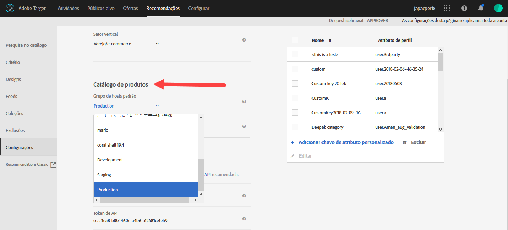
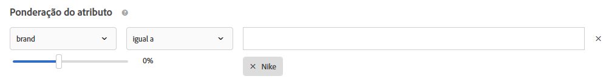

#  Perguntas frequentes sobre o Recommendations{#recommendations-faq}

Lista de perguntas frequentes sobre o Adobe Target Recommendations atividade.

## Quanto tempo leva para que as atualizações nos itens do meu catálogo sejam refletidas no meu site?

Após importar um arquivo de feed ou depois de receber atualizações de entidade por meio da API ou da mbox, as seguintes alterações serão refletidas em menos de 60 minutos:

* Atributos de item retornados no modelo de Design.
* Atributos de item usados em regras de exclusão globais que impedem a inclusão do item em recomendações retornadas.
* Atributos de item usados nas regras de inclusão dentro dos critérios que afetam se o item está incluído ou excluído em recomendações retornadas.

As seguintes alterações não são refletidas até que ocorra a execução do próximo algoritmo (dentro de 12 a 24 horas):

* Atributos de item usados nas regras de Coleção usadas para a atividade.
* Atributos de item usados em uma promoção baseada em um atributo ou coleção associada à atividade.
* Categoria do item na qual o item aparece para uma &quot;Categoria atual&quot; ou &quot;Categoria favorita&quot; no algoritmo Mais vendidos ou Mais visualizados.
* Classificação dos itens recomendados quando o atributo mudou é um atributo personalizado usado como chave personalizada para um algoritmo.
* Classificação dos itens recomendados com base nos atributos alterados quando a lógica de recomendação é &quot;Itens com atributos semelhantes&quot;, quando os fatores de ponderação de &quot;Similaridade de conteúdo&quot; são usados ou quando os fatores &quot;Ponderação de atributos&quot; são usados.

>[!NOTE]
>
>Um arquivo de feed é considerado importado quando seu status muda de “Importando itens” para “Preparando atualizações de índice de pesquisa”. As atualizações podem levar mais de 60 minutos para serem refletidas na interface do usuário da Pesquisa no catálogo; a Pesquisa no catálogo está atualizada quando o status do feed muda para &quot;Atualizações concluídas&quot;. Mesmo que a Pesquisa no catálogo ainda não esteja atualizada, seu site refletirá as atualizações nos prazos listados acima. O tempo mais recente de atualização de índice da Pesquisa no catálogo é exibido na página Pesquisa no catálogo.

## O que devo fazer se os caracteres especiais estão quebrando a matriz? {#section_D27214116EE443638A60887C7D1C534E}

Use valores removidos no JavaScript. As aspas ( &quot; ) podem quebrar a matriz. O snippet de código a seguir é um exemplo de valores removidos:

```
#set($String='') 
#set($escaper=$String.class.forName('org.apache.commons.lang.StringEscapeUtils')) 
<script type="text/javascript"> 
console.log("$escaper.escapeJavaScript($entity1.name)") 
console.log("$escaper.escapeJavaScript($entity2.name)") 
console.log('$escaper.escapeJavaScript($entity3.name)') 
names.push("$escaper.escapeJavaScript($entity4.name)") 
</script>
```

## Por que todos os critérios, incluindo os critérios personalizados, não estão disponíveis para seleção ao criar uma atividade do Recommendations?  {#section_B2265AC8B8A94E0298D495A05C5D817F}

Os critérios disponíveis são baseados na categoria atual. Quando você está criando ofertas do Recommendations, o seletor de algoritmo exibe os critérios com base na ID de categoria.

Se a localização na qual você estiver aplicando esse critério não contiver a ID da categoria, determinados critérios não estão disponíveis no seletor de algoritmo.

Se você usar um local onde a ID de categoria está presente na mbox, o seletor de critérios conterá todos os critérios aplicáveis.

O Target tem uma  [definição de Critérios incompatíveis de filtro](../../c-recommendations/plan-implement.md#concept_C1E1E2351413468692D6C21145EF0B84) para controlar a filtragem inteligente do seletor de algoritmo.

>[!NOTE]
>
>Essa configuração se aplica às atividades criadas somente no Visual Experience Composer (VEC). Essa definição não se aplica às atividades criadas no Experience Composer baseado em formulário (o Target não tem contexto de localização).

Para acessar a configuração [!UICONTROL Critérios incompatíveis de filtro], clique em [!UICONTROL Recommendations] > [!UICONTROL Configurações]:


Se a configuração [!UICONTROL Critérios incompatíveis de filtro] NÃO está ativado, o Target não filtra algoritmos no Seletor de algoritmo e todos os algoritmo são exibidos.

Se a configuração de [!UICONTROL Critérios incompatíveis de filtro] estiver ativado nas atividades de VEC, o Target lê entityId e category Id no local selecionado e, em seguida, exibe algoritmos baseados em `currentItem|currentCategory` (Se os valores respectivos estiverem presentes nesse local). Como resultado, somente os algoritmos compatíveis para o local selecionado são mostrados no seletor do algoritmo, como padrão.

Na configuração [!UICONTROL Critérios incompatíveis de filtro] estiver ativada, você ainda pode visualizar os algoritmos não compatíveis desmarcando a caixa de seleção [!UICONTROL Compatível] ao selecionar os critérios.


A lista a seguir contém casos especiais em que o Target não exibe a caixa de seleção [!UICONTROL Compatível]:

* EntityId e category Id estão presentes no local, então nada está sendo filtrado.
* Você está usando a [!DNL mbox.js] versão 55 ou anterior.
* Nenhuma chamada de mbox está sendo filtrada na página (!config.isAutoCreateGlobalMbox &amp;&amp; !config.isRegionalMbox)
* Os parâmetros do Target não estão definidos.

## O que devo fazer se uma coleção no Recommendations chega a zero (0)?  {#section_E2DB2FE67CF24EEC81412BFF3FA6385D}

Considere as informações a seguir se você vir uma coleção em zero que anteriormente não estava em zero:

* Você pode salvar novamente a coleção e ver se ela atualiza o número. Observe que ao salvar novamente, a coleção executará de novo todos os algoritmos que usarem ela.
* Você está olhando para o ambiente certo? Vá para [!DNL /target/products.html#recsSettings] para verificar novamente (conforme mostrado abaixo).

   

* O seu índice está atualizado? Vá para [!DNL /target/products.html#productSearch] e verifique quantas horas têm o índice (por exemplo, &quot;Indexado há 3 horas&quot;). Você pode atualizar o índice, conforme necessário.
* Você alterou algo no feed ou na camada de dados que resultou na falta de correspondência das suas entidades com as regras de coleção? Certifique-se de que as LETRAS MAIÚSCULAS E MINÚSCULAS estejam correspondentes (sensível à maiúscula e minúsculas).
* O seu feed foi executado com sucesso? Alguém alterou seu diretório de FTP, senha etc?
* O Target faz o melhor para atualizar a entrega (na página/aplicativo do cliente) o mais rápido possível. Além disso, também precisamos fornecer alguma representação na interface de usuário do profissional de marketing. Não necessariamente atrasamos atualizações de entrega para esperar a sincronização de atualizações de interface de usuário. Você pode usar [mboxTrace](/help/c-activities/c-troubleshooting-activities/content-trouble.md) para ver o que está no sistema no momento em que ocorre a solicitação.

## Qual a diferença entre ponderação de atributos geral e ponderação de atributo específico à similaridade de conteúdo? {#section_FCD96598CBB44B16A4C6C084649928FF}

A ponderação de atributos ocorre de duas formas: &quot;ponderação de atributos padrão&quot; e &quot;ponderação de atributos de similaridade de conteúdo&quot;.

&quot;A ponderação de atributo padrão&quot; aplica-se à maioria, ou todos, os tipos de critérios (não somente à Similaridade de conteúdo). Esse tipo de ponderação fornece mais peso a determinados valores de atributo. No exemplo a seguir, os produtos da Nike terão um salto nas recomendações de saída.



A &quot;ponderação de atributo por similaridade de conteúdo&quot; aplica-se aos critérios de Similaridade de conteúdo somente.

Esse tipo de ponderação é mais dinâmica e baseia-se na &quot;chave de recomendação&quot; atual (o item exibido atualmente). No exemplo a seguir (marca x 16), se um visitante estava visualizando tênis da Nike, ele tem maior probabilidade de receber recomendações de outros produtos da Nike (não necessariamente somente tênis) em vez de tênis de outros fabricantes. Se um visitante estava visualizando tênis da Adidas, ele tem maior probabilidade de recomendar produtos da Adidas.


## Por que o Target às vezes não consegue mostrar as recomendações?  {#section_DB3F40673AED42228E407C05437D99E9}

Às vezes, o Target não consegue mostrar recomendações devido ao baixo número de recomendações disponíveis.

O número de valores gerados por critério é 3 vezes o número de entidades especificadas no modelo. A filtragem em tempo de execução (por exemplo, inventário, correspondência de atributos da mbox) é aplicada após os valores 3x serem gerados, portanto, é possível chegar com menos que valores 3x no momento da entrega. Para mitigar essa situação, aumente o número de entidades no modelo ao ocultar as entidades adicionais.

É possível usar o seguinte código em JavaScript no início do design para aumentar o número de entidades solicitadas. Neste exemplo, a contagem de entidades solicitadas seria de 30 (3x10).

```
#foreach($entity in $entities) 
 #if( $foreach.count > 10 ) 
  #break 
 #end 
 #set ($foo = $entity.id) 
#end 
```

## Qual é o limite de tamanho de uma chamada à API para inserir/atualizar produtos? Posso atualizar 50.000 produtos em uma chamada ao usar a API em vez de um feed?  {#section_434FE1F187B7436AA39B7C14C7895168}

O Target impõe um limite de postagem de 50 MB no nível do aplicativo; no entanto, isso apenas acontece quando o cabeçalho de tipo de conteúdo `application/x-www-form-urlencoded` é passado.

Certamente é possível tentar enviar 50.000 produtos em uma mesma chamada. Se ela falhar, você deve quebrá-la em lotes. Normalmente, recomendamos que os clientes quebrem suas chamadas em lotes de 5.000 ou 10.000 produtos para diminuir a possibilidade de se alcançar o tempo limite devido à carga do sistema.

## Preciso especificar o nome da mbox ao criar critérios, promoções ou regras de teste do modelo do Recommendations?  {#section_FFA42ABCC5954B48A46526E32A3A88A2}

Ao criar critérios, promoções ou regras de testes do modelo do Recommendations com base em um parâmetro mbox, o `mboxParameter` não solicitará o `mboxName`. O nome da mbox agora é opcional. Essa alteração permite usar parâmetros de várias mboxes ou referenciar um parâmetro que ainda não foi gravado na borda.

Para selecionar o parâmetro desejado:

* Ao criar um novo critério, promoção ou regra de testes do modelo, selecione um nome de parâmetro na lista, comece a digitar os primeiros caracteres do nome ou o nome completo do parâmetro desejado.
* Caso lembre do nome da mbox, mas não do parâmetro, use a caixa de seleção para filtrar uma mbox conhecida que passe o parâmetro desejado.

Com ambos os métodos, não há link entre a mbox e o parâmetro. Os critérios, as promoções ou as regras de testes do modelo funcionarão de acordo com o parâmetro em todas as mboxes que passam esse parâmetro.

Se você editar um critério, uma promoção ou uma regra de testes do modelo existente, os critérios de filtragem serão exibidos com o nome da mbox fornecido durante a criação.

## Por que não posso salvar minha atividade herdada de Recommendations, depois de definir um novo público-alvo?  {#section_1E47C40B1FE7479BAC3EE0F50CE7C2C4}

Certifique-se de que o público-alvo tenha um nome exclusivo. Se você deu ao público o mesmo nome de um público-alvo existente, não poderá salvar sua atividade herdada de Recommendations (uma atividade de Recommendations criada antes de outubro de 2016).

## Qual é o tamanho máximo de um arquivo CSV para um upload de feed?  {#section_20F1AF4839A447B9889B246D6E873538}

Não há limite rígido de número de linhas ou tamanho do arquivo para o upload de um arquivo CSV do feed. No entanto, como prática recomendada, limite o tamanho do arquivo CSV para 1 GB para evitar falhas durante o processo de upload de arquivos. Se o tamanho do arquivo exceder 1 GB, idealmente ele deverá ser dividido em vários arquivos de feed. O número máximo de colunas de atributos personalizados é 100 e os atributos personalizados são limitados a 4.096 caracteres. Limites adicionais sobre o comprimento das colunas requeridas estão disponíveis na  [página de Limitações do Target](../../r-troubleshooting-target/target-limits.md#reference_BEFE60C3AAA442FF94D4EBFB9D3CC9B1).

## Posso excluir dinamicamente uma entidade?

Na sequência de consulta, você pode passar IDs de entidades para as entidades que deseja excluir de suas recomendações. Por exemplo, você pode desejar excluir itens que já estão no carrinho.

Para ativar a função de exclusão, use o parâmetro de mbox `excludedIds`. Esse parâmetro indica uma lista de IDs de entidade separadas por vírgulas. Por exemplo, `mboxCreate(..., "excludedIds=1,2,3,4,5")`. O valor é enviado quando novas recomendações são solicitadas.

A exclusão é executada apenas para a chamada de Público alvo atual; os itens não são excluídos em chamadas de Público alvo subsequentes, a menos que o `excludedIds` valor seja passado novamente. Para excluir itens no carrinho das recomendações em cada página, continue transmitindo o `excludedIds` valor em cada página.

>[!NOTE]
>
>Se muitas entidades forem excluídas, as recomendações se comportarão como se não houvesse entidades suficientes para preencher o modelo da recomendação.

To exclude `entityIds`, append the `&excludes=${mbox.excludedIds}` token to the offer content url. Quando o url de conteúdo for extraído, os parâmetros solicitados serão substituídos pelos parâmetros de solicitação atuais do mbox.

Por padrão, esse recurso é ativado para recomendações criadas recentemente. As recomendações existentes precisam ser salvas para suportar entidades excluídas dinamicamente.

## O que a resposta NO_CONTENT às vezes retorna no rastreamento de conteúdo da Recommendations significa?

NO_CONTENT é retornado quando as recomendações não estão disponíveis para o algoritmo solicitado e a combinação de teclas. Geralmente, isso ocorre quando os backups são desativados para o algoritmo e uma ou mais das seguintes opções também são verdadeiras:

* Os resultados ainda não estão prontos.

   Isso normalmente ocorre ao salvar uma atividade recém-criada ou depois que alterações de configuração são feitas na coleção, nos critérios ou nas promoções usados na atividade.

* Os resultados estão prontos, mas ainda não são armazenados em cache no servidor de borda mais próximo, para a combinação de algoritmo/chave solicitada.

   A solicitação recém-feita iniciará uma operação de armazenamento em cache, portanto isso deve resolver-se após alguns recarregamentos de página e/ou alguns minutos de passagem.

* Os resultados estão prontos, mas não estão disponíveis para o valor-chave fornecido.

   Isso normalmente ocorre ao solicitar recomendações para um item que foi adicionado ao catálogo após a execução mais recente do algoritmo e resolverá a si mesmo após a execução do próximo algoritmo.

* A renderização parcial do modelo está desativada e não há resultados suficientes disponíveis para preencher o modelo.

   Isso normalmente ocorre quando você tem uma regra de inclusão dinâmica, que filtros agressivamente muitos itens dos resultados possíveis. Para evitar isso, ative os backups e não aplique a regra de inclusão aos backups, ou use os critérios em sequência com critérios filtrados menos agressivos.
